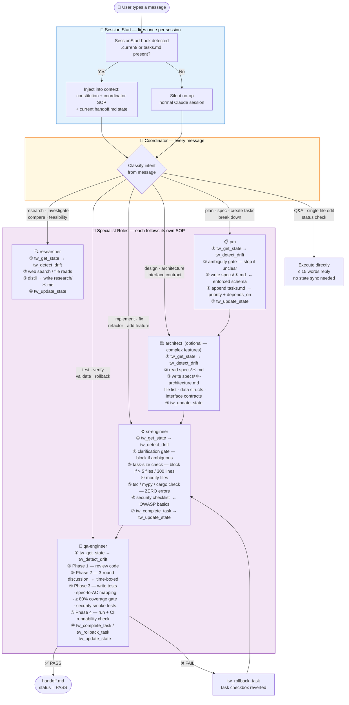

# 🛡️ Agent Governance MCP

> Prevents lost updates and rule drift when multiple AI coding agents (Cursor, Claude Code, Windsurf) work on the same project.

---

## 📑 Table of Contents

- [One-Line Summary](#one-line-summary)
- [Quick Guide for Non-Engineers](#quick-guide-for-non-engineers)
- [Motivation: What Problem Does It Solve?](#motivation-what-problem-does-it-solve)
- [Core Architecture: Three Layers of Defense](#core-architecture-three-layers-of-defense)
- [Technical Details](#technical-details)
- [Pros and Cons](#pros-and-cons)
- [Installation & Startup](#installation--startup)
- [Multi-Agent Workflow](#multi-agent-workflow)
- [FAQ](#faq)
- [Future Roadmap](#future-roadmap)
- [Project Structure](#project-structure)
- [Glossary](#glossary)

---

## One-Line Summary

**Agent Governance MCP** is an infrastructure layer that allows multiple AI agents/IDEs to work on the same project while **sharing state, adhering to a single source of truth for rules, and avoiding mutual overwrites.**

It is **not a code-generation tool**, but a "governance layer" for collaboration.

> Analogy: It acts as the team's PM + QA + Employee Handbook—built specifically for AI, running 24/7.

> **Positioning**: Technically an MCP server (protocol/transport), functionally a **harness** — it injects governance, shared state, and role SOPs into the agent's execution shell, not data sources or external APIs.

---

## Quick Guide for Non-Engineers

Imagine three scenarios:

- **Scenario A**: You ask Claude to write a login feature today. Tomorrow, you open Cursor to continue, but Cursor has no idea what was done or how it was implemented. It guesses, resulting in inconsistencies.
- **Scenario B**: You establish a rule: "Never read `.env` directly." But every tool (Cursor, Claude, Anti-Gravity) requires different config files. You must update rules in four places, which is error-prone.
- **Scenario C**: You have Cursor and VS Code open simultaneously. Both AIs update the project status file. **The later write silently overwrites the earlier one.** A whole task's progress is lost.

**This server solves all three scenarios with code.** It runs locally, and AIs talk to it instead of directly editing progress files. It will:
1. Memorize project progress. Regardless of which AI you use, they read the same state.
2. Centralize rules. All AIs fetch instructions from one place.
3. Prevent collisions. If two AIs write simultaneously, it queues them and prevents overwriting.

---

## Motivation: What Problem Does It Solve?

AI coding assistants have four fatal flaws when handling long-term projects:

### Pain Point 1: The Goldfish Memory — State Decoupling
- With every new session or IDE switch, the AI forgets its progress.
- What Claude modified yesterday is unknown to Cursor today.
- Result: Duplicated work, missed steps, or inconsistent implementations.

### Pain Point 2: Rule Drift
- Your rules ("No yapping", "TDD first", "Never touch .env") live in disparate config files (`.cursorrules`, `CLAUDE.md`, etc.).
- Modifying a single rule requires updating multiple files.

### Pain Point 3: Format Drift
- When AI maintains a progress file manually (`handoff.md` or `tasks.md`), it often breaks YAML syntax, messes up checkboxes, or drops fields.
- The next time you parse it, it fails, rendering the progress tracker useless.

### Pain Point 4 (The Silent Killer): Write Conflicts / Lost Updates
- Parallel sessions or multiple IDEs running concurrently.
- Both AIs read State X. They perform work and attempt to write State Y and State Z.
- **The later write overwrites the earlier write. State is silently lost.**

**Agent Governance MCP solves all four pain points via server-side hard constraints.**

---

## Core Architecture: Three Layers of Defense

This isn't just "soft prompt engineering." It employs **server-side hard constraints** that AI cannot bypass.

### Layer 1: Prompts — Auto-Injected Rules

When an MCP-compatible client calls any role prompt (`teamwork` for the Coordinator, `teamwork-lite` for the solo-dev lite mode, plus `pm`, `architect`, `researcher`, `sr-engineer`, `qa-engineer`), the server dynamically assembles:

```
content/constitution.md         ← Your "Constitution" (rules of conduct)
+ content/skill-<role>.md        ← Role-specific SOP (standard operating procedures)
+ Current handoff.md JSON state  ← Where the project is currently at
```

This is injected into the AI's context.
**In short**: The moment AI starts working, it automatically memorizes the employee handbook, workflow, and handover notes.

### Layer 2: Tools — Structured APIs (Revoking Free-Text Privileges)

The server exposes 10 MCP tools. **AI cannot edit `handoff.md` or tasks directly; it MUST use these tools:**

| Tool | Function | Why this design? |
|---|---|---|
| `tw_get_state` | Reads current project progress | **Mandatory first step**, otherwise write tools are blocked (pre-flight check) |
| `tw_update_state` | Updates handoff | Server enforces valid YAML; impossible for AI to break formatting |
| `tw_get_next_task` | Fetches next incomplete task | Returns structured data |
| `tw_add_task` | Appends a new task | Works in stdio (markdown) and HTTP/SQLite modes — no workspace filesystem needed |
| `tw_complete_task` | Changes `[ ]` to `[x]` | Safely edits markdown checkboxes atomically |
| `tw_rollback_task` | `[x]` → `[ ] (reverted: reason)` | Used when implementations fail later |
| `tw_detect_drift` | Compares handoff vs tasks | Catches synchronization issues |
| `tw_switch_role` | Loads a role's SOP into context | Coordinator calls this to auto-route complex tasks without a full prompt reload |
| `tw_index_prd` | Indexes a PRD file into RAG chunks | Embeds spec context for downstream roles (SQLite mode only); auto-triggered lazily |
| `tw_clear_prd_chunks` | Purges RAG chunks for a workspace | Ops escape hatch for manual cleanup (SQLite mode only) |

**In short**: AI works in a cleanroom. It can only report progress by pressing pre-defined buttons.

### Layer 3: Guards — Server-Side Interception

Two lines of defense enforced at the **code level**:

#### (a) Pre-Flight Check
If the AI tries to `update_state` without ever calling `tw_get_state`, it receives a `⛔ BLOCKED` error. This forces a "read-before-write" discipline.

#### (b) Cross-Process File Lock + Mtime Freshness Check
- **File Lock**: If two AIs write simultaneously, an `O_EXCL` lockfile serializes them. No torn writes.
- **Freshness Check**: If the file was modified by someone else after you read it, the server throws a `STATE DRIFT` error and demands a re-read.
- **Atomic Writes**: Writes to a `*.tmp` file, then uses POSIX `rename`. Readers only see the complete old or new version.

#### (c) QA-Flow Enforcement (v3.2.0)
The server validates every `tw_update_state` write against an
`ALLOWED_TRANSITIONS` matrix so the routing chain
`pm → architect → sr-engineer → qa-engineer` can't be bypassed. Highlights:

- **Agent-id gate**: `status=PASS` and `tw_complete_task` require
  `agent_id="qa-engineer"` (zod refinement + handler defense).
- **Transition matrix**: `(prev_last_agent, prev_status) → (new_agent,
  new_status)` must be a legal edge. Self-loops on
  `In_Progress→In_Progress` for the same agent are fast-pathed.
- **Round counter**: `qa_round` increments on `(qa-engineer, FAIL)` and
  resets on PASS or PM re-entry. Round 4 collapses the matrix to
  `{(pm, In_Progress)}` until PM resets.
- **Evidence-of-QA**: PASS requires `qa_reports/review_<id>.md` (file
  mode) or a `reports` table row (SQLite). Attach `qa_review` on the
  PASS/FAIL write and the server records evidence automatically.

Rejections return a structured envelope (`error`, `attempted`, `allowed`,
`hint`). Full design: `specs/qa-flow-enforcement-architecture.md`.

#### (d) RAG Lifecycle Automation (v3.3.0)
The server manages PRD-to-RAG indexing and garbage collection automatically:

- **Lazy auto-reindex**: When any specialist role prompt is activated,
  `appendSpecContext` checks the PRD's mtime against the stored invalidation
  key. If stale or missing, it reindexes inline (coalesced via
  `_indexingInFlight` map). Coordinator is skipped (`RAG_SKIP_ROLES`).
- **Auto-discover**: If `state.prd_path` is not set, the server probes
  `PRD.md` → `docs/PRD.md` → `specs/PRD.md` in the workspace root.
  Graceful no-op if none found.
- **PASS cleanup**: When `tw_update_state(status=PASS)` succeeds, all
  `prd_chunks` rows for that workspace are deleted. In-flight reindexing
  is awaited first to prevent INSERT-after-DELETE races.
- **Tombstone sweep**: On first RAG operation per process, workspaces
  whose directories no longer exist on disk have their chunks purged.
- **Manual tool**: `tw_clear_prd_chunks(workspace_path)` for ops.

Full design: `specs/rag-lifecycle-automation.md`.

#### (e) Schema Versioning & Lazy Migration (v3.4.0)
All four persisted artifacts carry a `schema_version` and are upgraded
transparently on the next read — no manual migration step:

- **Handoff YAML**: `schema_version` in frontmatter (`handoff.md`).
- **`tasks.md`**: sentinel comment line carries the version.
- **SQLite**: `PRAGMA user_version` plus an additive `schema_version` row.
- **`.config.json`**: top-level `schema_version` field.

Migration runners live under `schema/migrations-*.ts`, keyed by `from → to`.
`tw_detect_drift` also reports schema-version skew across artifacts. See
`docs/schema-versions.md` for the upgrade-authoring checklist.

#### (f) Token-Efficiency (v3.4.0)
Two write-side optimisations stop the governance layer from inflating
per-turn context:

- **Drift response compression** (`tools/drift.ts:compressDriftDetails`)
  collapses repeated drift entries and caps response payload.
- **`pending_notes` truncation** (`tools/handoff.ts`) enforces a character
  budget on `pending_notes` returned by `readState()`; oldest entries are
  dropped first, and truncation metadata is attached so callers see what
  was trimmed.

---

## Technical Details

### Language / Runtime
- **TypeScript** compiled to ES2022, strict typing.
- **Node.js** ESM modules.
- Output lives in `dist/` and is committed for immediate remote execution via `npx`.

### Dependencies
- `@modelcontextprotocol/sdk`: MCP server framework
- `zod` v4: Runtime validation
- `js-yaml`: Safe YAML frontmatter read/write
- `better-sqlite3`: SQLite storage adapter for HTTP/remote mode

### Communication
- **Stdio transport** (default): Communicates via standard input/output. Zero network ports, zero config, highly secure.
- **HTTP transport** (`--port <n> [--db <path>]`): Streamable HTTP at `/mcp`, SQLite-backed state, `GET /healthz` for liveness probes.
  - `TW_AUTH_TOKEN` — required Bearer token (set this whenever the port is reachable beyond localhost; a loud warning is logged if unset).
  - `TW_ALLOWED_ORIGINS` — comma-separated Origin allowlist (DNS-rebinding defense). Empty list = allow any.

### Methodology-Agnostic
The server defaults to a generic markdown checkbox format, but handles customization via workspace overrides:
- **Task format override**: Place `<workspace>/.current/.config.json` with `taskPattern` (regex) and `taskPaths`.
- **Constitution/Skill override**: Place `<workspace>/.current/constitution.md` to override the default rules.
- **Vibe coding mode**: If no task lists exist, the tools fail gracefully, but the prompt injection and handoff state still function perfectly.

### State Format Example (`handoff.md`)
The progress state is stored as a human-readable file with YAML frontmatter. This allows AI to easily parse it, and humans to easily read it.
```markdown
---
active_feature: Implement user login page
status: In_Progress
completed_tasks:
  - 'T01 src/auth.ts: Setup JWT validation'
pending_notes:
  - 'T02 blocked: Waiting for UI team to provide login button SVGs'
---

# Project State
Do not edit this file manually. Use the provided tools.
```

---

## Pros and Cons

### ✅ Pros
1. **Zero-Config Startup**: Run directly via `npx github:...#v3.6.1` (version-pinned). No *manual* clone or install — first invocation auto-downloads dependencies (~30-60s), subsequent runs are instant from the npx cache.
2. **Single Source of Truth**: Change rules in one place; all AI clients obey instantly.
3. **True Cross-Tool Consistency**: Works with Claude, Cursor, Anti-Gravity, Gemini, Cline, etc.
4. **Data Integrity**: Cross-process file locks + mtime checks genuinely prevent write conflicts.
5. **Human Readable**: State is saved as plain text markdown, not a black-box DB.
6. **Fails Loudly**: Clean Zod errors, explicit STATE DRIFT warnings.
7. **Ultra-lightweight Context (Caveman-style)**: Tool descriptions are heavily compressed to save LLM prompt tokens and reduce context window bloat, maximizing the tokens available for your actual code.
8. **Lite Mode for Solo Work (v3.6.0+)**: `/teamwork-lite` skips the multi-role chain, drift checks, and role switching for daily 1-file edits — ~80% per-task token savings while keeping the constitution as a single source of truth.

### ❌ Limitations
- **Cannot Force AI Rule Compliance**: The constitution is injected, but AI can still hallucinate or ignore it (inherent LLM limitation).
- **Cannot Force Tool Usage**: AI *could* bypass MCP and use `fs.write` directly. `tw_detect_drift` catches this on the *next* session, not at write time.
- **Self-Declared Identity**: `agent_id` is a self-reported string. The gate blocks empty/misspelled ids but cannot stop deliberate impersonation.
- **Opt-In Hook**: The SessionStart hook is a silent no-op unless the workspace contains `.current/`, `tasks.md`, or `TODO.md`.
- **No Cross-Machine Sync**: File locks are local-fs only. Remote team sync requires HTTP mode + SQLite, or Git-committed `.current/`.

---

## Installation & Startup

**Requirements**: Node.js 18+. Check with `node --version` — older versions emit cryptic ESM errors that look like server bugs. Stdio mode has zero native dependencies; HTTP mode optionally pulls in `better-sqlite3` (needs Python + a C++ toolchain on first install).

> ⏱️ **First `npx` invocation downloads ~30-60s of dependencies.** This is *not* a hang — subsequent runs are instant from the npx cache.

### TL;DR (Claude Code, 3 steps)

```bash
# 1. Register the MCP server (writes to ~/.claude.json)
claude mcp add -s user agent-governance-mcp -- npx -y github:Paul-hengChen/agent-governance-mcp#v3.6.1

# 2. Mark the current workspace as agent-governance-managed (REQUIRED for the hook in step 3)
mkdir -p .current

# 3. Add the SessionStart hook to ~/.claude/settings.json (full JSON in Step 3 below)
```

Then run `claude mcp list` — should show `✓ Connected`. Full step-by-step below.

### Step 1: Configure your MCP Client

Every client below points at the same command: `npx -y github:Paul-hengChen/agent-governance-mcp#v3.6.1`. Pick the section that matches your tool.

#### Claude Code (CLI) — writes to `~/.claude.json`

> ⚠️ **Do NOT add `mcpServers` to `~/.claude/settings.json`** — Claude Code CLI ignores that key (that's Claude Desktop's format). Use the CLI command:

```bash
claude mcp add -s user agent-governance-mcp -- npx -y github:Paul-hengChen/agent-governance-mcp#v3.6.1
claude mcp list
# agent-governance-mcp: npx -y github:Paul-hengChen/agent-governance-mcp#v3.6.1 - ✓ Connected
```

#### Most other clients — same JSON, different file

The following clients all accept this exact `mcpServers` JSON block:

```json
{
  "mcpServers": {
    "agent-governance-mcp": {
      "command": "npx",
      "args": ["-y", "github:Paul-hengChen/agent-governance-mcp#v3.6.1"]
    }
  }
}
```

Paste it into whichever file matches your tool, then restart the client:

| Client | Config file |
|---|---|
| Claude Desktop¹ | `~/Library/Application Support/Claude/claude_desktop_config.json` (macOS) / `%APPDATA%\Claude\claude_desktop_config.json` (Windows) |
| Cursor² | `~/.cursor/mcp.json` (global) or `<project>/.cursor/mcp.json` (per-project) |
| Windsurf | `~/.codeium/windsurf/mcp_config.json` |
| Cline (VS Code) | `cline_mcp_settings.json` (open via `Cline: Open MCP Settings`) |
| Gemini CLI / Code Assist | `~/.gemini/settings.json` |

¹ Claude Desktop does **not** support the SessionStart hook (Step 3); invoke roles via the prompt picker instead.
² Verify via Settings → Features → MCP (server should show ✓).

#### Clients with a different config shape

**Continue (VS Code / JetBrains)** — `~/.continue/config.yaml` (YAML, not JSON):
```yaml
mcpServers:
  - name: agent-governance-mcp
    command: npx
    args:
      - "-y"
      - "github:Paul-hengChen/agent-governance-mcp#v3.6.1"
```

**Zed** — `~/.config/zed/settings.json` (uses `context_servers`, not `mcpServers`):
```json
{
  "context_servers": {
    "agent-governance-mcp": {
      "command": {
        "path": "npx",
        "args": ["-y", "github:Paul-hengChen/agent-governance-mcp#v3.6.1"]
      }
    }
  }
}
```

**Google Antigravity**: open the in-app MCP Server settings UI and add a new entry — command `npx`, args `-y github:Paul-hengChen/agent-governance-mcp#v3.6.1`. (Underlying config file is platform-dependent.)

### Step 2: Enable Agent Governance in a Workspace (⚠️ Required before the hook works)

The SessionStart hook (Step 3) is a **silent no-op** unless the workspace contains **any of**: `.current/`, `tasks.md`, or `TODO.md`. This is by design — keeps unrelated projects clean. Skip this step and the hook from Step 3 will look broken.

```bash
mkdir -p .current
```

*Optional:* also create a `tasks.md` with markdown checkboxes (`- [ ] T01 …`).

### Step 3: (Claude Code only) Configure SessionStart Hook — edit `~/.claude/settings.json`

Auto-injects the constitution + Coordinator SOP + handoff state into every Claude Code session. **Finish Step 2 first**, or this hook will appear to do nothing.

The hook helper is exposed as a `bin` entry, so use `npx` directly — no fragile `~/.npm/_npx/<hash>/…` paths required.

```json
{
  "hooks": {
    "SessionStart": [
      {
        "matcher": "",
        "hooks": [
          {
            "type": "command",
            "command": "npx -y -p github:Paul-hengChen/agent-governance-mcp#v3.6.1 agent-governance-context",
            "timeout": 60
          }
        ]
      }
    ]
  }
}
```

> `timeout` is in seconds. **60 leaves headroom for the first cold-start `npx` install (~30-60s)**; cached runs return instantly. Setting this too low (e.g. 10) is the #1 cause of "hook silently does nothing" on first install.

> Other MCP clients (Claude Desktop, Cursor, Continue, etc.) don't have a SessionStart hook concept. For them, the constitution is loaded when you invoke a role prompt (Step 5) — that's expected.

### Step 4: Verify Installation

```bash
# 1. MCP server is registered and reachable
claude mcp list
# → agent-governance-mcp: ... - ✓ Connected

# 2. SessionStart hook helper works
#    IMPORTANT: cd into a workspace with .current/ first — outside a managed
#    workspace the helper exits silently with NO output (by design).
cd <your-project-with-.current>
npx -y -p github:Paul-hengChen/agent-governance-mcp#v3.6.1 agent-governance-context
# → emits a JSON blob containing "additionalContext" with the constitution
```

If the second command above produces no output, you're either not inside a workspace with `.current/`/`tasks.md`/`TODO.md` (re-do **Step 2**), or the npx download itself failed (check `node --version ≥ 18`, network, then `npx clear-npx-cache` and retry).

Finally, open Claude Code in that workspace — you should see the constitution banner injected on session start.

**Troubleshooting**: hook silently doing nothing? Check, in order:
1. One of `.current/`, `tasks.md`, `TODO.md` exists at workspace root (Step 2).
2. `timeout` in `~/.claude/settings.json` is ≥ 60.
3. You restarted the Claude Code session after editing `settings.json`.
4. `claude mcp list` shows `✓ Connected` — if not, the MCP server itself isn't reachable.

### Step 5: Invoke Roles Manually

In **Claude Code**, MCP prompts are exposed as namespaced slash commands:
- `/mcp__agent-governance-mcp__teamwork` — Coordinator (auto-routes to specialists)
- `/mcp__agent-governance-mcp__teamwork-lite` — Coordinator (lite): solo-dev direct execution, no chain
- `/mcp__agent-governance-mcp__pm` — write specs, break down tasks
- `/mcp__agent-governance-mcp__architect` — system design, interface contracts
- `/mcp__agent-governance-mcp__researcher` — deep tech research
- `/mcp__agent-governance-mcp__sr-engineer` — implement / fix / refactor
- `/mcp__agent-governance-mcp__qa-engineer` — review, write tests, rollback

> Want shorter aliases like `/teamwork`? Create `~/.claude/commands/teamwork.md` (or per-project `.claude/commands/teamwork.md`) containing a single line that invokes the namespaced command. Claude Code's own slash commands take precedence over MCP prompts of the same name.

**Lite vs full coordinator.** `teamwork-lite` skips drift checks, role switching, and the multi-role chain — appropriate for solo daily work (1-file edits, doc tweaks, Q&A, one-liner fixes). It is read-only from the server's perspective: it cannot call `tw_update_state` / `tw_complete_task` / other state writers (no valid `agent_id` in the routing chain). Use `teamwork` (full) for cross-module work, anything that should be tracked in `tasks.md` / `handoff.md`, or anything you want an independent QA pass on. Install command and config are unchanged — same `npx` tag covers both.

In **other clients**, use the in-app prompt picker (Claude Desktop), `@`-mention syntax (Cursor's MCP prompt menu), or your client's documented MCP-prompt invocation. The prompt names themselves (`teamwork`, `teamwork-lite`, `pm`, `architect`, `researcher`, `sr-engineer`, `qa-engineer`) are stable across clients.

### Step 6: (Optional) HTTP / Remote Mode

Stdio mode is the default and recommended for solo / single-machine use. For shared remote state (e.g. a team server), run HTTP mode:

```bash
# Local
npx -y github:Paul-hengChen/agent-governance-mcp#v3.6.1 --port 3000 --db ./agc.db
# Liveness probe
curl http://localhost:3000/healthz
```

**Required env vars** (whenever the port is reachable beyond `localhost`):
- `TW_AUTH_TOKEN` — Bearer token clients must send (server logs a loud warning if unset).
- `TW_ALLOWED_ORIGINS` — comma-separated `Origin` allowlist (DNS-rebinding defense; empty = allow any).

```bash
TW_AUTH_TOKEN=hunter2 TW_ALLOWED_ORIGINS=https://app.example.com \
  npx -y github:Paul-hengChen/agent-governance-mcp#v3.6.1 --port 3000
```

**Docker**:
```bash
docker build -t agent-governance-mcp .
docker run --rm -p 3000:3000 \
  -e TW_AUTH_TOKEN=hunter2 \
  -e TW_ALLOWED_ORIGINS=https://app.example.com \
  -v $(pwd)/data:/app/data \
  agent-governance-mcp --db /app/data/agc.db
```

> HTTP mode requires `better-sqlite3` (a native module needing Python + C++ toolchain on first install). It's an `optionalDependency` — stdio users on machines without build tools are unaffected.

---

## Multi-Agent Workflow

Every user message goes through the same routing pipeline. The diagram below shows both the session boot sequence and per-message decision flow.

### Full Routing Flowchart


### Typical Multi-Phase Feature Flow

```
User: "add dark mode"
  └─▶ pm        → specs/dark-mode.md + tasks.md (T01–T04)
       └─▶ architect  → specs/dark-mode-architecture.md
            └─▶ sr-engineer  → implements T01–T04, build PASS
                 └─▶ qa-engineer → reviews, writes tests, PASS
                      └─▶ handoff.md: status = PASS ✅
```

### Automated Per-Write Pipeline (v3.2.0)

Every `tw_update_state` call goes through a 9-step server-side pipeline
*before* `.current/handoff.md` (or the SQLite row) is touched. This is what
makes the routing chain non-bypassable rather than advisory.

```
caller: tw_update_state({ agent_id, status, completed_tasks, qa_review?, pending_notes })
                                          │
                                          ▼
┌─────────────────────────────────────────────────────────────────┐
│ ① Pre-Flight Check (guards/session.ts)                          │
│    hasReadState(workspace)? ─ no → ⛔ BLOCKED                    │
├─────────────────────────────────────────────────────────────────┤
│ ② File Lock (guards/file-lock.ts)                               │
│    O_EXCL on .current/handoff.md.lock + stale-PID detection      │
├─────────────────────────────────────────────────────────────────┤
│ ③ Freshness Check                                                │
│    file mode: current mtime == snapshot mtime?                   │
│    SQLite mode: SNAPSHOT_KEY token unchanged?                    │
│    drift → ⛔ STATE DRIFT (caller must re-read)                  │
├─────────────────────────────────────────────────────────────────┤
│ ④ validateTransition() (tools/transitions.ts)                   │
│    (prev_agent, prev_status) → (next_agent, next_status)         │
│    must appear in ALLOWED_TRANSITIONS, OR qualify for the        │
│    same-agent In_Progress→In_Progress self-loop fast path.       │
│    reject → { error, attempted, allowed, hint }                  │
├─────────────────────────────────────────────────────────────────┤
│ ⑤ Round-Cap Override                                             │
│    if prev_qa_round ≥ 4 → matrix collapses to {(pm, In_Progress)}│
│    forces PM re-entry; everything else rejected                  │
├─────────────────────────────────────────────────────────────────┤
│ ⑥ Agent-ID Gate (PASS path + tw_complete_task)                  │
│    agent_id == "qa-engineer"? ─ no → ⛔ BLOCKED                  │
├─────────────────────────────────────────────────────────────────┤
│ ⑦ Evidence-of-QA (PASS path)                                     │
│    every id in completed_tasks must have                         │
│    qa_reports/review_<id>.md (file mode) or `reports` row        │
│    qa_review attachment recorded atomically                      │
├─────────────────────────────────────────────────────────────────┤
│ ⑧ computeNewRound()                                              │
│    (qa-engineer, FAIL) → prev + 1                                │
│    (qa-engineer, PASS) | (pm, In_Progress) → 0                   │
│    else → unchanged                                              │
├─────────────────────────────────────────────────────────────────┤
│ ⑨ Atomic Write                                                   │
│    tmp file + fs.renameSync → refreshSnapshotFor                 │
│    next same-session write won't self-trip freshness check       │
└─────────────────────────────────────────────────────────────────┘
                                          │
                                          ▼
                                  handoff state updated
```

---

## FAQ

**Q: Why use `npx github:...` instead of `npm install`?**
A: Zero config. Your team doesn't need to clone or install anything. The install command pins a specific tag (`#v3.6.1`) so upstream breaking changes can't silently affect your sessions — see the next question for how to upgrade.

**Q: How do I upgrade, or pin to a different version?**
A: Replace `#v3.6.1` in the install command with another tag or `#main` to track the bleeding edge. After changing it, clear the npx cache: `npx clear-npx-cache`. The CHANGELOG records breaking changes per version.

**Q: I modified `content/constitution.md` but the client didn't update?**
A: Start a new session. Also, clear the npx cache: `npx clear-npx-cache` (or `rm -rf ~/.npm/_npx` on older npm 9 and below).

**Q: Why does it work even if `.current/handoff.md` doesn't exist?**
A: It supports cold starts. `tw_get_state` returns `{exists: false}`, prompting the AI to initialize it via `tw_update_state`.

**Q: How about cross-machine team collaboration?**
A: Stdio mode locks are local-only. For remote collaboration, use **HTTP mode** (`--port <n>`) with SQLite storage (Phase 6+). Alternatively, commit `.current/handoff.md` to Git for async sync.

**Q: Does this conflict with `.cursorrules` or `CLAUDE.md`?**
A: No, they are complementary. The MCP Server acts as the source of truth, while your IDE rules act as a fallback.

---

## Future Roadmap

| Phase | Content | Status |
|---|---|---|
| 1 | 3-layer architecture, 6 tools, `sr-engineer` prompt | ✅ Done |
| 2 | Zod validation, safe YAML, file locks, SessionStart hook | ✅ Done |
| 2.5 | Configurable task paths/patterns, workspace overrides | ✅ Done |
| 3 | Multi-Agent Ecosystem (Researcher, PM, QA) | ✅ Done |
| 3.5 | Per-role watermark as chat sign-off line | ✅ Done |
| 3.6 | Architect role + skill enhancements (spec schema, BDD AC, security checklist, coverage gate, persona backstory) | ✅ Done |
| 4 | Schema versioning — lazy auto-migrate-on-read across handoff YAML, tasks.md, SQLite, `.config.json` | ✅ Done |
| 5a | Unit + integration test suite | ✅ Done |
| 5b | GitHub Actions CI | ✅ Done |
| 6 | SSE / HTTP transport, SQLite storage, Docker deployment | ✅ Done |
| 6.1 | HTTP-mode Bearer auth + Origin allowlist + `/healthz` | ✅ Done |
| 7 | Task ops lifted into storage adapter — HTTP/SQLite mode no longer needs a mounted workspace; new `tw_add_task` tool | ✅ Done |
| 8 | QA-flow enforcement (v3.2.0): `ALLOWED_TRANSITIONS` matrix, `agent_id="qa-engineer"` gate, `qa_round` counter, evidence-of-QA | ✅ Done |
| 9 | RAG lifecycle automation (v3.3.0): lazy auto-reindex in `appendSpecContext`, `prd_path` in handoff state, PASS cleanup GC, tombstone sweep, `tw_clear_prd_chunks` tool | ✅ Done |
| 9.1 | Token-efficiency improvements — drift response compression + `pending_notes` truncation to reduce per-turn context bloat | ✅ Done |
| 10 | CI/CD hook — auto-update handoff on PR merge | Planning |

---

## Project Structure

```
agent-governance-mcp/
├── index.ts                       # MCP server entry point (prompts/tools/dispatcher)
├── tools/                         # tw_* tool implementations
│   ├── handoff.ts                 #   read/write .current/handoff.md (+ pending_notes truncation, v3.4.0)
│   ├── tasks.ts / tasks-file.ts   #   task ops (delegator + file backend)
│   ├── drift.ts                   #   tw_detect_drift (+ drift compression, v3.4.0)
│   ├── role.ts                    #   tw_switch_role
│   ├── transitions.ts             #   ALLOWED_TRANSITIONS state machine (v3.2.0)
│   ├── evidence-file.ts           #   QA evidence write/check (v3.2.0)
│   ├── rag.ts                     #   PRD chunking + embeddings (v3.3.0)
│   ├── rag-coalesce.ts            #   shared _indexingInFlight registry (v3.3.0)
│   ├── storage.ts / storage-sqlite.ts  # storage interface + SQLite adapter
│   └── config.ts                  #   .current/.config.json loader
├── schema/                        # schema_version constants + migration runners (v3.4.0)
│   ├── versions.ts                #   current versions + registries
│   └── migrations-{handoff,tasks,sqlite,config}.ts  # lazy migrate-on-read
├── transport/                     # HTTP transport (Streamable HTTP + auth/origin guard)
├── guards/                        # session.ts (pre-flight), file-lock.ts (O_EXCL)
├── prompts/                       # teamwork (= coordinator), pm, architect, researcher, sr-engineer, qa-engineer
├── content/                       # constitution.md + skill-<role>.md (6 roles)
├── specs/                         # design docs (qa-flow, rag-lifecycle, schema-versioning, etc.)
├── docs/schema-versions.md        # how to ship a new schema version (v3.4.0)
├── bin/agent-governance-context.mjs       # SessionStart hook helper
├── test/                          # unit + integration tests
├── dist/                          # compiled JS (committed for npx execution)
├── CLAUDE.md                      # guide for Claude Code (this repo dogfoods itself)
└── .antigravityrules              # guide for Anti-Gravity
```

---

## Glossary

| Term | Definition |
|---|---|
| **MCP (Model Context Protocol)** | Open standard by Anthropic enabling AI agents to interact with external tools and data. |
| **MCP Server** | An application (like this one) implementing the MCP protocol. |
| **MCP Client** | The AI tool (Cursor, Claude, Anti-Gravity) connecting to the server. |
| **Tool / Prompt** | Interfaces exposed by the server. Tools are callable functions; Prompts are context templates. |
| **Stdio transport** | Communication via standard input/output (no network ports). |
| **handoff.md** | The "handover" file detailing project state and blockers. |
| **Race condition** | Timing issue when multiple processes access the same resource simultaneously. |
| **`ALLOWED_TRANSITIONS`** | Server-side state machine that validates every `(prev_agent, prev_status) → (next_agent, next_status)` write — the routing chain is non-bypassable (v3.2.0). |
| **`qa_round`** | Counter persisted in handoff that increments on `(qa-engineer, FAIL)` and resets on PASS or PM re-entry; round 4 forces PM re-entry (v3.2.0). |
| **Evidence-of-QA** | PASS path requires a `qa_reports/review_<task-id>.md` file (file mode) or `reports` table row (SQLite) for every completed task (v3.2.0). |
| **`prd_chunks`** | SQLite table holding PRD-derived RAG embeddings; GC'd on PASS and via tombstone sweep (v3.3.0). |
| **`schema_version`** | Version field stamped on each persisted artifact (handoff YAML, tasks.md sentinel, SQLite `PRAGMA user_version`, `.config.json`); enables lazy migrate-on-read (v3.4.0). |

---

## License & Author

- Author: Paul Chen ([@Paul-hengChen](https://github.com/Paul-hengChen))
- License: ISC
- Repo: <https://github.com/Paul-hengChen/agent-governance-mcp>
