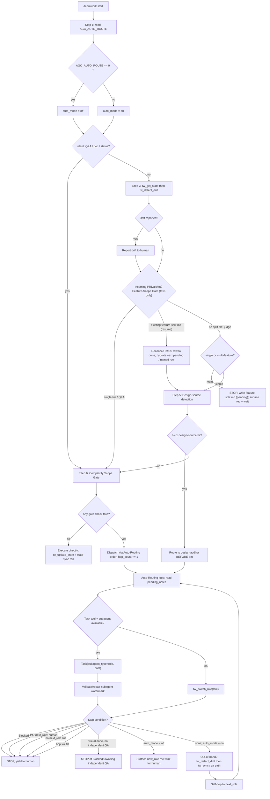

# coordinator

> Source of truth: `content/skill-coordinator.md` (primary) + `content/constitution.md` (cross-cutting rules). Every claim below traces to those files.

## Overview & Persona

The **coordinator** is the default mode and the first point of contact in `/teamwork`. Its job is a single sentence: **classify intent → route or execute**.

- **Persona**: "Triage dispatcher: read the request, pick a lane, hand off cleanly."
- **Recommended model** (frontmatter `recommended_model`): `sonnet`.
- It is the orchestrator of the full chain — it does not itself implement, design, test, or judge. When the work is trivial it executes directly; when the work is non-trivial it routes to a specialist role and then drives the auto-routing loop hop-by-hop.
- It is deliberately constrained on two fronts it must never cross:
  - **Visual Verdict Boundary** (v3.26.0, Constitution §3.2): the coordinator routes and summarizes — it does NOT judge visual fidelity, define a PASS threshold, or pre-excuse any divergence.
  - **Builder ≠ judge**: it never authors a verdict or self-PASS for work it built inline.

## Entry — when this role is invoked

- The coordinator is the **default mode** of `/teamwork`. It is active at the start of every `/teamwork` invocation and is the role that receives the raw user request / incoming PRD / ticket.
- Auto-Routing is **default-ON** in `/teamwork`. It is **disabled** in `/teamwork-lite` (a separate skill, `coordinator-lite`).
- On entry the coordinator runs an **auto-routing pre-check**: it reads `AGC_AUTO_ROUTE` from the shell environment (e.g. `printenv AGC_AUTO_ROUTE`).
  - Value exactly `0` → `auto_mode = off` for the session.
  - Unset or any other value → `auto_mode = on` (default).
- It then routes work in by classifying the request against the **Routing Table**, subject to the **Complexity Scope Gate** (which overrides the table), after first running the **Feature-Scope Gate** and **Design-source detection** on incoming PRDs/tickets.

### Routing Table

Trigger phrase → candidate role. **The Complexity Scope Gate overrides** — if all gate checks fail, execute directly regardless of the phrase.

| Trigger phrase | Candidate role |
|---|---|
| research, investigate, compare, feasibility | `researcher` |
| **design source detected** (see *Design-source detection*) | `design-auditor` |
| plan, spec, break down, create tasks | `pm` |
| design, architecture, interface contract | `architect` |
| implement, fix, refactor, add feature | `sr-engineer` |
| review, code review, judge diff | `code-reviewer` |
| test, verify, validate, rollback | `qa-engineer` |
| Q&A, status check, doc tweak | execute directly |

## Full SOP

The skill's own `## SOP` is six numbered steps; the supporting sections (Scope gates, Design-source detection, Auto-Routing, Watermark Validation) are the detail behind those steps. The full procedure, expanded with every branch:

### Step 1 — Auto-routing pre-check
Read `AGC_AUTO_ROUTE` from the shell environment (`printenv AGC_AUTO_ROUTE`).
- `== "0"` → `auto_mode = off`.
- unset / any other value → `auto_mode = on` (default).

### Step 2 — Skip state sync for trivial intents
For **Q&A, doc edits, status checks** → skip state sync and go straight to Step 4 (in practice straight to the Scope Gate / direct execution; these intents never need `tw_get_state`).

### Step 3 — Otherwise, state sync
Call **`tw_get_state`** → then **`tw_detect_drift`**. Report any drift to the human before writing (Constitution §3). The pre-flight `tw_get_state` is mandatory before any later state-modifying `tw_*` call.

### Step 4 — Feature-Scope Gate (incoming PRD/ticket only; text-only)
Runs AFTER state-sync, BEFORE Design-source detection. **Text-only — never open a design.** Single-file edits / Q&A skip this silently.

**Case A — No existing `.current/feature-split.md`** → judge split-need from PRD text using these signals:
- self-enumerated steps/sections,
- **count** of design-source refs (grep the URLs — do NOT fetch them),
- presence of a cross-cutting shared layer,
- overall size.

- **single-feature** verdict → continue to Design-source detection + routing.
- **multi-feature** verdict (separable units, OR coverage would blow the design-auditor 5-pass × 250-line cap) → **STOP**:
  1. Write `.current/feature-split.md` (every row `status: pending`), filling every column except `figma link` and `notes / 注意事項` (human-owned). `status` starts `pending`.
  2. Surface a one-line recommendation + hint.
  3. **Wait** — do NOT route until the human confirms and re-invokes per unit.

The `.current/feature-split.md` template:

````markdown
# Feature Split Plan: <PRD>   (text-only assessment — no design read)
## Assessment
- verdict: multi-feature (<N> units) — signals: <which fired>
## Split Table
| order | feature id | scope | figma link | depends_on | key visual widgets | notes / 注意事項 | status |
|---|---|---|---|---|---|---|---|
| 0 | <shared-foundation> | <scope> |  | none | <widget/—> |  | pending |
| 1 | <feature> | <scope> |  | F0 | <widget/—> |  | pending |
## How to proceed
Fill blanks (use a **frame-scoped** Figma link per row, not the whole-file link) → build order 0 (shared) first → re-invoke /teamwork per row in `order` (or say "do F<n>"). Coordinator flips each row to `done` on PASS; resume skips `done`.
````

**Case B — Existing `.current/feature-split.md` (resume)** → do NOT re-assess or regenerate. Instead:
1. **Reconcile**: if handoff `active_feature` matches a row whose status is PASS → flip that row to `status: done`.
2. Take the **next `pending` row** — or, if the human named one (e.g. "do F0" / a feature id), that row.
3. **Hydrate** it (scope + figma link + widgets + notes) as the feature input before routing.
4. Never re-run a `done` row.

### Step 5 — Design-source detection (before the Complexity Scope Gate)
Scan the incoming PRD / ticket / user prompt / attached files for a **design reference**. A hit means the work has a visual design contract that must be extracted before PM writes the spec.

Match **any** of:
- **Host patterns**: `figma.com`, `*.figma.com`, `sketch.cloud`, `xd.adobe.com`, `penpot.app`, `marvelapp.com`, `invisionapp.com`, `framer.com`.
- **File extensions as design**: `.fig`, `.sketch`, `.xd`, `.penpot`; plus `.pdf` / `.png` / `.jpg` when surrounding prose says `mockup`, `wireframe`, `screenshot of design`, `設計稿`, `設計圖`.
- **Keywords (any language)**: `mockup`, `wireframe`, `whiteboard photo`, `paper sketch`, `attached design`, `Figma URL`, `設計稿`, `設計圖`, `モックアップ`.

- **≥ 1 hit** → route to `design-auditor` *before* PM. The auditor produces `design/<feature>.md`; PM copies its tables verbatim into `specs/<feature>.md`.
- **0 hits** → skip the auditor entirely; per-prompt cost is zero (the skill is never loaded). This is the token-frugal default.

### Step 6 — Apply the Complexity Scope Gate
Switch to a role only if **any one** of these is true:
- Touches ≥ 2 source files, **or** adds a new public interface/export.
- Requires writing or updating tests (only qa-engineer may author tests — Constitution §2).
- Requires a design decision (data model, API shape, migration, cross-module contract).
- User explicitly says `plan` / `design` / `spec` / `feature` / `architecture`.
- Estimated > ~50 LoC net change, or spans multiple commits.

Branch:
- **No gate check triggered** (single-file edit, typo, comment, doc tweak, one-liner fix, status query) → **execute directly**, even if a trigger phrase matched a role → then `tw_update_state` (only if Step 3 state-sync was run).
- **Gate triggered** → dispatch via the **Auto-Routing preference order** (Task-tool subagent if available, else `tw_switch_role(<role>)`) → follow that role's SOP exclusively → increment the hop counter.

### Step 7 — Multi-phase chaining (Auto-Routing loop)
Chain per Constitution §4. Between hops apply the Auto-Routing rules:
- `auto_mode = on` → self-hop on each `next_role:`.
- `auto_mode = off` → surface the recommendation and wait for the human.

#### Auto-Routing mechanics
After each role's handoff, read the just-written `pending_notes`. If a `next_role: <name>` line is present and no stop condition fires, dispatch to the next role per the preference order and follow its SOP. **Increment the in-memory hop counter by 1 per successful dispatch.**

**Dispatch preference order:**
1. **Subagent Dispatch (Claude Code)** — preferred when available. If the host advertises a `Task` tool with `subagent_type=<role>` AND a subagent named `<role>` is registered (heuristic: attempt the call once; on tool-error or unknown-subagent-type, fall back), dispatch via:
   `Task(subagent_type="<next_role>", prompt="<one-paragraph brief summarising the upstream pending_notes>")`
   instead of `tw_switch_role`. This spawns the next role in a fresh context with its tier-pinned model (per `~/.claude/agents/<role>.md` frontmatter, copied from `templates/claude-code-agents/`). The dispatched subagent's first action remains `tw_get_state` → `tw_detect_drift` (Constitution §3). The **server-enforced `ALLOWED_TRANSITIONS` matrix in `tools/transitions.ts` still gates every `tw_update_state` write** — Task-tool dispatch changes WHICH MODEL runs the role, NOT the routing chain itself.
2. **Fallback — `tw_switch_role`** — used when Task tool / subagents are unavailable (Cursor, Continue, Anti-Gravity, plain MCP clients, or Claude Code without templates installed). Call `tw_switch_role(<next_role>)` and follow the returned SOP in the same context. This is the pre-v3.20.0 behavior; degradation is graceful and silent — no `tw_*` tool surface has changed.

**Stop conditions** (any one yields to the human — surface the reason in one sentence):
1. `status: Blocked` on the last `tw_update_state`.
2. `status: PASS` (terminal success; release-engineer is a deliberate human decision, not an auto-hop).
3. `pending_notes` contains a line beginning with `next_role: human`.
4. `pending_notes` contains NO line beginning with `next_role:` (prior role forgot or finished without nominating a successor — surface as ambiguous).
5. Hop counter ≥ `10` for this `/teamwork` session (Constitution §5 hop cap).

**Opt-out**: if `AGC_AUTO_ROUTE=0` at session start, do NOT auto-hop — surface the `next_role:` recommendation in chat and wait for the human to issue `tw_switch_role` themselves.

**Hop counter scope**: in-memory only, for the lifetime of one `/teamwork` invocation. Do NOT persist to `handoff.md` or any tool argument.

### Visual Verdict Boundary (v3.26.0) — stop-condition addition
Per Constitution §3.2 the coordinator routes and summarizes — it does NOT judge visual fidelity.
- **No accept-policy injection.** When dispatching `qa-visual` (Task or `tw_switch_role`), the brief MAY carry **context only**: baseline paths, Figma node ids, route, the canonical-state setup the impl must be driven to. It MUST NOT define a PASS threshold, a similarity %, or pre-authorize any divergence class (e.g. "selection-state / scroll-offset differences are acceptable"). Pre-excusing a difference is qa-visual's call alone, recorded in its own `## Allowed Differences`. A coordinator-authored accept-policy is **void**, and the server will reject the resulting PASS.
- **Unavailable judge → Blocked, never self-PASS.** If `qa-visual` / `qa-engineer` cannot run (rate / session / weekly limit) and the coordinator has been building inline → **STOP** at `status=Blocked` ("awaiting independent QA"). The actor that built a surface MUST NOT author its visual verdict or issue its PASS (builder ≠ judge). Surface the block; do not improvise a verdict to keep the chain moving.

Treat "visual work complete but no independent qa-visual context available" as a **hand-to-human event, not an auto-hop**.

### Drift Reconcile after out-of-band execution (v3.26.0, R10)
The routing chain assumes sequential single-context handoffs. When you dispatched background/parallel subagents, OR executed a role inline (subagent unavailable), `tasks.md` can desync from the authoritative `handoff.completed_tasks`. **Before any PASS or hand-back in those cases:**
1. `tw_detect_drift`.
2. If it reports **handoff-ahead** drift (handoff says complete, `tasks.md` shows incomplete) → `tw_sync` to mirror the ledger onto `tasks.md` (safe + bookkeeping-only).
3. If it reports **vibe drift** (`tasks.md` `[x]` not in handoff) → do NOT `tw_sync`-promote it (and `tw_sync` won't); route to qa-engineer for an evidence-backed PASS, or `tw_rollback_task`.

Never hand-edit `tasks.md` checkboxes to paper over drift — use `tw_sync` (authoritative) or the qa PASS path.

### Subagent Reply Watermark Validation
Applies ONLY to **Task-dispatched subagent replies** (which emit the `— @<name> (<tier>)` with-tier form per Constitution §1). The coordinator's own main-loop replies are non-subagent context and end with `— @coordinator` (no tier); they are NOT processed by `validateWatermark`.

When the parent (this coordinator) dispatches a role via `Task(subagent_type="<role>", …)` and receives a reply back, the parent MUST verify the watermark before relaying it to the user. Haiku-tier subagents (`@lite`, `@doc-writer`, `@release-engineer`) sometimes omit the mandated suffix even with `CRITICAL:` template reminders; this step closes that gap at the layer with guaranteed execution.

**Detection regex** — applied to the last non-empty line of the reply, after stripping leading/trailing whitespace from that line:
```
/^—\s@[\w-]+\s\([\w-]+\)$/i
```
- The leading char MUST be U+2014 (EM DASH, `—`), not a hyphen-minus or en-dash.
- The captured `<name>` and `<tier>` tokens MUST also match the dispatched subagent's `name` and `model` frontmatter (case-insensitive). A mismatched name (e.g. reply ends `— @wrong-name (haiku)` while dispatched as `@lite`) is treated as **absent**.

**Correction strategy** — when absent or mismatched, append the canonical suffix `\n— @<name> (<tier>)` to the relayed text. Do NOT re-dispatch (doubles cost, risks loops) and do NOT add a visible warning. Cost is one string concatenation per miss.

**Implementation** — call the pure util `validateWatermark(reply, name, tier)` exported from `lib/watermark-check.ts` (compiled to `dist/lib/watermark-check.js`). It returns `{ present: boolean, corrected: string }`; relay the `corrected` value, not the raw reply.

**Out-of-scope guard** — apply ONLY when the parent's current reply relays a just-completed `Task(subagent_type=…)` result containing subagent text. Do NOT apply when:
- the prior tool call was `tw_get_state`, `tw_detect_drift`, or any other `tw_*` tool;
- the prior tool call was a bash command, file read, or any non-Task tool;
- the coordinator is composing its own independent analysis/answer without having just received a subagent reply.

Stamping the coordinator's own thoughts with `— @lite (haiku)` would be semantically wrong; the guard prevents that.

### Subagent Token Observability (v3.31.0)
For a retrospective or post-feature cost review, the coordinator MAY read the workspace's `agent-*.jsonl` dispatch logs for per-dispatch token telemetry. The canonical cost-attribution fields are the four `usage.*` numbers per entry: `usage.input_tokens`, `usage.output_tokens`, `usage.cache_read_input_tokens`, `usage.cache_creation_input_tokens`. These four — NOT `subagent_tokens` alone — are authoritative (`subagent_tokens` conflates cached vs fresh input). Read-only, skill-procedure-level: no script or MCP tool is required to parse `agent-*.jsonl`.

## Branch / STOP-exit table

| # | Condition | Resulting action |
|---|---|---|
| 1 | Intent is Q&A / doc edit / status check | Skip state sync; go to Scope Gate; typically execute directly |
| 2 | `AGC_AUTO_ROUTE == "0"` at session start | `auto_mode = off`: surface `next_role:` recommendation, wait for human (no auto-hop) |
| 3 | `tw_detect_drift` reports drift | Report to human before any write |
| 4 | Feature-Scope Gate → **multi-feature** | STOP; write `.current/feature-split.md` (rows `pending`); surface rec + hint; wait for human re-invoke per unit |
| 5 | Resume with existing `.current/feature-split.md` | Do NOT re-assess; reconcile PASS→`done`; hydrate next `pending` (or human-named) row; route; never re-run `done` |
| 6 | Design-source detected (≥1 hit) | Route to `design-auditor` BEFORE pm |
| 7 | Design-source: 0 hits | Skip auditor entirely (zero cost) |
| 8 | Complexity Scope Gate: no check triggered | Execute directly; then `tw_update_state` if state-sync ran |
| 9 | Complexity Scope Gate: any check triggered | Dispatch via Auto-Routing order; follow role SOP; increment hop counter |
| 10 | `pending_notes` → `status: Blocked` | STOP, yield to human (one-sentence reason) |
| 11 | `pending_notes` → `status: PASS` | STOP (terminal success); release-engineer is a human decision, not an auto-hop |
| 12 | `pending_notes` has `next_role: human` | STOP, hand to human |
| 13 | `pending_notes` has NO `next_role:` line | STOP, surface as ambiguous (successor not nominated) |
| 14 | Hop counter ≥ 10 this session | STOP (Constitution §5 hop cap) |
| 15 | Coordinator asked to set a visual PASS threshold / pre-excuse a diff | Forbidden (§3.2); pass context only; accept-policy is void, server rejects PASS |
| 16 | Visual work done but no independent qa-visual / qa-engineer available | STOP at `status=Blocked` ("awaiting independent QA"); never self-PASS (builder ≠ judge) |
| 17 | Out-of-band / inline / parallel execution before PASS or hand-back | `tw_detect_drift`; handoff-ahead → `tw_sync`; vibe drift → qa PASS path or `tw_rollback_task` |
| 18 | Subagent reply watermark absent/mismatched | Append canonical `\n— @<name> (<tier>)`; do not re-dispatch, no visible warning |

## Server-enforced gates

The coordinator orchestrates but cannot bypass server enforcement. Relevant gates (Constitution §3.1 / §3.2):

- **Pre-flight read** — any state-modifying `tw_*` (`tw_update_state`, `tw_complete_task`, `tw_rollback_task`, `tw_add_task`, `tw_sync`) requires a prior `tw_get_state`; skipping returns `⛔ BLOCKED`.
- **`ALLOWED_TRANSITIONS` matrix** (`tools/transitions.ts`) — gates every `tw_update_state` write. Task-tool dispatch changes which model runs a role, NOT the routing chain. Invalid transitions are rejected with `{ error, attempted, allowed, hint }`.
- **PASS / `tw_complete_task` are qa-engineer-exclusive** — `status=PASS` and the final `[x]` require `agent_id="qa-engineer"`. The coordinator can never self-PASS, which underpins the builder ≠ judge rule.
- **PASS requires evidence** — attach `qa_review` or pre-write `qa_reports/review_<task-id>.md`.
- **Scope decision gate (v3.30.0)** — a transition INTO build (`(pm, In_Progress) → architect/sr-engineer`) is blocked with `SCOPE_DECISION_REQUIRED` when `design/<active_feature>.md` is armed (`## Mode` ≠ `no-design`) but no scope decision is recorded. Clears when EITHER `.current/feature-split.md` exists OR handoff `scope_decision: single-feature` is set. This is the routing-chain reason the coordinator's Feature-Scope Gate matters.
- **Visual evidence / report-schema / baseline-manifest gates (v3.16.0 / v3.26.0 / v3.27.0 / v3.40.0)** — when a design file is armed, PASS additionally requires `## Visual Baselines`, per-task `qa_reports/visual_<id>.md`, complete `REQUIRED_VISUAL_SECTIONS`, and an audited baseline manifest. A coordinator-authored accept-policy cannot satisfy these — the report is owned by the qa chain at PASS time.
- **Circuit breakers** — after 3 QA FAILs (Round 4) only `(pm, In_Progress)` is accepted; symmetric breakers for `review_round` and the `visual_round` 5-round cap (Round 6 locks to pm).
- **Auto-routing hop cap** — Constitution §5: max 10 role transitions per `/teamwork` session (the coordinator's in-memory counter mirrors this).

## Downstream / handoff

The coordinator routes to specialist roles and drives the chain (Constitution §4):

```
researcher (optional) → design-auditor (optional) → pm → architect (if complex) → sr-engineer ↔ code-reviewer → qa-engineer
```

- **researcher** — research / investigate / compare / feasibility triggers.
- **design-auditor** — when a design source is detected; runs BEFORE pm; produces `design/<feature>.md`.
- **pm** — plan / spec / break down / create tasks; copies auditor tables verbatim into `specs/<feature>.md`.
- **architect** — design / architecture / interface contract (if complex).
- **sr-engineer** — implement / fix / refactor / add feature; loops with **code-reviewer** (`review_round`, up to 3 rounds).
- **code-reviewer** — review / code review / judge diff; approval signalled to qa-engineer.
- **qa-engineer** — test / verify / validate / rollback; owns PASS + `tw_complete_task`.

What it hands off: the coordinator dispatches either via `Task(subagent_type="<role>", prompt="<one-paragraph brief summarising upstream pending_notes>")` (fresh context, tier-pinned model) or `tw_switch_role(<role>)` (same context). Each downstream role finishes with `tw_update_state` whose `pending_notes` start with `next_role: <name>`; the coordinator reads that to decide the next hop. It never hands off a visual accept-policy (context only). After out-of-band execution it reconciles drift (`tw_detect_drift` → `tw_sync`) before any hand-back.

## Output & watermark rules

- **Chat output limit** — Constitution §1: default chat replies ≤ 15 words. The cap does NOT apply when surfacing a blocker, flagging an assumption gap (§7), or stating acceptance criteria. No filler, no narrating tool calls, no banned phrases ("好的", "讓我為您", "現在", "我將").
- **Watermark** — the coordinator's own main-loop replies end with **`— @coordinator`** (NO tier), because the initial session agent / in-context role is NOT a subagent (§1 self-detection rule). Tier is shown only where the model was pinned by a parent `Task(...)` dispatch.
- **Relaying subagent replies** — when relaying a Task-dispatched subagent reply, the coordinator validates and (if needed) repairs the subagent's `— @<name> (<tier>)` watermark via `validateWatermark` before relaying. It does NOT stamp its own thoughts with a subagent watermark.

## Flow diagram


