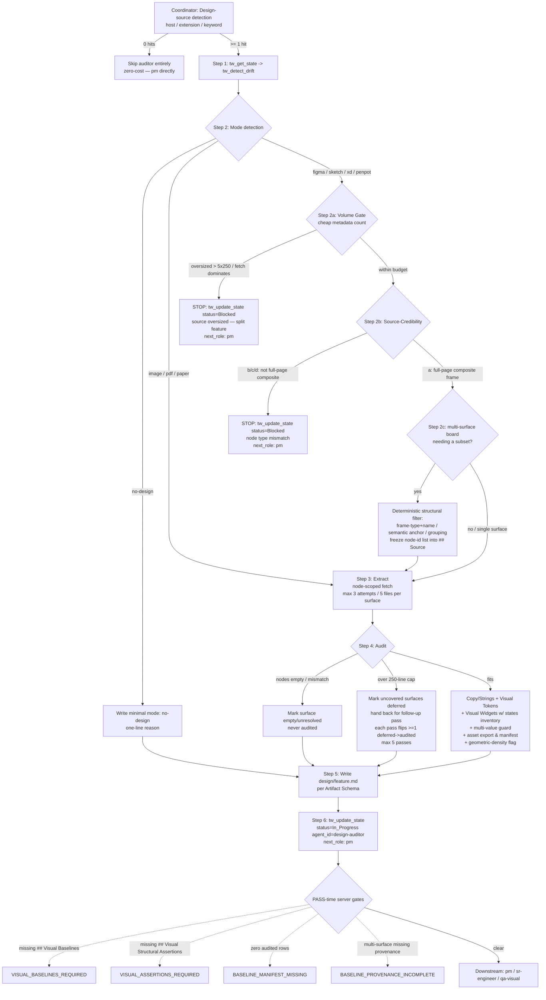

# design-auditor

> Source of truth: `content/skill-design-auditor.md` (primary), `content/constitution.md` (§-references), `content/skill-coordinator.md` (Design-source detection / entry).
> This page documents the role; it does not restate constitution rules beyond what the skill cites.

---

## Overview & Persona

**Role id:** `design-auditor`
**Recommended model (frontmatter):** `opus` (`recommended_model: opus`).

The design-auditor is a **source-agnostic design extractor**. It reads whatever the user calls "the design" — Figma, Sketch, XD, Penpot, PDF mockup, PNG screenshot, paper-photo, whiteboard photo — and produces a single structured artifact (`design/<feature>.md`) that the PM can copy verbatim into the spec.

Defining traits:

- **Source-agnostic.** Detect the design source's *medium* first, then pick the right extraction strategy. Do **NOT** assume Figma.
- **Verbatim only.** Every value in the audit must be copy-paste from the source. Never paraphrase. If a value cannot be extracted verbatim, write `authored-here` plus a one-line justification (the same convention `skill-pm` requires).
- **Never blocks PM for absence of a design.** If no design source exists, the role is an explicit no-op: write a minimal `mode: no-design` artifact and hand back.
- **Design = scope baseline (Constitution §1, v3.27.0).** The baseline this role authors is *scope-law* for design-backed work — a downstream gap vs the design is a fidelity defect, not MVP compliance. (Forward-reference only; the enforceable rule lives in the constitution.)
- **Content-verified node ids (v3.26.0, R8).** A node/frame id is `audited` ONLY after the fetched node's visible text/structure matches the intended surface. Name- or number-matching alone is INSUFFICIENT — a prior audit "resolved" baselines to the wrong frames by name. `nodes: []` or a content mismatch → `unresolved` in the *Source manifest* (never `audited`), with the mismatch noted. Record the canonical visible text alongside each baseline `source node` so downstream/QA can cross-check.

**Output rule:** chat output ≤ 1 sentence; final reply is exactly `Done. Audit in design/<feature>.md.`

---

## Entry — when the coordinator routes here

The coordinator runs **Design-source detection** (see `skill-coordinator`) *before* applying the Complexity Scope Gate, scanning the incoming PRD / ticket / user prompt / attached files for a design reference. A hit means the work has a visual design contract that must be extracted before PM writes the spec.

A hit is **any** of:

**Host patterns**
`figma.com`, `*.figma.com`, `sketch.cloud`, `xd.adobe.com`, `penpot.app`, `marvelapp.com`, `invisionapp.com`, `framer.com`.

**File extensions referenced as design**
`.fig`, `.sketch`, `.xd`, `.penpot`; plus `.pdf` / `.png` / `.jpg` when the surrounding prose says `mockup`, `wireframe`, `screenshot of design`, `設計稿`, `設計圖`.

**Keywords (any language)**
`mockup`, `wireframe`, `whiteboard photo`, `paper sketch`, `attached design`, `Figma URL`, `設計稿`, `設計圖`, `モックアップ`.

Routing decision:

- **≥ 1 hit** → route to `design-auditor` **before** PM. The auditor produces `design/<feature>.md`; PM copies its tables into `specs/<feature>.md`.
- **0 hits** → **zero-cost skip path.** The auditor is skipped entirely; the skill is never loaded and the per-prompt cost is zero. Tasks with no design reference go `… → pm → architect …` directly. This is the token-frugal default.

Within the routing table this corresponds to the `design source detected → design-auditor` row. The Complexity Scope Gate can still override generic phrase matches, but Design-source detection runs first and routes the auditor ahead of PM whenever the visual contract exists.

---

## Full SOP

### Step 1 — State sync

```
tw_get_state
tw_detect_drift
```

Pre-flight (`tw_get_state`) is mandatory before any state-modifying `tw_*` call (Constitution §3). Report any drift to the human before writing.

### Step 2 — Mode detection

Read the original PRD / ticket / user prompt. Pick **exactly one** mode per the keyword table:

| Pattern matched in source | Mode |
|---|---|
| `figma.com` | `figma` |
| `sketch.cloud`, `.sketch` attachment | `sketch` |
| `xd.adobe.com`, `.xd` | `xd` |
| `penpot.app` | `penpot` |
| `.pdf` attachment described as mockup | `pdf` |
| `.png` / `.jpg` mockup attachment | `image` |
| "wireframe", "whiteboard photo", "paper sketch" | `paper` |
| none of the above | `no-design` |

**No-design branch:** if mode is `no-design`, **jump straight to Step 5** with the minimal audit. Do **NOT** block. No-design mode skips multi-pass and the manifest entirely (empty manifest, single pass).

The remaining sub-steps **2a / 2b / 2c** apply only to **fetch-based modes** (`figma` / `sketch` / `xd` / `penpot`). `image` / `pdf` / `paper` / `no-design` skip all three gates because they are human-confirmed sources with no bulk fetch.

### Step 2a — Volume Gate (pre-fetch)

Fetch-based modes only. BEFORE extracting, estimate the source's surface/frame count via **cheap metadata** (frame list / node count) — NOT a full-document fetch.

If a single feature's source exceeds roughly one feature's worth — more surfaces than `5 passes × 250 lines` could audit, **OR** a fetch that would dominate the context budget — **STOP**:

```
tw_update_state(
  status=Blocked,
  agent_id="design-auditor",
  pending_notes=[
    "design-auditor: design source oversized — recommend splitting feature further (<N> frames > threshold)",
    "next_role: pm"
  ]
)
```

Do **NOT** ingest-then-defer; splitting the feature is preferred to overflowing context. This is the input-side mirror of the 250-line / 5-pass output cap.

### Step 2b — Source-Credibility Classification (v3.38.0)

Fetch-based modes only. BEFORE extracting any values, classify each target node into one of:

- **(a) full-page / screen composite frame** — the top-level frame representing the feature's actual surface as it renders for an end user.
- **(b) component variant / component-set child** — a sub-node inside a component definition, not a full composed screen.
- **(c) read-only review / overview page** — a documentation or handoff overview that shows a different mode, state, or context than the feature being built.
- **(d) other** — annotation, asset, or non-UI frame.

**Node-type-mismatch Blocked branch:** if the classification is **(b), (c), or (d)** — i.e. NOT a full-page/screen composite frame for the intended feature — you MUST **STOP** before any values are written to the artifact:

```
tw_update_state(
  status=Blocked,
  agent_id="design-auditor",
  pending_notes=[
    "design-auditor: node type mismatch — <node-id> is <actual classification>, expected full-page composite frame for <feature>; resolve source reference before extraction",
    "next_role: pm"
  ]
)
```

Do NOT transcribe values from the wrong node type; the guardrail fires BEFORE any values reach the audit artifact. (P2 was saved by this behaviour; P1 was reopened for lack of it — see `research/mode-feature-process-retrospective.md` §四#2.)

### Step 2c — Mechanical baseline selection (v3.39.0)

Fetch-based modes only, **AND** only when the source is a **multi-surface board** (one URL/node expands to many surfaces, e.g. a full OOBE flow board) and the task needs a *subset* as baselines.

Do **NOT** eyeball-scan the board and hand-pick frames — that is unreproducible, unaccountable, and varies per run (漏抓 / 誤收 / treating arrows/annotations as screens). Instead select via a **deterministic structural filter** over the metadata already pulled in 2a, written so a human can re-run it:

1. **Frame-type + name pattern** — keep `type=FRAME` whose `name` matches the surface naming glob (e.g. `Slide 16:9 - *`); drop CONNECTOR / annotation TEXT / sub-components.
2. **Semantic anchor** — keep only frames whose subtree contains the feature's anchor node. Prefer matching by `componentId` over layer name (name is unstable; component id is the more durable contract).
3. **Grouping** — group surfaces by **spatial proximity** (`absoluteBoundingBox` distance from a known-good reference frame) and/or shared `componentId`, **NOT** by Figma `id` prefix (id prefixes are an internal implementation detail that changes when frames are moved/copied and do not survive across files).

Record the resulting node-id list — plus the exact filter conditions and each exclusion reason — into the *Source manifest* as the **frozen selection**. Downstream (qa-visual) copies these node ids verbatim; it MUST NOT re-derive the set from the URL. The empty-shell guard from Step 4 still applies to every selected node. (Method / rationale: `research/figma-baselines.md`.)

**The v3.40 server gate (PASS-time, Constitution §3.1).** This step's artifacts are no longer prose-only — they are machine-checked:

- The *Source manifest* MUST be a `## Source` H2 table whose selected rows carry `status: audited` and a non-empty node-id `pointer`. A manifest with **zero audited rows** (or no `## Source` section once the design is on the manifest contract) blocks PASS with `BASELINE_MANIFEST_MISSING`.
- For **multi-surface** selections (≥ 2 audited rows) the filter conditions + exclusion reasons MUST be recorded in a dedicated **`## Baseline Selection Provenance`** H2 section containing **both** a `filter-conditions:` line **AND** an `exclusion-reasons:` line; omitting either blocks PASS with `BASELINE_PROVENANCE_INCOMPLETE`.
- **Single-surface** selections (exactly 1 audited row) are **exempt** from the provenance section.

Section/label format:

```
## Baseline Selection Provenance
- filter-conditions: type=FRAME && name~"Slide 16:9 - *" && subtree contains anchor componentId X
- exclusion-reasons: dropped CONNECTOR/annotation nodes; dropped deferred surfaces (over 250-line cap)
```

### Step 3 — Extract

Pick the strategy for the mode:

- **`figma`** — prefer the `figma` MCP tool if available (`get_figma_data` + `download_figma_images`). Fall back to user-pasted JSON / screenshots.
- **`sketch` / `xd` / `penpot`** — use the corresponding MCP if available; else ask the user to export Copy / Visual values manually.
- **`pdf` / `image` / `paper`** — OCR is brittle. Ask the user to confirm **every** value before recording; these become `authored-here` with the source filename as justification.

**Node-scoped fetch.** Scope every fetch to the specific node/frame id(s) being audited this pass — pass node ids to `get_figma_data` (and `download_figma_images` per node). NEVER pull the whole document when a frame-scoped id is available. This bounds the fetch payload alongside the Volume Gate.

**Hard limits (Constitution §5 Anti-Loop).** Max **3 extraction attempts per surface**; max **5 files read per surface**. On limit, stop and surface what you have so far.

### Step 4 — Audit

Fill the **Copy / Strings** + **Visual Tokens** + **Visual Widgets** tables. Quote verbatim. For values that must be paraphrased (translated, OCR'd), record `authored-here` and explain why.

**Empty-node branch.** If a fetch returns empty nodes (e.g. `nodes: []`), flag the surface as `empty` / `unresolved` in the manifest — **never** `audited`.

**Deferred / multi-pass branch.** Produce ≤ **250 lines per pass**. If the design exceeds the 250-line cap for this pass, mark uncovered surfaces as `deferred` in the *Source manifest* with a one-line reason and hand back — the coordinator may route you again for a follow-up pass. Hard ceiling: **5 passes per feature** (Constitution §5 anti-loop). Each subsequent pass MUST flip **≥ 1** *Source manifest* row from `deferred` → `audited`; passes that make no manifest progress are **forbidden**. (No-design mode skips multi-pass and manifest entirely.)

**Widget-shape heuristics (v3.14.0).** For the *Visual Widgets* table, emit a row whenever any of the following match on a layer / component / frame (component name OR layer name, case-insensitive):

| Match pattern | Likely widget shape | Primitive that must NOT be substituted |
|---|---|---|
| `Picker`, `Wheel`, `ColumnScroller`, `DateTimePicker`, `TimeWheel` | column-scroller picker | `<input type="date">`, `<input type="time">`, `<select>` |
| `Keyboard`, `Virtual Keyboard`, `OnScreen Keyboard`, `OSK` | virtual on-screen keyboard | hardware keyboard reliance, plain `<input>` |
| `Segmented`, `SegmentedControl`, `TabSwitch` | custom segmented control | `<select>`, `<input type="radio">` group with default styling |
| `Scrollbar`, `CustomScroll`, `ScrollIndicator` | custom scrollbar | browser default scrollbar |
| `Stepper`, `WizardStepper`, `Progress` (animated) | animated stepper | `<progress>`, static dots |
| `Accordion`, `Collapsible`, `ExpansionPanel` | accordion card | `<details>` |
| `Slider` (custom track), `RangeBar`, `RotaryDial` | custom slider / dial | `<input type="range">` |
| `Toggle` (custom shape), `SwitchPill` | custom toggle | `<input type="checkbox">` |

For uncertain matches, list the widget and tag the description `verify with PM` — let PM decide whether it stays. Out-of-scope: pure primitives with restyled CSS (a `<button>` with brand color is NOT a widget — it's a Visual Token). If no widgets found, write the literal row `N/A | — | no non-primitive widgets in audited surfaces`.

**Interactive-states inventory (v3.26.0, R2/A2).** For every widget row, the `description` MUST enumerate the per-state visual deltas present in the source — `default / focused / selected / disabled` (and `drawer-open` / `modal-open` / `error` where applicable), naming the token each state uses (e.g. "selected row → full-width `#3C5AAA` bar"). A missing focus/selection bar is the kind of un-inventoried state; an audit lacking the state inventory is **incomplete**, not done.

**Context-dependent multi-value guard (v3.38.0).** Before recording any token or property value as "the" canonical value, verify whether the property has more than one visual appearance depending on contextual state (e.g. a toggle ON that renders differently when the row is focused vs unfocused). If multiple values exist, enumerate **EACH** separately with its governing context/state — do NOT collapse them into a single canonical entry. Collapsing a context-dependent property bakes a wrong spec (`research/mode-feature-process-retrospective.md` §四#7: toggle ON had two Figma variants but was compressed into one, producing an incorrect implementation).

**Asset export + manifest (v3.28.0).** For fetch-based modes you MUST export the design's raster/vector assets (icons, logos, illustrations) via the export MCP call (Figma: `download_figma_images`, scoped per asset node id), saving each file into the workspace assets dir (`src/assets/` or repo convention). Record an **asset manifest** table in `design/<feature>.md` mapping `Figma node-id | exported file path | usage/widget` — one paper-verifiable row per asset. `image` / `pdf` / `paper`: record the human-supplied file path. `no-design`: no manifest. This is the upstream half of source-don't-redraw (Constitution §1 v3.28.0); sr-engineer imports from this manifest instead of hand-authoring SVG.

**Geometric-density flag (v3.31.0, awareness-only).** While auditing a surface's `## Layout / Canvas` structure, count its **independently-constrained geometry layers** (stacked container constraints, asymmetric padding, nested components with independent fill/sizing rules) — distinct from canonical state-count. When a single surface has **≥ 3** independently-constrained geometry layers, note it in the surface's *Source manifest* `reason` (or *Out of Scope* note) and flag it so PM can apply the authoritative **Geometric-Density Split Gate** (`skill-pm` step 2a-bis). Design-auditor only **flags**; PM owns the split decision and writes `.current/feature-split.md`. This does NOT change the 8–10 state-count threshold.

### Step 5 — Write

Write `design/<feature>.md` per the **Artifact schema** (below).

### Step 6 — Handoff

```
tw_update_state(
  active_feature=<name>,
  status=In_Progress,
  agent_id="design-auditor",
  pending_notes=["Audit: design/<feature>.md", "next_role: pm"]
)
```

On failure, **still** call `tw_update_state` with the failure summary in `pending_notes`.

---

## Branch / STOP-exit table

| # | Condition | Where | Action |
|---|---|---|---|
| 1 | Mode resolves to `no-design` | Step 2 | Jump to Step 5, write minimal `mode: no-design` audit + one-line reason; `next_role: pm`. Never block. |
| 2 | Source oversized (> 5×250 lines of surfaces, or fetch dominates context) | Step 2a Volume Gate | STOP → `tw_update_state(status=Blocked, agent_id="design-auditor", pending_notes=["design-auditor: design source oversized — recommend splitting feature further (<N> frames > threshold)", "next_role: pm"])`. Do not ingest-then-defer. |
| 3 | Target node is class (b)/(c)/(d) — not a full-page composite frame | Step 2b Source-Credibility | STOP → `tw_update_state(status=Blocked, agent_id="design-auditor", pending_notes=["design-auditor: node type mismatch — <node-id> is <actual classification>, expected full-page composite frame for <feature>; resolve source reference before extraction", "next_role: pm"])`. Fires before any value is written. |
| 4 | Fetch returns `nodes: []` / content mismatch | Step 3/4 | Mark surface `empty` / `unresolved` in *Source manifest*, never `audited`; note the mismatch. |
| 5 | Design exceeds 250-line cap this pass | Step 4 | Mark uncovered surfaces `deferred` (one-line reason), hand back; coordinator may re-route a follow-up pass. |
| 6 | Follow-up pass makes no manifest progress | Step 4 | Forbidden — each pass MUST flip ≥ 1 `deferred` → `audited`. |
| 7 | 5 passes reached | Step 4 | Hard ceiling (§5 anti-loop); stop. |
| 8 | 3 extraction attempts or 5 files read per surface | Step 3 | Hard limit (§5); stop and surface what you have. |
| 9 | Surface has ≥ 3 independently-constrained geometry layers | Step 4 | Flag in manifest `reason` / Out of Scope for PM's Geometric-Density Split Gate. Flag only — do not split. |
| 10 | Uncertain widget match | Step 4 | List widget + tag description `verify with PM`. |

---

## Artifact schema — `design/<feature>.md`

Every audit MUST contain these H2 sections:

- **`## Mode`** — one of `figma`, `sketch`, `xd`, `penpot`, `pdf`, `image`, `paper`, `no-design`. One line.
- **`## Layout / Canvas`** — MANDATORY unless mode is `no-design`. Describe stage type (fixed `W×H` vs fluid/responsive), root canvas dimensions, fixed container widths, outer margins, column/grid structure, persistent chrome (sidebar/header) structure. **Structured, not prose (v3.26.0, R6):** for every container and interactive component, record the source's actual auto-layout metadata — `layoutMode`, `primaryAxisAlignItems`, `counterAxisAlignItems`, `itemSpacing`, `padding`, sizing (`fixed`/`fill`/`hug` + `layoutGrow`), `fills` — as `key:value`, NOT paraphrased ("centered, 24px gap"). Group containers (rounded bordered setting-group boxes) MUST be recorded as such. Loose-prose transcription is documented root cause A1.
- **`## Source` (Source manifest)** — exhaustive list of every surface in the design source. One row per surface: `<medium> | <pointer> | <fetched? yes/no> | <status: audited | deferred | out-of-scope> | <reason>`. Pointer = Figma node id / Sketch artboard id / XD artboard id / Penpot board id / PDF page number / image filename / photo filename. MUST cover **every** frame / artboard / board / page / file in the source, not just the current task's. `reason` required for `deferred` and `out-of-scope`; optional for `audited`. **Backwards-compat:** pre-Phase-1 audits lacking the status column are read downstream as `audited` for listed surfaces and `unknown` for the rest — no retroactive migration.
- **`## Baseline Selection Provenance`** — MANDATORY for multi-surface (≥ 2 audited rows) fetch-based selections. MUST contain a `filter-conditions:` line AND an `exclusion-reasons:` line. Exempt for single-surface (exactly 1 audited row) selections.
- **`## Copy / Strings`** — the same 3-column table the PM spec schema demands. PM copies verbatim into `specs/<feature>.md`.
- **`## Visual Tokens`** — the same 4-column table the PM spec schema demands. PM copies verbatim.
- **`## Visual Widgets` (v3.14.0)** — the same 3-column table (`widget id | description | source-node`). Run the widget-shape heuristics; one row per non-primitive control; literal `N/A` row if none. Each `description` MUST carry the interactive-states inventory and respect the context-dependent multi-value guard.
- **Asset manifest** — for fetch-based modes, a table `Figma node-id | exported file path | usage/widget`. (`image`/`pdf`/`paper`: human-supplied path; `no-design`: omit.)
- **`## Visual Baselines`** — MANDATORY when mode ≠ `no-design`. Table `surface id | source node | baseline path | impl path | viewport | route | canonical state | compare region | notes` (v3.26.0 extended schema; pre-v3.26 4-column rows valid, missing columns read as `unspecified`). `surface id` MUST match a *Source manifest* row. `source node` is the content-verified node id. `canonical state` records the exact depicted state so QA can drive the impl to it before diffing (`selected` item, `focused` row/card, `scroll` offset top/mid/bottom, `drawer/modal` open, toggle/segmented values, expected default data, interaction path to reach it). `compare region` is the content/component bbox QA must diff (NOT the whole frame). Paths are workspace-relative image paths. Absence is legitimate ONLY when `mode = no-design`; otherwise PASS blocks with `VISUAL_BASELINES_REQUIRED`.
- **`## Visual Structural Assertions`** — MANDATORY when mode ≠ `no-design` (v3.26.0, R3/R-VIS). Table `assertion id | surface | required element/state | source node/token`. PM copies it into the spec; qa-visual Step C marks each pass/fail. Emit a row for every design-required structure a "looks similar" glance would miss — at minimum: primary-action button uses the accent token; focused-row/selected bar renders; setting-group bordered container present; selected-card expansion/description; drawer nesting; modal real (non-placeholder) copy; each declared state token actually renders in its state.
- **`## Out of Scope`** — frames / surfaces deliberately not audited this round, with a reason.

---

## Server-enforced gates

These fire at **PASS time** (qa-engineer `status=PASS`); the design-auditor's job is to author the artifact so they clear. All arm on the same signal: `design/<active_feature>.md` exists with `## Mode` ≠ `no-design`.

| Gate | Source | Fires when | How design-auditor clears it |
|---|---|---|---|
| `VISUAL_BASELINES_REQUIRED` | §3.1 visual evidence gate (v3.16.0) | Armed design file lacks a `## Visual Baselines` H2 | Add the `## Visual Baselines` section (it is NOT a silent pass-through). |
| `VISUAL_EVIDENCE_MISSING` | §3.1 (v3.16.0) | `## Visual Baselines` present but no `qa_reports/visual_<task-id>.md` for a task id in the round | (qa-visual concern; baselines must exist for QA to produce them.) |
| `VISUAL_ASSERTIONS_REQUIRED` | §3.1 (v3.27.0) | Armed but design omits `## Visual Structural Assertions` — hard error, no silent fallback | Add `## Visual Structural Assertions`. |
| `VISUAL_REPORT_INCOMPLETE` | §3.1 (v3.26.0/v3.27.0) | `qa_reports/visual_<id>.md` fails `REQUIRED_VISUAL_SECTIONS` (missing section / failed canonical-state or structural row / non-PASS verdict) | (qa-visual report concern; depends on the assertions/baselines the auditor authors.) |
| `BASELINE_MANIFEST_MISSING` | §3.1 baseline manifest gate (v3.40.0) — sixth/last visual sub-gate | Armed + `## Source` manifest present but **zero audited rows** (or no `## Source` once on the contract) | `## Source` table with ≥ 1 row `status: audited` + non-empty node-id `pointer`. |
| `BASELINE_PROVENANCE_INCOMPLETE` | §3.1 (v3.40.0) | Multi-surface (≥ 2 audited rows) but `## Baseline Selection Provenance` missing `filter-conditions:` OR `exclusion-reasons:` | Add the `## Baseline Selection Provenance` section with both lines. Single-surface (1 audited row) is exempt. |
| `SCOPE_DECISION_REQUIRED` | §3.1 scope decision gate (v3.30.0) | Transition INTO build while armed but no scope decision recorded | Cleared by PM/coordinator: `.current/feature-split.md` exists OR handoff `scope_decision: single-feature`. (Not authored by design-auditor, but armed by its file.) |

The v3.40 baseline manifest gate is **opt-in / dormant** when `## Source` is absent (pre-v3.40 designs are never retro-blocked). It enforces SOP Step 2c so an eyeball-pick or post-hoc/re-derived manifest cannot silently PASS.

---

## Downstream consumers

| Consumer | Consumes from `design/<feature>.md` |
|---|---|
| **PM** | Copies `## Copy / Strings`, `## Visual Tokens`, `## Visual Widgets`, and `## Visual Structural Assertions` **verbatim** into `specs/<feature>.md`. Reads the geometric-density flag (manifest `reason` / Out of Scope) to apply its Geometric-Density Split Gate. Treats listed surfaces as `audited` and the rest as `unknown` for legacy audits. |
| **sr-engineer** | Imports design-sourced assets from the **asset manifest** (`Figma node-id | exported file path | usage/widget`) instead of hand-authoring SVG (Constitution §1 v3.28.0, source-don't-redraw). Builds widgets per the declared widget shape, not substituted primitives. Treats the design as scope baseline (§1 v3.27.0). |
| **qa-visual** | Copies the frozen baseline node ids from `## Source` / `## Visual Baselines` **verbatim** (must NOT re-derive from the URL). Drives the impl to each `canonical state`, diffs the `compare region` (not the whole frame), and marks each `## Visual Structural Assertions` row pass/fail in `qa_reports/visual_<id>.md`. |

---

## Output & watermark rules

- **Chat output ≤ 1 sentence.** Final reply is exactly: `Done. Audit in design/<feature>.md.`
- **No yapping / silent execution** (Constitution §1): no filler, do not narrate tool calls.
- **Watermark** (Constitution §1): every chat reply ends with a role watermark. As a Task-dispatched subagent (opus-pinned), use the with-tier form `— @design-auditor (opus)`. If the role runs in-context via `tw_switch_role`, use `— @design-auditor` (no tier).

---

## Flow diagram


