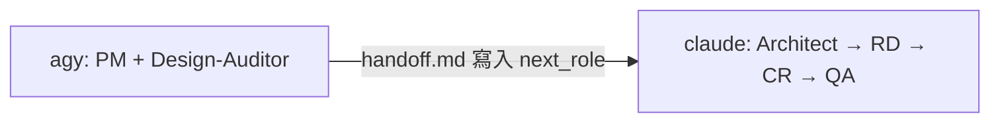

# Dual-Agent 架構評估：Antigravity (PM/Design) → Claude CLI (RD/QA)

## 📋 概要

評估將 `dual-agent.sh` 改為 **Antigravity CLI 負責 PM + Design-Auditor**，**Claude CLI 接手後續 Architect → Sr-Engineer → Code-Reviewer → QA** 的可行性。

## ✅ 架構上可行的部分

### 1. Handoff 機制天然支援跨 CLI
- agent-governance-mcp 的核心交接機制是 **檔案系統**（`.current/handoff.md` + `tasks.md`）
- 兩個不同 CLI 只要連接同一個 MCP server、指向同一個 workspace，就能讀寫同一份 handoff state
- `tw_get_state` → `tw_update_state` 的 pre-flight guard 是 **per-process** 的，不會因為換 CLI 就破壞

### 2. 狀態機支援這個分工

routing chain（[transitions.ts](file:///Users/paul.ph.chen/agent-governance-mcp/tools/transitions.ts#L112-L203)）完整支援：

```
null:null → pm:In_Progress           ← Antigravity 啟動
pm:In_Progress → design-auditor:In_Progress  ← Antigravity 內切角色
design-auditor → pm:In_Progress       ← 回到 PM 整合
pm:In_Progress → architect/sr-engineer:In_Progress  ← 交接點 ✂️ → Claude CLI 接手
```

> [!TIP]
> PM 完成後的 `pending_notes: ["next_role: architect"]` 就是天然的交接信號，Claude CLI 啟動時 `tw_get_state` 即可讀到。

### 3. 角色切換機制已內建
- `tw_switch_role` ([role.ts](file:///Users/paul.ph.chen/agent-governance-mcp/tools/role.ts)) 是 **context-loading only**，不做 server-side enforcement
- 兩個 CLI 都可以自由切角色，只要 `tw_update_state` 時帶正確的 `agent_id`

## ⚠️ 需要解決的問題

### 1. 腳本目前是「同時啟動 + 同一個 Prompt」，不是「串接」

現行 [dual-agent.sh](file:///Users/paul.ph.chen/agent-governance-mcp/mulit-agent-scripts/dual-agent.sh) 的設計是：
```bash
# 兩個 pane 同時啟動，傳入相同 prompt
claude "${PROMPT}"     # 左 pane
agy -i "${PROMPT}"     # 右 pane
```

但你想要的是 **串接流程**：Antigravity 先跑完 PM + Design → Claude 再接手。需要改為：



**改動方案**：需要一個 orchestrator 機制來偵測 Antigravity 完成後再啟動 Claude。

### 2. 「Antigravity 完成」的信號偵測

governance 目前沒有內建的「跨 CLI 接力」觸發機制。你需要自行實作：

| 方案 | 做法 | 複雜度 |
|------|------|--------|
| **A. 輪詢 handoff.md** | 腳本 poll `last_agent` + `pending_notes` 中的 `next_role:` | 低 |
| **B. fswatch/inotify** | 監聽 `.current/handoff.md` 變更 | 中 |
| **C. 手動兩步** | 先跑 `agy`，看到完成後手動啟動 `claude` | 最低 |

> [!IMPORTANT]
> 推薦 **方案 A**（輪詢），因為你可以精確檢查 `last_agent: pm` + `pending_notes` 包含 `next_role: architect` 或 `sr-engineer` 才觸發 Claude。

### 3. Prompt 需要差異化

兩個 CLI 的 prompt 不能相同：
- **Antigravity prompt**：「以 PM 角色分析需求，產出 spec 和 tasks，完成後交接」
- **Claude prompt**：「讀取 handoff state，從 architect/sr-engineer 開始接手實作」

### 4. Design-Auditor 角色的 Antigravity 適配

[skill-design-auditor.md](file:///Users/paul.ph.chen/agent-governance-mcp/content/skill-design-auditor.md) 是一個重度角色（17KB），涉及：
- Figma baseline 分析
- Visual Structural Assertions 產出
- Copy/Strings + Visual Tokens 提取

Antigravity CLI 需要確認：
- 是否有 MCP 連接 agent-governance-mcp server
- `tw_switch_role("design-auditor")` 是否能正確載入 SOP
- Antigravity 的 AGENTS.md profile 說「Use `tw_switch_role` for same-context role switching」— 這在單 session 內切 PM → Design-Auditor 是可行的

### 5. Session Guard 衝突風險

`guards/session.ts` 的 pre-flight 是 **per-(process, workspace)**。兩個 CLI 如果同時連 MCP server：
- 各自有獨立的 session snapshot
- 不會互相阻擋 `tw_get_state`
- 但 `verifyFreshness` 會拒絕 **過期寫入**（A 寫了之後 B 沒重新 `tw_get_state` 就直接寫）

> [!WARNING]
> 如果是串接（不同時寫），這不是問題。但如果兩個 CLI 意外同時活躍，就會觸發 freshness guard。確保 Antigravity 結束後再啟動 Claude。

## 🏗️ 建議的腳本架構

```bash
#!/bin/bash
# dual-agent-pipeline.sh — sequential handoff

PROMPT="$*"
WORKSPACE=$(pwd)

# Phase 1: Antigravity as PM + Design-Auditor
echo "🧑‍💼 Phase 1: PM + Design (Antigravity)..."
agy -p "作為 PM 角色：${PROMPT}。完成需求分析、設計審查、spec 和 task 拆解後，透過 tw_update_state 交接給下一角色。"

# Phase 2: Wait for handoff signal
echo "⏳ Waiting for PM handoff..."
while true; do
  if grep -q 'next_role:' "$WORKSPACE/.current/handoff.md" 2>/dev/null; then
    NEXT_ROLE=$(grep 'next_role:' "$WORKSPACE/.current/handoff.md" | head -1 | sed 's/.*next_role: *//')
    if [[ "$NEXT_ROLE" == "architect" || "$NEXT_ROLE" == "sr-engineer" ]]; then
      echo "✅ PM handoff detected → $NEXT_ROLE"
      break
    fi
  fi
  sleep 5
done

# Phase 3: Claude CLI takes over
echo "👨‍💻 Phase 3: Build + QA (Claude)..."
claude "讀取 tw_get_state，從 ${NEXT_ROLE} 角色開始，完成所有任務直到 QA PASS。"
```

## 📊 總結評估

| 維度 | 評分 | 說明 |
|------|------|------|
| **架構相容性** | 🟢 高 | Handoff 機制天然支援跨 CLI |
| **狀態機相容性** | 🟢 高 | 分工邊界剛好落在 pm → architect/sr-engineer 轉換點 |
| **實作複雜度** | 🟡 中 | 需改腳本為串接模式 + 信號偵測 |
| **風險** | 🟡 中 | Session freshness、prompt 差異化、completion detection |
| **價值** | 🟢 高 | 善用兩個 CLI 的優勢分工 |

> [!NOTE]
> **結論**：架構上完全可行，核心原因是 agent-governance-mcp 的交接協議是 file-based 且 CLI-agnostic。主要工作在於將 `dual-agent.sh` 從「平行啟動」改為「串接 pipeline」，加上信號偵測邏輯。

## 🔜 Next Steps

1. **修正目錄名稱**：`mulit-agent-scripts` → `multi-agent-scripts`（typo）
2. **改寫 `dual-agent.sh`**：實作串接 pipeline 邏輯
3. **差異化 prompt template**：為 PM phase 和 Build phase 各寫一個 prompt
4. **考慮 `.antigravityrules`**：確保 Antigravity 的 rules 有指引它走 PM + Design 流程
5. **測試 end-to-end**：用一個小 feature 驗證完整流程
