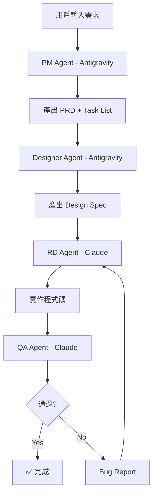

# Multi-Agent 自動化開發流程架構

## 🎯 概念

用兩個 AI CLI 工具組成完整開發團隊，透過**檔案交接**實現 agent 間的協作：

| 角色 | 工具 | 職責 |
|------|------|------|
| 🧑‍💼 **PM** | Antigravity CLI (`agy`) | 需求分析、拆解任務、產出 PRD |
| 🎨 **Designer** | Antigravity CLI (`agy`) | UI/UX 設計規格、元件規劃 |
| 👨‍💻 **RD** | Claude CLI (`claude`) | 根據 PRD + Design Spec 寫程式碼 |
| 🧪 **QA** | Claude CLI (`claude`) | 程式碼審查、測試、Bug Report |

## 🔄 流程



## 📁 交接協定

所有 Agent 透過 `.ai-pipeline/` 目錄下的檔案進行交接：

```
.ai-pipeline/
├── 01-prd.md           # PM 產出的需求文件
├── 02-design-spec.md   # Designer 產出的設計規格
├── 03-task-list.md     # 任務清單 (含狀態追蹤)
├── 04-qa-report.md     # QA 測試報告
└── status.json         # 流程狀態追蹤
```

## 🚀 執行方式

### 方式一：全自動 Pipeline（推薦）
```bash
./scripts/ai-pipeline.sh "我要做一個 Todo App"
```
依序自動執行所有階段，每個階段的產出作為下一階段的輸入。

### 方式二：分階段手動控制
```bash
./scripts/ai-pipeline.sh --stage pm "我要做一個 Todo App"
./scripts/ai-pipeline.sh --stage design
./scripts/ai-pipeline.sh --stage rd
./scripts/ai-pipeline.sh --stage qa
```

### 方式三：iTerm2 Split View（視覺化監控）
```bash
./scripts/ai-pipeline-visual.sh "我要做一個 Todo App"
```

## ⚙️ 技術細節

- **Antigravity CLI**: 使用 `agy -p "prompt"` 進行 print mode 執行
- **Claude CLI**: 使用 `claude -p "prompt" --output-format json` 進行 headless 執行
- **交接**: 透過檔案系統（`.ai-pipeline/` 目錄）
- **狀態管理**: `status.json` 追蹤每個階段的完成狀態
