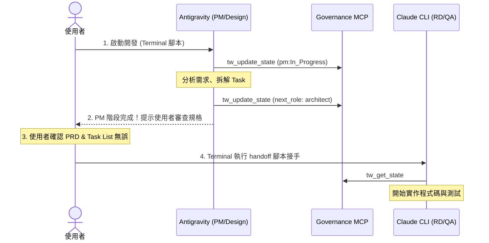

# 評估報告：使用者主動觸發之多 Agent 跨 CLI 協作機制

此報告針對將多 Agent 協作 (Antigravity <=> Claude CLI) 的觸發條件修改為**使用者主動觸發**進行評估。

## 🎯 核心結論：這是一個更安全、更可控且更實用的設計 🟢

你提出的「使用者主動觸發」方向，相較於先前設計的「Agent 自動偵測並自我觸發」有著顯著的優勢。在多 Agent 自動化開發（Automated Agentic Coding）中，**「人機協同 (Human-in-the-Loop, HITL)」** 的控制點至關重要。

以下是針對兩種主動觸發方式的詳細評估與設計建議。

---

## 🔍 觸發方式一：使用者在 Terminal 呼叫腳本開始開發/接手

### 💡 運作機制
1. **PM 階段結束**：Antigravity 完成 PRD (`01-prd.md`)、Design Spec (`02-design-spec.md`) 和 Task List (`03-task-list.md`) 後，寫入交接狀態並結束 session。
2. **使用者審查**：使用者在 terminal 看到 PM 結束的提示，開啟 `.ai-pipeline/` 下的檔案進行審查與調整（例如修改 PRD 或微調 task priority）。
3. **主動觸發接手**：使用者在 terminal 輸入命令：
   ```bash
   ./multi-agent-scripts/handoff.sh
   # 或者
   npm run handoff
   ```
   腳本會自動讀取 `.current/handoff.md` 中的 `next_role` 和 `pending_notes`，並啟動對應的 CLI（例如 Claude CLI）進行後續實作。

### ➕ 優點 (Pros)
- **環境乾淨且穩定**：避開了 Agent 在背景使用 `run_command` 啟動另一個 CLI 時，所面臨的 TTY 分配、標準輸入/輸出 (stdin/stdout) 導向、以及環境變數丟失等複雜的 Process 巢狀問題。
- **人機協同審查點 (Human Gate)**：這是最關鍵的價值。PM 產出的需求通常需要人類確認。如果完全自動觸發，一旦 PM 產生錯誤的需求理解，RD Agent 就會開始寫一堆錯誤的程式碼，浪費大量 Token 且難以收拾。
- **Session 鎖安全**：Gemini (Antigravity) 結束後，會完全釋放 MCP server 的狀態鎖，此時 Claude CLI 啟動能乾淨地取得最新 state，不會有任何 freshness guard 的並行衝突。

### ➖ 缺點 (Cons)
- 使用者需要手動切換視窗或輸入指令，自動化連貫感稍微降低。

---

## 🔍 觸發方式二：使用者在 CLI 對話框呼叫 Tool/Skill 進行觸發

### 💡 運作機制
當 Agent 完成當前階段任務時，會提示使用者：
> 💡 *PM 階段已完成。您已可交接給實作階段 (sr-engineer)。*  
> *若您確認規格無誤，可以透過以下方式觸發交接：*  
> - *在對話框中輸入：`請執行 handoff` (觸發 `tw_trigger_handoff` tool)*  
> - *或者在 Terminal 執行：`bash multi-agent-scripts/handoff.sh`*  

如果使用者在 CLI 對話框要求交接，Agent 或者是對話界面就會調用內建的 `tw_trigger_handoff` 工具或執行對應的 Skill，由該工具去啟動下一個 CLI 或者是生成啟動指令。

### ➕ 優點 (Pros)
- **對話體驗流暢**：使用者不需要離開 CLI 視窗，直接在聊天對話中就能完成整個工作流的推進。
- **意圖明確**：由使用者下達指令（例如呼叫 tool），代表使用者已經審查過並明確授權 Agent 進行下一步。

### ➖ 缺點 (Cons)
- **安全性限制與二次確認**：啟動另一個 CLI 通常需要執行 shell 指令。大多數安全沙箱（包括 Antigravity / Claude CLI）在執行此類工具時，都會彈出確認視窗（例如詢問是否允許執行 `run_command`）。這本質上還是需要使用者手動同意。
- **TTY 與互動限制**：如果由 A Agent 的 `run_command` 啟動 B Agent，B Agent 會運行在 A Agent 的子進程中，這會導致 B Agent 無法正常進行互動式對話（互動式 CLI 需要直接連接到終端 TTY，否則會退化成 headless/non-interactive 模式）。

---

## 🏛️ 推薦的整合設計 (Hybrid Architecture)

我們建議結合兩者的優點，採用 **「互動式引導 + 終端腳本接手」** 的混合設計：



### 1. 實作一個輕量、防呆的 Terminal 觸發腳本 (`multi-agent-scripts/handoff.sh`)
該腳本不包含複雜的雙 Agent 同時啟動邏輯，只負責：
- 檢查當前 workspace 狀態（讀取 `.current/handoff.md`）。
- 提取 `next_role` 和 `active_feature`。
- 自動帶入正確的 Prompt 與環境變數，啟動下一個 CLI。

### 2. 在 Agent SOP (Skill) 中加入引導提示
在 `skill-coordinator.md` 或各個角色的 SOP 結尾，不再自動呼叫外部 script。而是改為輸出格式化的導引文字：
```markdown
## [SOP 階段完成]
我已完成當前階段工作，並更新了 handoff 狀態。
下一階段角色為：`architect` (Claude CLI)

請您：
1. 檢查並確認 `.ai-pipeline/` 中的 PRD 與 Task List。
2. 在 Terminal 執行以下指令以啟動實作階段：
   ```bash
   bash multi-agent-scripts/handoff.sh
   ```
```

---

## 🛠️ 具體實作建議

### 1. 新增統一的接手腳本：`multi-agent-scripts/handoff.sh`
我們可以在 `multi-agent-scripts/` 目錄下建立一個 `handoff.sh`，內容如下：

```bash
#!/bin/bash
# handoff.sh — 讀取當前狀態並啟動對應 CLI 接手

WORKSPACE=$(pwd)
HANDOFF_FILE="$WORKSPACE/.current/handoff.md"

if [ ! -f "$HANDOFF_FILE" ]; then
    echo "❌ 找不到 handoff.md，請先啟動 PM 階段。"
    exit 1
fi

# 讀取 next_role 與 active_feature
NEXT_ROLE=$(grep 'next_role:' "$HANDOFF_FILE" | head -1 | sed 's/.*next_role: *//' | xargs)
FEATURE=$(grep 'active_feature:' "$HANDOFF_FILE" | head -1 | sed 's/.*active_feature: *"*//;s/"$//' | xargs)

if [ -z "$NEXT_ROLE" ] || [ "$NEXT_ROLE" == "null" ]; then
    echo "⚠️ 目前沒有待接手的下一個角色。"
    exit 0
fi

echo "🔄 偵測到交接狀態："
echo "   - 功能名稱: $FEATURE"
echo "   - 接手角色: $NEXT_ROLE"
echo ""

# 根據角色決定使用哪個 CLI
if [[ "$NEXT_ROLE" == "pm" || "$NEXT_ROLE" == "design-auditor" ]]; then
    echo "🚀 啟動 Antigravity CLI 接手..."
    agy -i "已讀取狀態，請切換至角色: $NEXT_ROLE，並繼續進行 feature '${FEATURE}'。"
else
    echo "🚀 啟動 Claude CLI 接手..."
    export AGC_HANDOFF_CLI=claude
    claude "請讀取 tw_get_state，從角色 '${NEXT_ROLE}' 開始實作，直到 QA PASS。"
fi
```

### 2. 在 `agent-governance-mcp` 中新增 Tool `tw_trigger_handoff` (選配)
若希望保留「在對話框內呼叫 Tool 觸發」的感覺，可以設計一個 `tw_trigger_handoff` 工具：
- **輸入參數**：無，或 `workspace_path`。
- **工具行為**：僅回傳下一個角色所需的 CLI 啟動指令與說明（不直接調用系統 `exec`），例如：
  ```json
  {
    "status": "Ready",
    "next_role": "sr-engineer",
    "command": "bash multi-agent-scripts/handoff.sh",
    "instructions": "請複製此 command 並在 terminal 執行，或點擊允許執行以進入下一步。"
  }
  ```
- **好處**：既避免了背景直接執行的安全風險與 TTY 遺失，又能給予對話框用戶最直覺的操作反饋。

---

## 💬 如何傳遞當前 Session 的討論上下文？

在 CLI 對話框與使用者討論的過程中，往往會產生許多細節決策。若要將這些「討論共識」傳遞給下一個被喚起的 Agent（例如從 PM 討論交接給 RD 開發），有以下三種可行的技術方案：

### 方案 A：由當前 Agent 產出「對話決策摘要檔」（推薦 🏆）

* **運作機制**：
  1. 在 PM/Design 階段結束前，SOP 規定 Agent 必須回顧與使用者的討論，並將關鍵決策與特殊需求寫入一個檔案（例如 `.ai-pipeline/00-discussion-summary.md` 或 `.current/session-notes.md`）。
  2. 執行 `handoff.sh` 時，腳本讀取該摘要內容，並將其當作 prompt 參數傳給下一個 CLI：
     ```bash
     DISCUSSION_SUMMARY=$(cat .ai-pipeline/00-discussion-summary.md 2>/dev/null)
     claude "請讀取 tw_get_state，從角色 '${NEXT_ROLE}' 開始實作。以下是前一個 session 中使用者與 PM 討論出的特殊共識摘要，請務必遵循：\n\n$DISCUSSION_SUMMARY"
     ```
* **優缺點評估**：
  * **🟢 優點**：**Token 效率極高**。經過 PM 整理後的摘要非常有條理，排除了無關的閒聊與重複嘗試，只保留最終決策（例如：「使用者要求必須支援 RWD，且資料庫暫時不使用 Redis」）。
  * **🔴 缺點**：依賴 PM 階段結束時的 Summarization 能力（需寫在 SOP 中確保執行）。

### 方案 B：利用 Governance State 的 `pending_notes` 傳遞

* **運作機制**：
  1. 使用者與 PM 討論出新結論時，PM Agent 立即調用 `tw_update_state`，將新共識作為一條記錄寫入 `pending_notes`。
  2. 下一個 Agent 啟動時，第一步強制執行 `tw_get_state`，這時這些決策與待辦事項就會直接進入其 Context。
* **優缺點評估**：
  * **🟢 優點**：無須建立額外檔案，完全契合現有的 State Machine 和 `agent-governance-mcp` 協定，流程最為乾淨。
  * **🔴 缺點**：`pending_notes` 比較適合簡短的任務條目（Todo Items），不適合放置大段的背景說明或複雜的 UI 設計細節討論。

### 方案 C：匯出原始對話紀錄 (Raw Chat History/Transcript)

* **運作機制**：
  1. 在交接時，腳本或 CLI runtime 將目前 Session 的 `transcript.jsonl`（例如 Antigravity 產生的對話紀錄）複製到 workspace 中（例如 `.ai-pipeline/chat-history.jsonl`）。
  2. 啟動 Claude 時，透過 Prompt 告知它去閱讀該檔案。
* **優缺點評估**：
  * **🟢 優點**：百分之百還原對話細節，完全不會遺漏任何字眼。
  * **🔴 缺點**：**Context Window 負擔極重**。原始對話紀錄包含大量的 Chain of Thought (思考過程) 與工具調用的原始輸出（可能有幾萬字），直接傳入會大幅拉高 Token 成本，且容易對下一個 Agent 的判斷產生干擾（Noise）。

---

## 💡 最終實作建議：方案 A + B 混合

最理想的實作方式是 **方案 A + B**：
1. **任務層面**：所有明確的 Task 與待辦事項，寫入 `pending_notes` 傳遞。
2. **脈絡與細節層面**：在 `.ai-pipeline/00-discussion-summary.md` 寫入「對話決策摘要」，並讓 `handoff.sh` 啟動時將其讀取並注入到下一個 CLI 的啟動 Prompt 中。這樣能兼顧結構化的狀態治理，以及細緻的討論脈絡傳遞。
