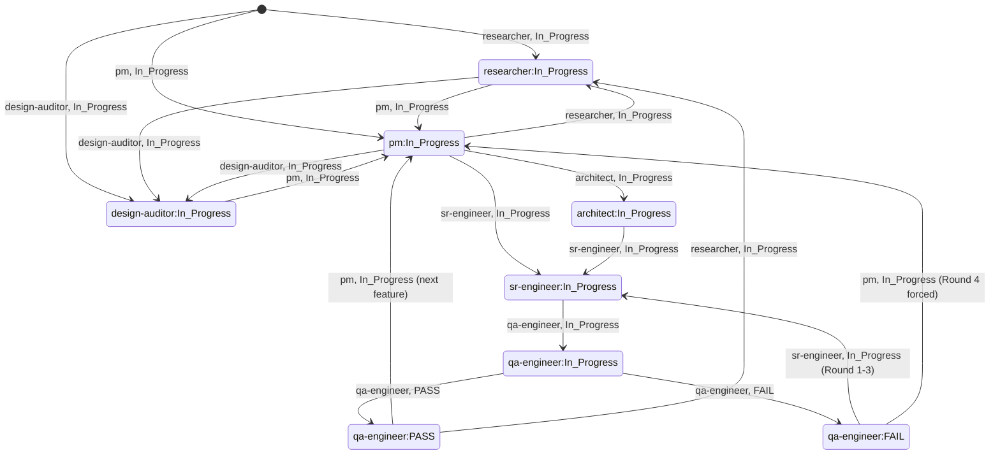

# Agent Governance MCP — Automated Workflow Phases Report

> @researcher · 2026-05-22
> Source: Codebase analysis of `index.ts`, `tools/`, `guards/`, `content/`, `prompts/`, `specs/`, `schema/`

## Summary

- The system implements a **3-Layer Defense Architecture** (Prompts → Tools → Guards) enforcing a multi-role routing chain with server-side state-machine validation.
- **8 roles** (coordinator, coordinator-lite, researcher, design-auditor, pm, architect, sr-engineer, qa-engineer) each have defined SOPs with automated handoff via `pending_notes` → `next_role`.
- **State synchronisation** is server-enforced: pre-flight `tw_get_state` is mandatory before any write; transitions are validated against an `ALLOWED_TRANSITIONS` matrix; QA round-cap (≥4) forces PM re-entry.
- **RAG lifecycle** is fully automated: lazy reindex on prompt activation, PRD auto-discover, PASS-triggered GC, concurrency coalescing.
- **Schema versioning** uses lazy migrate-on-read with refuse-loud semantics for future versions.

---

## Evidence — Architecture Overview

### Layer 1: MCP Prompts (Auto-inject Context)

**Source**: [`prompts/build.ts`](file:///Users/paul.ph.chen/agent-governance-mcp/prompts/build.ts)

Every role prompt is assembled by `buildPromptForRole()`:

```
constitution.md + skill-<role>.md + current handoff state (JSON) + [RAG spec context]
```

| Prompt Name       | Role              | Trigger                              |
|-------------------|-------------------|--------------------------------------|
| `sr-engineer`     | Sr-engineer       | Implementation work                  |
| `researcher`      | Researcher        | Research / investigation             |
| `pm`              | PM                | Spec / task breakdown                |
| `qa-engineer`     | QA                | Review / test                        |
| `teamwork`        | Coordinator       | Triage / routing (default)           |
| `teamwork-lite`   | Coordinator-lite  | Solo-dev direct-execute              |
| `architect`       | Architect         | System design                        |
| `design-auditor`  | Design Auditor    | Extract visual/copy tokens           |

**Automation details**:
- Constitution + skill content are loaded from `content/` directory, with per-workspace override via `.current/<filename>` ([`build.ts:32-44`](file:///Users/paul.ph.chen/agent-governance-mcp/prompts/build.ts#L32-L44))
- Project state is auto-injected as a JSON block from `storage.parse()` ([`build.ts:227-235`](file:///Users/paul.ph.chen/agent-governance-mcp/prompts/build.ts#L227-L235))
- RAG spec context is appended via `appendSpecContext()` for non-coordinator roles ([`build.ts:156-213`](file:///Users/paul.ph.chen/agent-governance-mcp/prompts/build.ts#L156-L213))

### Layer 2: Structured Tools (10 `tw_*` APIs)

**Source**: [`index.ts:306-528`](file:///Users/paul.ph.chen/agent-governance-mcp/index.ts#L306-L528)

| Tool                 | R/W   | Guard Required | Purpose                                      |
|----------------------|-------|----------------|----------------------------------------------|
| `tw_get_state`       | Read  | None           | Read handoff state; marks session for guards  |
| `tw_detect_drift`    | Read  | None           | Compare handoff vs task list                  |
| `tw_switch_role`     | Read  | None           | Return role SOP text                          |
| `tw_get_next_task`   | Read  | None           | Return next uncompleted task                  |
| `tw_update_state`    | Write | Pre-flight     | Atomic state write + transition validation    |
| `tw_complete_task`   | Write | Pre-flight     | Mark task `[x]` — qa-engineer only            |
| `tw_rollback_task`   | Write | Pre-flight     | Mark task `[ ]` with reason                   |
| `tw_add_task`        | Write | Pre-flight     | Append task to list                           |
| `tw_index_prd`       | Write | None           | Chunk + embed PRD into SQLite RAG index       |
| `tw_clear_prd_chunks`| Write | None           | Drop all RAG chunks for a workspace           |

### Layer 3: Server-side Guards

**Source**: [`guards/session.ts`](file:///Users/paul.ph.chen/agent-governance-mcp/guards/session.ts)

| Guard                   | Enforcement Point                      | Mechanism                              |
|-------------------------|----------------------------------------|----------------------------------------|
| Pre-flight check        | `tw_update_state`, `tw_complete_task`, `tw_rollback_task`, `tw_add_task` | `enforcePreFlight()` — throws if `tw_get_state` not called first |
| Freshness verification  | All file-mode writes                   | `verifyFreshness()` — compares mtime snapshot vs current |
| Extra token verification| SQLite mode writes                     | `verifyExtra()` — compares `last_updated` snapshot |
| Stale session cleanup   | Background (30 min interval)           | `cleanupStaleSessions(60 min)` — evicts idle sessions |
| File lock               | handoff.md / tasks.md writes           | `withFileLock()` from `guards/file-lock.ts` |

---

## Phase-by-Phase Workflow Detail

### Phase 0: Coordinator Triage (Entry Point)

**Source**: [`content/skill-coordinator.md`](file:///Users/paul.ph.chen/agent-governance-mcp/content/skill-coordinator.md)

```
User Request → Coordinator
  ├─ Design-source detected? → design-auditor (before PM)
  ├─ Complexity Scope Gate triggered? → Route to role via tw_switch_role
  └─ Simple task? → Execute directly
```

**Automated logic**:
1. **Design-source detection** (keyword/URL/file-extension scan): `figma.com`, `.sketch`, `mockup`, `設計稿`, etc. → routes to `design-auditor` before PM.
2. **Complexity Scope Gate**: ≥2 files, new public API, ≥50 LoC, needs tests, or explicit keyword (`plan`, `spec`, `feature`) → route to role.
3. **State sync**: `tw_get_state` → `tw_detect_drift` before routing (skipped for Q&A / doc edits).
4. **Routing**: `tw_switch_role(<role>)` → follow returned SOP.
5. **Multi-phase chaining**: Each role emits `pending_notes: ["next_role: <name>"]` for the coordinator to continue the chain.

**Lite mode** ([`content/skill-coordinator-lite.md`](file:///Users/paul.ph.chen/agent-governance-mcp/content/skill-coordinator-lite.md)): Solo-dev bypass. No state writes, no role switching. `tw_update_state` / `tw_switch_role` are rejected for this role. Scope creep → recommend `/teamwork`.

### Phase 1: Research (Optional)

**Source**: [`content/skill-researcher.md`](file:///Users/paul.ph.chen/agent-governance-mcp/content/skill-researcher.md)

**SOP** (4 steps, fully automated):

| Step | Action | Automation |
|------|--------|------------|
| 1 | `tw_get_state` → `tw_detect_drift` | Server-enforced pre-flight |
| 2 | Web search, file reads, code traversal | Max 3 research branches (circuit-breaker) |
| 3 | Write `research/<topic>.md` | Structured schema: Summary → Evidence → Recommendation → Alternatives → Open Questions |
| 4 | `tw_update_state(status=In_Progress, pending_notes=["Findings: research/<topic>.md", "next_role: pm"])` | Transition validated: `researcher:In_Progress → pm:In_Progress` ✓ |

**Transition enforcement** ([`tools/transitions.ts:78-83`](file:///Users/paul.ph.chen/agent-governance-mcp/tools/transitions.ts#L78-L83)):
- From `researcher:In_Progress` → allowed: `(pm, In_Progress)`, `(pm, Blocked)`, `(researcher, Blocked)`, `(design-auditor, In_Progress)`
- From `researcher:Blocked` → allowed: `(researcher, In_Progress)`, `(pm, In_Progress)`

### Phase 1.5: Design Audit (Optional, Conditional)

**Source**: [`content/skill-design-auditor.md`](file:///Users/paul.ph.chen/agent-governance-mcp/content/skill-design-auditor.md)

**Trigger**: Coordinator detects design reference (Figma URL, `.sketch` file, `設計稿` keyword, etc.).

**SOP** (6 steps):

| Step | Action | Automation |
|------|--------|------------|
| 1 | `tw_get_state` → `tw_detect_drift` | Server-enforced |
| 2 | Mode detection (`figma`/`sketch`/`xd`/`penpot`/`pdf`/`image`/`paper`/`no-design`) | Pattern-matching table |
| 3 | Extract: MCP tools (Figma/Sketch), OCR, or user-confirm | Max 3 attempts × max 5 files per surface |
| 4 | Fill Copy/Strings + Visual Tokens tables | Verbatim-only policy; `authored-here` for paraphrased values |
| 5 | Write `design/<feature>.md` | Structured schema: Mode → Source Manifest → Copy/Strings → Visual Tokens → Out of Scope |
| 6 | `tw_update_state(agent_id="design-auditor", pending_notes=["Audit: design/<feature>.md", "next_role: pm"])` | Transition: `design-auditor:In_Progress → pm:In_Progress` ✓ |

**Token efficiency**: When skipped entirely (no design reference), the skill is never loaded — zero per-prompt cost.

### Phase 2: Product Management (Spec + Tasks)

**Source**: [`content/skill-pm.md`](file:///Users/paul.ph.chen/agent-governance-mcp/content/skill-pm.md)

**SOP** (7 steps):

| Step | Action | Automation |
|------|--------|------------|
| 1 | `tw_get_state` → `tw_detect_drift` | Server-enforced |
| 2 | Review requirements + `research/<topic>.md` + `design/<feature>.md` | If design audit exists, **copy verbatim** (no paraphrase) |
| 3 | **Resource Audit Gate**: grep for external refs (`http://`, `figma`, `JIRA`, `設計圖`, etc.) | Per-reference: `fetch / index / ignore` — recorded in spec |
| 4 | **Ambiguity Gate**: incomplete/conflicting requirements | `tw_update_state(status=Blocked)` + STOP |
| 5 | Write `specs/<feature>.md` | 7-section schema: Problem → User Stories → ACs (BDD) → **Copy/Strings** → **Visual Tokens** → Out of Scope → Dependencies |
| 6 | Append tasks via `tw_add_task` | One call per task; format: `- [ ] T01 [P0] <desc> \| depends_on: none` |
| 7 | `tw_update_state(pending_notes=["next_role: architect" or "next_role: sr-engineer"])` | Complexity-based routing: ≥3 modules / new data model / cross-cutting API → architect |

**Spec Copy/Strings and Visual Tokens** enforcement is a key automation:
- **Copy/Strings table**: every user-facing string must have `string id | exact text | source` — source must be PRD section, Figma node id, CSV/ticket ref, or `authored-here` with justification.
- **Visual Tokens table**: every literal visual property must have `token id | property | value | source` — hex colors, sp/dp dimensions, weights, radii, strokes, opacity.
- If any string/token has no canonical source → PM **blocks** (`tw_update_state(status=Blocked)`).

**Task format**: `- [ ] T01 [P0] <description> | depends_on: none` — one task = one sr-engineer session (≤5 files / 300 lines).

### Phase 3: Architecture (Conditional)

**Source**: [`content/skill-architect.md`](file:///Users/paul.ph.chen/agent-governance-mcp/content/skill-architect.md)

**Trigger**: PM routes here when complexity threshold is met (≥3 modules, new data model, cross-cutting API).

**SOP** (7 steps):

| Step | Action | Automation |
|------|--------|------------|
| 1 | `tw_get_state` → `tw_detect_drift` | Server-enforced |
| 2 | Read `specs/<feature>.md` | Missing → block back to PM |
| 3 | **Ambiguity Gate** | Missing/contradictory ACs → block back to PM |
| 4 | **External-reference Sanity Gate** | Cross-check Deferred Resources vs spec Dependencies; unclassified ref → block to PM |
| 5 | Write `specs/<feature>-architecture.md` | 6-section schema: Affected Files → Data Structures → Interface Contracts → Sequence Diagram → Deferred Resources → Open Questions |
| 6 | **Open Questions Gate** | Non-empty → block back to PM |
| 7 | `tw_update_state(pending_notes=["Architecture ready", "next_role: sr-engineer"])` | Transition: `architect:In_Progress → sr-engineer:In_Progress` ✓ |

### Phase 4: Implementation (Sr-Engineer)

**Source**: [`content/skill-sr-engineer.md`](file:///Users/paul.ph.chen/agent-governance-mcp/content/skill-sr-engineer.md)

**SOP** (8 steps):

| Step | Action | Automation |
|------|--------|------------|
| 1 | `tw_get_state` → `tw_detect_drift` | Server-enforced |
| 2 | **Clarification Gate** | Ambiguous → `tw_update_state(status=Blocked, pending_notes=["next_role: human"])` |
| 3 | **Task-Size Check** | >5 files or >300 lines → block, recommend PM split |
| 4 | Read spec + architecture docs, implement | — |
| 5 | Type/lint check | `npx tsc --noEmit` / `mypy .` / `cargo check` — ZERO errors |
| 6 | **Security Checklist** | No hardcoded secrets, input validation, no injection vectors |
| 7 | Full project build | ZERO errors |
| 8 | `tw_update_state(pending_notes=["sr-engineer: <task-id> ready for QA", "next_role: qa-engineer"])` | Transition: `sr-engineer:In_Progress → qa-engineer:In_Progress` ✓ |

**Hard constraints (server-enforced)**:
- `tw_complete_task` is **rejected** for sr-engineer — server requires `agent_id="qa-engineer"` ([`tools/transitions.ts:47-59`](file:///Users/paul.ph.chen/agent-governance-mcp/tools/transitions.ts#L47-L59))
- No test files — only qa-engineer writes tests (constitution §2)

### Phase 5: QA Review & Testing (QA-Engineer)

**Source**: [`content/skill-qa-engineer.md`](file:///Users/paul.ph.chen/agent-governance-mcp/content/skill-qa-engineer.md)

This is the most complex phase with 4 sub-phases:

#### Sub-phase 0: Claim Review

```
tw_update_state(status=In_Progress, agent_id="qa-engineer", pending_notes=["QA: claiming review of <task-ids>"])
```

Server validates: `sr-engineer:In_Progress → qa-engineer:In_Progress` ✓

#### Sub-phase 1: Review

| Check | Automation |
|-------|------------|
| Code correctness, edge cases, security | Manual review |
| **Copy Audit Gate** | For every spec Copy/Strings entry: grep source tree for string id AND text. Drift (impl ≠ spec) → FAIL to sr-engineer. Coverage gap (unlisted string) → FAIL to PM |
| **Visual Audit Gate** | For every spec Visual Tokens entry: grep source tree for literal value. Drift → FAIL to sr-engineer. Coverage gap → FAIL to PM. Source rot (Figma MCP check) → flag to PM |

Write findings → `qa_reports/review_<task-id>.md`

#### Sub-phase 2: Discussion (Multi-Round)

```
Round 1-3: QA ↔ Sr-engineer review cycle
  QA FAIL → tw_update_state(status=FAIL, qa_review="<reason>")
  Server: qa_round++ (computeNewRound)
  sr-engineer fixes → tw_update_state(In_Progress, pending_notes=["next_role: qa-engineer"])
  Repeat...

Round 4 (after 3 prior FAILs):
  Server injects: "⛔ Round 4: forced rollback to pm — no further QA allowed until PM resets."
  ONLY (pm, In_Progress) accepted next — server-enforced via round-cap override
```

**Round counter automation** ([`tools/transitions.ts:243-248`](file:///Users/paul.ph.chen/agent-governance-mcp/tools/transitions.ts#L243-L248)):

```
(qa-engineer, FAIL)    → prev_round + 1
(qa-engineer, PASS)    → 0
(pm, In_Progress)      → 0 (reset)
everything else        → hold steady
```

#### Sub-phase 3: Tests

| Gate | Requirement |
|------|-------------|
| Spec-to-Test Map | Every AC in spec → ≥1 test |
| Coverage Gate | ≥80% line coverage on new/modified files |
| Security Smoke Tests | Boundary inputs, auth/permission |

#### Sub-phase 4: Run

| Outcome | Server Automation |
|---------|-------------------|
| **PASS** | `tw_update_state(status=PASS, agent_id="qa-engineer", completed_tasks=[...], qa_review="<summary>")` → Server: (1) `recordReview` writes evidence, (2) `hasEvidence` gate verifies all task IDs have evidence, (3) `qa_round` resets to 0, (4) RAG chunks GC'd for workspace |
| **FAIL** | `tw_rollback_task` + `tw_update_state(status=FAIL, qa_review="<detail>")` → Server: `qa_round++` |

**Evidence enforcement** ([`index.ts:620-631`](file:///Users/paul.ph.chen/agent-governance-mcp/index.ts#L620-L631)):
- PASS with `completed_tasks` requires evidence for every task ID
- File mode: `qa_reports/review_<id>.md` must exist
- SQLite mode: `reports` table must have a PASS-status row

---

## State Machine: ALLOWED_TRANSITIONS Matrix

**Source**: [`tools/transitions.ts:69-143`](file:///Users/paul.ph.chen/agent-governance-mcp/tools/transitions.ts#L69-L143)



**Validation precedence** ([`transitions.ts:188-233`](file:///Users/paul.ph.chen/agent-governance-mcp/tools/transitions.ts#L188-L233)):
1. `agent_id` required (non-null, known agent)
2. Round-cap override (`qa_round ≥ 4` → only `(pm, In_Progress)`)
3. Self-loop fast path (`same agent, In_Progress → In_Progress` → accept)
4. Table lookup against `ALLOWED_TRANSITIONS` map

---

## RAG Lifecycle Automation

**Source**: [`specs/rag-lifecycle-automation.md`](file:///Users/paul.ph.chen/agent-governance-mcp/specs/rag-lifecycle-automation.md), [`prompts/build.ts`](file:///Users/paul.ph.chen/agent-governance-mcp/prompts/build.ts), [`tools/rag.ts`](file:///Users/paul.ph.chen/agent-governance-mcp/tools/rag.ts)

| Stage | Automation | Source |
|-------|------------|--------|
| **PRD path discovery** | `state.prd_path` > `PRD.md` > `docs/PRD.md` > `specs/PRD.md` | [`build.ts:86-101`](file:///Users/paul.ph.chen/agent-governance-mcp/prompts/build.ts#L86-L101) |
| **Lazy reindex** | On prompt activation, if `prd_mtime` / `chunker_version` / `embedding_model` differs → `buildPrdChunks()` + `upsertPrdChunks()` | [`build.ts:105-154`](file:///Users/paul.ph.chen/agent-governance-mcp/prompts/build.ts#L105-L154) |
| **Concurrency coalescing** | `getInflightKey(workspace, prdPath)` — duplicate reindex requests share the same promise | [`tools/rag-coalesce.ts`](file:///Users/paul.ph.chen/agent-governance-mcp/tools/rag-coalesce.ts) |
| **Spec context injection** | `queryPrdSpec(workspace, query, top-5)` → appended to last prompt message | [`build.ts:186-213`](file:///Users/paul.ph.chen/agent-governance-mcp/prompts/build.ts#L186-L213) |
| **PASS cleanup (GC)** | On `tw_update_state(status=PASS, agent_id="qa-engineer")` → await in-flight → `deletePrdChunks(workspace)` | [`index.ts:655-669`](file:///Users/paul.ph.chen/agent-governance-mcp/index.ts#L655-L669) |
| **Manual clear** | `tw_clear_prd_chunks(workspace_path)` → drop all chunks | [`index.ts:761-789`](file:///Users/paul.ph.chen/agent-governance-mcp/index.ts#L761-L789) |

**Chunking details** ([`tools/rag.ts:46-88`](file:///Users/paul.ph.chen/agent-governance-mcp/tools/rag.ts#L46-L88)):
- Split by H1-H3 headings
- Max chunk size: 2048 chars (~512 tokens)
- Overlap: 200 chars
- Embedding: `@xenova/transformers` (optional dep, `Xenova/all-MiniLM-L6-v2`)

---

## Schema Versioning

**Source**: [`schema/versions.ts`](file:///Users/paul.ph.chen/agent-governance-mcp/schema/versions.ts), [`schema/migrations-*.ts`](file:///Users/paul.ph.chen/agent-governance-mcp/schema/)

| Artifact | Current Version | Migration Strategy |
|----------|----------------|--------------------|
| `handoff.md` (YAML frontmatter) | v1 | Lazy migrate-on-read; refuse-loud on future |
| `tasks.md` (HTML comment sentinel) | v1 | Lazy migrate-on-read; refuse-loud on future |
| `.config.json` | v1 | Lazy migrate-on-read; heal-on-read persist |
| SQLite tables | N/A (additive) | `runSqliteMigrations()` at boot |

**Drift detection integration** ([`tools/drift.ts:99-151`](file:///Users/paul.ph.chen/agent-governance-mcp/tools/drift.ts#L99-L151)):
- `checkVersionSkew()` runs BEFORE `storage.parse()` in `detectDrift()`
- Reports if on-disk version > server max (stale server / newer workspace)
- Stale (< CURRENT) artifacts are NOT reported — lazy migrate heals them

---

## Storage Backends

**Source**: [`tools/storage.ts`](file:///Users/paul.ph.chen/agent-governance-mcp/tools/storage.ts), [`tools/storage-sqlite.ts`](file:///Users/paul.ph.chen/agent-governance-mcp/tools/storage-sqlite.ts)

| Mode | Backend | Activation | State Storage | Task Storage | RAG Support |
|------|---------|------------|---------------|--------------|-------------|
| **stdio** (default) | `FileHandoffStorage` | No `--port` flag | `.current/handoff.md` (YAML frontmatter) | `tasks.md` (markdown checkboxes) | ❌ |
| **HTTP** | `SqliteHandoffStorage` | `--port <N>` | `agc.db` → `handoff_state` table | `agc.db` → `tasks` table | ✅ (`prd_chunks` table) |

**File-mode write safety**:
- Atomic publish: write to temp → rename ([`handoff.ts:304-307`](file:///Users/paul.ph.chen/agent-governance-mcp/tools/handoff.ts#L304-L307))
- File locking via `withFileLock()` ([`guards/file-lock.ts`](file:///Users/paul.ph.chen/agent-governance-mcp/guards/file-lock.ts))
- Freshness verification: mtime snapshot at `tw_get_state` time → verify before write

**HTTP mode security** ([`index.ts:853-871`](file:///Users/paul.ph.chen/agent-governance-mcp/index.ts#L853-L871)):
- Optional `TW_AUTH_TOKEN` (Bearer token)
- Optional `TW_ALLOWED_ORIGINS` (CORS)
- Warning logged if no auth token set

---

## Workspace Configuration

**Source**: [`tools/config.ts`](file:///Users/paul.ph.chen/agent-governance-mcp/tools/config.ts)

`.current/.config.json` allows per-workspace customisation:

| Field | Default | Purpose |
|-------|---------|---------|
| `taskPattern` | `^- \[([ x])\] (\S+)\s+(.+)$` | Regex for parsing task lines (group 1=checkmark, 2=ID, 3=description) |
| `taskPaths` | `[".current/tasks.md", "tasks.md", "TODO.md"]` | Candidate task file paths |

---

## Drift Detection

**Source**: [`tools/drift.ts`](file:///Users/paul.ph.chen/agent-governance-mcp/tools/drift.ts)

**Checks performed**:

1. **Schema version skew**: on-disk artifact version > server max → error
2. **Handoff-vs-tasks consistency**: cross-reference completed tasks in both sources
3. **Vibe-coding drift**: task completed in task list but not in handoff → "possible vibe-coding drift"
4. **Handoff-ahead**: task completed in handoff but not in task list
5. **Status/incomplete mismatch**: FAIL/Blocked status with remaining incomplete tasks

**Token efficiency**: Drift details are compressed when >5 items share the same pattern — collapsed into summary with ID ranges ([`drift.ts:40-92`](file:///Users/paul.ph.chen/agent-governance-mcp/tools/drift.ts#L40-L92)).

---

## Anti-Loop Circuit Breakers (Constitution §5)

| Limit | Scope | Action |
|-------|-------|--------|
| Max 2 fix attempts | Same failure | STOP, report, wait for human |
| Max 3 file reads | Same target file | STOP, report, wait for human |
| QA Round cap = 4 | Same feature | Server forces `(pm, In_Progress)` only |

---

## End-to-End Workflow Example

```
1. User submits requirement (with Figma URL)
2. Coordinator detects design source → tw_switch_role("design-auditor")
3. Design-auditor extracts Copy/Strings + Visual Tokens → design/<feature>.md
   └ tw_update_state(pending_notes=["next_role: pm"])
4. PM copies design tables verbatim → specs/<feature>.md + tw_add_task × N
   └ tw_update_state(pending_notes=["next_role: architect"])
5. Architect → specs/<feature>-architecture.md
   └ tw_update_state(pending_notes=["next_role: sr-engineer"])
6. Sr-engineer implements, type-checks, security-checks
   └ tw_update_state(pending_notes=["next_role: qa-engineer"])
7. QA-engineer:
   a. Claim review (Phase 0)
   b. Review + Copy Audit + Visual Audit (Phase 1)
   c. Discussion rounds if issues (Phase 2, max 3 rounds)
   d. Write tests (Phase 3)
   e. Run all (Phase 4)
      ├ PASS → tw_update_state(PASS) + tw_complete_task → RAG chunks GC'd → next feature
      └ FAIL → qa_round++ → sr-engineer fixes → re-review
         └ Round 4 → forced PM re-entry
```

## Recommendation

The current architecture is production-grade. The 3-layer defense + server-enforced state machine eliminates most agent-coordination failure modes (double-completion, wrong-role writes, stale reads, unbounded QA loops). The main gap is that `coordinator-lite` has no state writes at all — teams using solo-dev mode lose all tracking. Consider a future `coordinator-lite-tracked` variant that allows opt-in state writes without the full routing chain.

## Alternatives Considered

- **Advisory routing (pre-v3.2.0)**: Transitions were documented in skills but not enforced. Agents could skip roles or write PASS without QA. Replaced by server-enforced matrix.
- **Background RAG indexer / `fs.watch`**: Rejected in favour of lazy reindex on prompt activation — zero config, no daemon process.
- **TTL-based chunk cleanup**: Deferred to v2 — PASS-triggered GC is sufficient for v1.

## Open Questions

- Should `coordinator-lite` support opt-in state writes for teams that want lightweight tracking without the full chain?
- Should `design-auditor` be available for routing from PM (currently only from coordinator)?
- Is there a plan for multi-PRD per workspace support (currently one PRD per workspace)?
