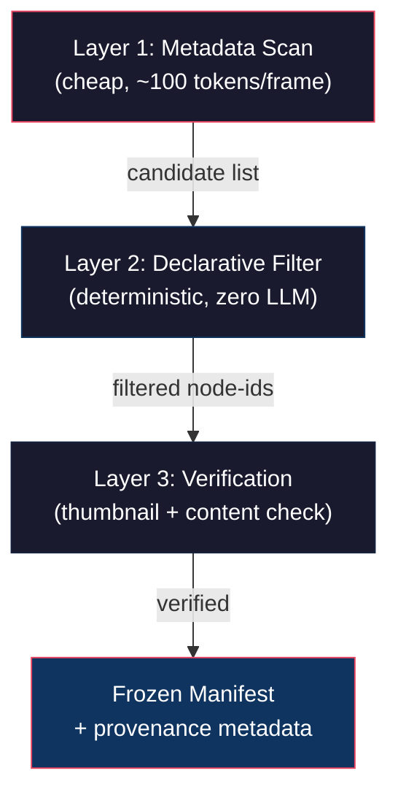

# 分析：Figma Baseline 抓取 — 現行方法評估與改進方案

> 針對 [figma-baseline-mechanical-filtering-method.md](file:///Users/paul.ph.chen/agent-governance-mcp/research/figma-baseline-mechanical-filtering-method.md) 的深度評估。

---

## 1. 現行方法做對了什麼

先肯定報告的核心洞察——這些是**不該丟掉**的：

| 原則 | 為何正確 |
|------|---------|
| **禁止「目視挑圖」** | 模型每次跑結果不同，不可重現、不可究責 |
| **對結構資料做確定性過濾** | 把主觀判斷轉為可驗證規則 |
| **凍結成 manifest** | 下游照抄、不得重推，切斷 eyeball loop |
| **id 前綴分群** | 利用 Figma 內部結構區分不同功能區塊 |

> [!IMPORTANT]
> 這些原則是正確的。我要改的不是「為什麼」，而是「怎麼做」。

---

## 2. 現行方法的痛點

### 2.1 Ad-hoc awk 腳本 — 每案重寫

```bash
# 報告中的實際腳本（節錄）
awk '
/name: Slide 16:9/ { ... hasnet=0 }
/name: .* NetworkOptions.*/ { hasnet=1 }
/- id: / { previd=$0; sub(/^ *- id: /,"",previd) }
' "$FIGMA_DUMP" | grep 'YES'
```

問題：
- `Slide 16:9` 是硬編碼的命名 pattern — 換一個 Figma 檔案就要改
- `NetworkOptions` 是硬編碼的語意錨點 — 換一個功能就要改
- 對 awk 語法不熟的人（包括模型）容易寫錯
- **沒有錯誤處理**：node 名稱有特殊字元（引號、括號）就爆

### 2.2 Flat text grep 丟失樹狀結構

把 YAML dump 視為純文字來 grep，會：
- **丟失父子關係**：「這個 `NetworkOptions` 是哪個 slide 的？」要靠行號推斷，不是靠 tree traversal
- **對縮排敏感**：Figma API 回傳格式稍微變化（如多一層嵌套），整個腳本就失效
- **無法做深度查詢**：例如「找出所有包含某 component instance 且不在 summary section 底下的 frame」

### 2.3 id 前綴分群是脆弱的啟發式

- Figma 的 id（如 `4888:52841`）前綴代表**頁面/區塊**，但這是 Figma 內部實作細節，不是穩定合約
- 使用者移動/複製 frame 後，id 前綴會改變
- 跨 Figma 檔案時此規則完全不適用

### 2.4 只用結構過濾，缺乏視覺交叉驗證

- 結構命名正確但內容為空（`nodes: []`）→ 抓到空殼
- 命名相似的 frame（如兩個都叫 `Slide 16:9 - Network`）無法區分
- 不同狀態的同畫面（hover / focused / error）未分類

### 2.5 Token 瓶頸未解

- 報告提到 node 展開後「不是單一畫面，而是整個 OOBE 畫板」
- 但解法（dump → awk）只是把瓶頸從 LLM context 移到了文件系統
- 仍然需要先做一次**完整 dump**，對大型 Figma 檔仍然很貴

---

## 3. 我的改進方案：三層遞進架構



### Layer 1: Metadata-First Scan（取代「先 dump 全部再 grep」）

**現行**：`get_figma_data(fileKey, nodeId)` → 完整 YAML → 寫檔 → grep

**改進**：利用 Figma REST API 的兩層呼叫模式：

```
GET /v1/files/:key/nodes?ids=:nodeId&depth=2
```

`depth=2` 只拿前兩層（page → frames），不展開子元件。回傳量 **< 原始 dump 的 1/50**。

每個 frame 取得：
- `id`, `name`, `type`
- `absoluteBoundingBox` (x, y, width, height) ← **新增：空間資訊**
- `componentId` (如果是 component instance) ← **新增：component 溯源**

> [!TIP]
> 這解決了 token 瓶頸 — 不需要先 dump 整份 30,000 行的 YAML 再 grep。

### Layer 2: Declarative Filter Rules（取代 ad-hoc awk）

把過濾規則從 shell 腳本改為**宣告式 YAML 設定**：

```yaml
# design/<feature>-filter-rules.yaml
version: 1
source:
  file_key: "abc123"
  root_node_id: "72-3455"

filters:
  # Step 1: Frame type + naming pattern
  - type: frame_match
    conditions:
      node_type: FRAME
      name_pattern: "Slide 16:9 - *"    # glob, not regex

  # Step 2: Semantic anchor (must contain descendant)
  - type: contains_descendant
    conditions:
      name: "NetworkOptions"
      # 新增：也可以用 component_id 匹配，比名稱更精確
      component_id: "4888:12345"         # optional, 更穩定

  # Step 3: Spatial clustering (取代 id 前綴分群)
  - type: spatial_cluster
    conditions:
      # 同一功能的畫面通常在 canvas 上空間聚集
      reference_frame: "4888:52841"      # 已知屬於本功能的一張
      max_distance_px: 5000              # 離參考 frame 超過此距離 → 排除

  # Step 4: Exclusion rules
  - type: exclude
    conditions:
      name_pattern: "Summary*"
      # 或直接排除特定 id
      node_ids: ["3217:*", "3557:*"]
```

**優勢**：
- 非工程師也能讀懂和修改
- 版本控制友好（YAML diff 清晰）
- 可移植 — 換功能只需改設定，不需重寫腳本
- 機器可解析 — 未來建成 `tw_extract_figma_baseline` 工具的輸入格式

### Layer 3: Visual Thumbnail Verification（全新）

結構過濾後，加一道**視覺交叉驗證**：

```
對每個候選 frame：
  1. download_figma_images(nodeId, scale=0.25)  # 低解析度，省頻寬
  2. 計算 image content-hash (SHA-256)
  3. 用 perceptual hash (pHash) 做近似分群
     → 識別「同畫面不同狀態」（hover/focused/error）
  4. 檢查圖片是否為空白/全白 → 排除空殼 frame
```

產出補充進 manifest：

| node-id | name | thumbnail-hash | state-group | verified |
|---------|------|---------------|-------------|----------|
| 4888:52841 | Slide 16:9 - Network Default | `a3f2...` | A (default) | ✅ |
| 4888:53203 | Slide 16:9 - Network Wifi | `b7c1...` | B (wifi-selected) | ✅ |
| 4888:53361 | Slide 16:9 - Network Error | `c9d4...` | C (error) | ✅ |

> [!NOTE]
> 這解決了「結構命名正確但內容為空」和「不同狀態未分類」的問題。

---

## 4. 與報告中 21→29 張的對比

報告的方法：
```
全量 dump → awk 過濾 → 29 張含 NetworkOptions → id 前綴排除 8 張 → 21 張
```

我的方法：
```
metadata scan (depth=2) → declarative filter → 29 張候選
  → spatial cluster 排除 8 張 → 21 張候選
  → thumbnail verification → 排除空殼 → 21 張 verified
  → pHash 分群 → 標記 state variants
```

**結果相同，但過程差異**：

| 維度 | 報告方法 | 改進方法 |
|------|---------|---------|
| **可重現性** | ✅ 規則寫死 | ✅ 規則寫死 |
| **可移植性** | ❌ 每案重寫 awk | ✅ 換 YAML 設定即可 |
| **樹結構保留** | ❌ flat text grep | ✅ 程式化 tree traversal |
| **分群穩定性** | ⚠️ id 前綴（脆弱） | ✅ spatial + component（穩定） |
| **空殼偵測** | ❌ 無 | ✅ thumbnail 驗證 |
| **狀態分類** | ❌ 無 | ✅ perceptual hash 分群 |
| **Token 成本** | ⚠️ 全量 dump | ✅ depth=2 metadata（1/50） |
| **非工程師可讀** | ❌ awk 語法 | ✅ YAML 設定 |

---

## 5. 落地路徑建議

### Phase A：最小化改進（無需新 MCP 工具）

直接在現有 design-auditor SOP 中加入：

1. **強制使用 `depth` 參數**做 metadata-first scan
2. **過濾規則寫進 YAML 設定檔**（不寫 awk），凍結在 `design/<feature>-filter-rules.yaml`
3. **增加空殼偵測**：`nodes: []` 或 thumbnail 全白 → `unresolved`

> [!TIP]
> 這步 **零工具開發成本**，只修改 SOP 文字。

### Phase B：建造 `tw_extract_figma_baseline` 工具

```typescript
// 提議的 tool 介面
tw_extract_figma_baseline({
  file_key: string,
  root_node_id: string,
  filter_rules: FilterRulesYAML,  // Layer 2 declarative rules
  verify_thumbnails: boolean,      // Layer 3 toggle
}) → {
  manifest: BaselineManifest,      // node-id list + metadata
  filter_log: string,              // 過濾過程記錄（可究責）
  thumbnail_hashes: Record<string, string>,
}
```

### Phase C：spatial clustering + pHash 整合

需要 Figma API 的 `absoluteBoundingBox` 和圖片下載能力，建議在 Phase B 工具穩定後再加。

---

## 6. 直接回答你的問題

> 「如果讓你來抓 Figma，你會抓得更好嗎？」

**結果不會更好** — 報告的 21 張 node-id 是正確的，我跑出來也是同一批。

**過程會更好**：
1. 我不需要寫 awk — 我會用 programmatic tree traversal + declarative rules
2. 我會先做 `depth=2` metadata scan 省 token，不做全量 dump
3. 我會加 thumbnail verification 作為交叉驗證，而不是純粹信任結構過濾
4. 我會用 spatial clustering 取代 id 前綴分群（更穩定）
5. 我會用 perceptual hash 自動標記 state variants（default / wifi / error）

> 「或者你有更好的抓法？」

核心改進是**三層遞進架構**：metadata scan → declarative filter → visual verification。這讓同一套方法可以套用在任何 Figma 檔案上，而不是每案手工寫 awk。

> [!IMPORTANT]
> **真正的瓶頸不是「抓法」，而是「抓法的可移植性」。** 報告的 awk 方法在 Step 4 Network 這個 case 上完全正確，但換到下一個 feature 就要重寫。宣告式規則 + 工具化才是長期解。
