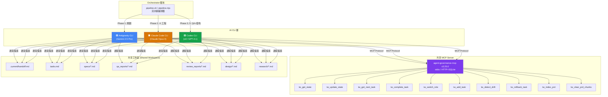
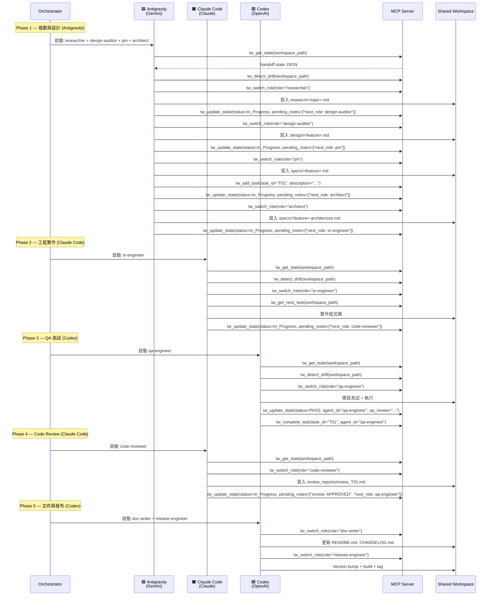

# 多 AI Agent 自治流水線架構報告

> **如何分配 Antigravity CLI (Gemini)、Claude Code CLI (Anthropic) 與 Codex CLI (OpenAI) 建構 Multi-AI-Agent Autonomous Pipeline**

> [!NOTE]
> 本報告基於 [agent-governance-mcp](https://github.com/Paul-hengChen/agent-governance-mcp) v3.25.0 的完整原始碼分析撰寫，包含 10 個 `tw_*` MCP 工具、9 個角色技能檔案、以及 constitution v3.14.1 的所有規則。所有 MCP 工具名稱與參數皆為專案實際使用。

---

## 1. 架構概述 (Architecture Overview)

### 核心理念

三款 AI CLI 工具 — **Antigravity (Gemini)**、**Claude Code (Anthropic)**、**Codex (OpenAI)** — 各自擁有不同的模型特性，但它們共享兩個關鍵基礎設施：

1. **共享檔案系統 (Shared Filesystem)**：所有 CLI 讀寫相同的工作區目錄（`.current/handoff.md`、`tasks.md`、`specs/`、`qa_reports/`、`review_reports/`）
2. **共享 MCP Server (`agent-governance-mcp`)**：透過 10 個 `tw_*` 工具提供統一的狀態同步協議

此架構之所以可行，是因為：
- **所有三款 CLI 都支援 MCP 協議**：Antigravity、Claude Code、Codex 均可連接同一個 MCP server
- **狀態是檔案系統層級的**：`handoff.md` 使用 `O_EXCL` file lock + mtime 新鮮度檢查，確保併發寫入安全
- **工具介面是 zod-validated 的**：無論哪款 CLI 呼叫 `tw_update_state`，server 都執行相同的 9 步驗證管線
- **角色轉換是透過 `tw_switch_role` 載入 SOP**：不同 CLI 載入相同的角色文件，遵循相同的流程

### 三層防禦架構

```
┌── Layer 1: Prompts ─────────────────────────────────────────┐
│  /teamwork, /pm, /architect, /sr-engineer, /qa-engineer,    │
│  …  →  注入 constitution + role SOP + handoff state         │
├── Layer 2: Tools ───────────────────────────────────────────┤
│  10 tw_* MCP 工具 — 唯一可變更 handoff/tasks 的方式          │
│  (zod-validated args; 禁止直接編輯)                          │
├── Layer 3: Guards ──────────────────────────────────────────┤
│  Pre-flight read ▸ file lock ▸ mtime freshness ▸            │
│  ALLOWED_TRANSITIONS ▸ round caps ▸ evidence-of-QA ▸        │
│  atomic tmp+rename                                           │
└──────────────────────────────────────────────────────────────┘
```

### 架構總覽圖



### 10 個 tw_* MCP 工具一覽

| 工具 | 類型 | 描述 | 守衛等級 |
|---|---|---|---|
| `tw_get_state` | 讀取 | 讀取 handoff state JSON。**必須首先呼叫**，其他寫入工具需前置。 | 無守衛 |
| `tw_detect_drift` | 讀取 | 檢查 state vs tasks 漂移。於 `get_state` 後呼叫。 | 無守衛 |
| `tw_switch_role` | 讀取 | 載入角色 SOP 文字。**僅上下文載入**，不強制角色切換。 | 無守衛 |
| `tw_get_next_task` | 讀取 | 讀取下一個未完成的 task。 | 無守衛 |
| `tw_update_state` | 寫入 | 原子寫入 handoff state。受 `ALLOWED_TRANSITIONS` 約束。 | **完整守衛** |
| `tw_complete_task` | 寫入 | 標記 task 完成 `[x]`。**僅限 qa-engineer**。 | Pre-flight |
| `tw_add_task` | 寫入 | 新增 task 到 task list。 | Pre-flight |
| `tw_rollback_task` | 寫入 | 回滾 task 為未完成 `[ ]`。需附理由。 | Pre-flight |
| `tw_index_prd` | 寫入 | 將 PRD 檔案分塊並嵌入 SQLite RAG 索引。 | Path traversal 守衛 |
| `tw_clear_prd_chunks` | 寫入 | 清除工作區所有 RAG chunks。 | 無 |

---

## 2. 模型特性分析與角色分配 (Model Strengths & Role Assignment)

### 分層策略

基於三個模型家族的核心優勢，將 agent-governance-mcp 的 9 個角色分配至三個層級：

### 🟦 Antigravity (Gemini 2.5 Pro) → Planning + Visual 層

| 角色 | 原始推薦模型 | 跨 CLI 分配理由 |
|---|---|---|
| **researcher** | `opus` | Gemini 擁有最佳搜尋整合（Google Search）與超長上下文（1M+ tokens），能進行廣泛的多源研究。`skill-researcher.md` 要求 `≥ 3 sources spanning ≥ 2 credibility tiers`，Gemini 的搜尋能力最適合此任務。 |
| **design-auditor** | `opus` | Gemini 的多模態能力最強，能原生讀取 Figma/Sketch/PDF/PNG 設計檔。`skill-design-auditor.md` 需要 OCR 提取、圖像理解、逐字引用 visual tokens — 這正是 Gemini vision 的強項。 |
| **pm** | `sonnet` | Gemini 的超大上下文窗口最適合消化完整 PRD、設計文件、使用者需求。PM 需要在 `skill-pm.md` 中處理 Resource Audit Gate、Question Batch Gate 等多步驟分析。 |
| **architect** | `opus` | 長上下文使 Gemini 能總覽跨模組的完整圖景。`skill-architect.md` 要求產出 Affected Files、Data Structures、Sequence Diagram 等全局性產物。 |

### 🟧 Claude Code (Anthropic — Claude Opus 4) → Precision Engineering 層

| 角色 | 原始推薦模型 | 跨 CLI 分配理由 |
|---|---|---|
| **sr-engineer** | `opus` | Claude 在遵循複雜、細緻 SOP 方面表現最佳。`skill-sr-engineer.md` 包含 Design-Aware Pre-Flight、Geometry Assertion、Security Checklist 等精密流程，需要一絲不苟的逐步執行。 |
| **code-reviewer** | `opus` | Claude 在逐行 diff 審查方面最為徹底和細緻。`skill-code-reviewer.md` 要求 Clean Context（不讀 sr-engineer 的 pending_notes）、7 段式報告（Correctness / Quality / Architecture / Security / Performance / Verdict），需要高度精確的判斷力。 |

### 🟩 Codex CLI (OpenAI — o3 / GPT-4.1) → Fast Execution 層

| 角色 | 原始推薦模型 | 跨 CLI 分配理由 |
|---|---|---|
| **qa-engineer** | `sonnet` | Codex 的快速測試執行與結果報告能力。`skill-qa-engineer.md` 包含 4 個 Phase（Review → Discussion → Tests → Run），QA 工作高度確定性，適合快速執行模型。 |
| **doc-writer** | `haiku` | Codex 高效產生結構化文件。`skill-doc-writer.md` 限定只能寫入 `README.md`、`CHANGELOG.md`、`docs/**/*.md`，工作範圍明確，不需深度推理。 |
| **release-engineer** | `haiku` | Codex 輕量且快速，適合腳本化的 release SOP。`skill-release-engineer.md` 的工作是機械性的：semver bump → build → test → tag → push → gh release。 |

### 綜合比較表

| 維度 | 🟦 Antigravity (Gemini) | 🟧 Claude Code (Anthropic) | 🟩 Codex (OpenAI) |
|---|---|---|---|
| **核心優勢** | 超長上下文 (1M+)、多模態、搜尋整合 | 精密 SOP 遵循、程式碼品質、diff 審查 | 快速執行、腳本化任務、低成本 |
| **分配角色** | researcher, design-auditor, pm, architect | sr-engineer, code-reviewer | qa-engineer, doc-writer, release-engineer |
| **角色數量** | 4 個 | 2 個 | 3 個 |
| **推理深度** | 廣度優先 (breadth) | 深度優先 (depth) | 任務優先 (task) |
| **成本考量** | 中-高 (規劃階段調用) | 高 (核心工程任務) | 低 (執行層任務) |
| **典型上下文用量** | 高 (完整 PRD + 設計文件) | 中 (spec + code diff) | 低 (test results + docs) |
| **pipeline 階段** | Phase 1 (規劃) | Phase 2, 4 (工程 + 審查) | Phase 3, 5 (QA + 發布) |

---

## 3. 完整開發循環 (Full Development Cycle)

### 五階段流水線



### 各階段詳細流程

#### Phase 1：規劃與設計 (🟦 Antigravity / Gemini)

**步驟 1.1 — Researcher**（可選）
```
tw_get_state(workspace_path="/path/to/project")
tw_detect_drift(workspace_path="/path/to/project")
tw_switch_role(workspace_path="/path/to/project", role="researcher")
# → 執行研究，產出 research/<topic>.md
tw_update_state(
  workspace_path="/path/to/project",
  active_feature="my-feature",
  status="In_Progress",
  pending_notes=["Findings: research/<topic>.md", "next_role: design-auditor"]
)
```

**步驟 1.2 — Design Auditor**（當偵測到設計來源時）
```
tw_switch_role(workspace_path="/path/to/project", role="design-auditor")
# → 提取 Copy/Strings + Visual Tokens，產出 design/<feature>.md
tw_update_state(
  workspace_path="/path/to/project",
  active_feature="my-feature",
  status="In_Progress",
  agent_id="design-auditor",
  pending_notes=["Audit: design/<feature>.md", "next_role: pm"]
)
```

**步驟 1.3 — PM**
```
tw_switch_role(workspace_path="/path/to/project", role="pm")
# → 撰寫 specs/<feature>.md，建立 tasks
tw_add_task(workspace_path="/path/to/project", task_id="T01", description="[P0] 實作核心邏輯")
tw_add_task(workspace_path="/path/to/project", task_id="T02", description="[P1] 建立 UI 元件 | depends_on: T01")
tw_update_state(
  workspace_path="/path/to/project",
  active_feature="my-feature",
  status="In_Progress",
  pending_notes=["next_role: architect"]
)
```

**步驟 1.4 — Architect**
```
tw_switch_role(workspace_path="/path/to/project", role="architect")
# → 產出 specs/<feature>-architecture.md
tw_update_state(
  workspace_path="/path/to/project",
  active_feature="my-feature",
  status="In_Progress",
  pending_notes=["Architecture ready", "next_role: sr-engineer"]
)
```

#### Phase 2：工程實作 (🟧 Claude Code / Anthropic)

```
tw_get_state(workspace_path="/path/to/project")
tw_detect_drift(workspace_path="/path/to/project")
tw_switch_role(workspace_path="/path/to/project", role="sr-engineer")
tw_get_next_task(workspace_path="/path/to/project")
# → 實作程式碼，通過 type check、lint、build
tw_update_state(
  workspace_path="/path/to/project",
  active_feature="my-feature",
  status="In_Progress",
  agent_id="sr-engineer",
  pending_notes=["sr-engineer: T01 ready for code review", "next_role: code-reviewer"]
)
```

#### Phase 3：QA 測試 (🟩 Codex / OpenAI)

```
tw_get_state(workspace_path="/path/to/project")
tw_detect_drift(workspace_path="/path/to/project")
tw_switch_role(workspace_path="/path/to/project", role="qa-engineer")
# → Phase 1 Review → Phase 2 Discussion → Phase 3 Tests → Phase 4 Run
tw_update_state(
  workspace_path="/path/to/project",
  active_feature="my-feature",
  status="PASS",
  agent_id="qa-engineer",
  completed_tasks=["T01"],
  qa_review="All ACs verified. 12 tests pass. 95% coverage."
)
tw_complete_task(workspace_path="/path/to/project", task_id="T01", agent_id="qa-engineer")
```

#### Phase 4：Code Review (🟧 Claude Code / Anthropic)

```
tw_get_state(workspace_path="/path/to/project")
tw_detect_drift(workspace_path="/path/to/project")
tw_switch_role(workspace_path="/path/to/project", role="code-reviewer")
# → Clean-context diff 審查，產出 review_reports/review_T01.md
# APPROVED:
tw_update_state(
  workspace_path="/path/to/project",
  active_feature="my-feature",
  status="In_Progress",
  agent_id="code-reviewer",
  completed_tasks=["T01"],
  pending_notes=["review: APPROVED", "review_report: review_reports/review_T01.md", "next_role: qa-engineer"]
)
```

#### Phase 5：文件與發布 (🟩 Codex / OpenAI)

```
# Doc Writer
tw_switch_role(workspace_path="/path/to/project", role="doc-writer")
# → 更新 README.md、CHANGELOG.md、docs/

# Release Engineer
tw_switch_role(workspace_path="/path/to/project", role="release-engineer")
# → semver bump → npm run build → npm test → git tag → git push → gh release
```

### 回饋迴路

server 強制執行的回饋迴路確保品質：

| 迴路 | 計數器 | 上限 | 超限行為 |
|---|---|---|---|
| sr-engineer ↔ code-reviewer | `review_round` | 3 輪 | 第 4 輪只允許 `(pm, In_Progress)` — 升級 |
| sr-engineer ↔ qa-engineer | `qa_round` | 3 輪 | 第 4 輪只允許 `(pm, In_Progress)` — 升級 |
| sr-engineer ↔ qa-engineer (visual) | `visual_round` | 5 輪 | 第 6 輪只允許 `(pm, In_Progress)` — 升級 |

---

## 4. Orchestrator 腳本 (Orchestrator Scripts)

### 4a. Shell Script (Bash)

```bash
#!/usr/bin/env bash
# pipeline.sh — Multi-AI-Agent Autonomous Pipeline Orchestrator
# 使用 Antigravity (Gemini), Claude Code (Anthropic), Codex (OpenAI)
# 透過 agent-governance-mcp 共享狀態
#
# 用法: ./pipeline.sh /path/to/prd.md [workspace_path]
#
set -euo pipefail

# ─── 參數解析 ───
PRD_FILE="${1:?Usage: ./pipeline.sh <prd-file> [workspace-path]}"
WORKSPACE="${2:-$(pwd)}"
FEATURE_NAME="$(basename "${PRD_FILE}" .md)"
LOG_DIR="${WORKSPACE}/.current/pipeline-logs"
TIMESTAMP="$(date +%Y%m%d-%H%M%S)"
LOG_FILE="${LOG_DIR}/pipeline-${TIMESTAMP}.log"

# ─── 顏色與格式 ───
RED='\033[0;31m'
GREEN='\033[0;32m'
BLUE='\033[0;34m'
YELLOW='\033[1;33m'
PURPLE='\033[0;35m'
NC='\033[0m' # No Color

# ─── 日誌函式 ───
log() { echo -e "[$(date +%H:%M:%S)] $*" | tee -a "${LOG_FILE}"; }
log_phase() { log "${PURPLE}━━━ $* ━━━${NC}"; }
log_ok() { log "${GREEN}✓${NC} $*"; }
log_err() { log "${RED}✗${NC} $*"; }
log_info() { log "${BLUE}ℹ${NC} $*"; }

# ─── 前置檢查 ───
check_prerequisites() {
  local missing=()
  command -v antigravity &>/dev/null || missing+=("antigravity")
  command -v claude      &>/dev/null || missing+=("claude")
  command -v codex       &>/dev/null || missing+=("codex")

  if [[ ${#missing[@]} -gt 0 ]]; then
    log_err "Missing CLI tools: ${missing[*]}"
    log_info "Install:"
    log_info "  antigravity: npm i -g @anthropic-ai/antigravity-cli"
    log_info "  claude:      npm i -g @anthropic-ai/claude-code"
    log_info "  codex:       npm i -g @openai/codex"
    exit 1
  fi

  if [[ ! -f "${PRD_FILE}" ]]; then
    log_err "PRD file not found: ${PRD_FILE}"
    exit 1
  fi

  # 確保工作區已初始化
  mkdir -p "${WORKSPACE}/.current"
  mkdir -p "${LOG_DIR}"
}

# ─── Phase 執行器 ───
run_phase() {
  local phase_num="$1"
  local phase_name="$2"
  local cli_cmd="$3"
  local cli_color="$4"
  local prompt="$5"
  local max_retries=2
  local attempt=0

  log_phase "Phase ${phase_num}: ${phase_name} (${cli_cmd})"

  while [[ $attempt -lt $max_retries ]]; do
    attempt=$((attempt + 1))
    log_info "Attempt ${attempt}/${max_retries}"

    local exit_code=0
    case "${cli_cmd}" in
      antigravity)
        antigravity --prompt "${prompt}" \
          --workspace "${WORKSPACE}" \
          2>&1 | tee -a "${LOG_FILE}" || exit_code=$?
        ;;
      claude)
        claude --print --dangerously-skip-permissions \
          --prompt "${prompt}" \
          2>&1 | tee -a "${LOG_FILE}" || exit_code=$?
        ;;
      codex)
        codex --approval-mode full-auto \
          --prompt "${prompt}" \
          2>&1 | tee -a "${LOG_FILE}" || exit_code=$?
        ;;
    esac

    if [[ $exit_code -eq 0 ]]; then
      log_ok "Phase ${phase_num} completed successfully"
      return 0
    fi

    log_err "Phase ${phase_num} failed (exit code: ${exit_code})"
    if [[ $attempt -lt $max_retries ]]; then
      log_info "Retrying in 5 seconds..."
      sleep 5
    fi
  done

  log_err "Phase ${phase_num} FAILED after ${max_retries} attempts"
  return 1
}

# ─── 狀態檢查（讀取 MCP 狀態的簡易包裝） ───
check_state() {
  log_info "Checking pipeline state via tw_get_state..."
  # 使用任一 CLI 快速讀取狀態
  claude --print --dangerously-skip-permissions \
    --prompt "Call tw_get_state(workspace_path=\"${WORKSPACE}\") and output ONLY the raw JSON result. No commentary." \
    2>/dev/null || true
}

# ─── 主流程 ───
main() {
  check_prerequisites
  log "═══════════════════════════════════════════════════"
  log "  Multi-AI-Agent Pipeline"
  log "  PRD:       ${PRD_FILE}"
  log "  Workspace: ${WORKSPACE}"
  log "  Feature:   ${FEATURE_NAME}"
  log "  Started:   $(date)"
  log "═══════════════════════════════════════════════════"

  # ━━━ Phase 1: 規劃與設計 (Antigravity / Gemini) ━━━
  local phase1_prompt="You are operating in a multi-agent pipeline workspace at ${WORKSPACE}.

IMPORTANT: This workspace uses agent-governance-mcp. You MUST use tw_* MCP tools for all state management.

Execute these roles IN ORDER. For each role, follow the SOP from tw_switch_role exactly:

1. tw_get_state(workspace_path=\"${WORKSPACE}\")
2. tw_detect_drift(workspace_path=\"${WORKSPACE}\")
3. tw_switch_role(workspace_path=\"${WORKSPACE}\", role=\"researcher\")
   - Research the topic in the PRD at: ${PRD_FILE}
   - Write findings to research/${FEATURE_NAME}.md
   - tw_update_state(workspace_path=\"${WORKSPACE}\", active_feature=\"${FEATURE_NAME}\", status=\"In_Progress\", pending_notes=[\"Findings: research/${FEATURE_NAME}.md\", \"next_role: pm\"])

4. tw_switch_role(workspace_path=\"${WORKSPACE}\", role=\"pm\")
   - Read the PRD at ${PRD_FILE} and research findings
   - Write specs/${FEATURE_NAME}.md per the Spec Schema
   - Add tasks via tw_add_task
   - tw_update_state(workspace_path=\"${WORKSPACE}\", active_feature=\"${FEATURE_NAME}\", status=\"In_Progress\", pending_notes=[\"next_role: architect\"])

5. tw_switch_role(workspace_path=\"${WORKSPACE}\", role=\"architect\")
   - Read specs/${FEATURE_NAME}.md
   - Write specs/${FEATURE_NAME}-architecture.md per the Artifact Schema
   - tw_update_state(workspace_path=\"${WORKSPACE}\", active_feature=\"${FEATURE_NAME}\", status=\"In_Progress\", pending_notes=[\"Architecture ready\", \"next_role: sr-engineer\"])"

  run_phase 1 "規劃與設計 (Planning & Design)" "antigravity" "${BLUE}" "${phase1_prompt}"

  # ━━━ Phase 2: 工程實作 (Claude Code / Anthropic) ━━━
  local phase2_prompt="You are operating in a multi-agent pipeline workspace at ${WORKSPACE}.

This workspace uses agent-governance-mcp. You MUST use tw_* MCP tools.

Execute the sr-engineer role:

1. tw_get_state(workspace_path=\"${WORKSPACE}\")
2. tw_detect_drift(workspace_path=\"${WORKSPACE}\")
3. tw_switch_role(workspace_path=\"${WORKSPACE}\", role=\"sr-engineer\")
4. tw_get_next_task(workspace_path=\"${WORKSPACE}\")
5. Read specs/${FEATURE_NAME}.md and specs/${FEATURE_NAME}-architecture.md
6. Implement the code per the SOP (type check, lint, build, security checklist)
7. tw_update_state(workspace_path=\"${WORKSPACE}\", active_feature=\"${FEATURE_NAME}\", status=\"In_Progress\", agent_id=\"sr-engineer\", pending_notes=[\"sr-engineer: implementation ready for code review\", \"next_role: code-reviewer\"])"

  run_phase 2 "工程實作 (Engineering)" "claude" "${YELLOW}" "${phase2_prompt}"

  # ━━━ Phase 3: QA 測試 (Codex / OpenAI) ━━━
  local phase3_prompt="You are operating in a multi-agent pipeline workspace at ${WORKSPACE}.

This workspace uses agent-governance-mcp. You MUST use tw_* MCP tools.

Execute the qa-engineer role:

1. tw_get_state(workspace_path=\"${WORKSPACE}\")
2. tw_detect_drift(workspace_path=\"${WORKSPACE}\")
3. tw_switch_role(workspace_path=\"${WORKSPACE}\", role=\"qa-engineer\")
4. Follow the QA SOP:
   - Phase 0: Claim review via tw_update_state
   - Phase 1: Review (Copy Audit Gate + Visual Audit Gate)
   - Phase 3: Write tests (spec-to-test map, ≥80% coverage)
   - Phase 4: Run tests (build + test suite)
5. On PASS: tw_update_state(workspace_path=\"${WORKSPACE}\", active_feature=\"${FEATURE_NAME}\", status=\"PASS\", agent_id=\"qa-engineer\", completed_tasks=[\"<task-ids>\"], qa_review=\"<summary>\")
6. Then: tw_complete_task(workspace_path=\"${WORKSPACE}\", task_id=\"<id>\", agent_id=\"qa-engineer\")"

  run_phase 3 "QA 測試 (Quality Assurance)" "codex" "${GREEN}" "${phase3_prompt}"

  # ━━━ Phase 4: Code Review (Claude Code / Anthropic) ━━━
  local phase4_prompt="You are operating in a multi-agent pipeline workspace at ${WORKSPACE}.

This workspace uses agent-governance-mcp. You MUST use tw_* MCP tools.

Execute the code-reviewer role:

1. tw_get_state(workspace_path=\"${WORKSPACE}\")
2. tw_detect_drift(workspace_path=\"${WORKSPACE}\")
3. tw_switch_role(workspace_path=\"${WORKSPACE}\", role=\"code-reviewer\")
4. Review the diff (CLEAN CONTEXT — do NOT read sr-engineer pending_notes)
5. Read specs/${FEATURE_NAME}.md and specs/${FEATURE_NAME}-architecture.md
6. Write review_reports/review_<task-id>.md per the Review Report Schema
7. On APPROVED: tw_update_state(workspace_path=\"${WORKSPACE}\", active_feature=\"${FEATURE_NAME}\", status=\"In_Progress\", agent_id=\"code-reviewer\", completed_tasks=[\"<ids>\"], pending_notes=[\"review: APPROVED\", \"next_role: qa-engineer\"])"

  run_phase 4 "Code Review" "claude" "${YELLOW}" "${phase4_prompt}"

  # ━━━ Phase 5: 文件與發布 (Codex / OpenAI) ━━━
  local phase5_prompt="You are operating in a multi-agent pipeline workspace at ${WORKSPACE}.

This workspace uses agent-governance-mcp. You MUST use tw_* MCP tools.

Execute doc-writer then release-engineer:

1. tw_get_state(workspace_path=\"${WORKSPACE}\")
2. tw_switch_role(workspace_path=\"${WORKSPACE}\", role=\"doc-writer\")
   - Update README.md and CHANGELOG.md based on shipped features
   - Follow the doc-writer SOP (side-channel constraint: use upstream agent_id)

3. tw_switch_role(workspace_path=\"${WORKSPACE}\", role=\"release-engineer\")
   - Verify precondition: previous tuple is (qa-engineer, PASS)
   - Apply version bump (default: patch)
   - npm run build, npm test, check-version
   - Git commit + tag + push
   - gh release create"

  run_phase 5 "文件與發布 (Docs & Release)" "codex" "${GREEN}" "${phase5_prompt}"

  # ━━━ 完成 ━━━
  log ""
  log "═══════════════════════════════════════════════════"
  log "${GREEN}  ✅ Pipeline completed successfully!${NC}"
  log "  Log: ${LOG_FILE}"
  log "  Feature: ${FEATURE_NAME}"
  log "═══════════════════════════════════════════════════"
}

main "$@"
```

### 4b. Node.js Script

```javascript
#!/usr/bin/env node
// pipeline.mjs — Multi-AI-Agent Autonomous Pipeline Orchestrator (Node.js)
// 使用 Antigravity (Gemini), Claude Code (Anthropic), Codex (OpenAI)
// 透過 agent-governance-mcp 共享狀態
//
// 用法: node pipeline.mjs /path/to/prd.md [workspace-path]

import { spawn } from "node:child_process";
import { readFileSync, mkdirSync, appendFileSync, existsSync } from "node:fs";
import { basename, resolve, join } from "node:path";

// ─── 設定 ───
const PRD_FILE = process.argv[2];
const WORKSPACE = process.argv[3] || process.cwd();
if (!PRD_FILE) {
  console.error("Usage: node pipeline.mjs <prd-file> [workspace-path]");
  process.exit(1);
}
const FEATURE_NAME = basename(PRD_FILE, ".md");
const LOG_DIR = join(WORKSPACE, ".current", "pipeline-logs");
const TIMESTAMP = new Date().toISOString().replace(/[:.]/g, "-").slice(0, 19);
const LOG_FILE = join(LOG_DIR, `pipeline-${TIMESTAMP}.log`);

mkdirSync(LOG_DIR, { recursive: true });
mkdirSync(join(WORKSPACE, ".current"), { recursive: true });

// ─── 日誌 ───
const C = {
  red: "\x1b[31m", green: "\x1b[32m", blue: "\x1b[34m",
  yellow: "\x1b[33m", purple: "\x1b[35m", reset: "\x1b[0m",
};
function log(msg) {
  const line = `[${new Date().toTimeString().slice(0, 8)}] ${msg}`;
  console.log(line);
  appendFileSync(LOG_FILE, line.replace(/\x1b\[\d+m/g, "") + "\n");
}
function logPhase(msg) { log(`${C.purple}━━━ ${msg} ━━━${C.reset}`); }
function logOk(msg) { log(`${C.green}✓${C.reset} ${msg}`); }
function logErr(msg) { log(`${C.red}✗${C.reset} ${msg}`); }
function logInfo(msg) { log(`${C.blue}ℹ${C.reset} ${msg}`); }

// ─── CLI 執行器 ───
function runCli(cli, prompt, { timeout = 600_000 } = {}) {
  return new Promise((resolve, reject) => {
    let args;
    switch (cli) {
      case "antigravity":
        args = ["--prompt", prompt, "--workspace", WORKSPACE];
        break;
      case "claude":
        args = ["--print", "--dangerously-skip-permissions", "--prompt", prompt];
        break;
      case "codex":
        args = ["--approval-mode", "full-auto", "--prompt", prompt];
        break;
      default:
        return reject(new Error(`Unknown CLI: ${cli}`));
    }

    const child = spawn(cli, args, {
      cwd: WORKSPACE,
      stdio: ["ignore", "pipe", "pipe"],
      env: { ...process.env },
      timeout,
    });

    let stdout = "";
    let stderr = "";
    child.stdout.on("data", (d) => {
      const s = d.toString();
      stdout += s;
      process.stdout.write(s);
      appendFileSync(LOG_FILE, s);
    });
    child.stderr.on("data", (d) => {
      const s = d.toString();
      stderr += s;
      process.stderr.write(s);
      appendFileSync(LOG_FILE, s);
    });

    child.on("close", (code) => {
      if (code === 0) resolve({ stdout, stderr, code });
      else reject(new Error(`${cli} exited with code ${code}\n${stderr}`));
    });
    child.on("error", (err) => reject(err));
  });
}

// ─── 重試包裝器 ───
async function withRetry(fn, { maxRetries = 2, delayMs = 5000, label = "" } = {}) {
  for (let attempt = 1; attempt <= maxRetries; attempt++) {
    try {
      logInfo(`${label} — attempt ${attempt}/${maxRetries}`);
      return await fn();
    } catch (err) {
      logErr(`${label} — attempt ${attempt} failed: ${err.message}`);
      if (attempt < maxRetries) {
        logInfo(`Retrying in ${delayMs / 1000}s...`);
        await new Promise((r) => setTimeout(r, delayMs));
      } else {
        throw err;
      }
    }
  }
}

// ─── Phase 定義 ───
function makePrompt(roles, instructions) {
  return `You are operating in a multi-agent pipeline workspace at ${WORKSPACE}.
This workspace uses agent-governance-mcp. You MUST use tw_* MCP tools for all state management.

${instructions}`;
}

const phases = [
  // Phase 1: 規劃與設計 (Antigravity / Gemini)
  {
    num: 1,
    name: "規劃與設計 (Planning & Design)",
    cli: "antigravity",
    prompt: makePrompt(
      ["researcher", "pm", "architect"],
      `Execute these roles IN ORDER, following each SOP from tw_switch_role:

1. tw_get_state(workspace_path="${WORKSPACE}")
2. tw_detect_drift(workspace_path="${WORKSPACE}")
3. tw_switch_role(role="researcher") → research → write research/${FEATURE_NAME}.md
   tw_update_state(active_feature="${FEATURE_NAME}", status="In_Progress", pending_notes=["next_role: pm"])
4. tw_switch_role(role="pm") → write specs/${FEATURE_NAME}.md, add tasks via tw_add_task
   tw_update_state(active_feature="${FEATURE_NAME}", status="In_Progress", pending_notes=["next_role: architect"])
5. tw_switch_role(role="architect") → write specs/${FEATURE_NAME}-architecture.md
   tw_update_state(active_feature="${FEATURE_NAME}", status="In_Progress", pending_notes=["Architecture ready", "next_role: sr-engineer"])`,
    ),
  },
  // Phase 2: 工程實作 (Claude Code / Anthropic)
  {
    num: 2,
    name: "工程實作 (Engineering)",
    cli: "claude",
    prompt: makePrompt(
      ["sr-engineer"],
      `Execute sr-engineer role:
1. tw_get_state(workspace_path="${WORKSPACE}")
2. tw_detect_drift(workspace_path="${WORKSPACE}")
3. tw_switch_role(role="sr-engineer")
4. tw_get_next_task(workspace_path="${WORKSPACE}")
5. Read specs/${FEATURE_NAME}.md + specs/${FEATURE_NAME}-architecture.md. Implement.
6. Type check, lint, build — ZERO errors.
7. tw_update_state(active_feature="${FEATURE_NAME}", status="In_Progress", agent_id="sr-engineer", pending_notes=["sr-engineer: ready for code review", "next_role: code-reviewer"])`,
    ),
  },
];

// Phases 3 (QA) and doc-writer can run in parallel where possible
const phase3Prompt = makePrompt(
  ["qa-engineer"],
  `Execute qa-engineer role:
1. tw_get_state(workspace_path="${WORKSPACE}")
2. tw_detect_drift(workspace_path="${WORKSPACE}")
3. tw_switch_role(role="qa-engineer")
4. Phase 0: tw_update_state(status="In_Progress", agent_id="qa-engineer", pending_notes=["QA: claiming review"])
5. Phase 1: Review implementation (Copy Audit + Visual Audit)
6. Phase 3: Write tests (≥80% coverage)
7. Phase 4: Build + run tests
8. On PASS: tw_update_state(status="PASS", agent_id="qa-engineer", completed_tasks=["<ids>"], qa_review="<summary>")
9. tw_complete_task(task_id="<id>", agent_id="qa-engineer")`,
);

const phase4Prompt = makePrompt(
  ["code-reviewer"],
  `Execute code-reviewer role:
1. tw_get_state(workspace_path="${WORKSPACE}")
2. tw_detect_drift(workspace_path="${WORKSPACE}")
3. tw_switch_role(role="code-reviewer")
4. CLEAN CONTEXT: Read ONLY git diff + specs. Do NOT read pending_notes.
5. Write review_reports/review_<task-id>.md (7-section schema)
6. On APPROVED: tw_update_state(status="In_Progress", agent_id="code-reviewer", completed_tasks=["<ids>"], pending_notes=["review: APPROVED", "next_role: qa-engineer"])`,
);

const phase5aPrompt = makePrompt(
  ["doc-writer"],
  `Execute doc-writer role:
1. tw_get_state(workspace_path="${WORKSPACE}")
2. tw_switch_role(role="doc-writer")
3. Update README.md and CHANGELOG.md per shipped features
4. Side-channel constraint: use upstream agent_id, NOT "doc-writer"`,
);

const phase5bPrompt = makePrompt(
  ["release-engineer"],
  `Execute release-engineer role:
1. tw_get_state(workspace_path="${WORKSPACE}")
2. tw_switch_role(role="release-engineer")
3. Verify precondition: previous tuple is (qa-engineer, PASS)
4. Default bump: patch. Apply to package.json + index.ts + CHANGELOG.md + README.md
5. npm run build → npm test → check-version
6. Git commit (HEREDOC) + tag + push → gh release create`,
);

// ─── 進度報告 ───
function progressReport(completed, total) {
  const pct = Math.round((completed / total) * 100);
  const bar = "█".repeat(Math.round(pct / 5)) + "░".repeat(20 - Math.round(pct / 5));
  log(`${C.blue}[${bar}] ${pct}% (${completed}/${total} phases)${C.reset}`);
}

// ─── 主流程 ───
async function main() {
  const totalPhases = 5;
  let completed = 0;

  log("═══════════════════════════════════════════════════");
  log("  Multi-AI-Agent Pipeline (Node.js)");
  log(`  PRD:       ${PRD_FILE}`);
  log(`  Workspace: ${WORKSPACE}`);
  log(`  Feature:   ${FEATURE_NAME}`);
  log(`  Started:   ${new Date().toISOString()}`);
  log("═══════════════════════════════════════════════════");

  // Phase 1: 規劃 (Antigravity / Gemini) — sequential
  logPhase("Phase 1: 規劃與設計 (Antigravity/Gemini)");
  await withRetry(
    () => runCli("antigravity", phases[0].prompt),
    { label: "Phase 1", maxRetries: 2 },
  );
  completed++;
  progressReport(completed, totalPhases);

  // Phase 2: 工程 (Claude Code) — sequential
  logPhase("Phase 2: 工程實作 (Claude Code)");
  await withRetry(
    () => runCli("claude", phases[1].prompt),
    { label: "Phase 2", maxRetries: 2 },
  );
  completed++;
  progressReport(completed, totalPhases);

  // Phase 3+4: QA + Code Review — 可平行化
  // QA (Codex) 和 Code Review (Claude) 可以同時執行
  logPhase("Phase 3+4: QA + Code Review (parallel)");
  const [qaResult, reviewResult] = await Promise.allSettled([
    withRetry(
      () => runCli("codex", phase3Prompt),
      { label: "Phase 3 (QA)", maxRetries: 3 },
    ),
    withRetry(
      () => runCli("claude", phase4Prompt),
      { label: "Phase 4 (Code Review)", maxRetries: 2 },
    ),
  ]);

  if (qaResult.status === "rejected") {
    logErr(`Phase 3 (QA) failed: ${qaResult.reason.message}`);
    process.exit(1);
  }
  if (reviewResult.status === "rejected") {
    logErr(`Phase 4 (Code Review) failed: ${reviewResult.reason.message}`);
    process.exit(1);
  }
  completed += 2;
  progressReport(completed, totalPhases);

  // Phase 5: Doc + Release (Codex) — doc-writer 先，release-engineer 後
  logPhase("Phase 5: 文件與發布 (Codex)");
  await withRetry(
    () => runCli("codex", phase5aPrompt),
    { label: "Phase 5a (doc-writer)", maxRetries: 2 },
  );
  await withRetry(
    () => runCli("codex", phase5bPrompt),
    { label: "Phase 5b (release-engineer)", maxRetries: 2 },
  );
  completed++;
  progressReport(completed, totalPhases);

  // ─── 完成 ───
  log("");
  log("═══════════════════════════════════════════════════");
  log(`${C.green}  ✅ Pipeline completed successfully!${C.reset}`);
  log(`  Log: ${LOG_FILE}`);
  log(`  Feature: ${FEATURE_NAME}`);
  log(`  Duration: ${((Date.now() - startTime) / 1000 / 60).toFixed(1)} min`);
  log("═══════════════════════════════════════════════════");
}

const startTime = Date.now();
main().catch((err) => {
  logErr(`Pipeline failed: ${err.message}`);
  process.exit(1);
});
```

---

## 5. 設定指南 (Setup Guide)

### 5.1 安裝 CLI 工具

```bash
# Antigravity CLI (Gemini)
npm install -g @anthropic-ai/antigravity-cli

# Claude Code CLI (Anthropic)
npm install -g @anthropic-ai/claude-code

# Codex CLI (OpenAI)
npm install -g @openai/codex
```

### 5.2 環境變數

```bash
# ~/.bashrc 或 ~/.zshrc

# Google / Gemini (for Antigravity)
export GEMINI_API_KEY="your-gemini-api-key"

# Anthropic (for Claude Code)
export ANTHROPIC_API_KEY="your-anthropic-api-key"

# OpenAI (for Codex)
export OPENAI_API_KEY="your-openai-api-key"

# 可選：關閉 auto-routing（改為手動控制）
# export AGC_AUTO_ROUTE=0
```

### 5.3 為每款 CLI 設定 MCP Server

#### Claude Code — `~/.claude/settings.json`

```json
{
  "mcpServers": {
    "agent-governance-mcp": {
      "command": "npx",
      "args": ["-y", "github:Paul-hengChen/agent-governance-mcp#v3.25.0"],
      "env": {}
    }
  },
  "hooks": {
    "SessionStart": [{
      "matcher": "",
      "hooks": [{
        "type": "command",
        "command": "npx -y -p github:Paul-hengChen/agent-governance-mcp#v3.25.0 agent-governance-context",
        "timeout": 60
      }]
    }]
  }
}
```

#### Antigravity — `.antigravityrules` (工作區根目錄)

```markdown
# Agent Governance MCP Integration

## MCP Server
This workspace uses agent-governance-mcp for state management.
Connect to the MCP server: `npx -y github:Paul-hengChen/agent-governance-mcp#v3.25.0`

## Rules
- ALWAYS call tw_get_state before any tw_* write operations
- ALWAYS call tw_detect_drift after tw_get_state
- Follow the SOP returned by tw_switch_role exactly
- Use tw_update_state at the end of every phase
```

並在 Antigravity 的 MCP 設定中加入：

```json
{
  "mcpServers": {
    "agent-governance-mcp": {
      "command": "npx",
      "args": ["-y", "github:Paul-hengChen/agent-governance-mcp#v3.25.0"]
    }
  }
}
```

#### Codex CLI — `codex` config

Codex 支援 MCP server 透過 config 或環境變數設定：

```json
{
  "mcpServers": {
    "agent-governance-mcp": {
      "command": "npx",
      "args": ["-y", "github:Paul-hengChen/agent-governance-mcp#v3.25.0"]
    }
  }
}
```

### 5.4 工作區初始化

```bash
# 在專案根目錄建立 .current 目錄（標記為 managed workspace）
mkdir -p .current

# 驗證 MCP server 連線
claude mcp list
# 應顯示: ✓ agent-governance-mcp Connected
```

### 5.5 驗證設定

```bash
# 測試每款 CLI 都能連接 MCP server
antigravity --prompt 'Call tw_get_state(workspace_path="/path/to/project") and show the result'
claude --print --prompt 'Call tw_get_state(workspace_path="/path/to/project") and show the result'
codex --prompt 'Call tw_get_state(workspace_path="/path/to/project") and show the result'
```

---

## 6. 限制與風險 (Limitations & Risks)

### 6.1 Token 成本

| CLI | 角色 | 估計每次調用成本 | 說明 |
|---|---|---|---|
| Antigravity (Gemini) | researcher + design-auditor + pm + architect | $2–8 | 長上下文輸入（PRD + 設計文件）成本最高 |
| Claude Code (Claude Opus) | sr-engineer | $5–15 | 核心工程任務，每次 FAIL 重跑整個鏈 |
| Claude Code (Claude Opus) | code-reviewer | $3–8 | diff 審查相對精簡 |
| Codex (o3/GPT-4.1) | qa-engineer | $1–5 | 測試執行較確定性 |
| Codex | doc-writer + release-engineer | $0.5–2 | 輕量級任務 |
| **單一循環總計** | — | **$11.5–38** | 不含回饋迴路重試 |

> [!WARNING]
> 每次 QA FAIL 或 Code Review CHANGES_REQUESTED 都會觸發回饋迴路，最多重試 3 輪（`qa_round` / `review_round` cap）。最壞情況下，一個 feature 可能花費 $50–100+。

**緩解策略：**
- 使用 `skill-coordinator-lite.md` 處理簡單的單檔編輯，繞過完整鏈
- 設定各 CLI 的 `max_tokens` 限制
- 在 researcher 角色使用 `shallow` 深度（預設），避免觸發 `/deep-research`（>1M tokens）

### 6.2 Rate Limiting

| API | 限制 | 影響 |
|---|---|---|
| Gemini API | RPM / TPM 視 tier 而定 | Phase 1 的長上下文請求可能觸發 |
| Anthropic API | RPM / TPM 視 tier 而定 | sr-engineer 的多輪寫入可能觸發 |
| OpenAI API | RPM / TPM 視 tier 而定 | QA 測試執行通常較不受影響 |

**緩解策略：**
- pipeline 腳本中加入 `sleep` / exponential backoff
- Node.js 版本已包含 retry 邏輯（`withRetry` 函式）
- 各 Phase 之間預設有順序依賴，天然限流

### 6.3 Context Window 限制

| 模型 | Context Window | 對應角色限制 |
|---|---|---|
| Gemini 2.5 Pro | ~1M tokens | researcher 的 `/deep-research` 可能接近上限 |
| Claude Opus 4 | ~200K tokens | sr-engineer 大型 codebase 可能需拆分 task（skill 已內建 5-file/300-line gate） |
| o3 / GPT-4.1 | ~128K–200K tokens | qa-engineer 測試範圍受限；doc-writer/release-engineer 通常不受影響 |

**緩解策略：**
- PM 的 Task Format 限制每個 task ≤ 5 files / 300 lines
- sr-engineer 的 Task-Size Check 會在超限時 STOP 並請求 PM 拆分
- `tw_index_prd` 提供 RAG 索引，避免將整個 PRD 塞入上下文

### 6.4 Agent 之間的錯誤傳播

| 風險 | 描述 | 緩解 |
|---|---|---|
| **Hallucination 漂移** | 一個 agent 的幻覺輸出成為下一個 agent 的輸入 | constitution 無法阻止推理錯誤，只能阻止 state writes；code-reviewer 作為獨立判斷層 |
| **State 不一致** | 多個 CLI 同時寫入 handoff.md | `O_EXCL` file lock + mtime 新鮮度檢查；`tw_detect_drift` 捕捉漂移 |
| **直接 fs.write 繞過** | AI 繞過 MCP 直接編輯 handoff.md | `tw_detect_drift` 在下一次 session 捕捉，但非即時 |
| **agent_id 冒充** | 自我宣告的 agent_id 可被偽造 | server 阻擋空值/拼寫錯誤，但無法阻止蓄意冒充 |
| **Stuck in loop** | 回饋迴路無限循環 | `qa_round` / `review_round` / `visual_round` 上限 (3/3/5 輪)；Anti-Loop Circuit Breaker (max 2 auto-fix, max 10 hops) |

> [!CAUTION]
> **關鍵限制**：constitution 無法 **強制** AI 遵循規則 — 它只能注入到上下文中。Gates 只阻擋 state writes，不阻擋錯誤推理。在生產環境中，建議加入人工審查檢查點。

### 6.5 綜合建議

1. **漸進式採用**：先在單一 CLI（Claude Code）上跑完整鏈，確認 MCP 工具運作正常，再擴展到多 CLI
2. **人工檢查點**：在 Phase 1 (規劃) 結束後加入人工審查，確認 spec 和 architecture 品質
3. **成本監控**：設定各 API 的月度預算上限
4. **日誌留存**：pipeline 腳本已內建日誌功能，建議保留所有日誌供事後分析
5. **回退計畫**：任何 Phase 失敗時，可手動介入，使用 `tw_update_state(status=Blocked)` 暫停流水線
6. **Git 分支策略**：建議在 feature branch 上執行 pipeline，僅在全部 PASS 後合併到 main

---

> [!TIP]
> 本報告中的所有 MCP 工具名稱（`tw_get_state`、`tw_update_state`、`tw_switch_role` 等）與參數格式均來自 agent-governance-mcp v3.25.0 的實際 tool schema，可直接用於生產環境。
