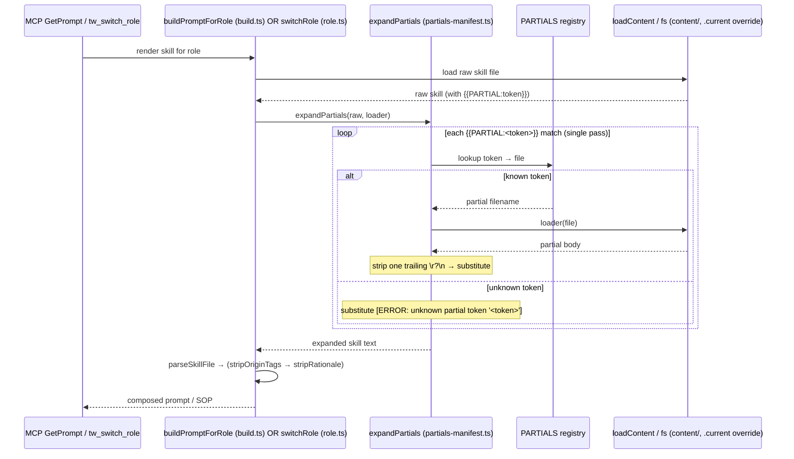

# a12-partials-limits-registry — architecture

Blueprint for the two mechanisms in the ticket: (1) the `{{PARTIAL:token}}` skill-body
substitution contract + partials registry (T-A12-02/03), and (2) the **Limits** table
naming contract in `content/const-01-core-head.md` (T-A12-05/06/07). Text/build-composition
only — no server-gate logic, no schema bump (per spec Out of Scope).

## Affected Files

### Part 1 — Partials registry + substitution (T-A12-02/03)
- `prompts/partials-manifest.ts` — **create**: the partial registry (token → content filename), mirroring `prompts/constitution-manifest.ts`'s data-module style. Also exports the pure `expandPartials(text, load)` function.
- `content/partial-step1-preflight.md` — **create**: canonical body of the one partial. Exact content on line 1: `` 1. `tw_get_state` → `tw_detect_drift`. `` followed by a single trailing newline (see Byte-Identity Contract).
- `prompts/build.ts` — **modify**: call `expandPartials` inside `buildPromptForRole` immediately after `loadContent(skillFile, …)` and **before** `parseSkillFile` (line 362-363 region).
- `tools/role.ts` — **modify (CRITICAL — second render path)**: `switchRole()` reads skill files raw and returns the body directly; it does NOT flow through `buildPromptForRole`. Wire `expandPartials` there too (after `fs.readFileSync`, before `parseSkillFile`, line 59-60 region). Without this, `tw_switch_role("architect"|"pm"|"design-auditor"|"researcher"|"sr-engineer")` returns a raw, unexpanded `{{PARTIAL:step1-preflight}}` token — a regression.
- `content/skill-architect.md` (line 69), `content/skill-pm.md` (line 75), `content/skill-design-auditor.md` (line 34), `content/skill-researcher.md` (line 40), `content/skill-sr-engineer.md` (line 11) — **modify**: replace the whole step-1 line with the bare token line `{{PARTIAL:step1-preflight}}` (T-A12-03).

### Part 2 — Limits table naming contract (T-A12-05/06/07)
- `content/const-01-core-head.md` — **modify**: insert one `## Limits` table between the intro paragraph (ends line 5) and `## 1. Output Directives` (line 7). Unnumbered heading — do NOT renumber §1 (T-A12-05).
- `content/const-08-chain-31-mid.md`, `content/const-09-design-chain-vround.md`, `content/const-12-chain-r10-s4.md`, `content/const-15-core-tail.md` — **modify**: reference Limits names instead of bare limit values (T-A12-06). Per-site rules in **Limits Reference Rewrite Map** below.
- `content/skill-qa-engineer.md`, `content/skill-code-reviewer.md`, `content/skill-design-auditor.md`, `content/skill-sr-engineer.md`, `content/skill-pm.md`, `content/skill-qa-visual.md`, `content/skill-coordinator.md` — **modify**: same, plus resolve the `visual_round` "6"→"5" drift in skill-qa-visual (T-A12-07). Per-site rules in the map below.

### qa-owned (T-A12-04/08/09 — listed for the architect's completeness; sr-engineer does NOT touch these)
- `test/context-budget.test.mjs` — repoint `PM_RULE_MARKERS`/`SR_RULE_MARKERS` raw-file reads to composed output; re-baseline exact-value token caps.
- `test/compose-equivalence.test.mjs` + `test/fixtures/compose-golden/*.txt` — regenerate via `scripts/capture-constitution-golden.mjs`, review diff.
- `test/subagent-templates.test.mjs`, `test/skill-evolution-v3.11.test.mjs` — AC7 collision sweep.

## Data Structures

New module `prompts/partials-manifest.ts` (mirrors `constitution-manifest.ts`):

```ts
export interface PartialSegment {
  readonly token: string; // the <token> in {{PARTIAL:<token>}} (no braces, no prefix)
  readonly file: string;  // basename in content/ (honors .current/ override via the caller's loader)
}

// Single source of truth for "which token maps to which content file".
// One entry today; adding a partial = one row here + one content/partial-*.md file.
export const PARTIALS: readonly PartialSegment[] = [
  { token: "step1-preflight", file: "partial-step1-preflight.md" },
];

// Pre-derived lookup + matcher (built once at module load).
const BY_TOKEN = new Map(PARTIALS.map((p) => [p.token, p.file]));
const PARTIAL_RE = /\{\{PARTIAL:([a-z0-9-]+)\}\}/g;
```

No new persisted types, no schema_version, no zod schema (nothing crosses the tool boundary).

## Interface Contracts

```ts
// prompts/partials-manifest.ts
// Single non-recursive pass. `load` is injected so the manifest module stays fs-free
// and each call site supplies its own .current-override-aware loader (build.ts has
// loadContent; role.ts supplies an equivalent closure — see DR-4).
export function expandPartials(
  text: string,
  load: (partialFile: string) => string,
): string;
```

Behavioral contract for `expandPartials`:
- **Single pass, non-recursive.** Uses `String.prototype.replace(PARTIAL_RE, …)`; the substituted text is NOT re-scanned. Partials referencing partials are unsupported (spec Out of Scope) — a `{{PARTIAL:…}}` that appears *inside* a partial's own body is left verbatim.
- **Trailing-newline normalization (byte-identity critical).** For each matched token, load the partial file and strip exactly one trailing `\r?\n` before substituting: `load(file).replace(/\r?\n$/, "")`. The token sits alone on its line in the skill; the skill's own surrounding `\n`s are preserved, so the expanded result is byte-identical to the pre-refactor line.
- **Unknown token → fail-loud, never silent passthrough.** If a token has no `PARTIALS` entry, substitute a visible error marker (mirror `loadContent`'s convention): `` `[ERROR: unknown partial token '<token>']` ``. This surfaces a typo instead of shipping a dangling `{{PARTIAL:…}}` into an agent prompt.
- **No-token passthrough.** Text with zero matches is returned unchanged (the coordinator/lite skills and all const-*.md files pass through untouched).
- **Pure.** No hidden state; repeated calls on the same input are identical (protects the compose-golden / compose-equivalence loops that call render paths many times per process).

Call-site wiring:
- `prompts/build.ts` `buildPromptForRole`:
  ```ts
  const rawSkill = loadContent(skillFile, workspacePath);
  const expandedSkill = expandPartials(rawSkill, (f) => loadContent(f, workspacePath)); // NEW
  const { frontmatter, body: taggedBody } = parseSkillFile(expandedSkill);             // was parseSkillFile(rawSkill)
  ```
  Ordering: expand → parseSkillFile → stripOriginTags → (stripRationale unless fullDetail). The partial body carries no origin/rationale fences, so the downstream strippers are no-ops over it → byte-identical.
- `tools/role.ts` `switchRole`:
  ```ts
  const raw = fs.readFileSync(filePath, "utf-8");
  const load = (f) => {                          // NEW — mirror the skill override resolution already in this fn
    const o = path.join(workspacePath, ".current", f);
    return fs.readFileSync(fs.existsSync(o) ? o : path.join(CONTENT_DIR, f), "utf-8");
  };
  const { frontmatter, body } = parseSkillFile(expandPartials(raw, load)); // was parseSkillFile(raw)
  ```

## Byte-Identity Contract (AC2)

AC2 requires `buildPromptForRole`'s composed output for the 5 roles to be byte-identical pre/post the **partial** refactor. This is evaluated on the **skill portion only** — the constitution portion legitimately changes under Part 2 (Limits table). Guarantee chain:
1. All 5 step-1 lines are byte-identical today: `1.·` `` `tw_get_state` `` `·→·` `` `tw_detect_drift` `` `.` `\n` (verified: arrow = U+2192; no leading indent; no trailing spaces).
2. `content/partial-step1-preflight.md` line 1 must be exactly those bytes (minus the newline).
3. `expandPartials` strips one trailing `\r?\n` from the loaded partial, so `{{PARTIAL:step1-preflight}}\n` in the skill expands back to the identical `1. …drift`.`\n`.
4. Nothing else in the pipeline changes → skill slice identical.

Recommended primary AC2 assertion (for qa, T-A12-04): a direct unit test that
`expandPartials("{{PARTIAL:step1-preflight}}", loader)` equals the literal
`` "1. `tw_get_state` → `tw_detect_drift`." `` (exact bytes). Combined with the unchanged
pipeline, this proves the skill slice is unchanged. The compose-golden regen (AC6) is the
end-to-end backstop: its diff for the 5 roles must show only the const-01/08/09/12/15 text
changing, never the skill body.

## Limits Table (T-A12-05) — canonical name/value/meaning

Insert this `## Limits` H2 in `content/const-01-core-head.md` before `## 1.`. Columns exactly
`name | value | meaning`. Values are the **user-visible framing** (see DR-2). Do NOT put the
server-internal cap+1 lock indices (4/4/6) in this table — those are a distinct quantity that
stays in `tools/transitions.ts` and is out of scope.

| name | value | meaning |
|---|---|---|
| `qa_round` cap | 3 | Max qa-engineer FAIL rounds on one task before routing locks to pm. |
| `review_round` cap | 3 | Max code-reviewer CHANGES_REQUESTED rounds before routing locks to pm. |
| `visual_round` cap | 5 | Max visual-regression rounds before mandatory split/pm route (design-armed only). |
| `hop` cap | 10 | Max auto-routing role transitions per `/teamwork` session (lite mode exempt). |
| `fix_try` cap | 2 | Max consecutive auto-fix tries on the same failure (§5 anti-loop). |
| `read` cap | 3 | Max file reads per target (§5 anti-loop). |
| `pass_budget` | 250 lines × 5 passes | design-auditor per-feature output ceiling (§5 anti-loop). |
| `task_size` budget | ≤ 5 files / 300 lines | One sr-engineer task = one session ceiling. |

Naming rule the const/skill body text must follow: reference the **name** (e.g. "the
`visual_round` cap", "the `hop` cap", "the `task_size` budget"), never the bare number.

## Limits Reference Rewrite Map (T-A12-06 const, T-A12-07 skills)

Precise per-site guidance. Three categories: **[NAME]** = restatement of a limit value → replace
with the named reference; **[KEEP-DERIVED]** = cap+1 escalation index or an independent threshold,
NOT a limit value → keep the number (phrase relative to the named cap where it reads cleanly);
**[LEAVE]** = a number that is not one of the eight limits — do not touch.

const-08-chain-31-mid.md
- L5 "After 3 code-reviewer FAILs" → **[NAME]** `review_round` cap. "(Round 4 of `review_round`)" → **[KEEP-DERIVED]** (cap+1 lock index). "`qa_round` circuit breaker" → already named, leave.

const-09-design-chain-vround.md  (chain-design tag — ships only design-armed)
- L2 "Cap is 5 rounds" → **[NAME]** `visual_round` cap. "Round 6 attempts lock" → **[KEEP-DERIVED]**.
- L3 "Split escalation (Round 3)" / "`visual_round >= 3`" / "Round 3, 4, 5" — the `3` is the **split-hatch threshold**, an independent value → **[LEAVE]** (do NOT conflate with the cap). The `5` in "Round 3, 4, 5" is the cap → name it ("through Round 5, the `visual_round` cap"). "mandatory route at Round 6" → **[KEEP-DERIVED]**.

const-12-chain-r10-s4.md
- L17 "(`review_round` cap)" — already named, leave. L18 "Round 1-3 review" → **[NAME]** the `3` is the `qa_round` cap (phrase e.g. "Round 1 through the `qa_round` cap"). "`qa_round` independently" — already named, leave.

const-15-core-tail.md  (core tag — always ships, incl. lite; Limits table also core → always in context)
- L3 "Max 2 consecutive auto-fix tries" → **[NAME]** `fix_try` cap.
- L4 "Max 3 [file reads per target]" → **[NAME]** `read` cap.
- L6 "max 10 role transitions" → **[NAME]** `hop` cap.
- L29 "(2 fix tries / 3 reads exhausted)" → **[NAME]** `fix_try` cap / `read` cap.

skill-qa-engineer.md
- L62 "after Round 3" / "unresolved after 3 rounds" → **[NAME]** `qa_round` cap.
- L78 "At Round 4 (after 3 prior FAILs)" → "3 prior FAILs" **[NAME]** `qa_round` cap; "Round 4" **[KEEP-DERIVED]**.

skill-code-reviewer.md
- L85 "After 3 FAILs" → **[NAME]** `review_round` cap.

skill-qa-visual.md  (THE DRIFT — T-A12-07 headline)
- L77 "Past the round cap (6)" → **[NAME]** `visual_round` cap (value 5). Rewrite to the const-09 canonical framing, e.g. "Past the `visual_round` cap (Round 6 attempts lock to `(pm, In_Progress)` only)". This resolves the "6"→"5" inconsistency; it is a framing fix ONLY — `VISUAL_ROUND_CAP=6` in transitions.ts is untouched.
- L30 "`visual_round` `0`/`1`", "round ≥ 2" → **[LEAVE]** (round-counter carry-forward-gate values, not the cap).

skill-design-auditor.md
- L18/L47/L63/L71 "250 lines" / "5 passes" / "5-pass × 250-line" → **[NAME]** `pass_budget`.
- L70 "max 5 files read per surface" / "max 3 extraction attempts per surface" → **[LEAVE]** (design-auditor surface-scoped limits, NOT the general `read` cap and NOT among the eight).

skill-sr-engineer.md
- L13 "> 5 files or > 300 lines" → **[NAME]** `task_size` budget.
- L21/L48 "`visual_round >= 3`" → **[LEAVE]** (split-hatch threshold, not the cap).

skill-pm.md
- L69 "≤ 5 files / 300 lines" → **[NAME]** `task_size` budget.

skill-coordinator.md
- L44 "design-auditor 5-pass × 250-line cap" → **[NAME]** `pass_budget`.
- L131 "hop counter ≥ `10`" → **[NAME]** `hop` cap. L246 "(hop cap ≥ 10, per-skill round caps)" → **[NAME]** `hop` cap.

(Line numbers are current-state anchors; sr-engineer should confirm by content match, not blind line address, since earlier edits in the same file shift later lines.)

## Sequence Diagram



## Decision Records

| Context | Decision | Consequences |
|---|---|---|
| Module shape for the partials mechanism (T-A12-02: mirror manifest vs inline map) | **DR-1:** New `prompts/partials-manifest.ts` mirroring `constitution-manifest.ts` (data registry + pure function), NOT an inline map in build.ts. | Consistent with the A9 pattern the codebase standardizes on; the feature is literally named "…-registry"; a 1-entry registry is the extensible seam the ticket exists to build. Slightly more ceremony than an inline map for one entry, accepted. |
| Table stores which number: user-visible framing (3/3/5) or server-internal cap (4/4/6)? | **DR-2:** Table stores the **user-visible framing** (3/3/5), matching T-A12-05 and the PM's ruling (visual_round=5, const-09 normative). Server-internal `ROUND_CAP=4 / REVIEW_ROUND_CAP=4 / VISUAL_ROUND_CAP=6` stay in transitions.ts and are NOT surfaced. | The eight AC4 "values" are the framing numbers. Derived escalation indices ("Round 4/6") are a *different* quantity (cap+1), so keeping them in prose is not an AC4 violation. Prose keeps derived indices as **[KEEP-DERIVED]**, phrased relative to the named cap. Closes off putting 4/6 in the table (would duplicate the server's private counter and confuse readers). |
| Trailing-newline handling for byte-identity | **DR-3:** `expandPartials` strips exactly one trailing `\r?\n` from each loaded partial; the partial file carries the canonical text + one conventional trailing newline. | Makes the file's standard trailing newline inert; the skill's own surrounding newlines are preserved → AC2 byte-identity holds. A partial authored with a trailing blank line would break identity — covered by the direct AC2 unit test. |
| `tools/role.ts` is a second skill-render path | **DR-4:** Wire `expandPartials` into BOTH `buildPromptForRole` and `switchRole`. `expandPartials` takes an injected `load` callback so the manifest stays fs-free; each site passes its own override-aware loader (mild duplication of override logic, already duplicated for skills today). | Prevents `tw_switch_role` from leaking a raw token for all 5 roles. Rejected: exporting build.ts's private `loadContent` into tools/ (crosses the prompts→tools layer the wrong way). |
| Should the SessionStart hook expand partials? | **DR-5:** No. The hook renders only `skill-coordinator.md` / `skill-coordinator-lite.md`, neither of which adopts a partial. Matches the existing single-copy precedent (stripOriginTags/stripRationale are build.ts-only, not duplicated into the hook). | Keeps the hook untouched. Residual risk: a future partial token placed in a coordinator skill or any const-*.md would leak unexpanded. Mitigated by the invariant + cheap guard test below (qa, fits T-A12-09). |
| Unknown-token behavior | **DR-6:** Fail-loud with a visible `[ERROR: unknown partial token '<token>']` marker, not silent passthrough. | A typo surfaces in the prompt/test instead of shipping a dangling `{{PARTIAL:…}}`. Mirrors `loadContent`'s existing `[ERROR: … not found]` convention. |

Invariant to record (qa guard, T-A12-09): no literal `{{PARTIAL:` may appear in any
`content/const-*.md`, `content/skill-coordinator.md`, or `content/skill-coordinator-lite.md`
(the files rendered outside `expandPartials`). A one-line grep test enforces the DR-5 boundary.

## Deferred Resources

_None — the spec's Dependencies / Prerequisites shows zero ignored/deferred external refs (the sole reference, `docs/backlog.md §A12`, is a same-repo doc read verbatim before spec drafting; no `external_refs` ledger entry required per Constitution §7)._

## Open Questions

None.
