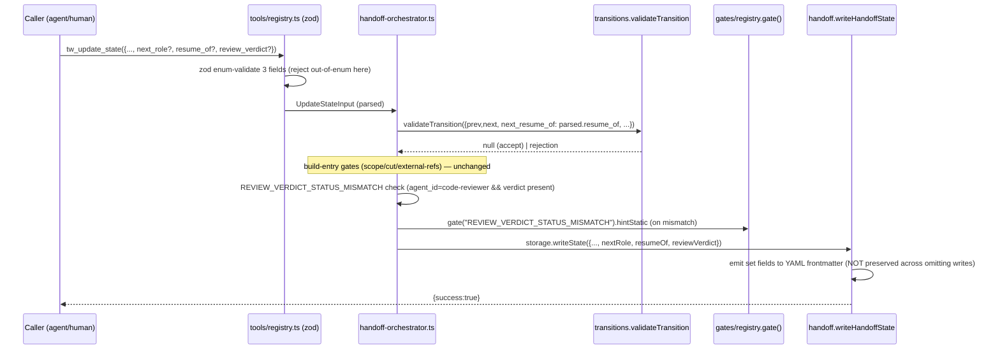

# c9-protocol-fields — architecture

Blueprint for promoting the three `pending_notes` string-convention protocol
tokens (`next_role:`, `resume_of:`, `review: APPROVED|CHANGES_REQUESTED`) to
first-class, schema-versioned handoff fields (`next_role`, `resume_of`,
`review_verdict`). Handoff schema **v6 → v7**. The server validates enums at the
zod boundary and, for `resume_of`, reads a structured `TransitionRequest` field
instead of substring-grepping `pending_notes`. A new plain-text gate
(`REVIEW_VERDICT_STATUS_MISMATCH`) enforces verdict⟺status consistency.

Reads consumed: PM spec `specs/c9-protocol-fields.md` (AC-1..AC-9),
`docs/schema-versions.md` (migration procedure), and the seven code surfaces +
13 content files enumerated in the cut. dispatch_pins is **out of scope**
(AC-8, PM re-deferred).

---

## Affected Files

The table is the authoritative map from each `T-C9-*` task to its file(s) and
the exact change. Sequencing follows the spec's Dependencies note: schema →
handoff fields → zod → transitions → orchestrator+gate → content → tests. Tests
(T-C9-07..11) are **qa-engineer-owned** deliverables; the architect and
sr-engineer do NOT edit `test/*` (Constitution §2). They are listed so the
implementer knows what QA will assert against.

| Task | File(s) | Change |
|---|---|---|
| **T-C9-01** | `schema/versions.ts` | `CURRENT_VERSIONS.handoff: 6 → 7`. |
| **T-C9-01** | `schema/migrations-handoff.ts` | Register **stamp-only** v6→v7 migration: `up: (input) => ({ ...input, schema_version: 7 })`. Seeds nothing (mirrors v3→v4 / v4→v5 / v5→v6). Keep the `void CURRENT_VERSIONS.handoff` grep anchor. |
| **T-C9-02** | `tools/handoff.ts` | Add `next_role? / resume_of? / review_verdict?` to `HandoffState` **and** `WriteHandoffStateOptions`. Add defensive enum parsers (like `parseExternalRefs`) that read frontmatter → `undefined` on out-of-enum/absent. Surface via the `{ ...state }` spread in `readHandoffState` (AC-2). In `writeHandoffState`: emit each key to frontmatter **only when set on this write**; do **NOT** add them to the "preserve-across-omitting-writes" existing-state read block (AC-3 — transient, write-scoped). |
| **T-C9-03** | `tools/registry.ts` | Add three optional zod fields to `UpdateStateArgs`: `next_role: z.enum([...8 AgentName])`, `resume_of: z.enum(["code-reviewer","qa-engineer"])`, `review_verdict: z.enum(["APPROVED","CHANGES_REQUESTED"])`. Add matching JSON-Schema `properties` blocks to the `tw_update_state` `inputSchema` literal. `UpdateStateInput` extends automatically via `z.infer`. |
| **T-C9-04** | `tools/transitions.ts` | Add `next_resume_of?: "code-reviewer" \| "qa-engineer"` to `TransitionRequest`. Rewrite the Amend-Resume Edge (step 3.5) to accept iff `req.next_resume_of === req.next.agent`. **Delete** `resumeMarkerNames` and remove `next_pending_notes` from `TransitionRequest` (it had no other reader — see DR-6). No dual-support fallback (AC-4). |
| **T-C9-05** | `tools/handoff-orchestrator.ts` | Pass `next_resume_of: parsed.resume_of` into `validateTransition` (replacing `next_pending_notes: parsed.pending_notes`). Thread `nextRole: parsed.next_role, resumeOf: parsed.resume_of, reviewVerdict: parsed.review_verdict` into the `storage.writeState({...})` options object. |
| **T-C9-06** | `gates/registry.ts` | Add `REVIEW_VERDICT_STATUS_MISMATCH` to the `GateErrorCode` union and a 20th `GATE_REGISTRY` entry (`producer: "orchestrator"`, `envelope: "plain-text"`, `documentedInProse: true`, `hintStatic` per §Interface Contracts). |
| **T-C9-06** | `tools/handoff-orchestrator.ts` | Add the `REVIEW_VERDICT_STATUS_MISMATCH` plain-text gate (contract in §Interface Contracts). Update the FROZEN check-order comment at the top of the file to insert the new gate in sequence. |
| **T-C9-07** | `test/handoff-versioning.test.mjs` (or `handoff.test.mjs`) *(qa-owned)* | v6→v7 migrate-on-read fixture; v8 refuse-loud fixture; round-trip write-back (`applied === []`). |
| **T-C9-08** | `test/schema-versions.test.mjs` *(qa-owned)* | Assert v7 present in `CURRENT_VERSIONS` coverage. |
| **T-C9-09** | `test/qa-flow.test.mjs` (or new) *(qa-owned)* | Amend-Resume via structured `resume_of`: accept on match, reject on mismatch/absent, legacy pending_notes-only token now **inert**. |
| **T-C9-10** | test *(qa-owned)* | zod enum rejection for garbage `next_role`/`resume_of`/`review_verdict`; `REVIEW_VERDICT_STATUS_MISMATCH` matrix (see §Test Thresholds). |
| **T-C9-11** | `test/error-code-contract.test.mjs` *(qa-owned)* | **Re-baseline gate count 19 → 20**; **extend `SUFFIX_RE` with `MISMATCH`** (DR-7 — otherwise both harvest sides silently drop the new code and parity fails); confirm the code is backtick-quoted in ≥1 content file. DR-8 union stays **13** (gate NOT added to `TransitionRejection["error"]`). |
| **T-C9-12** | `content/const-05-core-standards.md`, `const-08-chain-31-mid.md`, `const-12-chain-r10-s4.md` | Rewrite the canonical token definitions (Escalation note-token list, `review:`/`resume_of:` prose, Auto-Routing `next_role:` text) to describe first-class fields. `pending_notes` reverts to "free text for humans." At least ONE of these MUST backtick-quote `REVIEW_VERDICT_STATUS_MISMATCH` (satisfies the registry⊆doc parity test). |
| **T-C9-13** | `content/skill-coordinator.md`, `skill-pm.md` | Auto-Routing / Escalation Routes / Gate Summary prose: set/read the structured fields, not tokens. |
| **T-C9-14** | `content/skill-sr-engineer.md`, `skill-architect.md`, `skill-code-reviewer.md` | Escalation Routes tables: note-token column → structured-field column. |
| **T-C9-15** | `content/skill-qa-visual.md`, `skill-release-engineer.md`, `skill-design-auditor.md` | Same table migration. |
| **T-C9-16** | `content/skill-doc-writer.md`, `skill-researcher.md` | Update the one `next_role:` reference each. |

**Explicitly NOT touched** (decision, not oversight): `tools/storage-sqlite.ts`
and the `sqlite` schema (stays v2) — DR-5. `index.ts` — the tool arg surface is
driven entirely by `tools/registry.ts`; no dispatcher edit. `docs/skills/*.md`
and historical `specs/*.md` — AC-7 / Out of Scope.

---

## Data Structures

New optional fields on `HandoffState` and `WriteHandoffStateOptions`
(`tools/handoff.ts`). All three are **transient** — never carried forward
across writes that omit them (AC-3), unlike `prd_path`/`scope_decision` (blindly
preserved) or `external_refs`/`cut_approved` (feature-scoped).

```ts
// Single-hop routing directive to the immediate next reader. Enum-validated at
// the zod boundary against the 8 AgentName values. Advisory metadata only —
// NOT cross-checked against ALLOWED_TRANSITIONS (AC-6, DR-4).
next_role?: AgentName;

// Which stranded role a PM Amend-Resume write targets. Restricted to the exact
// two the Amend-Resume Edge already allows. Consumed by validateTransition via
// TransitionRequest.next_resume_of (AC-4), NOT by a pending_notes grep.
resume_of?: "code-reviewer" | "qa-engineer";

// Code-reviewer verdict. Server-checked for consistency against `status`
// (AC-5). Optional even on code-reviewer writes — absence never fires the gate.
review_verdict?: "APPROVED" | "CHANGES_REQUESTED";
```

`TransitionRequest` (`tools/transitions.ts`) gains one field and loses one:

```ts
export interface TransitionRequest {
  prev: TransitionTuple;
  next: TransitionTuple;
  prev_qa_round: number;
  prev_review_round: number;
  prev_visual_round?: number;
  next_resume_of?: "code-reviewer" | "qa-engineer"; // ADDED (AC-4)
  // next_pending_notes?: ReadonlyArray<string>;      // REMOVED (DR-6)
}
```

`GateErrorCode` (`gates/registry.ts`) gains `"REVIEW_VERDICT_STATUS_MISMATCH"`
(→ 20 codes). It is added to `GATE_REGISTRY` but **not** to
`TransitionRejection["error"]` in `tools/transitions.ts` (DR-3, stays at 13
members — identical treatment to `MISSING_EVIDENCE`/`MISSING_REVIEW_EVIDENCE`,
which are also plain-text-envelope orchestrator gates outside that union).

No SQLite DDL. No new `SchemaKind`. `CURRENT_VERSIONS.sqlite` stays 2.

---

## Interface Contracts

### v6→v7 migration (`schema/migrations-handoff.ts`)
```ts
registerMigration<Record<string, unknown>, Record<string, unknown>>({
  kind: "handoff",
  from: 6,
  to: 7,
  up: (input) => ({ ...input, schema_version: 7 }), // stamp-only; seeds nothing
});
```
Pure. No field seeding (DR-1). Legacy `pending_notes` left byte-verbatim; no
token → field extraction (AC-9, DR-2).

### Amend-Resume Edge (rewritten `validateTransition` step 3.5)
```ts
// Accept pm:In_Progress → {code-reviewer,qa-engineer}:In_Progress iff the
// incoming write's structured resume_of names the exact target role.
if (
  req.prev.agent === "pm" &&
  req.prev.status === "In_Progress" &&
  req.next.status === "In_Progress" &&
  (req.next.agent === "code-reviewer" || req.next.agent === "qa-engineer") &&
  req.next_resume_of === req.next.agent
) {
  return null; // accept
}
```
Trust boundary unchanged (AC-4): server checks only field⟺target consistency;
"genuinely stranded" remains the PM's honest attestation. Pure / fs-free /
storage-agnostic.

### `REVIEW_VERDICT_STATUS_MISMATCH` gate (`tools/handoff-orchestrator.ts`)
Placement: **after** `validateTransition` accepts and after the three
build-entry attestation gates (scope-decision, cut-approval, external-refs),
**before** the "Evidence record FIRST" block. It keys only on the incoming
write, so it is storage-agnostic (DR-5) — **no `FileHandoffStorage` guard**,
unlike cut-approval/external-refs which read prev-state from disk.

```ts
// Fires ONLY when a code-reviewer write carries a verdict AND it disagrees with
// status. Absent verdict never fires (AC-5). APPROVED pairs with In_Progress
// (code-reviewer:In_Progress); CHANGES_REQUESTED pairs with FAIL
// (code-reviewer:FAIL) — matches the existing transition matrix + review_round.
if (parsed.agent_id === "code-reviewer" && parsed.review_verdict) {
  const mismatch =
    (parsed.review_verdict === "APPROVED" && parsed.status !== "In_Progress") ||
    (parsed.review_verdict === "CHANGES_REQUESTED" && parsed.status !== "FAIL");
  if (mismatch) {
    return {
      content: [{
        type: "text" as const,
        text:
          `⛔ REVIEW_VERDICT_STATUS_MISMATCH: review_verdict=${parsed.review_verdict} ` +
          `with status=${parsed.status}. ` +
          gate("REVIEW_VERDICT_STATUS_MISMATCH").hintStatic,
      }],
      isError: true,
    };
  }
}
```

### `GATE_REGISTRY` entry (`gates/registry.ts`)
```ts
{
  errorCode: "REVIEW_VERDICT_STATUS_MISMATCH",
  producer: "orchestrator",
  envelope: "plain-text",
  triggerEdge: "code-reviewer write with review_verdict disagreeing with status",
  armCondition: "agent_id=code-reviewer && review_verdict present",
  clearingArtifact: "APPROVED↔In_Progress or CHANGES_REQUESTED↔FAIL",
  hintStatic:
    "A code-reviewer APPROVED verdict requires status=In_Progress; " +
    "CHANGES_REQUESTED requires status=FAIL. Align review_verdict with status, " +
    "or omit review_verdict. See specs/c9-protocol-fields.md AC-5.",
  documentedInProse: true,
}
```

### zod additions (`tools/registry.ts`, in `UpdateStateArgs`)
```ts
next_role: z.enum([
  "pm","researcher","design-auditor","architect",
  "sr-engineer","code-reviewer","qa-engineer","release-engineer",
]).optional(),
resume_of: z.enum(["code-reviewer","qa-engineer"]).optional(),
review_verdict: z.enum(["APPROVED","CHANGES_REQUESTED"]).optional(),
```
An out-of-enum value is rejected by zod at the tool boundary before any gate
runs (AC-2), mirroring `external_refs.state`.

### `writeHandoffState` emit rule (`tools/handoff.ts`)
Add to `frontmatterData` build, using the same guarded-emit pattern as the
existing string attestations, and **without** joining the existing-state
preserve read (AC-3):
```ts
if (nextRole)      frontmatterData.next_role = nextRole;
if (resumeOf)      frontmatterData.resume_of = resumeOf;
if (reviewVerdict) frontmatterData.review_verdict = reviewVerdict;
```

---

## Sequence Diagram



---

## Decision Records

| Context | Decision | Consequences |
|---|---|---|
| **DR-1** — v6→v7 migration: stamp-only vs backfill | **Stamp-only**, seeds nothing. Mirrors v3→v4/v4→v5/v5→v6 precedent. | A migrated v6 file gains only `schema_version: 7`; the three fields stay absent = "no routing signal recorded" (AC-1). Backfilling would synthesize a false directive (e.g. a fabricated `next_role`). |
| **DR-2** — legacy `pending_notes` tokens on migrate: inert / honored / reject? | **Inert.** Migration leaves `pending_notes` byte-verbatim, extracts nothing. After ship the server reads none of the three from prose (`resume_of` grep deleted; `next_role`/`review` were never server-consumed). No dual-read, no rejection. | A stale `resume_of: qa-engineer` prose line no longer opens the Amend-Resume Edge — the PM must set the `resume_of` field. Acceptable because server + skill text (T-C9-13) ship together (AC-4) and chains are short-lived (see Risk R1). |
| **DR-3** — `REVIEW_VERDICT_STATUS_MISMATCH` envelope + union membership | **Plain-text** envelope emitted directly by the orchestrator; **NOT** added to `TransitionRejection["error"]`. Models it on `MISSING_EVIDENCE`/`MISSING_REVIEW_EVIDENCE`. | The DR-8 pinned-cardinality test (`TransitionRejection["error"]` = 13 members) is undisturbed. Gate count in `GATE_REGISTRY` goes 19→20. |
| **DR-4** — `next_role` vs `ALLOWED_TRANSITIONS` | `next_role` gets **enum-shape validation only**; NOT cross-checked against legal next edges (AC-6). | Cheap, no false-positives (e.g. PM legitimately routing to `pm` for a Blocked note). A future ticket can add edge-cross-validation; documented as intentional, not an oversight. |
| **DR-5** — storage mode for the three fields | **File-mode persistence only**; `sqlite` schema stays v2, `tools/storage-sqlite.ts` untouched. Optional fields on `WriteHandoffStateOptions` are simply ignored by `SqliteHandoffStorage.writeState`. | Both gates function identically in SQLite mode because `resume_of`→transition and `review_verdict`→mismatch read the **incoming write args**, not disk state. Only the `tw_get_state` disk-surfacing of a *persisted* value is file-mode (mirrors `external_refs`). Keeps the cut scoped to the enumerated surfaces. |
| **DR-6** — remove `next_pending_notes` from `TransitionRequest` | **Remove it** (not keep-but-unused). Its only reader was `resumeMarkerNames`, deleted by AC-4. `computeNewRound` takes `pending_notes` as its own separate param, unaffected. | Cleaner interface; matches AC-4 "delete the path, no fallback." qa-flow tests that drove resume via `next_pending_notes` re-baseline to `next_resume_of` (T-C9-09, qa-owned). |
| **DR-7** — `_MISMATCH` is a novel gate-code suffix | The generative parity test's `SUFFIX_RE` (`REQUIRED\|MISSING\|INCOMPLETE\|EXCEEDED\|UNVERIFIED\|REJECTED\|UNRESOLVED`) does **not** include `MISMATCH`. QA must **extend `SUFFIX_RE` with `MISMATCH`** in `test/error-code-contract.test.mjs`. | Without it, `isGateErrorCode("REVIEW_VERDICT_STATUS_MISMATCH")` is false → the code is filtered out of BOTH the code-side and doc-side harvests → the registry↔code parity assertion (`registryOnly` non-empty) fails. Exactly the b8 `UNRESOLVED` precedent (test comment lines 48-57). QA-owned re-baseline, NOT a code rename (S01 mandates the string verbatim). |
| **DR-8** — verdict⟺status polarity | APPROVED requires `In_Progress`; CHANGES_REQUESTED requires `FAIL`. | Matches the existing matrix (`code-reviewer:In_Progress`→qa on approve; `code-reviewer:FAIL`→sr on changes) and `review_round` bump semantics. Verdict absent ⇒ gate never fires (a code-reviewer FAIL with no verdict is legal, AC-5). |

---

## Deferred Resources

_None — the spec's Dependencies / Prerequisites records a Resource Audit Gate
scan with **zero** external references (every reference in scope is an in-repo
file path); `external_refs` is omitted from this ticket. dispatch_pins is a
scope deferral (AC-8), not an external resource._

---

## Test Thresholds & Fixtures (for qa-engineer)

Author under `test/` per `docs/schema-versions.md` checklist. **All test files
are qa-owned; sr-engineer and architect do not edit them (Constitution §2).**

**T-C9-07 — migration (`handoff-versioning.test.mjs` / `handoff.test.mjs`)**
1. migrate-on-read: on-disk v6 handoff → read → `schema_version: 7`, `pending_notes` byte-verbatim, none of the three new fields seeded.
2. refuse-loud: on-disk v8 → `runMigrations` throws (message names on-disk 8 > server max 7).
3. round-trip write-back: parse stale v6 → re-read → `applied === []` (healed to current).

**T-C9-08 — `schema-versions.test.mjs`**: `CURRENT_VERSIONS.handoff === 7`; v6→v7 step registered and adjacency-valid.

**T-C9-09 — Amend-Resume via `resume_of`**:
- accept: `pm:In_Progress` → `qa-engineer:In_Progress` with `resume_of="qa-engineer"`; likewise `code-reviewer`.
- reject (`TRANSITION_REJECTED`): mismatch (`resume_of="code-reviewer"` but next agent qa-engineer); absent `resume_of`.
- inert: a legacy `pending_notes` line `"resume_of: qa-engineer"` with the field absent does **NOT** open the edge.

**T-C9-10 — zod enums + verdict gate**:
- zod reject: garbage `next_role="reviewer"`, `resume_of="pm"`, `review_verdict="approved"` (lowercase) each rejected at the tool boundary.
- gate matrix (`REVIEW_VERDICT_STATUS_MISMATCH`):
  | agent_id | review_verdict | status | expect |
  |---|---|---|---|
  | code-reviewer | APPROVED | FAIL | **reject** |
  | code-reviewer | CHANGES_REQUESTED | In_Progress | **reject** |
  | code-reviewer | APPROVED | In_Progress | accept |
  | code-reviewer | CHANGES_REQUESTED | FAIL | accept |
  | code-reviewer | (absent) | FAIL | accept (never fires) |
  | sr-engineer | APPROVED | In_Progress | accept (non-reviewer never fires) |

**T-C9-11 — `error-code-contract.test.mjs`** (see DR-7):
- re-baseline the "exactly 19 entries" assertion → **20**.
- extend `SUFFIX_RE` to add `MISMATCH`.
- assert `REVIEW_VERDICT_STATUS_MISMATCH` ∈ `GATE_REGISTRY`, backtick-quoted in ≥1 `content/*.md`, generative parity green.
- assert `TransitionRejection["error"]` union UNCHANGED at 13 members (DR-3/DR-8).

**Build gate**: `npm run build` clean (dist/ is shipped) and `npm test` green
before code-reviewer handoff.

---

## Open Questions

None.
