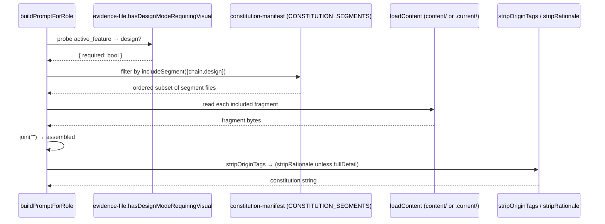

# Architecture — Compose-Not-Strip: Overlay Modules Replace Fence Stripping

> Ticket A9 / T-CNSO cut. PM spec: `specs/compose-not-strip-overlays.md`.
> Constitution baseline read for this design: `content/constitution.md`
> header `# Constitution v3.40.0`, 168 lines. sr-engineer MUST re-read and
> re-confirm the line ranges below before cutting — if the file changed since
> this doc was written, the ranges shift but the *structure* (15 runs, the
> tag of each) is stable.

## Overview & Core Decision

Today `prompts/build.ts` produces each mode's constitution by loading one
monolithic `content/constitution.md` and **subtracting** fenced spans
(`stripChainOnly`, `stripDesignOnly`, `stripRationale`, `stripOriginTags`).
This ticket inverts that to **additive composition**: the monolith is cut
into an ordered list of physical fragment files, each tagged with the
dispatch condition under which it ships, and each consumer **concatenates the
fragments whose tag matches its mode**. No `stripChainOnly` / `stripDesignOnly`
call survives.

**The load-bearing decision is DR-1 (Option R — markers retained).** Each
fragment is a *verbatim byte-slice* of the monolith, and the
`<!-- chain-only:* -->` / `<!-- design-only:* -->` structural markers are
**kept inside the fragment they used to delimit** (they travel with the
content). This gives an exact, mechanically-verifiable equivalence:

- Concatenating **all 15 fragments in manifest order === today's
  `content/constitution.md`, byte-for-byte.** (sr-engineer build-gate check:
  `cat` the fragments in order and diff against `git show HEAD:content/constitution.md`.)
- **Excluding** a design/chain fragment removes *exactly* the bytes the old
  `stripDesignOnly` / `stripChainOnly` removed (marker + body + trailing `\n`),
  because the old regex removed `marker→marker` and the fragment *is* that
  `marker→marker` slice.

Consequence: the retained markers are now **inert** — composition never parses
them, so a malformed/unbalanced marker can no longer silently change shipped
governance text. That is precisely the failure class the ticket eliminates
(AC11), achieved structurally, while byte-identity (AC2–AC5) holds *literally*
with **no normalization step**. The markers are byte-identity artifacts; a
future ticket (out of scope) may re-cut the golden baseline without them and
delete them, but for A9 they stay.

The alternative — Option N (strip the markers out of the fragments, cleaner
files, but "byte-identical modulo structural markers" requiring a
normalization pass in the golden test) — is **rejected**; see DR-1.

## Affected Files

### Create
- `content/const-01-core-head.md` … `content/const-15-core-tail.md` — the 15
  fragment files (table in *Fence-Nesting Resolution* below).
- `prompts/constitution-manifest.ts` — the single ordered segment manifest +
  `includeSegment()` predicate. Compiles to
  `dist/prompts/constitution-manifest.js`. **Single source of truth** imported
  by `build.ts`, the hook, and the measure script (replaces the DR-3 "keep 3
  regex copies in sync" contract — see *Hook Parity Contract*).
- `scripts/capture-constitution-golden.mjs` — one-shot capture tool
  (sr-engineer-authored; it is a script, not a test file, so §2 test-ownership
  does not apply). Run against the **pre-refactor** build to emit golden
  fixtures. See *Golden-Snapshot Approach* for exactly what it captures.
- `test/fixtures/compose-golden/*.txt` — captured golden fixtures (data, not
  test logic).
- `test/compose-equivalence.test.mjs` — the byte-equivalence test (T-CNSO-08).
  **qa-engineer-authored** (§2).

### Modify
- `prompts/build.ts` — replace the strip pipeline (current L327–342) with
  `composeConstitution()`; delete `stripChainOnly` and `stripDesignOnly`
  (exported functions + their bodies); **keep** `stripRationale` and
  `stripOriginTags` unchanged. Skill-body path (L343–353) unchanged.
- `bin/agent-governance-context.mjs` — replace its duplicate `stripChainOnly`
  + `loadContent("constitution.md")` with a compose-from-manifest step.
- `scripts/measure-context-cost.mjs` — replace `read("constitution.md")` + its
  three local strip mirrors (`stripChainOnly`/`stripRationale`/`stripDesignOnly`)
  with compose-from-manifest for each reported figure.
- `test/context-budget.test.mjs` — **qa-authored** rework (T-CNSO-07): drop the
  tests that assert on the deleted monolith / deleted strippers, keep and
  re-point the rest (details in *Golden-Snapshot Approach*).
- **Four additional test files that read `content/constitution.md` as a
  fixture** (found by grep; NOT in the spec's file estimate — flagged):
  `test/agc-adapters.test.mjs` (L264–269), `test/constitution-deliverable-guard.test.mjs`
  (L30), `test/skill-evolution-v3.11.test.mjs` (L96), `test/widget-shape-spec.test.mjs`
  (L19,L128). Each does `fs.readFileSync(content/constitution.md)`. Migration is
  **mechanical**: swap that read for the exported "assemble full constitution"
  helper (which under Option R returns the old monolith byte-for-byte). These
  are test files → **qa-authored** changes (§2).

### Delete
- `content/constitution.md` — **only after** every caller above is migrated
  (AC8). This is the last edit; deleting earlier breaks the capture step.

### Explicitly NOT touched (see *Out-of-Scope Confirmations*)
- `tools/transitions.ts`, `tools/evidence-file.ts`, every `content/skill-*.md`,
  `content/constitution-rationale.md` content. `lib/watermark-check.ts` has a
  *comment* mentioning `constitution.md §1` (L6) — the rule still lives in
  `const-01-core-head.md §1`; the comment may stay as-is (no code dependency),
  optionally re-worded, but no functional change.

## Fence-Nesting Resolution (Point 1 — the module boundary problem)

I confirmed the spec's claim against the source. `stripChainOnly` removes the
one chain-only span, `stripDesignOnly` the design-only spans, `stripRationale`
the rationale spans, `stripOriginTags` the inline origin spans. **Design-only
spans occur in two structurally different places, confirmed:**

- **Standalone in §1, OUTSIDE any chain-only span** — L16–20 (Visual Widgets
  exception w/ nested rationale, Design-baseline scope, Design-sourced assets)
  and L22–24 (Self-converge relaxation). These ship on **any** design-armed
  dispatch, **lite included** (lite keeps §1 design because lite runs
  `stripChainOnly` but NOT `stripDesignOnly` when the feature is design-armed).
- **Nested INSIDE the chain-only span** (L43–138) — L52–56 (§3.1 gates), L60–63
  (§3.1 `visual_round`), L68–97 (all of §3.2), L119–137 (§4 visual paragraphs).
  These ship **only when both chain (full) and design-arm are active**.

**Why a single `overlay-design.md` at one insertion point cannot work, and why
even "two design-only fragments with two insertion points" (the spec's loose
suggestion) undercounts:** byte-identity (AC4) requires the composed
design-armed output to reproduce the monolith's **interleaved order**. In §1
the design sub-bullets sit *between* core bullets (MVP-strict → design → Surgical
→ design → §2); in §3–§4 the design blocks sit *between* chain bullets at four
points. Neither the §1 nor the §3–§4 design content can be grouped/relocated
without changing the design-armed byte order → an outline-restructure is
**incompatible** with byte-identity against a *pre-refactor* snapshot (DR-2).
So the interleaving must be represented, and the design content splits by
**two tags** — `design` (standalone §1) and `chain-design` (nested) — landing
at **six** physical positions, not two.

### The resolution: two tags, a flat ordered fragment list

Every design-only span is assigned one of two tags; the chain content its own;
core the rest. Composition includes a fragment iff its tag's predicate holds:

| tag | ships when | predicate (build.ts) |
|---|---|---|
| `core` | always | `true` |
| `design` | feature is design-armed | `design` |
| `chain` | full (non-lite) dispatch | `chain` |
| `chain-design` | full **and** design-armed | `chain && design` |

where `chain = (skillFile !== LITE_SKILL_FILE)` and
`design = isDesignFeature` (the existing `hasDesignModeRequiringVisual(...)
.required` probe, unchanged).

### The 15 fragments (exact monolith slices, markers retained — DR-1)

Line ranges are **inclusive**, against the v3.40.0 / 168-line monolith. The
ranges **partition L1–168 with no gaps or overlaps** — so concatenating them
all reproduces the file. Marker lines (`<!-- chain-only:* -->`,
`<!-- design-only:* -->`) stay in the fragment shown; `core` fragments contain
no structural markers. Origin (`<!-- origin:* -->`) and rationale
(`<!-- rationale:* -->`) markers stay wherever they physically fall and are
handled post-assembly (see *Composition Contract*).

| # | file | tag | monolith lines | content |
|---|---|---|---|---|
| 01 | `const-01-core-head.md` | core | 1–15 | header, preamble, §1 intro, NO-YAPPING…**MVP strict** |
| 02 | `const-02-design-mvp.md` | design | 16–20 | `design-only` markers + Visual-Widgets exc. (inner rationale span) / Design-baseline / Design-sourced |
| 03 | `const-03-core-surgical.md` | core | 21 | **Surgical changes** bullet |
| 04 | `const-04-design-surgical.md` | design | 22–24 | `design-only` markers + Self-converge relaxation |
| 05 | `const-05-core-standards.md` | core | 25–42 | §2 Dev/Tech, §3 State-Sync heading + core bullets |
| 06 | `const-06-chain-31-head.md` | chain | 43–51 | `<!-- chain-only:start -->` + §3.1 heading + intro + first 3 bullets |
| 07 | `const-07-design-chain-gates.md` | chain-design | 52–56 | `design-only` markers + visual evidence / report-schema / baseline-manifest gates |
| 08 | `const-08-chain-31-mid.md` | chain | 57–59 | Scope-decision gate + code-reviewer approval + 3-FAIL bullets |
| 09 | `const-09-design-chain-vround.md` | chain-design | 60–63 | `design-only` markers + `visual_round` sub-loop |
| 10 | `const-10-chain-31-tail.md` | chain | 64–67 | on-rejection sentence (+ surrounding blanks) |
| 11 | `const-11-design-chain-32.md` | chain-design | 68–97 | `design-only` markers + entire §3.2 |
| 12 | `const-12-chain-r10-s4.md` | chain | 98–118 | R10 bullet + §4 heading + routing diagram + text |
| 13 | `const-13-design-chain-s4.md` | chain-design | 119–137 | `design-only` markers + §4 `visual_round` para + design-auditor para |
| 14 | `const-14-chain-end.md` | chain | 138–139 | `<!-- chain-only:end -->` (+ blank) |
| 15 | `const-15-core-tail.md` | core | 140–168 | §5, §6, §7 (inner rationale span at L159), Document Priority |

Notes for the cut:
- Fragment **14** exists as its own tiny `chain` file because
  `<!-- chain-only:end -->` sits *positionally after* the last `chain-design`
  fragment (13) in the monolith. It cannot be glued to fragment 12 (that would
  put the end-marker before the §4 design paras in full-design mode, wrong
  order); it must ship in full **non**-design too (old full mode never stripped
  chain markers). A one-line file is the honest cost of byte-identity.
- Fragment **03** is a single bullet — forced, because a `design`-tagged
  sub-bullet (04) interleaves after "Surgical changes." Do not merge.
- Assign boundary blank lines to the **preceding** fragment (e.g. the blank
  before `<!-- chain-only:start -->` belongs to fragment 05; the blank after
  the on-rejection sentence belongs to fragment 10). The `cat == original`
  invariant is the arbiter; tune until it holds.

## Module Set Replacing `constitution.md` (Point 2)

The 15 fragments above **are** the replacement module set. `constitution-core`
is the union of the four `core` fragments (01,03,05,15); the "overlay-chain"
concept is the four `chain` fragments (06,08,10,12,14); "overlay-design" is the
two `design` fragments (02,04); the nested design overlay is the four
`chain-design` fragments (07,09,11,13). They are physical files rather than one
`overlay-chain.md` + one `overlay-design.md` precisely because byte-identity
forbids collapsing the interleaving (DR-2). Each file is independently lintable
and token-countable (the User-Story goal).

**`content/constitution-rationale.md`** (AC6): never loaded by `build.ts`, the
hook, or any script — that is true today and stays true (no consumer added).
It is **not split, not edited**. Its one-way `§X` references resolve because
the split **preserves every section heading and number verbatim** — `## 1`…
`## 7`, `### 3.1`, `### 3.2`, and "Document Priority" all survive unchanged in
their fragments (renumbering is out of scope). The forward mentions *from* the
constitution into rationale ("see `content/constitution-rationale.md`" at old
L57 and L74) travel verbatim into fragments 08 and 11. qa verifies both
directions in T-CNSO-08 (grep `constitution-rationale.md` for `§` refs; confirm
each target heading exists in exactly one fragment). No edit to rationale.md is
required (Out-of-Scope).

## Data Structures

```ts
// prompts/constitution-manifest.ts
export type SegmentTag = "core" | "design" | "chain" | "chain-design";

export interface ConstitutionSegment {
  readonly file: string;   // basename in content/ (honors .current/ override via loadContent)
  readonly tag: SegmentTag;
}

// Ordered — index order IS document order. Concatenation of every entry === constitution.md.
export const CONSTITUTION_SEGMENTS: readonly ConstitutionSegment[] = [
  { file: "const-01-core-head.md",        tag: "core" },
  { file: "const-02-design-mvp.md",       tag: "design" },
  { file: "const-03-core-surgical.md",    tag: "core" },
  { file: "const-04-design-surgical.md",  tag: "design" },
  { file: "const-05-core-standards.md",   tag: "core" },
  { file: "const-06-chain-31-head.md",    tag: "chain" },
  { file: "const-07-design-chain-gates.md",   tag: "chain-design" },
  { file: "const-08-chain-31-mid.md",     tag: "chain" },
  { file: "const-09-design-chain-vround.md",  tag: "chain-design" },
  { file: "const-10-chain-31-tail.md",    tag: "chain" },
  { file: "const-11-design-chain-32.md",  tag: "chain-design" },
  { file: "const-12-chain-r10-s4.md",     tag: "chain" },
  { file: "const-13-design-chain-s4.md",  tag: "chain-design" },
  { file: "const-14-chain-end.md",        tag: "chain" },
  { file: "const-15-core-tail.md",        tag: "core" },
];
```

## Interface Contracts

```ts
// prompts/constitution-manifest.ts
export function includeSegment(
  tag: SegmentTag,
  opts: { chain: boolean; design: boolean },
): boolean {
  switch (tag) {
    case "core":         return true;
    case "design":       return opts.design;
    case "chain":        return opts.chain;
    case "chain-design": return opts.chain && opts.design;
  }
}
```

```ts
// prompts/build.ts — new helper (exported, so tests + the 4 fixture-reading
// tests can snapshot it directly; composing all → the old monolith verbatim).
export function composeConstitution(
  opts: { chain: boolean; design: boolean },
  workspacePath?: string,
): string {
  return CONSTITUTION_SEGMENTS
    .filter((s) => includeSegment(s.tag, opts))
    .map((s) => loadContent(s.file, workspacePath))  // existing loader; .current/ override preserved
    .join("");                                        // no separator — fragments carry their own newlines
}
```

## Composition Contract & Pipeline Order (Point 3)

`buildPromptForRole` replaces its current L327–342 with:

```ts
const isLite = skillFile === LITE_SKILL_FILE;
// isDesignFeature computed exactly as today (L319–321, hasDesignModeRequiringVisual).
const assembled = composeConstitution(
  { chain: !isLite, design: isDesignFeature },
  workspacePath,
);
const originClean = stripOriginTags(assembled);              // ALWAYS (AC7)
const constitution = fullDetail ? originClean : stripRationale(originClean); // AC5/AC6
```

**Pipeline order: compose → `stripOriginTags` → (`stripRationale` unless
fullDetail).** This is the whole constitution pipeline; the skill-body path
(L343–353: `stripOriginTags` then `fullDetail ? body : stripRationale(body)`)
is **unchanged**.

- `stripOriginTags` **still runs, over the assembled result, exactly as AC7
  requires** — origin spans live inline inside fragments; whichever fragments
  ship get their origin spans stripped identically to today. Excluded
  fragments' origin spans never appear (identical net result to today, where
  the surrounding span was stripped anyway). It runs **first** and its
  `\n{3,}→\n\n` collapse also normalizes any blank-run left at a fragment seam.
- `stripRationale` **still runs for non-`fullDetail`, over the assembled
  result** (AC6), scanning for `<!-- rationale:* -->` spans now living inside
  `const-02` (§1) and `const-15` (§7). For `fullDetail` it is skipped exactly
  as today (AC5) → rationale kept verbatim.
- Per-mode equivalence, derived (Option R makes each mechanical):
  - **full-design** = `stripRationale(stripOriginTags(composeAll))` where
    `composeAll === raw` ⇒ identical to today's
    `stripRationale(stripOriginTags(raw))`. (AC4/AC5)
  - **full-non-design** = `stripRationale(stripOriginTags(compose(core+chain)))`;
    `compose(core+chain)` drops exactly the `design`/`chain-design` slices that
    old `stripDesignOnly` removed ⇒ identical to today. (AC3)
  - **lite** drops all `chain`/`chain-design`; `stripOriginTags`'s collapse
    supplies the blank-run normalization old `stripChainOnly` did. (AC2)
- **A4 tag-strip and rationale-strip both remain pure text-transforms over a
  single assembled string** — AC1's requirement that they "remain" is met; only
  `stripChainOnly`/`stripDesignOnly` are removed.

## Hook Parity Contract (Point 4 — AC9)

Today `bin/agent-governance-context.mjs` does **not** call `build.ts`; it holds
its own `stripChainOnly` copy and, critically, **strips nothing else** — so its
output retains design-only, rationale, AND origin markers as literal text
(lite additionally runs its `stripChainOnly` collapse). Under Option R this is
reproduced **exactly, with no normalization**, because the fragments retain all
markers:

```ts
// hook, replacing its stripChainOnly + loadContent("constitution.md")
const { CONSTITUTION_SEGMENTS, includeSegment } = await import(
  pathToFileURL(path.join(SERVER_ROOT, "dist", "prompts", "constitution-manifest.js")).href
);
const wantChain = skillVariant === "skill-coordinator.md"; // full mode
let constitution = CONSTITUTION_SEGMENTS
  .filter((s) => includeSegment(s.tag, { chain: wantChain, design: true })) // hook ALWAYS includes design (it never stripped design)
  .map((s) => loadContent(s.file))   // hook's own loadContent (workspace .current/ override, then SERVER_ROOT/content)
  .join("");
if (!wantChain) constitution = constitution.replace(/\n{3,}/g, "\n\n"); // mirrors old stripChainOnly collapse; lite only
```

- Hook **lite** (default): `{chain:false, design:true}` → `core` + `design`
  fragments, chain excluded, collapse applied. Byte-identical to old
  `stripChainOnly(raw)` (which kept §1 design + rationale + origin markers).
- Hook **full** (`AGC_DEFAULT_SKILL=full`): `{chain:true, design:true}` → all
  fragments, **no** collapse (old full path ran no strip). Byte-identical to
  old raw `constitution.md`.
- **DR-3 "keep the regex in sync" is replaced by "one manifest, imported":**
  there is no longer any duplicated `stripChainOnly` to sync — `build.ts`, the
  hook, and the measure script all import `CONSTITUTION_SEGMENTS` +
  `includeSegment` from the single compiled `dist/prompts/constitution-manifest.js`.
  The parity contract is now *structural* (shared list) not *textual* (matching
  regexes).
- **Fallback:** the hook already dynamic-imports `dist/tools/skill-frontmatter.js`
  with a try/catch. If the manifest import fails (dist/ missing during a partial
  install), emit the **existing "hook misconfigured" hint and exit** (fail loud)
  — do NOT silently ship a partial bundle.

`scripts/measure-context-cost.mjs` migrates the same way: it imports the
manifest and composes each reported figure — `raw` = compose-all;
`non-design` = `compose(core+chain)` then its `stripRationale`; `lite-lean` =
`compose(core)` (+ collapse); etc. — instead of `read("constitution.md")` +
local strip mirrors. Its three local strip functions are deleted.

## Golden-Snapshot / Equivalence Approach (Point 5 — T-CNSO-02 capture, T-CNSO-08 assert)

**Sequencing is mandatory (spec Dependencies):** capture BEFORE any content/
build.ts edit lands, or the diff proves nothing.

### T-CNSO-02 — capture (sr-engineer, via `scripts/capture-constitution-golden.mjs`)
Run against the **current** `dist/` (pre-refactor). For build.ts, drive the two
axes with tmp fixture workspaces (mirror the existing `os.tmpdir()` +
`FileHandoffStorage` pattern in `context-budget.test.mjs`):
- **non-design workspace:** `.current/handoff.md` with `active_feature: X`, **no**
  `design/X.md` ⇒ `hasDesignModeRequiringVisual().required === false`.
- **design-armed workspace:** same, plus `design/X.md` containing `## Mode`
  then a line `figma` (any non-`no-design` mode ⇒ `required === true`; format per
  `tools/evidence-file.ts` `parseDesignMode`).

Capture the **constitution portion** of `buildPromptForRole` output (call it,
then slice the text before the first `\n\n---\n\n` skill separator — or snapshot
the extracted `composeConstitution`-equivalent directly if the pre-refactor
build is first refactored to expose an `assembleConstitution()` seam; either is
fine, but the *slice* approach needs no pre-refactor edit and is preferred to
keep capture strictly read-only). Modes (8 — full cross product; capturing all
is cheap and makes T08 exhaustive):

| fixture file | skillFile | design | fullDetail |
|---|---|---|---|
| `build-lite-nondesign.txt`     | lite  | no  | no  |
| `build-lite-design.txt`        | lite  | yes | no  |
| `build-lite-nondesign-fd.txt`  | lite  | no  | yes |
| `build-lite-design-fd.txt`     | lite  | yes | yes |
| `build-full-nondesign.txt`     | chain | no  | no  |
| `build-full-design.txt`        | chain | yes | no  |
| `build-full-nondesign-fd.txt`  | chain | no  | yes |
| `build-full-design-fd.txt`     | chain | yes | yes |

For the hook, spawn `bin/agent-governance-context.mjs` twice
(default env, and `AGC_DEFAULT_SKILL=full`) in a managed tmp workspace, parse
`additionalContext`, slice the constitution portion (between the two `---`
delimiters around it), save `hook-lite.txt` and `hook-full.txt`.

All fixtures land in `test/fixtures/compose-golden/` and are committed.

### T-CNSO-08 — assert (qa-engineer, `test/compose-equivalence.test.mjs`)
For each of the 10 fixtures, run the **new** code path for that mode and
`assert.equal(actual, fs.readFileSync(fixture))` — **strict byte-equality, no
normalization** (Option R guarantees literal identity). Plus:
- `assert.equal(CONSTITUTION_SEGMENTS.map(s=>read(content/s.file)).join(""),
  <old monolith bytes captured as a fixture>)` — the `cat == original`
  invariant.
- The `constitution-rationale.md` `§`-reference resolution check (both directions).

### T-CNSO-07 — context-budget test rework (qa-engineer)
- **Remove** (assert on deleted artifacts): "stripChainOnly removes the
  chain-only block", "exactly one balanced chain-only fence wraps §3.1 + §4",
  "DR-3: all three stripChainOnly regex copies are identical", and any
  `import { stripChainOnly, stripDesignOnly }` (deleted).
- **Re-point** to the composed source: the `CONSTITUTION` constant (was
  `read(constitution.md)`) → `composeConstitution({chain:true,design:true})`
  (== old monolith); the lean-bundle token-budget assertion → `compose(core)`
  (lite) bundle; hook lite/full assertions stay (they should pass unchanged
  since the hook is byte-identical).
- **Keep** the `stripOriginTags` / `stripRationale` unit tests verbatim (those
  strippers remain). Replace "DR-3 3-copy" with a new assertion that the
  manifest is imported (not duplicated) by hook + measure script.

## Sequence Diagram (compose pipeline, build.ts arm)



## Decision Records

| Context | Decision | Consequences |
|---|---|---|
| Byte-identity (AC2–AC5) requires reproducing the monolith's interleaved order; markers survive as inert text in most of today's modes (full keeps chain-only markers; design-armed keeps design-only markers; hook keeps everything). | **DR-1 (Option R): fragments are verbatim monolith slices with structural markers RETAINED inside them; composition selects by file inclusion, never parses markers.** | Literal byte-identity with zero normalization; `cat==original` invariant; marker failure class eliminated (markers inert). Rejected Option N (strip markers, "byte-identical modulo markers" + golden normalization) — cleaner files but relaxes the ACs' literal "byte-identical" and adds a normalization step that a reviewer must trust. A follow-up ticket may drop the inert markers by re-cutting the baseline. |
| An outline-restructure that groups all design content together (spec's alt suggestion) would let 2 overlay files concat at 2 points. | **DR-2: reject restructure.** Grouping changes design-armed byte order vs the *pre-refactor* snapshot, which the ticket forbids re-capturing. | Interleaving is preserved via the flat 15-fragment split; more files, but each a coherent, independently-lintable slice. |
| Design-only content lives both standalone in §1 (ships in lite too) and nested in the chain span (ships only full+design). | **DR-3: two design tags — `design` and `chain-design` — landing at 6 physical positions**, not one `overlay-design.md`. | The spec's "two insertion points" is corrected to six; predicates differ (`design` vs `chain && design`), so a single file/point cannot represent both. |
| The hook, `build.ts`, and the measure script each derived the lite bundle independently (DR-3 "keep regex in sync"). | **DR-4: one exported `CONSTITUTION_SEGMENTS` + `includeSegment`, imported by all three.** | No duplicated logic to drift; parity is structural. Hook dynamic-imports from `dist/` with a fail-loud fallback. |
| Golden capture must precede edits, but test files are qa-owned (§2). | **DR-5: capture is a script (`scripts/capture-…mjs`, sr-authored); the equivalence *test* is qa-authored.** | Sequencing respected without violating §2. Fixtures are committed data. |
| 5 more files read `constitution.md` beyond the spec's estimate (measure script + 4 test files); `lib/watermark-check.ts` only a comment. | **DR-6: migrate all readers to the manifest/compose helper; the comment may stay.** | AC8 ("any script/caller") is honored; the 4 test-file migrations are mechanical (read → `composeConstitution(all)`), qa-authored. |

## Deferred Resources

_No external references. The spec's Dependencies / Prerequisites records a
Resource Audit with zero `http(s)`/design-file/ticket hits (only internal
backlog cross-refs A3 and A10/A12, resolved under Out-of-Scope / AC11). Nothing
to defer._

## Out-of-Scope Confirmations (Point 6)

- **`tools/transitions.ts` — untouched.** No `ALLOWED_TRANSITIONS` change. (AC10)
- **`tools/evidence-file.ts` — untouched.** `hasDesignModeRequiringVisual` is
  *consumed* (read) by `build.ts` for the `design` axis, exactly as today; not
  modified. Every server-checked string (`VISUAL_BASELINES_REQUIRED`,
  `SCOPE_DECISION_REQUIRED`, `next_role:`, etc.) is untouched. (AC10)
- **Every `content/skill-*.md` — untouched.** Skill bodies still go through
  `stripOriginTags` + `stripRationale` only (no chain/design axis applies); the
  `build.ts` skill path is unchanged. (Out-of-Scope)
- **No wording / ordering-semantics / gate-behavior change.** Byte-content is
  preserved (DR-1); this ticket relocates text across files and removes only the
  two structural strippers. (AC1, Out-of-Scope)
- **A3's fence validator is NOT added** — the failure class is gone structurally
  (inert markers). (AC11)
- **`content/constitution-rationale.md` content — untouched**; its `§X` refs
  still resolve (headings preserved). (AC6, Out-of-Scope)

## Open Questions

_None. The two spec tensions the Dependencies section flagged are resolved:
the fence-nesting boundary (DR-1/DR-2/DR-3) and the hook parity contract (DR-4).
The one item worth the coordinator/PM's awareness — surfaced in the handoff, not
a blocker — is that scope is wider than the spec's ~8-file estimate: 5 extra
readers of `constitution.md` (DR-6) must be migrated for AC8/AC12 to hold._
