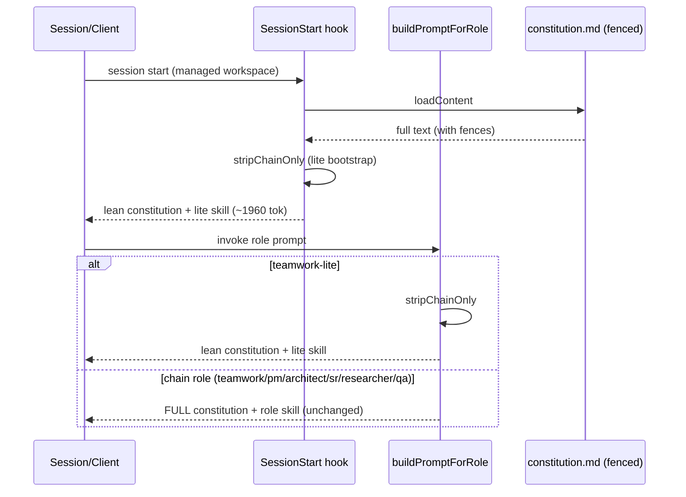

# Architecture: context-budget-reduction

> Blueprint for T322 (impl) + T323 (QA). Built on the T320 baseline:
> constitution.md ~2353 tok, re-injected every session (hook) and into all 7
> role-prompt bundles; always-on default (hook lite) ~2824 tok/session.

## Design summary

The reducible cost is the **constitution re-injected into lite contexts that can
never use half its rules**. §3.1 (server-enforced chain) and §4 (routing chain)
are *chain-only*: they govern role-to-role transitions, qa/review/visual rounds,
and circuit-breaker routing. **Lite mode is server-read-only with no chain and no
auto-routing** (`content/skill-coordinator-lite.md`), so it pays ~864 tok/session
for rules it structurally cannot exercise.

**Approach: single-source section-strip.** Keep `constitution.md` as the sole
source of truth. Fence the two chain-only sections with HTML-comment markers. A
trivial deterministic stripper removes fenced content for **lite contexts only**
— the SessionStart hook (lite bootstrap) and the `teamwork-lite` role prompt. All
chain contexts (`teamwork` full + `pm`/`architect`/`sr-engineer`/`researcher`/
`qa-engineer`) receive the **full, unmodified** constitution, because that is
exactly when those rules become load-bearing. No normative rule is deleted (AC3);
the moment an agent enters the chain it gets the complete ruleset.

**Concrete reduction target (AC2):** always-on default (hook lite) **2824 → ≤ 2000
tok** (~29% reduction; measured strip ≈ 864 tok). `teamwork-lite` prompt bundle:
same ~864 tok drop. Chain bundles: **unchanged** (full constitution retained).

## Affected Files

- **`content/constitution.md`** (modify) — wrap §3.1 (`### 3.1 Server-enforced
  chain`) and §4 (`## 4. Routing Chain …`) each in `<!-- chain-only:start -->` …
  `<!-- chain-only:end -->` fences. No wording change to the rules themselves.
- **`prompts/build.ts`** (modify) — add `stripChainOnly(text)`; in
  `buildPromptForRole`, strip when the context is lite. Pass a `liteContext`
  signal (see Interface Contracts).
- **`bin/agent-governance-context.mjs`** (modify) — add the same
  `stripChainOnly` (duplicated, see DR-3); apply when `skillVariant ===
  "skill-coordinator-lite.md"`.
- **`scripts/measure-context-cost.mjs`** (modify, optional) — teach it to report
  the post-strip lite figure so AC2 is verifiable from the same tool.
- **`test/context-budget.test.mjs`** (create — QA/T323 owns) — assertions in AC list.

## Data Structures

None. Pure string transform over already-loaded content.

## Interface Contracts

```ts
// prompts/build.ts — exported for reuse + test.
// Removes every <!-- chain-only:start --> … <!-- chain-only:end --> block
// (markers inclusive) and collapses the blank lines left behind. Idempotent.
// Text with no markers is returned unchanged (full-constitution safety default).
export function stripChainOnly(text: string): string;

// buildPromptForRole gains an internal lite-context decision:
//   lite = (skillFile === "skill-coordinator-lite.md")
// When lite, constitution = stripChainOnly(loadContent("constitution.md")).
// All other roles use the raw constitution. Signature unchanged otherwise.
```

```js
// bin/agent-governance-context.mjs — local copy (module-boundary, see DR-3):
//   function stripChainOnly(text) { /* same regex */ }
// Applied only when skillVariant === "skill-coordinator-lite.md".
```

Stripper regex (both copies must match):
`/<!-- chain-only:start -->[\s\S]*?<!-- chain-only:end -->\n?/g` → `""`, then
collapse `\n{3,}` → `\n\n`.

## Sequence Diagram



## Decision Records

| Context | Decision | Consequences |
|---|---|---|
| How to make the always-on bundle lean without losing rules | Single-source `constitution.md` + HTML-comment fences + runtime strip for lite contexts | One source of truth; zero dual-file drift risk. Cost: a fragile-ish marker contract (mitigated by idempotent no-marker passthrough + a test asserting markers exist). |
| Which sections to fence | §3.1 (server-enforced chain) + §4 (routing chain) only | These are provably chain-only (lite can't transition). §1/§2/§5/§6/§7 stay always-on (universal). Conservative: leaves smaller chain refs (e.g. §5 hop-cap bullet) in place rather than over-fragmenting. |
| Strip scope: all contexts vs lite-only | Lite-only (hook + `teamwork-lite`) | Chain roles genuinely need §3.1/§4 → full text preserved (AC3/AC4). Reduction lands on the every-session path, which is the highest-frequency cost. |
| Share stripper between build.ts (TS→dist) and hook (.mjs, npx-standalone) | Duplicate the 3-line function in both, cross-referenced by comment | Avoids a cross-module-system import that complicates the `npx github:` consumer path. Risk: two copies drift — mitigated by a test running BOTH the dist export and a regex-equivalence check. |
| Token-count method | chars/4 approximation (T320) | No new runtime/test dependency; deterministic + diff-able. Not exact, but adequate for a relative before/after target. |
| Prompt caching (#1) interaction | Out of scope; ordering already cache-friendly (constitution+skill prefix, volatile state suffix in both paths) | No reorder needed. Harness-side caching status remains an unmeasured assumption, but does not block this #2 work. |

## Deferred Resources

- **Anthropic docs URLs** (context-engineering / building-effective-agents /
  Claude Code) cited in `research/*.md` — PM classified `ignore`: rationale is
  already distilled into the findings; not load-bearing external artifacts.

## Open Questions

_No non-trivial trade-offs left unresolved; design is implementation-ready._
