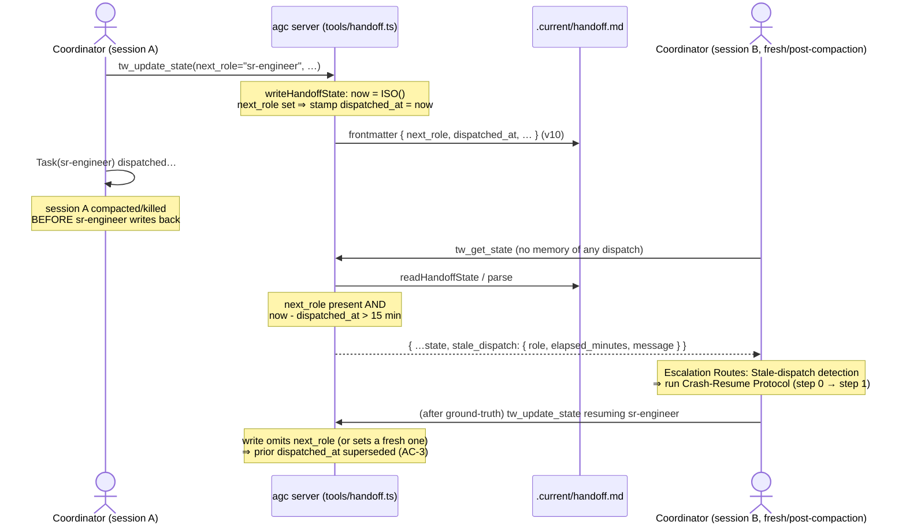

# d5-server-side-stale-dispatch-detection — architecture

Blueprint for `specs/d5-server-side-stale-dispatch-detection.md`. Pins every
open decision in that spec's *Architecture Decision Required* section (AC-10)
and gives the sr-engineer an unambiguous file-by-file diff plan.

## Decision summary (the pins)

| # | Question | Decision |
|---|---|---|
| 1 | Field name(s) | Persisted stamp: **`dispatched_at`** (ISO-8601 UTC string) on the handoff frontmatter — direct companion to `next_role`. Read-time advisory output key: **`stale_dispatch`** (object) on the `tw_get_state` JSON. No new *client-supplied* arg on `tw_update_state`. |
| 2 | N-minute threshold | **Fixed constant `STALE_DISPATCH_THRESHOLD_MIN = 15`** in `tools/handoff.ts`. NOT config-driven (DR-4). |
| 3 | Storage-mode scope | **File-mode-only**, by construction — `dispatched_at` is `next_role`'s companion and `next_role` is already file-mode-only (v7 DR-5; `storage-sqlite.ts` never destructures it). Zero new SQLite code; tested + documented per AC-9 (DR-5). |
| 4 | New `GateErrorCode`? | **None.** Read-path advisory only; no `tw_update_state` write is rejected; `gates/registry.ts` untouched; the frozen orchestrator check-order is untouched (DR-6). |
| 5 | `skill-coordinator.md` prose | **Three edits** (all in T-D5-03): a new *Stale-dispatch detection* Escalation Routes row, a second clause on the *Crash detection* row's intro pointer, and a **step 0** prepended to the Crash-Resume Protocol. Advisory surfaces as `tw_get_state` → `stale_dispatch.{role,dispatched_at,elapsed_minutes,threshold_minutes,message}` (DR-9, AC-7). |
| 6 | Schema impact | **v9 → v10**, stamp-only, **seeds nothing** — absence of `dispatched_at` === "no dispatch in flight" (the `next_role`/`scope_decision`/`external_refs` absence-is-signal precedent, NOT `hop_count`'s seed-0). (DR-7) |

**Reshape note (vs. the PM draft task list):** PM sketched the stamp landing
in `tools/handoff-orchestrator.ts`. DR-2 single-sources the stamp inside
`writeHandoffState` (`tools/handoff.ts`) instead, so **the orchestrator is NOT
touched by this feature.** T-D5-02's file set therefore changes from
"orchestrator + get_state, 2 files" to "`tools/handoff.ts` read-path only, 1
file." Task ordering and `depends_on` chains are preserved; no task exceeds the
`task_size` budget, so no task is split further (the D2 DR-8 01A/01B split is
NOT needed here).

## Affected Files

**T-D5-01 — field persistence + schema bump (AC-1, AC-3, AC-6):**
- `tools/handoff.ts` — modify: add `dispatched_at?: string` to `HandoffState`; parse it in `readAndMigrate`; **emit it in `writeHandoffState`** on the same predicate that emits `next_role`.
- `schema/migrations-handoff.ts` — modify: register the v9→v10 stamp-only step.
- `schema/versions.ts` — modify: bump `CURRENT_VERSIONS.handoff` `9 → 10`.
- `docs/schema-versions.md` — modify: add the v10 history row; extend the "`sqlite` stays at v2" paragraph to list `dispatched_at` among the file-mode-only fields.

**T-D5-02 — read-time staleness surfacing (AC-2, AC-4, AC-5, AC-9):**
- `tools/handoff.ts` — modify: add the `STALE_DISPATCH_THRESHOLD_MIN` constant and the `stale_dispatch` compute block in `readHandoffState`. (Same file as T-D5-01, disjoint functions; T-D5-02 `depends_on` T-D5-01 so there is no edit collision.)

**T-D5-03 — coordinator skill prose (AC-7):**
- `content/skill-coordinator.md` — modify: Escalation Routes new row + Crash-Resume Protocol step 0 (exact text in *Interface Contracts → Skill prose*).

**T-D5-05 — tests (qa-owned deliverable, AC-1..AC-6, AC-8, AC-9):**
- `test/stale-dispatch-detection.test.mjs` — create: the D5 unit/integration suite (assertions enumerated under *Test Plan*).

_No change to `tools/handoff-orchestrator.ts`, `tools/storage-sqlite.ts`,
`tools/config.ts`, `gates/registry.ts`, `tools/transitions.ts`, `index.ts`, or
the zod schemas — see DR-2/DR-4/DR-5._

## Data Structures

### `HandoffState` (tools/handoff.ts) — one new optional field

```ts
export interface HandoffState {
  // …existing fields…
  next_role?: AgentName;
  // v10 (d5-server-side-stale-dispatch-detection) — server-stamped ISO-8601
  // UTC timestamp recording WHEN this write set next_role. Direct companion to
  // next_role: emitted by writeHandoffState iff next_role is set on THIS write,
  // and — like next_role — never carried forward from existing state (transient,
  // write-scoped, AC-3). NOT client-supplied: derived from the write's own
  // now(). Absence === "no dispatch currently in flight" (the next_role /
  // scope_decision absence-is-signal precedent, NOT hop_count's seed-0). FILE-
  // MODE ONLY: SqliteHandoffStorage.writeState never persists next_role, so it
  // never stamps this either (DR-5).
  dispatched_at?: string;
}
```

### Module constant (tools/handoff.ts)

```ts
// v10 — staleness threshold for the tw_get_state stale-dispatch advisory.
// Fixed constant, NOT config-driven (DR-4): the advisory never blocks a write,
// so a false positive costs one cheap ground-truth check, and there is no
// legitimate reason a workspace would DISABLE it (unlike tokenBudgetPerFeature,
// whose absence is a meaningful opt-out). Mirrors HOP_CAP's fixed-constant
// posture. Tunable in one line if 15 proves too tight.
const STALE_DISPATCH_THRESHOLD_MIN = 15;
```

### `stale_dispatch` advisory (added to the `tw_get_state` JSON response only)

Not a persisted field — computed at read time, present on the response ONLY
when the threshold is crossed:

```ts
stale_dispatch?: {
  role: AgentName;          // === state.next_role (the in-flight target)
  dispatched_at: string;    // === state.dispatched_at (the stamp)
  elapsed_minutes: number;  // Math.floor((now - dispatched_at)/60000)
  threshold_minutes: number;// === STALE_DISPATCH_THRESHOLD_MIN (15)
  message: string;          // "stale in-flight dispatch: <role>, no state write for >15 min"
}
```

`message` is the spec's verbatim Copy string
(`stale_dispatch.message`), interpolated with `role` = `next_role` and `n` =
`STALE_DISPATCH_THRESHOLD_MIN`.

## Interface Contracts

### Write stamp — `writeHandoffState` (tools/handoff.ts)

No signature change. `now` is already computed once
(`const now = new Date().toISOString();`) and `next_role` is already emitted by
`if (nextRole) frontmatterData.next_role = nextRole;`. Add ONE adjacent line so
the stamp shares that exact transient predicate and `now` source:

```ts
if (nextRole) frontmatterData.next_role = nextRole;
if (nextRole) frontmatterData.dispatched_at = now;   // v10 — stamp iff dispatching; same now() as last_updated
```

Consequences that fall out **for free** from keying on `nextRole` (this-write
value, never preserved):
- **AC-1** — every write that sets `next_role` persists a companion stamp; server-derived, no client arg.
- **AC-3** — a subsequent write that omits `next_role` drops `dispatched_at`; one that sets its own `next_role` re-stamps `now`. Prior stamp superseded either way.
- **AC-6** — a feature-change write handled by the same transient rule: omit `next_role` ⇒ stamp dropped; set `next_role` ⇒ fresh stamp. No cross-feature bleed. (Strictly stronger than the `dispatch_pins` feature-scoped reset — this is every-write-scoped.)
- `dispatched_at === last_updated` exactly whenever a dispatch is stamped (single `now`).
- **Best-effort (D3 discipline):** a bare synchronous string assignment — no I/O, no parse — so it can never throw and never make a `tw_update_state` write fail.

### Parse — `readAndMigrate` (tools/handoff.ts)

Add alongside the other `asString`-defensive parses (permissive passthrough;
validity is checked at compute time, not parse time):

```ts
const dispatchedAt = asString(frontmatter.dispatched_at) || undefined;
// …in the state object literal, next to ...(nextRole && { next_role: nextRole }):
...(dispatchedAt && { dispatched_at: dispatchedAt }),
```

So `dispatched_at` round-trips through `parseHandoff`/`readHandoffState`'s
`...state` view like any other field.

### Read surfacing — `readHandoffState` (tools/handoff.ts)

After the `view` object is built and before `return JSON.stringify(...)`,
compute the advisory defensively:

```ts
let staleDispatch: Record<string, unknown> | undefined;
if (state.next_role && state.dispatched_at) {
  const stampedMs = Date.parse(state.dispatched_at);
  if (Number.isFinite(stampedMs)) {                 // malformed stamp ⇒ no signal, never throw
    const elapsedMin = (Date.now() - stampedMs) / 60000;
    if (elapsedMin > STALE_DISPATCH_THRESHOLD_MIN) {
      staleDispatch = {
        role: state.next_role,
        dispatched_at: state.dispatched_at,
        elapsed_minutes: Math.floor(elapsedMin),
        threshold_minutes: STALE_DISPATCH_THRESHOLD_MIN,
        message:
          `stale in-flight dispatch: ${state.next_role}, ` +
          `no state write for >${STALE_DISPATCH_THRESHOLD_MIN} min`,
      };
    }
  }
}
return JSON.stringify({ exists: true, ...view, ...(staleDispatch && { stale_dispatch: staleDispatch }) });
```

- **AC-2** — surfaced on read, informational; no write path touched.
- **AC-4** — derived purely from persisted `next_role` + `dispatched_at` + wall clock; a fresh process with no memory gets the identical signal (correct by construction).
- **AC-5** — a stamp younger than 15 min yields no `stale_dispatch` key (no false positive).
- This is the site reached by `tw_get_state`: `handleGetState` → `getActiveStorage().readState` → `FileHandoffStorage.readState` (storage.ts:98) → `readHandoffState`. SQLite's `readState` is a separate method that never carries `dispatched_at` (DR-5), so it never surfaces the advisory — the file-mode-only scope is automatic.

### Migration — `schema/migrations-handoff.ts` (v9 → v10, stamp-only)

```ts
// v9 → v10: add optional dispatched_at stamp (d5-server-side-stale-dispatch-
// detection). Additive STAMP-ONLY: bumps the version, seeds NO default —
// absence === "no dispatch currently in flight" (the next_role / scope_decision
// absence-is-signal precedent, NOT hop_count's seed-0: there is no true
// pre-feature value to seed). Mirrors the v3→v4 … v6→v7 stamp-only pattern.
registerMigration<Record<string, unknown>, Record<string, unknown>>({
  kind: "handoff",
  from: 9,
  to: 10,
  up: (input) => ({ ...input, schema_version: 10 }),
});
```

And `schema/versions.ts`: `handoff: 9,` → `handoff: 10,`.

> Migration-boundary note (not a bug — do not "fix"): a v9 file that happens to
> carry a live `next_role` at upgrade time loses it on the one migration
> heal-write (the heal-write is positional and omits `next_role`, dropping it —
> pre-existing v7 transient behavior). Such a file predates `dispatched_at`, so
> there is nothing to detect anyway; every post-upgrade write stamps correctly.

### `docs/schema-versions.md` — history row (append to the Handoff table)

```
| v10 | adds optional `dispatched_at?: string` stamp (d5-server-side-stale-dispatch-detection) — server-stamped companion to `next_role`, transient/write-scoped, file-mode-only | v9→v10 stamp-only, seeds nothing — **absence === no dispatch in flight** (the `next_role` absence-is-signal precedent, NOT `hop_count`'s seed-0). |
```

And extend the "`sqlite` stays at v2 …" paragraph to name `dispatched_at`
alongside `next_role` as file-mode-only (not mirrored to SQLite).

### Skill prose — `content/skill-coordinator.md` (T-D5-03, exact edits)

**(a) New Escalation Routes row**, inserted immediately after the *Crash
detection* row (current line 133):

```
| **Stale-dispatch detection** — `tw_get_state` returns a `stale_dispatch` advisory (a `next_role` was stamped `dispatched_at` more than 15 min ago with no subsequent write; surfaced from persisted state alone, so a fresh/post-compaction session with NO memory of dispatching still sees it) | — | do not resume or re-dispatch directly — run the Crash-Resume Protocol first, then resume | (role named by `stale_dispatch.role`) |
```

**(b) One-clause pointer** appended to the *Crash detection* row's cell so the
two triggers cross-reference (keeps the same-session and fresh-session cases
adjacent). Append to that row's "pending note" cell:
`… (fresh-session counterpart: the Stale-dispatch detection row below)`.

**(c) Crash-Resume Protocol step 0**, prepended before the current step 1
(line 149), and a clause on the intro (line 145) noting BOTH routes lead here:

```
0. **Identify the in-flight role without relying on your own memory.** If you saw
   the `Task(...)` fail this session, that reply names the role directly. If you
   are fresh / post-compaction and have NO memory of dispatching, read the
   `stale_dispatch` field from `tw_get_state`: `stale_dispatch.role` IS the role
   in flight and the signal is your trigger. Either path, resume THAT role and
   proceed to step 1.
```

## Sequence Diagram



## Decision Records

| Context | Decision | Consequences |
|---|---|---|
| **DR-1** Field name & advisory key | Persist **`dispatched_at`** (ISO-8601 string), surface advisory under key **`stale_dispatch`** (structured object, not a bare string). | One frontmatter field + one read-response key. Structured object lets any caller read `role`/`elapsed_minutes` without re-parsing the message; the verbatim Copy string lives in `.message`. Alternative — surface only `dispatched_at` and make every caller re-derive ">N min" — rejected: duplicates the threshold across call sites and buries the trigger. |
| **DR-2** Where the stamp is written | Stamp inside **`writeHandoffState`** (tools/handoff.ts) on the `if (nextRole)` predicate, NOT in `tools/handoff-orchestrator.ts` (PM's sketch). | Single `now` source ⇒ `dispatched_at === last_updated` when stamped; covers ALL write paths (orchestrator, migration heal-write, positional callers) with one line; **orchestrator untouched**, so AC-8 (existing routing/gate semantics byte-identical) is trivially satisfied and no new option/positional/zod arg is added. Closed-off alternative: orchestrator-side stamp threaded as a new `WriteHandoffStateOptions.dispatchedAt` — rejected as more surface + a second `now`. |
| **DR-3** Transient lifecycle (not feature-scoped preserve) | `dispatched_at` inherits `next_role`'s **every-write-scoped transient** lifecycle (dropped by any omitting write), NOT the `dispatch_pins`/`external_refs` feature-scoped carry-forward. | AC-6 (no cross-feature bleed) is satisfied *a fortiori* — the stamp cannot survive even a same-feature write that omits `next_role`, let alone a feature change. No `active_feature`-comparison code needed. |
| **DR-4** Threshold source | **Fixed constant `STALE_DISPATCH_THRESHOLD_MIN = 15`**; NOT a `.current/.config.json` field. | Zero `tools/config.ts` / `WorkspaceConfig` surface; matches HOP_CAP's fixed-constant posture. Closed-off alternative: config-driven `staleDispatchThresholdMinutes` (the `tokenBudgetPerFeature` additive-scalar precedent) — rejected because the advisory never blocks (a false positive is a cheap ground-truth check) and, unlike a spend ceiling, there is no legitimate reason to DISABLE it via absence. Tunable in one line if 15 proves tight. |
| **DR-5** Storage-mode scope | **File-mode-only, by construction.** `dispatched_at` is stamped only when `next_role` is emitted, and `SqliteHandoffStorage.writeState` never destructures `next_role` (storage-sqlite.ts:464-469). | Zero new SQLite code; the advisory can never fire from a SQLite read (needs both `next_role` and `dispatched_at`, neither persisted there). AC-9 (scope explicit + tested) met by a SQLite test asserting a `next_role`-carrying write yields a `readState` with no `dispatched_at`/`stale_dispatch`, plus the `docs/schema-versions.md` note. |
| **DR-6** No new gate | **No `GateErrorCode`, no `gates/registry.ts` change, no telemetry event.** | Read-path advisory only; the FROZEN orchestrator check-order (handoff-orchestrator.ts:9-15) is untouched; the `GateErrorCode` union stays at its current size (unlike every D2/C9/C14/A10 change). No `.current/telemetry.jsonl` entry (D3 confirm: telemetry fires on gate *rejections*; nothing is rejected). Closed-off alternative: a blocking `STALE_DISPATCH` gate — rejected per spec Out-of-Scope (detection ≠ auto-recovery; the human-in-the-loop Crash-Resume procedure stays). |
| **DR-7** Schema seed semantics | **v9→v10 stamp-only, seeds nothing.** Absence === "no dispatch in flight". | The `next_role`(v7)/`scope_decision`(v4)/`external_refs`(v6) absence-is-signal precedent, explicitly NOT `hop_count`(v9)'s seed-0 (no true pre-feature value exists for a timestamp). |
| **DR-8** Task reshape vs. PM draft | T-D5-02 drops `tools/handoff-orchestrator.ts`; becomes `tools/handoff.ts` read-path only (1 file). No task split (D2 DR-8-style 01A/01B) needed. | Every T-D5-0x task stays ≤ 2 files / well under 300 lines. Ordering and `depends_on` chain preserved. |

## Test Plan (T-D5-05, qa-owned — enumerated for the sr-engineer's self-check too)

`test/stale-dispatch-detection.test.mjs`:
1. **Stamp set on dispatch (AC-1):** write with `next_role` ⇒ re-read frontmatter has `dispatched_at`, equal to `last_updated`.
2. **No stamp without dispatch:** write omitting `next_role` ⇒ no `dispatched_at`.
3. **Stamp dropped/replaced on next write (AC-3):** after (1), a write omitting `next_role` ⇒ `dispatched_at` gone; a write setting a new `next_role` ⇒ `dispatched_at` refreshed.
4. **Fresh-read staleness surfaced (AC-2, AC-4):** hand-write a v10 handoff with `next_role` + a `dispatched_at` 16 min in the past ⇒ `tw_get_state` JSON carries `stale_dispatch` with the verbatim message and `role`/`elapsed_minutes`/`threshold_minutes`.
5. **No false positive in-window (AC-5):** `dispatched_at` 5 min in the past ⇒ no `stale_dispatch` key.
6. **Malformed stamp is inert:** `dispatched_at: "not-a-date"` ⇒ no throw, no `stale_dispatch`.
7. **Feature-change no bleed (AC-6):** dispatch on feature A, then a write on feature B omitting `next_role` ⇒ no `dispatched_at`/`stale_dispatch`.
8. **Migration round-trip (AC-10 / DR-7):** stale v9 fixture ⇒ read applies v9→v10 (stamps `schema_version: 10`, no `dispatched_at` seeded); re-read ⇒ `applied` empty; future-version (v11) fixture ⇒ refuse-loud throw.
9. **SQLite scope (AC-9 / DR-5):** via `SqliteHandoffStorage`, write carrying `next_role` ⇒ `readState` JSON has no `dispatched_at` and no `stale_dispatch`.
10. **AC-8 regression:** the existing `next_role`/`hop_count`/round-cap/`dispatch_pins`/`cut_approved`/`external_refs` suites remain green unmodified; full `npm test` green.

## Deferred Resources

_None — the spec's Dependencies / Prerequisites (Resource Audit Gate) records zero external references; every pointer is an in-repo path._

## Open Questions

None.
