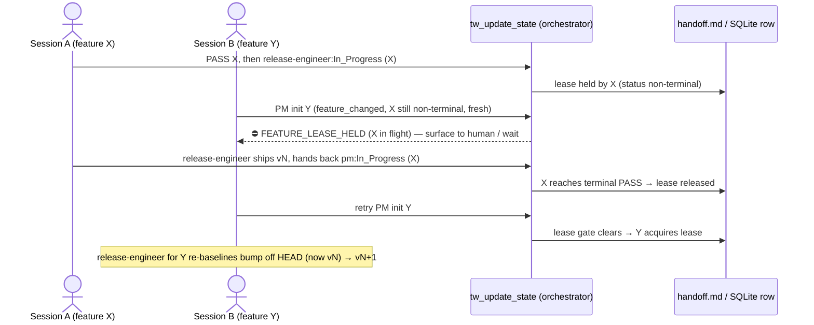

# e1-feature-scoped-state — architecture decision (design-first)

> **Status:** design deliverable for backlog **E1** (`docs/backlog.md` §E1, ~L938).
> Out-of-band design session; no PM spec precedes this (E1's backlog row calls
> for "architecture decision first"). No `tw_update_state` was issued — a
> parallel session holds the D6 handoff. This doc is the sole write.

## Problem (grounded)

`.current/handoff.md` models exactly ONE feature. Every persistence path is
keyed to a single workspace, not to a feature:

- **One handoff file, fixed path.** `getHandoffPath` returns
  `<workspace>/.current/handoff.md` with no feature discriminator
  (`tools/handoff.ts:181-183`); the write lock is the single sibling
  `<workspace>/.current/.handoff.lock` (`tools/handoff.ts:712`).
- **One SQLite row per workspace.** `handoff_state` has
  `workspace_path TEXT PRIMARY KEY` (`tools/storage-sqlite.ts:58`), so the DB
  can physically hold only one `active_feature` per workspace. `tasks` is keyed
  `PRIMARY KEY (workspace_path, task_id)` (`tools/storage-sqlite.ts:84`) — one
  task namespace per workspace.
- **One session snapshot per workspace.** `guards/session.ts` maps
  `workspacePath → SessionSnapshot` (`:21`), snapshotting one handoff mtime and
  one tasks path (`markStateRead`, `:31-55`).
- **All counters are single-feature-scoped.** `hop_count`, `qa_round`,
  `review_round`, `visual_round` all reset on `active_feature` change
  (`computeNewRound`, `tools/transitions.ts:519-527`; `HOP_CAP` note `:264-270`).

### The actual failure mode

A second feature does not error today — it **silently clobbers**. The freshness
guard is optimistic-concurrency on mtime/`last_updated`
(`verifyFreshness`, `guards/session.ts:111-128`; SQLite `last_updated` compare,
`tools/storage-sqlite.ts:246-253`). It rejects a write whose read-snapshot is
stale, forcing a re-read — but after that re-read, `writeHandoffState`
compares `existing.active_feature === _activeFeature` only to decide whether to
*preserve or drop* feature-scoped fields (`tools/handoff.ts:814, 819, 824`). A
write carrying a **different** `active_feature` is accepted and overwrites the
whole file, dropping the prior feature's `external_refs` / `dispatch_pins` /
`cut_approved` and resetting its counters. Nothing rejects "a second feature is
taking the slot." That is the structural root of the incident series:

| incident | shared resource contended | outcome |
|---|---|---|
| D5 / D9 (v3.69.0) | one release/version line | both features grabbed v3.69.0; D5 re-versioned to v3.70.0 via a hand-run coordinator rebase |
| D9 | one evidence ledger | FAIL fan-out to 11 unrelated `review_*.md` (already fixed narrowly by D9's `review_task_ids` scoping) |
| D10 | one git main / working tree | release-engineer `git reset` discarded a committed release |

D10's STOP-on-non-ff rule (`content/skill-release-engineer.md:15,20`) is a
tourniquet on the last resource; E1 asks for the structural fix.

---

## Candidate designs evaluated

### (a) Feature lease — reject/queue a second feature while a lease is live

A live lease on the workspace's active feature makes a *different* feature's
build-entry write fail loud instead of clobbering. Two sub-variants:

**(a-min) Derive-only lease — NO schema bump.** The lease is not a stored
field; it is *derived* from state the orchestrator already reads. The
orchestrator computes `feature_changed` from `prevState.active_feature` vs the
incoming write (`tools/handoff-orchestrator.ts:96-98`) and already holds
`prevState` (`:86`). A new gate fires when a write would switch to a new
feature while the incumbent feature is non-terminal and fresh:

```
FEATURE_LEASE_HELD  ⇔  prevState exists
                       ∧ prevState.active_feature ≠ incoming.active_feature   (feature_changed)
                       ∧ prevState.status ∉ { "PASS" }                        (incumbent still in flight)
                       ∧ (now − Date.parse(prevState.last_updated)) < LEASE_TTL_MIN
```

- **Handoff schema impact:** none. `active_feature` / `status` / `last_updated`
  are the three oldest fields; no new key, no migration. Current
  `CURRENT_VERSIONS.handoff = 10` (`schema/versions.ts:8`) stays.
- **Storage-interface impact:** none, and it works **uniformly in both modes** —
  unlike `cut_approved` / `external_refs` (file-mode-only, guarded by
  `getActiveStorage() instanceof FileHandoffStorage`,
  `tools/handoff-orchestrator.ts:189-190,238`), the three fields the lease reads
  exist in the SQLite row too (`tools/storage-sqlite.ts:57-73, parse :395-410`).
- **Orchestrator/transitions impact:** one new gate block in
  `handoff-orchestrator.ts`, placed with the other fs/state-reading gates
  (model it on the scope-decision gate, `:142-173`). NOT in `transitions.ts` —
  that module stays pure/fs-free (`validateTransition`, `:325`), same rule the
  scope/cut/external gates already follow. One new `GateErrorCode` +
  `hintStatic` in `gates/registry.ts` (union `:23-47`, spec table `:404`).
- **File-lock semantics / guarantee:** the O_EXCL lock (`guards/file-lock.ts:55-97`)
  still only serializes the write *operation*; the lease adds the *semantic*
  exclusion — **per-workspace mutual exclusion**: at most one non-terminal
  feature per `workspace_path`. Stale-lease auto-expiry falls out of the TTL
  clause, mirroring the lock's own `LOCK_STALE_MS` self-heal
  (`guards/file-lock.ts:10,33-53`) and D5's `stale_dispatch` advisory
  (`tools/handoff.ts:179,525-543`).
- **Migration/rollback:** nothing to migrate; disabling the gate is a one-line
  revert.
- **Skills blast radius:** `skill-coordinator` gains one Escalation-Routes row
  and a Feature-Scope-Gate note; `skill-release-engineer` unaffected by the gate
  itself (see release design below). Small.

**(a-explicit) Stored lease field — schema v10 → v11.** Add
`feature_lease?: { owner: string; acquired_at: string }` (owner = the feature
id that claimed exclusivity). Per `docs/schema-versions.md`, a bump costs
exactly: register a stamp-only `up()` in `schema/migrations-handoff.ts`
(the v9→v10 `dispatched_at` step is the template, `:124-129`) + bump
`CURRENT_VERSIONS.handoff` to 11 + parser/writer plumbing in `tools/handoff.ts`
(feature-scoped preserve, mirroring `dispatch_pins`). Absence === no lease
(the `next_role`/`dispatched_at` absence-is-signal precedent). SQLite: either
leave it file-mode-only (like `dispatch_pins`, D5 DR-5) or one nullable column
via the idempotent `addColumnIfMissing` ALTER with NO version bump
(`tools/storage-sqlite.ts:186-206`, the `visual_round`/`hop_count` mechanism).
Buys: an explicit audit owner and — crucially — the ability to hold a *release*
lease independent of the *build* lease (relevant only in Phase 2).

**Verdict on (a):** converts silent clobber → loud, governed rejection. Cheap.
Does NOT deliver parallel *build* in one checkout — it serializes to one
feature per workspace. That is a safety-over-parallelism trade, which is the
correct MVP posture: overlap becomes *safe* (serialized) instead of
*corrupting*.

### (b) Per-feature handoff files + serialized release queue

`.current/handoff-<feature>.md` (+ per-feature lock + per-feature task
namespace), giving genuine parallel build isolation.

- **Handoff schema impact:** the file's shape is unchanged, but **the tool
  protocol breaks**: `tw_get_state` / `tw_update_state` / every mutating tool
  receives only `workspace_path` today (`tools/registry.ts:86,215`), never a
  feature selector. Per-feature files require either a new required
  `feature` arg on all 11 `tw_*` tools (+ zod + JSON Schema + the SessionStart
  hook + every skill's call examples) or a "current-feature pointer" file the
  server reads first. This is the largest surface change in the codebase's
  history of these tools.
- **Storage-interface impact:** SQLite PRIMARY KEY must become
  `(workspace_path, active_feature)` on `handoff_state` and the task namespace
  re-keyed to include feature — a real DDL migration (sqlite v2 → v3, a
  registered `SqliteMigrationStep`, `docs/schema-versions.md` §SQLite), plus
  every prepared statement re-bound (`tools/storage-sqlite.ts:215-336`).
- **Orchestrator/transitions impact:** counters (`hop_count` et al.) become
  per-feature naturally, but `feature_changed` semantics
  (`tools/handoff-orchestrator.ts:96-98`) lose meaning — a feature switch is now
  a file switch, not a field change.
- **Drift impact:** `tw_detect_drift` compares one handoff against one
  `tasks.md`; with N handoffs it must be told which pair to compare.
- **File-lock semantics / guarantee:** per-feature locks give true parallel
  build **within one checkout** — but only there. Two features in separate git
  worktrees already have distinct `workspace_path`s and distinct `.current/`
  dirs, so they are *already* isolated today with zero server change; the local-fs
  lock (`guards/file-lock.ts`) cannot span worktrees regardless.
- **The release path stays serial no matter what.** N handoff files do not
  create N version lines: there is one `package.json`, one `index.ts` Server
  literal, one main branch. So (b) **still needs** a release queue — it does not
  subsume the release problem, it merely adds it back on top of a large refactor.
- **Skills blast radius:** large — every skill that names `tw_*` calls, plus
  drift/release prose.

**Verdict on (b):** the right shape for genuine in-checkout parallelism, but
protocol-breaking, and most of its value (isolated build) is already achievable
operationally via **worktree-per-feature at zero server cost**. Defer.

### Hybrid (recommended sequencing)

Ship the lease now; treat per-feature files as a *conditional* follow-on that is
only justified if worktree-per-feature proves insufficient. The lease is the
foundation the release queue is built on either way.

---

## Decision

**Adopt (a-min): the derive-only feature lease, no schema bump, both storage
modes.** Rationale, weighing schema cost vs guarantee strength:

- The strongest concurrency guarantee the **local-fs, single-machine, per-path
  lock** model can honestly give for one workspace is *mutual exclusion of the
  active feature* — and (a-min) delivers exactly that at **zero schema-migration
  cost** and with **identical behavior in file and SQLite mode** (the gate reads
  only the three universal fields). Every richer option (a-explicit's field, b's
  per-feature files) buys capability the MVP does not need yet and pays real
  migration cost.
- It directly extinguishes the D5/D9/D10 incident class *as those incidents
  actually occurred* — all three happened in the single shared repo checkout,
  where a second feature took the one slot. Under the lease, the second feature
  cannot start until the first reaches terminal `PASS` (or its lease goes stale).
- The clean upgrade path is preserved: if a future need arises to name a lease
  owner distinct from `active_feature`, or to hold a release lease independent of
  the build lease (Phase 2's parallel-build world), promote to (a-explicit) via
  the well-worn stamp-only v10→v11 migration. Nothing in (a-min) blocks that.

### Explicitly out of scope (MVP-strict)

- **Per-feature handoff files / feature-selector protocol / SQLite re-key** →
  deferred follow-on (propose as **E1b**). Worktree-per-feature covers the
  parallel-build need today with no server change.
- **Cross-worktree / cross-checkout release serialization.** Serializing
  releases that originate in *different* `workspace_path`s would require a lock
  at a shared path (e.g. the git common dir) — the server "does NOT touch git"
  and is workspace-path-scoped (`CLAUDE.md`), and the file lock is local-fs only.
  Out of scope. The release SOP hardening below is the tourniquet for that case.
- **No speculative multi-machine story.** The lock is local-fs only, stated.
- **A durable queue runtime.** MVP rejects loud (`FEATURE_LEASE_HELD`) and lets
  the coordinator surface to human — the existing escalation pattern. A
  pending-queue file is a Phase-2 nicety, not MVP.

---

## Release-queue serialization (for the recommended option)

Under (a-min) the release queue **is** the feature lease: within one workspace
at most one feature is ever non-terminal, so two features cannot both reach the
release path concurrently. Release is serial by construction. The design must
still specify ordering, re-versioning, and what release-engineer sees — and must
still harden the *worktree* case the lease cannot reach.

**Ordering (single checkout — the incident reality).** Feature A holds the lease
through `qa-engineer:PASS → release-engineer:In_Progress`
(`tools/transitions.ts:235-242`), ships, and hands back
`release-engineer:In_Progress → pm:In_Progress` (`:246-248`), landing at terminal
state. Only then does Feature B's PM init write pass the lease gate. B is ordered
strictly after A — no version race is possible.

**Who re-versions, and against what.** Whichever feature releases *second* must
compute its bump off the **just-released HEAD**, not its own stale baseline —
this is exactly D5's manual rebase (v3.69.0 → v3.70.0), promoted to a mandatory
SOP step so it is never hand-improvised. Add to `content/skill-release-engineer.md`
SOP step 3/4 (`:39-44`), and mirror a ≤2-sentence hint into
`templates/claude-code-agents/release-engineer.md` (C13 pattern): *before*
applying the `package.json` / `index.ts` / CHANGELOG bump, `git fetch` and
re-derive the target version from current `origin/<branch>` HEAD; if HEAD
advanced since PASS, re-baseline the bump. The existing check-version gate
(`content/skill-release-engineer.md:17`) then catches any incoherence.

**What release-engineer sees.** A clean single-owner state (lease held by its own
feature). If it nonetheless hits a non-fast-forward on push — the only way two
releases collide is the worktree case the lease cannot serialize — the D10 Hard
rule already applies verbatim: STOP, no `reset`/`rebase`/`checkout --force`/`clean`,
write `status=Blocked` with the local release SHA, hand back
(`content/skill-release-engineer.md:15,20`). The new re-baseline step means the
*first* thing coordinator recovery does on that Blocked is re-pull + re-version,
turning D5's ad-hoc rebase into the documented recovery path.

### Sequence — two features finishing near-simultaneously (single checkout)



---

## Affected Files (recommended option, Phase 1)

- `gates/registry.ts` — add `FEATURE_LEASE_HELD` to the `GateErrorCode` union
  (`:23-47`) and a `GateSpec` with `hintStatic` (table ~`:404`).
- `tools/handoff-orchestrator.ts` — new lease gate block, modeled on the
  scope-decision gate (`:142-173`), reading `prevState` (`:86`) +
  `feature_changed` (`:96-98`); add `LEASE_TTL_MIN` const (mirror
  `STALE_DISPATCH_THRESHOLD_MIN`, `tools/handoff.ts:179`).
- `tools/transitions.ts` — extend the `TransitionRejection["error"]` union for
  handler-side narrowing/envelope consistency (the pattern used for
  `SCOPE_DECISION_REQUIRED` et al., `:87-114`). No logic in the pure module.
- `content/skill-coordinator.md` — one Escalation-Routes row (`:125-138`) + a
  Feature-Scope-Gate note (`:38-61`): a second feature can't start while one
  holds the lease → surface + wait, or run it in a separate git worktree.
- `content/skill-release-engineer.md` (+ `templates/claude-code-agents/release-engineer.md`
  mirror) — the re-baseline-off-HEAD step folded into SOP 3/4.
- `test/` — lease-gate unit tests (both storage modes) + a skill-text pin.

_No `tools/handoff.ts`, `tools/storage*.ts`, or `schema/*` change — that is the
point of choosing (a-min) over (a-explicit)/(b)._

## Data Structures

None new (recommended option). The lease is a *derived predicate* over existing
`HandoffState` fields (`active_feature`, `status`, `last_updated`) — no type,
interface, or schema addition. (a-explicit, if ever promoted, would add
`feature_lease?: { owner: string; acquired_at: string }` to `HandoffState`,
`tools/handoff.ts:46-162`.)

## Interface Contracts

- New pure predicate (place in `gates/` alongside the other arm-helpers):
  `isFeatureLeaseHeld(prevState: HandoffState | null, incomingFeature: string, nowMs: number, ttlMin: number): boolean`
  — returns `true` iff the lease clause holds. Pure, fs-free, storage-agnostic
  (reads only the three universal fields), unit-testable without a workspace.
- Orchestrator call site (in `handleUpdateStateCore`): after
  `validateTransition` accepts and before the evidence blocks (same slot as the
  scope-decision gate), emit the `FEATURE_LEASE_HELD` envelope
  (`error`/`attempted`/`hint`) when the predicate is true.

## Decision Records

| Context | Decision | Consequences |
|---|---|---|
| Lease storage: derived vs stored field | Derive from `active_feature`/`status`/`last_updated`; no new field | Zero schema-migration cost; works in file AND SQLite mode uniformly; cannot express a release lease distinct from the build lease (not needed at MVP) |
| Where the gate lives | Orchestrator (`handoff-orchestrator.ts`), not `transitions.ts` | Keeps `transitions.ts` pure/fs-free, consistent with scope/cut/external gates; union-only extension in transitions for typing |
| Reject vs queue a second feature | Reject loud (`FEATURE_LEASE_HELD`), coordinator surfaces to human | No new queue subsystem; matches existing escalation pattern; a queue file is a Phase-2 option |
| Stale-lease handling | TTL auto-expiry (advisory, not auto-steal) | Mirrors `LOCK_STALE_MS` and D5 `stale_dispatch`; a dead session can't deadlock the workspace forever, but a live-but-slow one is protected within TTL |
| Parallel build in one checkout | Out of scope; recommend worktree-per-feature (distinct `workspace_path`, zero server change) | MVP trades in-checkout parallelism for safety; per-feature files (E1b) deferred |
| Cross-worktree release serialization | Out of scope (needs a shared-path lock; server doesn't touch git; local-fs only) | Covered operationally by the release-engineer re-baseline SOP + the D10 STOP rule, not by a server lock |
| Release re-versioning | Second releaser re-baselines off current HEAD (D5 rebase promoted to SOP) | Removes the hand-run rebase; check-version gate backstops incoherence |

## Deferred Resources

_None — this design references only in-repo source; the E1 backlog row cites no
external URLs, design files, or tickets._

## Open Questions

None blocking. Two calibration values for PM to fix in the spec (both have safe
defaults, neither gates the design): `LEASE_TTL_MIN` (propose 30 — longer than
D5's 15-min dispatch staleness, since a whole feature legitimately spans longer
gaps than a single dispatch) and whether the gate should treat `Blocked` as
lease-holding (recommend **yes** — a Blocked feature is still the workspace's
owner awaiting human recovery, not free to be clobbered).

## Ticket cut estimate (PM input for when E1 enters the chain)

Sized to `task_size` (≤5 files / ≤300 lines each), dependency-ordered:

- **T-E1-01 — Lease gate + error code (the mechanism).** `gates/registry.ts`
  (union + hint), new `isFeatureLeaseHeld` predicate in `gates/`,
  `tools/handoff-orchestrator.ts` gate block + `LEASE_TTL_MIN`,
  `tools/transitions.ts` union extension, unit tests (file + SQLite mode).
  ~5 files. **No dependency — build first.**
- **T-E1-02 — Release re-baseline SOP hardening (D10-class killer).**
  `content/skill-release-engineer.md` SOP 3/4 re-baseline step +
  `templates/claude-code-agents/release-engineer.md` mirror + skill-text pin
  test. ~3 files. **Depends on T-E1-01** (references the lease as the primary
  serialization; SOP is the worktree-case tourniquet).
- **T-E1-03 — Coordinator escalation + feature-scope note.**
  `content/skill-coordinator.md` Escalation-Routes row + Feature-Scope-Gate note
  + skill-text pin test. ~2 files. **Depends on T-E1-01** (surfaces the new gate
  code). Parallelizable with T-E1-02.

Build order: **T-E1-01 → { T-E1-02, T-E1-03 }**. E1b (per-feature files) is a
separate future cut, not part of this chain.
