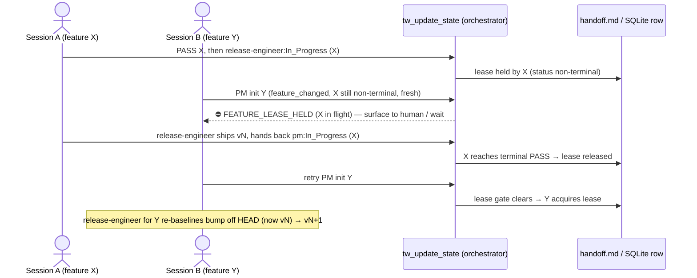

# e1-feature-scoped-state — architecture decision (design-first)

> **Status:** design deliverable for backlog **E1** (`docs/backlog.md` §E1, ~L938).
> Out-of-band design session; no PM spec precedes this (E1's backlog row calls
> for "architecture decision first"). No `tw_update_state` was issued — a
> parallel session holds the D6 handoff. This doc is the sole write.

## Problem (grounded)

`.current/handoff.md` models exactly ONE feature. Every persistence path is
keyed to a single workspace, not to a feature:

- **One handoff file, fixed path.** `getHandoffPath` returns
  `<workspace>/.current/handoff.md` with no feature discriminator
  (`tools/handoff.ts:181-183`); the write lock is the single sibling
  `<workspace>/.current/.handoff.lock` (`tools/handoff.ts:712`).
- **One SQLite row per workspace.** `handoff_state` has
  `workspace_path TEXT PRIMARY KEY` (`tools/storage-sqlite.ts:58`), so the DB
  can physically hold only one `active_feature` per workspace. `tasks` is keyed
  `PRIMARY KEY (workspace_path, task_id)` (`tools/storage-sqlite.ts:84`) — one
  task namespace per workspace.
- **One session snapshot per workspace.** `guards/session.ts` maps
  `workspacePath → SessionSnapshot` (`:21`), snapshotting one handoff mtime and
  one tasks path (`markStateRead`, `:31-55`).
- **All counters are single-feature-scoped.** `hop_count`, `qa_round`,
  `review_round`, `visual_round` all reset on `active_feature` change
  (`computeNewRound`, `tools/transitions.ts:519-527`; `HOP_CAP` note `:264-270`).

### The actual failure mode

A second feature does not error today — it **silently clobbers**. The freshness
guard is optimistic-concurrency on mtime/`last_updated`
(`verifyFreshness`, `guards/session.ts:111-128`; SQLite `last_updated` compare,
`tools/storage-sqlite.ts:246-253`). It rejects a write whose read-snapshot is
stale, forcing a re-read — but after that re-read, `writeHandoffState`
compares `existing.active_feature === _activeFeature` only to decide whether to
*preserve or drop* feature-scoped fields (`tools/handoff.ts:814, 819, 824`). A
write carrying a **different** `active_feature` is accepted and overwrites the
whole file, dropping the prior feature's `external_refs` / `dispatch_pins` /
`cut_approved` and resetting its counters. Nothing rejects "a second feature is
taking the slot." That is the structural root of the incident series:

| incident | shared resource contended | outcome |
|---|---|---|
| D5 / D9 (v3.69.0) | one release/version line | both features grabbed v3.69.0; D5 re-versioned to v3.70.0 via a hand-run coordinator rebase |
| D9 | one evidence ledger | FAIL fan-out to 11 unrelated `review_*.md` (already fixed narrowly by D9's `review_task_ids` scoping) |
| D10 | one git main / working tree | release-engineer `git reset` discarded a committed release |

D10's STOP-on-non-ff rule (`content/skill-release-engineer.md:15,20`) is a
tourniquet on the last resource; E1 asks for the structural fix.

---

## Candidate designs evaluated

### (a) Feature lease — reject/queue a second feature while a lease is live

A live lease on the workspace's active feature makes a *different* feature's
build-entry write fail loud instead of clobbering. Two sub-variants:

**(a-min) Derive-only lease — NO schema bump.** The lease is not a stored
field; it is *derived* from state the orchestrator already reads. The
orchestrator computes `feature_changed` from `prevState.active_feature` vs the
incoming write (`tools/handoff-orchestrator.ts:96-98`) and already holds
`prevState` (`:86`). A new gate fires when a write would switch to a new
feature while the incumbent feature is non-terminal and fresh:

```
FEATURE_LEASE_HELD  ⇔  prevState exists
                       ∧ prevState.active_feature ≠ incoming.active_feature   (feature_changed)
                       ∧ prevState.status ∉ { "PASS" }                        (incumbent still in flight)
                       ∧ (now − Date.parse(prevState.last_updated)) < LEASE_TTL_MIN
```

- **Handoff schema impact:** none. `active_feature` / `status` / `last_updated`
  are the three oldest fields; no new key, no migration. Current
  `CURRENT_VERSIONS.handoff = 10` (`schema/versions.ts:8`) stays.
- **Storage-interface impact:** none, and it works **uniformly in both modes** —
  unlike `cut_approved` / `external_refs` (file-mode-only, guarded by
  `getActiveStorage() instanceof FileHandoffStorage`,
  `tools/handoff-orchestrator.ts:189-190,238`), the three fields the lease reads
  exist in the SQLite row too (`tools/storage-sqlite.ts:57-73, parse :395-410`).
- **Orchestrator/transitions impact:** one new gate block in
  `handoff-orchestrator.ts`, placed with the other fs/state-reading gates
  (model it on the scope-decision gate, `:142-173`). NOT in `transitions.ts` —
  that module stays pure/fs-free (`validateTransition`, `:325`), same rule the
  scope/cut/external gates already follow. One new `GateErrorCode` +
  `hintStatic` in `gates/registry.ts` (union `:23-47`, spec table `:404`).
- **File-lock semantics / guarantee:** the O_EXCL lock (`guards/file-lock.ts:55-97`)
  still only serializes the write *operation*; the lease adds the *semantic*
  exclusion — **per-workspace mutual exclusion**: at most one non-terminal
  feature per `workspace_path`. Stale-lease auto-expiry falls out of the TTL
  clause, mirroring the lock's own `LOCK_STALE_MS` self-heal
  (`guards/file-lock.ts:10,33-53`) and D5's `stale_dispatch` advisory
  (`tools/handoff.ts:179,525-543`).
- **Migration/rollback:** nothing to migrate; disabling the gate is a one-line
  revert.
- **Skills blast radius:** `skill-coordinator` gains one Escalation-Routes row
  and a Feature-Scope-Gate note; `skill-release-engineer` unaffected by the gate
  itself (see release design below). Small.

**(a-explicit) Stored lease field — schema v10 → v11.** Add
`feature_lease?: { owner: string; acquired_at: string }` (owner = the feature
id that claimed exclusivity). Per `docs/schema-versions.md`, a bump costs
exactly: register a stamp-only `up()` in `schema/migrations-handoff.ts`
(the v9→v10 `dispatched_at` step is the template, `:124-129`) + bump
`CURRENT_VERSIONS.handoff` to 11 + parser/writer plumbing in `tools/handoff.ts`
(feature-scoped preserve, mirroring `dispatch_pins`). Absence === no lease
(the `next_role`/`dispatched_at` absence-is-signal precedent). SQLite: either
leave it file-mode-only (like `dispatch_pins`, D5 DR-5) or one nullable column
via the idempotent `addColumnIfMissing` ALTER with NO version bump
(`tools/storage-sqlite.ts:186-206`, the `visual_round`/`hop_count` mechanism).
Buys: an explicit audit owner and — crucially — the ability to hold a *release*
lease independent of the *build* lease (relevant only in Phase 2).

**Verdict on (a):** converts silent clobber → loud, governed rejection. Cheap.
Does NOT deliver parallel *build* in one checkout — it serializes to one
feature per workspace. That is a safety-over-parallelism trade, which is the
correct MVP posture: overlap becomes *safe* (serialized) instead of
*corrupting*.

### (b) Per-feature handoff files + serialized release queue

`.current/handoff-<feature>.md` (+ per-feature lock + per-feature task
namespace), giving genuine parallel build isolation.

- **Handoff schema impact:** the file's shape is unchanged, but **the tool
  protocol breaks**: `tw_get_state` / `tw_update_state` / every mutating tool
  receives only `workspace_path` today (`tools/registry.ts:86,215`), never a
  feature selector. Per-feature files require either a new required
  `feature` arg on all 11 `tw_*` tools (+ zod + JSON Schema + the SessionStart
  hook + every skill's call examples) or a "current-feature pointer" file the
  server reads first. This is the largest surface change in the codebase's
  history of these tools.
- **Storage-interface impact:** SQLite PRIMARY KEY must become
  `(workspace_path, active_feature)` on `handoff_state` and the task namespace
  re-keyed to include feature — a real DDL migration (sqlite v2 → v3, a
  registered `SqliteMigrationStep`, `docs/schema-versions.md` §SQLite), plus
  every prepared statement re-bound (`tools/storage-sqlite.ts:215-336`).
- **Orchestrator/transitions impact:** counters (`hop_count` et al.) become
  per-feature naturally, but `feature_changed` semantics
  (`tools/handoff-orchestrator.ts:96-98`) lose meaning — a feature switch is now
  a file switch, not a field change.
- **Drift impact:** `tw_detect_drift` compares one handoff against one
  `tasks.md`; with N handoffs it must be told which pair to compare.
- **File-lock semantics / guarantee:** per-feature locks give true parallel
  build **within one checkout** — but only there. Two features in separate git
  worktrees already have distinct `workspace_path`s and distinct `.current/`
  dirs, so they are *already* isolated today with zero server change; the local-fs
  lock (`guards/file-lock.ts`) cannot span worktrees regardless.
- **The release path stays serial no matter what.** N handoff files do not
  create N version lines: there is one `package.json`, one `index.ts` Server
  literal, one main branch. So (b) **still needs** a release queue — it does not
  subsume the release problem, it merely adds it back on top of a large refactor.
- **Skills blast radius:** large — every skill that names `tw_*` calls, plus
  drift/release prose.

**Verdict on (b):** the right shape for genuine in-checkout parallelism, but
protocol-breaking, and most of its value (isolated build) is already achievable
operationally via **worktree-per-feature at zero server cost**. Defer.

### Hybrid (recommended sequencing)

Ship the lease now; treat per-feature files as a *conditional* follow-on that is
only justified if worktree-per-feature proves insufficient. The lease is the
foundation the release queue is built on either way.

---

## Decision

**Adopt (a-min): the derive-only feature lease, no schema bump, both storage
modes.** Rationale, weighing schema cost vs guarantee strength:

- The strongest concurrency guarantee the **local-fs, single-machine, per-path
  lock** model can honestly give for one workspace is *mutual exclusion of the
  active feature* — and (a-min) delivers exactly that at **zero schema-migration
  cost** and with **identical behavior in file and SQLite mode** (the gate reads
  only the three universal fields). Every richer option (a-explicit's field, b's
  per-feature files) buys capability the MVP does not need yet and pays real
  migration cost.
- It directly extinguishes the D5/D9/D10 incident class *as those incidents
  actually occurred* — all three happened in the single shared repo checkout,
  where a second feature took the one slot. Under the lease, the second feature
  cannot start until the first reaches terminal `PASS` (or its lease goes stale).
- The clean upgrade path is preserved: if a future need arises to name a lease
  owner distinct from `active_feature`, or to hold a release lease independent of
  the build lease (Phase 2's parallel-build world), promote to (a-explicit) via
  the well-worn stamp-only v10→v11 migration. Nothing in (a-min) blocks that.

### Explicitly out of scope (MVP-strict)

- **Per-feature handoff files / feature-selector protocol / SQLite re-key** →
  deferred follow-on (propose as **E1b**). Worktree-per-feature covers the
  parallel-build need today with no server change.
- **Cross-worktree / cross-checkout release serialization.** Serializing
  releases that originate in *different* `workspace_path`s would require a lock
  at a shared path (e.g. the git common dir) — the server "does NOT touch git"
  and is workspace-path-scoped (`CLAUDE.md`), and the file lock is local-fs only.
  Out of scope. The release SOP hardening below is the tourniquet for that case.
- **No speculative multi-machine story.** The lock is local-fs only, stated.
- **A durable queue runtime.** MVP rejects loud (`FEATURE_LEASE_HELD`) and lets
  the coordinator surface to human — the existing escalation pattern. A
  pending-queue file is a Phase-2 nicety, not MVP.

---

## Release-queue serialization (for the recommended option)

Under (a-min) the release queue **is** the feature lease: within one workspace
at most one feature is ever non-terminal, so two features cannot both reach the
release path concurrently. Release is serial by construction. The design must
still specify ordering, re-versioning, and what release-engineer sees — and must
still harden the *worktree* case the lease cannot reach.

**Ordering (single checkout — the incident reality).** Feature A holds the lease
through `qa-engineer:PASS → release-engineer:In_Progress`
(`tools/transitions.ts:235-242`), ships, and hands back
`release-engineer:In_Progress → pm:In_Progress` (`:246-248`), landing at terminal
state. Only then does Feature B's PM init write pass the lease gate. B is ordered
strictly after A — no version race is possible.

**Who re-versions, and against what.** Whichever feature releases *second* must
compute its bump off the **just-released HEAD**, not its own stale baseline —
this is exactly D5's manual rebase (v3.69.0 → v3.70.0), promoted to a mandatory
SOP step so it is never hand-improvised. Add to `content/skill-release-engineer.md`
SOP step 3/4 (`:39-44`), and mirror a ≤2-sentence hint into
`templates/claude-code-agents/release-engineer.md` (C13 pattern): *before*
applying the `package.json` / `index.ts` / CHANGELOG bump, `git fetch` and
re-derive the target version from current `origin/<branch>` HEAD; if HEAD
advanced since PASS, re-baseline the bump. The existing check-version gate
(`content/skill-release-engineer.md:17`) then catches any incoherence.

**What release-engineer sees.** A clean single-owner state (lease held by its own
feature). If it nonetheless hits a non-fast-forward on push — the only way two
releases collide is the worktree case the lease cannot serialize — the D10 Hard
rule already applies verbatim: STOP, no `reset`/`rebase`/`checkout --force`/`clean`,
write `status=Blocked` with the local release SHA, hand back
(`content/skill-release-engineer.md:15,20`). The new re-baseline step means the
*first* thing coordinator recovery does on that Blocked is re-pull + re-version,
turning D5's ad-hoc rebase into the documented recovery path.

### Sequence — two features finishing near-simultaneously (single checkout)



---

## Affected Files (recommended option, Phase 1)

- `gates/registry.ts` — add `FEATURE_LEASE_HELD` to the `GateErrorCode` union
  (`:23-47`) and a `GateSpec` with `hintStatic` (table ~`:404`).
- `tools/handoff-orchestrator.ts` — new lease gate block, modeled on the
  scope-decision gate (`:142-173`), reading `prevState` (`:86`) +
  `feature_changed` (`:96-98`); add `LEASE_TTL_MIN` const (mirror
  `STALE_DISPATCH_THRESHOLD_MIN`, `tools/handoff.ts:179`).
- `tools/transitions.ts` — extend the `TransitionRejection["error"]` union for
  handler-side narrowing/envelope consistency (the pattern used for
  `SCOPE_DECISION_REQUIRED` et al., `:87-114`). No logic in the pure module.
- `content/skill-coordinator.md` — one Escalation-Routes row (`:125-138`) + a
  Feature-Scope-Gate note (`:38-61`): a second feature can't start while one
  holds the lease → surface + wait, or run it in a separate git worktree.
- `content/skill-release-engineer.md` (+ `templates/claude-code-agents/release-engineer.md`
  mirror) — the re-baseline-off-HEAD step folded into SOP 3/4.
- `test/` — lease-gate unit tests (both storage modes) + a skill-text pin.

_No `tools/handoff.ts`, `tools/storage*.ts`, or `schema/*` change — that is the
point of choosing (a-min) over (a-explicit)/(b)._

## Data Structures

None new (recommended option). The lease is a *derived predicate* over existing
`HandoffState` fields (`active_feature`, `status`, `last_updated`) — no type,
interface, or schema addition. (a-explicit, if ever promoted, would add
`feature_lease?: { owner: string; acquired_at: string }` to `HandoffState`,
`tools/handoff.ts:46-162`.)

## Interface Contracts

- New pure predicate (place in `gates/` alongside the other arm-helpers):
  `isFeatureLeaseHeld(prevState: HandoffState | null, incomingFeature: string, nowMs: number, ttlMin: number): boolean`
  — returns `true` iff the lease clause holds. Pure, fs-free, storage-agnostic
  (reads only the three universal fields), unit-testable without a workspace.
- Orchestrator call site (in `handleUpdateStateCore`): after
  `validateTransition` accepts and before the evidence blocks (same slot as the
  scope-decision gate), emit the `FEATURE_LEASE_HELD` envelope
  (`error`/`attempted`/`hint`) when the predicate is true.

## Decision Records

| Context | Decision | Consequences |
|---|---|---|
| Lease storage: derived vs stored field | Derive from `active_feature`/`status`/`last_updated`; no new field | Zero schema-migration cost; works in file AND SQLite mode uniformly; cannot express a release lease distinct from the build lease (not needed at MVP) |
| Where the gate lives | Orchestrator (`handoff-orchestrator.ts`), not `transitions.ts` | Keeps `transitions.ts` pure/fs-free, consistent with scope/cut/external gates; union-only extension in transitions for typing |
| Reject vs queue a second feature | Reject loud (`FEATURE_LEASE_HELD`), coordinator surfaces to human | No new queue subsystem; matches existing escalation pattern; a queue file is a Phase-2 option |
| Stale-lease handling | TTL auto-expiry (advisory, not auto-steal) | Mirrors `LOCK_STALE_MS` and D5 `stale_dispatch`; a dead session can't deadlock the workspace forever, but a live-but-slow one is protected within TTL |
| Parallel build in one checkout | Out of scope; recommend worktree-per-feature (distinct `workspace_path`, zero server change) | MVP trades in-checkout parallelism for safety; per-feature files (E1b) deferred |
| Cross-worktree release serialization | Out of scope (needs a shared-path lock; server doesn't touch git; local-fs only) | Covered operationally by the release-engineer re-baseline SOP + the D10 STOP rule, not by a server lock |
| Release re-versioning | Second releaser re-baselines off current HEAD (D5 rebase promoted to SOP) | Removes the hand-run rebase; check-version gate backstops incoherence |

## Deferred Resources

_None — this design references only in-repo source; the E1 backlog row cites no
external URLs, design files, or tickets._

## Open Questions — resolved (PM ratification, 2026-07-12)

None blocking. Both calibration values below are now fixed for implementation
(sr-engineer MUST use these exact values; any change requires a PM spec
amendment, not a unilateral sr-engineer choice):

- **`LEASE_TTL_MIN = 30`** — longer than D5's 15-min dispatch staleness, since
  a whole feature legitimately spans longer gaps than a single dispatch.
- **`Blocked` counts as lease-held: YES** — a `Blocked` feature is still the
  workspace's owner awaiting human recovery, not free to be clobbered. The
  predicate's `prevState.status ∉ { "PASS" }` clause (already written this way
  in the Decision above) already encodes this — `Blocked` is not `PASS`, so no
  code change is needed beyond implementing the clause exactly as specified;
  this entry exists to make the choice an explicit, citable decision rather
  than an implicit fallthrough.

## Ticket cut (final, PM ratification 2026-07-12 — see tasks.md T-E1-01…T-E1-06)

Sized to `task_size` (≤5 files / ≤300 lines each), dependency-ordered. Split
into implementation / review / test tasks per repo convention (mirrors the
T-D5/T-D9/T-D10 tickets) rather than bundling sr + qa work into one task, since
"one task = one sr-engineer session" (`content/skill-pm.md` Task Format):

- **T-E1-01 [sr-engineer] — Lease gate + error code (the mechanism).**
  `gates/registry.ts` (`FEATURE_LEASE_HELD` union + hint), new
  `isFeatureLeaseHeld()` predicate in a new `gates/feature-lease.ts`,
  `tools/handoff-orchestrator.ts` gate block + `LEASE_TTL_MIN = 30` const,
  `tools/transitions.ts` `TransitionRejection["error"]` union extension.
  ~4 files. **No dependency — build first.**
- **T-E1-02 [sr-engineer] — Release re-baseline SOP hardening (D10-class
  killer).** `content/skill-release-engineer.md` SOP 3/4 re-baseline-off-HEAD
  step + `templates/claude-code-agents/release-engineer.md` mirror hint.
  ~2 files. **Depends on T-E1-01** (references the lease as the primary
  serialization; the SOP hardening is the worktree-case tourniquet the lease
  itself cannot reach).
- **T-E1-03 [sr-engineer] — Coordinator escalation + feature-scope note.**
  `content/skill-coordinator.md` Escalation-Routes row (`FEATURE_LEASE_HELD`)
  + Feature-Scope-Gate note. ~1 file. **Depends on T-E1-01** (surfaces the new
  gate code). Parallelizable with T-E1-02.
- **T-E1-04 [code-reviewer] — Batched review of T-E1-01/02/03.** Confirm
  `isFeatureLeaseHeld` is pure/fs-free/storage-agnostic (reads only
  `active_feature`/`status`/`last_updated`); confirm the gate lives in the
  orchestrator, not `transitions.ts` (which stays pure); confirm `Blocked`
  counts as lease-held per the ratified Open Questions above; confirm zero
  changes to `tools/handoff.ts` / `tools/storage*.ts` / `schema/*` (the entire
  point of choosing a-min); confirm the two skill-text edits match this spec's
  prose. **Depends on T-E1-01, T-E1-02, T-E1-03.**
- **T-E1-05 [qa-engineer] — Tests.** Unit tests for `isFeatureLeaseHeld`
  (TTL-boundary, `Blocked`-counts-as-held, terminal `PASS` releases the lease,
  `feature_changed=false` never gates) + orchestrator gate integration in
  **both** file and SQLite storage modes; skill-text pinning tests for the
  T-E1-02/T-E1-03 prose (mirrors the T-D10-03/C13-06 pinning convention).
  **Depends on T-E1-04.**
- **T-E1-06 [qa-engineer] — Full verification + PASS.** `npm run build && npm
  audit --audit-level=high && npm test`, 0 fail; re-baseline any tripped
  context-budget cap. **Depends on T-E1-05.**

Build order: **T-E1-01 → { T-E1-02, T-E1-03 } → T-E1-04 → T-E1-05 → T-E1-06**.
Release/backlog bookkeeping (version bump, CHANGELOG, `docs/backlog.md` E1
done-mark) is release-engineer's standing post-PASS SOP step (T-C10-01
convention) — not cut as a separate ticket line, mirroring D10 practice.
E1b (per-feature handoff files) is a separate future cut, not part of this
chain.

---

## Amendment (2026-07-12) — post-release lease terminal-marker (E1A)

> Root-fix follow-on to the v3.72.0 release-engineer closing write.
> Human-approved to proceed with the root fix (not just a diagram correction).
> Ticket cut: `T-E1A-01…T-E1A-04` (below). Continues on the same
> `active_feature` (`e1-feature-scoped-state-design`) — same-feature writes
> never gate on the lease (`gates/feature-lease.ts:51`), so this amendment does
> not itself trip the gate it is fixing.

### Problem (grounded)

The Decision above (`§Decision`) and its sequence diagram (L255-256) and prose
(L220-221) assert that the lease releases once release-engineer hands back
post-release: *"ships, and hands back `release-engineer:In_Progress →
pm:In_Progress` (`:246-248`), landing at **terminal state**."* This is
inaccurate. `isFeatureLeaseHeld` (`gates/feature-lease.ts:44-56`) has exactly
ONE terminal condition — `prevState.status === "PASS"` — and `PASS` is
reserved to `qa-engineer` (`requireQaEngineer` gate,
`tools/handoff-orchestrator.ts:88-93`; zod `status` field description in
`index.ts`). Release-engineer's closing write is `status: "In_Progress"`
(SOP step 12, `content/skill-release-engineer.md:73`) — non-terminal — so a
`<=30`-min `LEASE_TTL_MIN` cooldown applies after **every** release, silently
contradicting the diagram's claim of immediate release. Confirmed live: the
v3.72.0 closing write left the workspace at
`active_feature=e1-feature-scoped-state-design, status=In_Progress,
last_agent=release-engineer, next_role=pm` — exactly the non-terminal shape
the lease still holds.

Two implementation constraints rule out the two most obvious "just make it
terminal" fixes:

- **Cannot reuse `status=PASS`.** `requireQaEngineer` rejects any non-
  `qa-engineer` writer from setting `status=PASS`; the PASS evidence-recording
  path (`qa_review` stamping) is also `qa-engineer`-specific. Repurposing PASS
  for "released" would conflate two distinct meanings (QA-verified vs.
  shipped) and is out of scope for a wart-fix.
- **Cannot key on `last_agent="release-engineer"` alone.** Both the OPENING
  write (SOP step 2, `qa-engineer:PASS → release-engineer:In_Progress`) and
  the CLOSING write stamp `last_agent="release-engineer"` — release-engineer
  self-loops across its whole SOP via `validateTransition`'s same-agent
  In_Progress→In_Progress fast path (`tools/transitions.ts:412-420`), not the
  static `release-engineer:In_Progress → {agent:"pm"}` table entry. Releasing
  the lease on ANY `last_agent="release-engineer"` state would also release it
  during the OPENING window — i.e., while release mechanics (git commit/tag/
  push) are still running — reopening exactly the D5/D9/D10 race the lease
  exists to prevent (a second feature's build/release work interleaving with
  the first's in-flight git operations in the same checkout).

### Decision — terminal-marker (item 1, the root fix)

Extend `isFeatureLeaseHeld`'s terminal check with a second, narrowly-scoped
clause, evaluated after the existing `status === "PASS"` check:

```
prevState.last_agent === "release-engineer"
  && prevState.status === "In_Progress"
  && prevState.next_role === "pm"
  ⇒ lease released (terminal)
```

This reuses `next_role`, an existing field already stamped unconditionally by
release-engineer's closing write (SOP step 12) on every successful release —
**zero SOP behavior change**, zero schema bump, zero new field. It fires only
on the closing write because:

- the OPENING write (SOP step 2) never sets `next_role` — the in-flight
  release window stays lease-held, exactly as today;
- release-engineer's escalation writes route `next_role="qa-engineer"` or
  `"human"` (Escalation Routes table, `content/skill-release-engineer.md:79-85`),
  or set `status="Blocked"` — neither matches, so an interrupted/failed
  release still holds the lease pending human recovery, consistent with the
  already-ratified "Blocked counts as held" decision;
- the `last_agent === "release-engineer"` conjunction excludes every OTHER
  role's `next_role="pm"` handback (e.g. code-reviewer's `CHANGES_REQUESTED`
  routing pm to review rejected changes) from being mistaken for a shipped
  feature.

**Known scoping limit (explicit, not a defect):** `SqliteHandoffStorage`
never persists `next_role` (`tools/handoff.ts:131`), so in SQLite/HTTP storage
mode this clause is always false — the terminal-marker refinement is a
**file-mode-only** improvement; SQLite-mode behavior is byte-for-byte
unchanged (still TTL-bounded post-release). This mirrors the existing
file-mode-only asymmetry already accepted for `cut_approved` / `external_refs`
/ `dispatch_pins` (`tools/handoff-orchestrator.ts:189-190,238`). Extending
`next_role` persistence to SQLite mode is a separate, larger change (touches
`tools/storage-sqlite.ts` schema) and is explicitly deferred — not needed to
fix the incident that triggered this amendment (a single-checkout, file-mode
workspace).

**Companion fix — skill-text correction.** `content/skill-release-engineer.md`
SOP step 12's literal text instructs `agent_id="pm"` on the closing write. The
v3.72.0 release did not do this — it self-looped as `agent_id="release-engineer"`
(legal via the fast path above) with `next_role="pm"` as the routing signal,
which is also the convention every OTHER role in this codebase follows
(`agent_id` = the writer's own identity; `next_role` = who's dispatched next —
e.g. `qa-engineer`'s `PASS` write keeps `agent_id="qa-engineer"`, never flips
to the next role). Since the new terminal-marker clause keys on
`last_agent === "release-engineer"`, a future release-engineer session that
followed the CURRENT literal SOP text (`agent_id="pm"`) would stamp
`last_agent="pm"` and silently defeat the fix. Step 12 is corrected to pin the
actually-required, actually-observed contract: `agent_id` stays
`"release-engineer"` (self-loop), `next_role="pm"` is the terminal/routing
signal. No transition-table change — the self-loop fast path already permits
this; only the SOP's prose (and its inline rationale comment) changes.

### Decision — negative-age hardening (item 2)

`isFeatureLeaseHeld` (`gates/feature-lease.ts:53-55`) computes
`ageMs = nowMs - Date.parse(prevState.last_updated)` and returns
`ageMs < ttlMin * 60_000`. A future-dated `last_updated` (clock skew, wrong
timezone, hand-edited state) yields a **negative** `ageMs`, which is
unconditionally less than any positive TTL threshold — the lease is held
until the wall clock catches up to the bad stamp. Observed live in this
session's own `tw_get_state` read, before this write's fresh, correct
`last_updated` self-healed it: `last_updated: "2026-07-12T01:35:00.000Z"`
against a real UTC of `~2026-07-11T19:24Z` — roughly 6.2h in the future,
turning the ratified 30-min TTL into an effective ~6.5h cooldown.

**Fix:** treat negative age as not-fresh (lease NOT held), mirroring the
existing `NaN` posture at L54 (an unparseable stamp already fails open) —
both are "cannot establish a trustworthy, non-negative elapsed time, so do not
let it block the workspace." Zero tolerance / no skew-grace window: a
non-negative check (`ageMs >= 0 && ageMs < ttlMin * 60_000`) is the whole fix,
kept binary to match the existing `NaN` precedent rather than introducing a
second tunable.

### Decision — `LEASE_TTL_MIN` configurability (item 3): DEFERRED

The question that prompted this ("was 30 min our own choice, and should it be
configurable?") is real, but the incident that surfaced it was actually the
negative-age bug (item 2) miscomputing the cooldown as ~6.5h, not evidence
that the fixed 30-min value itself is wrong. Once item 2 ships, the effective
cooldown is bounded at exactly the ratified 30 min. No workspace has yet
needed a different value. Making `LEASE_TTL_MIN`
(`tools/handoff-orchestrator.ts:60`) configurable via
`.current/.config.json` now — new config key, default-fallback plumbing,
docs, tests — would be speculative surface against a need that has not
materialized. **`LEASE_TTL_MIN` stays a fixed constant, unchanged at `30`.**
Revisit only if a concrete cross-workspace need for a different TTL emerges;
tracked as a candidate for a future amendment, not cut here (keeps this
wart-fix small, per the original Open Questions' own "any change requires a
PM spec amendment, not a unilateral sr-engineer choice" rule — this amendment
IS that PM ratification, and it ratifies "no change").

### Acceptance Criteria (append)

- **AC-E1A-1**: Given release-engineer's closing-write state (`last_agent="release-engineer"`,
  `status="In_Progress"`, `next_role="pm"`) is the current state (file mode),
  when a DIFFERENT feature's write is attempted, then `isFeatureLeaseHeld`
  returns `false` (lease released).
- **AC-E1A-2**: Given release-engineer's OPENING-write state (`last_agent="release-engineer"`,
  `status="In_Progress"`, no `next_role`), when a different feature's write is
  attempted, then the lease is still held (unchanged from pre-amendment
  behavior).
- **AC-E1A-3**: Given release-engineer writes `status="Blocked"` (any
  `next_role`), or `next_role` ∈ `{"qa-engineer","human"}` with
  `status="In_Progress"`, when a different feature's write is attempted, then
  the lease is still held.
- **AC-E1A-4**: Given `prevState.last_updated` parses to a timestamp in the
  future (`nowMs - Date.parse(last_updated) < 0`), when `isFeatureLeaseHeld`
  is evaluated with any `ttlMin`, then it returns `false`.
- **AC-E1A-5**: Given the existing NaN / empty-string `last_updated` cases
  (P5a/P5b in `test/feature-lease.test.mjs`), when `isFeatureLeaseHeld` is
  evaluated, then behavior is unchanged (regression guard).
- **AC-E1A-6**: Given the same release-engineer closing-write state in SQLite
  storage mode (where `next_role` is not persisted on that row), when a
  different feature's write is attempted, then behavior is unchanged from
  pre-amendment (still TTL-bounded, no SQLite-mode regression).
- **AC-E1A-7**: Given `content/skill-release-engineer.md`, its SOP step 12
  text no longer instructs `agent_id="pm"` on the closing write; it pins
  `agent_id` staying `"release-engineer"` with `next_role="pm"` as the
  terminal/routing signal (skill-text pinning test, mirrors the existing
  S1–S6 convention in `test/feature-lease.test.mjs`).

No Copy / Strings, Visual Tokens, or Visual Widgets — this amendment is pure
backend gate-logic plus one SOP-prose correction; no user-facing surface.

### Decision Records (append)

| Context | Decision | Consequences |
|---|---|---|
| Post-release lease terminal signal | `last_agent="release-engineer" ∧ status="In_Progress" ∧ next_role="pm"` treated as terminal, additive to `status===PASS` | Reuses an existing, already-unconditionally-stamped field; zero schema bump; file-mode-only (SQLite doesn't persist `next_role`) — explicit, accepted asymmetry, not a defect |
| Why not key on `last_agent="release-engineer"` alone | Would also release the lease during release-engineer's OPENING write (mid release-mechanics) | Rejected — reopens the D5/D9/D10 in-flight-release race the lease exists to prevent |
| Why not reuse `status="PASS"` for "released" | `PASS` is reserved to `qa-engineer` (`requireQaEngineer`); conflates QA-verified with shipped | Rejected — out of scope for a wart-fix, would need its own evidence-recording rework |
| `content/skill-release-engineer.md` step 12 correction | `agent_id` stays `"release-engineer"` (self-loop) on the closing write, not `"pm"` | Matches actual v3.72.0 practice and the system-wide `agent_id`-is-identity / `next_role`-is-routing convention; prevents a literal-SOP-following future release from stamping `last_agent="pm"` and silently defeating the terminal-marker clause |
| Negative-age handling | Treat `ageMs < 0` as not-held, mirroring the existing `NaN`-fails-open posture | One-line, zero-tolerance fix; no new skew-grace constant introduced |
| `LEASE_TTL_MIN` configurability | Deferred — stays a fixed constant at `30` | The triggering incident was the negative-age bug, not the TTL value itself; no configurability need has been demonstrated yet |

### Ticket cut — E1A (final, PM ratification 2026-07-12 — see `tasks.md` T-E1A-01…T-E1A-04)

Sized to `task_size` (≤5 files / ≤300 lines each). Same mechanism → review →
test → verify shape as the original E1 cut, tightened to one sr-engineer
ticket since the whole mechanism fix lands in two small files.

- **T-E1A-01 [sr-engineer]** — Feature-lease predicate hardening: terminal
  marker (item 1) + negative-age guard (item 2) in `gates/feature-lease.ts`;
  skill-text correction (item 1 companion) in
  `content/skill-release-engineer.md` SOP step 12. ~2 files, ~45 LoC.
  **No dependency — build first.**
- **T-E1A-02 [code-reviewer]** — Batched review of T-E1A-01: scoping
  correctness (opening-write / Blocked / escalation / other-roles'-`pm`-handback
  all still gate), SQLite-mode no-op safety, NaN-posture regression check,
  zero schema/version-file changes, skill-text match. **Depends on
  T-E1A-01.** ~0 files (review only).
- **T-E1A-03 [qa-engineer]** — Tests: extend `test/feature-lease.test.mjs`
  per AC-E1A-1…7 (file mode + SQLite mode where applicable) + skill-text
  pinning test for the corrected step 12 line. **Depends on T-E1A-02.**
  ~1 file, ~100-150 LoC.
- **T-E1A-04 [qa-engineer]** — Full verification + PASS: `npm run build &&
  npm audit --audit-level=high && npm test`, 0 fail; re-baseline any tripped
  context-budget cap. **Depends on T-E1A-03.**

Build order: **T-E1A-01 → T-E1A-02 → T-E1A-03 → T-E1A-04**. Release/backlog
bookkeeping is release-engineer's standing post-PASS SOP step, not a separate
ticket line here either.
