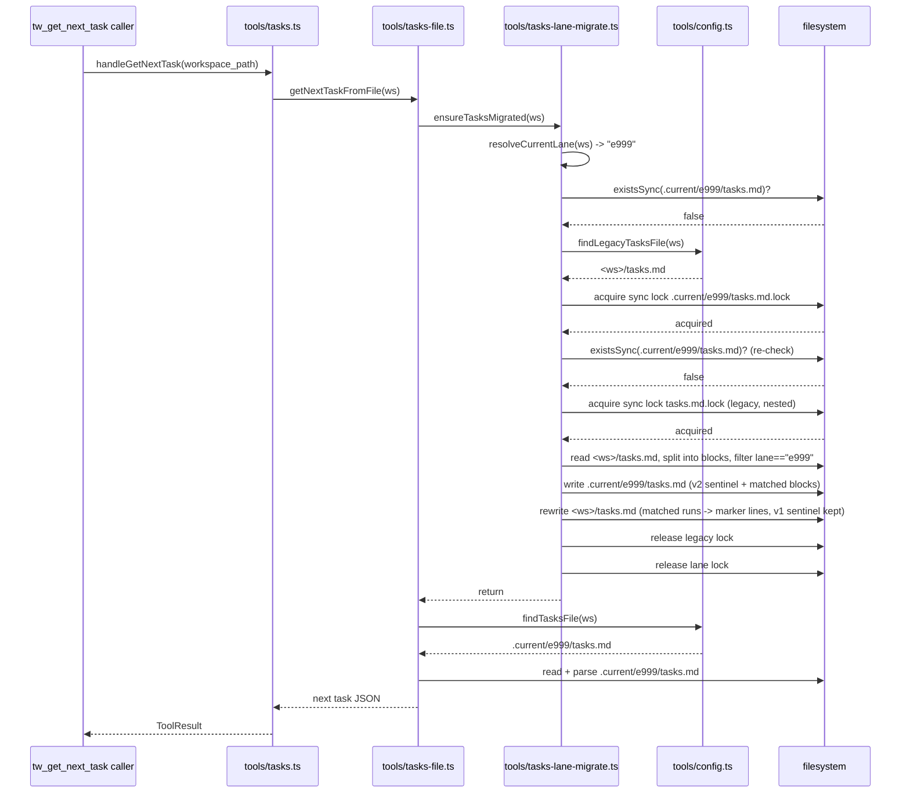

# e125a-lane-local-ledgers — architecture

Base: `b0db90e`. Spec: `specs/e125a-lane-local-ledgers.md` (AC1–AC14, D-A..D-F,
cut_approved: true, 2026-09-25). Q1=L (`_primary` also gets a lane-local
ledger; root becomes a v2 index for everyone), Q2=D-A (specs/ does not move),
Q3=keep the feature-lane extraction path, Q4=runner-only rollback (no CLI) —
all four are now human-CONFIRMED in the spec's "Human decisions" section, not
merely working defaults.

Sr task split is unchanged from the PM-bootstrapped `T-E125A-01..04` in
`tasks.md`, with two explicit deviations from the literal task bullets,
called out where they occur (both keep every task within ≤5 files/≤300
lines and avoid an import cycle — see Decision Records D8/D9).

## Affected Files

**T-E125A-01** — registry + schema + E123-runner carve-out (≈4 files, ~65 lines)
- `tools/lane-paths.ts` — modify: `LaneFileEntry.noFlatCounterpart?: true`; new
  `LANE_FILES` entry `{ key: "tasks", filename: "tasks.md", required: false,
  noFlatCounterpart: true }`; `LanePaths.tasksPath`; `LANE_PATH_FIELD.tasks`.
- `tools/lane-migrate.ts` — modify: filter `LANE_FILES` by `!noFlatCounterpart`
  everywhere a move/merge PLAN is built (`planMoves`'s `sidecarsFirst`,
  `hasFlatLaneFiles`, `migrateLaneToFlatLocked`'s `known` set,
  `migrateFlatToLaneLocked`'s `missingRequired`); explicit early refusal in
  `migrateLaneToFlatLocked` when the lane dir holds `tasks.md`; `tasks.md.lock`
  added to `isTolerableDebris`. `isStaleAtomicTmp` is left iterating the FULL
  `LANE_FILES` (unfiltered) — a stale `tasks.md.<pid>.<ms>.tmp` in a lane dir
  is still tolerable debris even though `tasks.md` itself is never planned for
  a move.
- `schema/versions.ts` — modify: `CURRENT_VERSIONS.tasks: 1 → 2`.
- `schema/migrations-tasks.ts` — modify: register the `tasks` v1→v2 step
  (stamp-only, body untouched — mirrors the existing v0→v1 step).

**T-E125A-02** — forward migration (≈3 files, ~265–290 lines; depends: T-01)
- `tools/config.ts` — modify: add `findLegacyTasksFile` (new export).
  Deviation from the literal task bullet, which groups this under T-04 — see
  Decision Record D8 for why it must land here instead (avoids a
  `config.ts` ↔ `tasks-lane-migrate.ts` import cycle).
- `guards/file-lock.ts` — modify: extract the existing private `looksStale`
  into an exported `isLockPayloadStale(lockPath): boolean` (pure extraction,
  identical logic); `withFileLock` calls the exported function instead of its
  own private copy. Zero behavior change to `withFileLock` itself.
- `tools/tasks-lane-migrate.ts` — **new**: the sync lock primitive, the
  self-acquiring/`*Locked` forward-migration pair, `migratePrimaryForward`,
  `migrateFeatForward`, the `## `-block splitter, and the marker/notice/receipt
  constants, plus a small legacy-version guard (D13: `ensureTasksMigratedLocked`
  reads the legacy file's on-disk sentinel and treats a v2 legacy file as "no
  forward source" — D-C's "a legacy file already at v2 is never a forward
  source" — rather than attempting to re-extract from an already-frozen
  index). See Interface Contracts and Migration Trigger Site below.

**T-E125A-03** — reverse migration (≈1 file, ~120–150 lines; depends: T-02)
- `tools/tasks-lane-migrate.ts` — modify (same file, additive): `migratePrimaryReverse`,
  `migrateFeatReverse`, marker collection/validation, migration-receipt
  read+delete. No other file touched — the AC2 lane→flat refusal and
  `tasks.md.lock` debris tolerance already landed in T-01.

**T-E125A-04** — wire tw_* to the lane-local ledger (≈4 files, ~170–190 lines; depends: T-02)
- `tools/config.ts` — modify: `findTasksFile` checks the lane path first
  (`resolveCurrentLanePaths(...).tasksPath`, pure `fs.existsSync`), else falls
  back to the T-02 `findLegacyTasksFile`. Stays side-effect-free (no writes,
  no migration) — see Migration Trigger Site.
- `tools/tasks-file.ts` — modify: `parseTasksFromFile` / `getNextTaskFromFile`
  call `ensureTasksMigrated` as their first statement; `completeTaskInFile` /
  `rollbackTaskInFile` / `voidTaskInFile` / `addTaskInFile` lock the LANE
  tasks path (not whatever `findTasksFile` returns pre-migration), verify
  freshness against the pre-migration path, then call
  `ensureTasksMigratedLocked`. **No public signature in this file changes.**
  ALSO (D12, revised after coordinator review — see R1 below): `parseTasks()`
  gains a `_primary`-only read-time ownership filter, and `addTaskInFile`
  gains a matching write-time guard — both described in Interface Contracts
  and R1.
- `tools/metrics.ts` — modify: `emitFeatureMetrics`'s ticket count additionally
  scans every live + history-bucket lane copy of `tasks.md`
  (`enumerateLaneSidecarSources(ws, "tasks")`, reused as-is — no lane-paths.ts
  change needed, see Decision Record D10), deduplicated by task ID (a `Set<string>`
  of `T-<CODE>-...` ids), not by file/byte content.
- `tools/drift.ts` — comment-only (~3 lines): `readArtifactVersion`'s `"tasks"`
  branch already calls `findTasksFile`, which is lane-aware after this task's
  `config.ts` change — **no functional change required**; add a one-line
  comment recording that this satisfies AC10's "tasks skew check reads the
  lane file, else the legacy file" without further edits.
- **`tools/sync.ts`, `tools/registry.ts`, `tools/storage-sqlite.ts` — verified
  ZERO changes needed** (accounting for the AC10 grep, not a 5th/6th/7th
  file): `sync.ts` and `registry.ts` only call `storage.listTasks` /
  `storage.completeTask` / wire handler functions — they hold no task-file-path
  knowledge of their own, so they inherit the lane-aware behavior transitively
  through `FileHandoffStorage`. `storage-sqlite.ts` never touches
  `tools/tasks-file.ts` or `tools/config.ts` at all (AC12 — SQLite mode has
  its own `listTasks`/`getNextTask`, no lane-local `tasks.md` is ever created
  or read there).

## Data Structures

```ts
// tools/lane-paths.ts
export interface LaneFileEntry {
  readonly key: string;
  readonly filename: string;
  readonly required: boolean;
  // NEW. true iff this entry's "legacy" (pre-lane) location is NOT
  // `.current/<filename>` — its legacy resolution is owned by a different
  // module (tools/config.ts's taskPaths, for "tasks"). The E123 runners
  // (migrateFlatToLaneLocked / migrateLaneToFlatLocked / hasFlatLaneFiles /
  // planMoves) skip any entry carrying this flag; tools/tasks-lane-migrate.ts
  // owns that entry's flat<->lane transition instead.
  readonly noFlatCounterpart?: true;
}

export const LANE_FILES = [
  { key: "handoff", filename: "handoff.md", required: true },
  { key: "telemetry", filename: "telemetry.jsonl", required: false },
  { key: "metrics", filename: "metrics.jsonl", required: false },
  { key: "usage", filename: "usage.jsonl", required: false },
  { key: "dispatch", filename: "dispatch.jsonl", required: false },
  { key: "pendingTickets", filename: "pending-tickets.md", required: false },
  { key: "tasks", filename: "tasks.md", required: false, noFlatCounterpart: true },
] as const satisfies ReadonlyArray<LaneFileEntry>;

export interface LanePaths {
  handoffPath: string;
  telemetryPath: string;
  metricsPath: string;
  usagePath: string;
  dispatchLogPath: string;
  pendingTicketsPath: string;
  tasksPath: string; // NEW
}
```

```ts
// schema/migrations-tasks.ts
// v1 -> v2: stamp only. The MEANING of v2 (index vs ledger) is carried by
// WHICH PATH a v2 file lives at (D-D) — the migration step itself does not
// distinguish; that distinction lives in tools/tasks-lane-migrate.ts.
registerMigration<TasksPayload, TasksPayload>({
  kind: "tasks", from: 1, to: 2,
  up: (input) => ({ schema_version: 2, body: input.body }),
});
```

```ts
// tools/tasks-lane-migrate.ts — internal types (not exported unless noted)
interface Block {
  headingLine: string;   // the raw "## ..." line
  body: string;           // headingLine + every line up to (not including) the next "## " heading, joined by "\n"
  lane: string;            // resolveLaneName(headingLine.slice(3).trim()) — LEGACY_LANE if no ticket-id token
}

// Migration receipt (T-02/T-03; `_primary` reverse ONLY — see Marker/Notice
// section). NOT a LANE_FILES entry, NOT inside `.current/<lane>/` (so it never
// interacts with lane-migrate.ts's foreign-entry classification). Lives beside
// the legacy file itself.
interface TasksIndexReceipt {
  bodySha256: string; // sha256(hex) of B — root's trailing body right after
                       // migratePrimaryForward's write, i.e. everything after
                       // `V2_SENTINEL + TASKS_INDEX_NOTICE`. NOT an mtime
                       // (R4 correction — mtime is rewritten by git merge /
                       // checkout / clone, which would make _primary reverse
                       // refuse after ANY git operation, not just a real
                       // tamper. A content hash is invariant under all of
                       // those, by construction).
}
```

## Interface Contracts

```ts
// tools/lane-paths.ts (T-01) — no new exported functions, only the data
// structures above. laneFile("tasks").filename remains the single owner of
// the "tasks.md" literal (AC15 lineage) for every other module.

// tools/config.ts (T-02)
/**
 * The pre-E125a resolver's pick (D-C): first candidate in resolveTaskPaths()
 * that exists AND is not nested one-or-more levels inside `.current/` (i.e.
 * not `.current/<lane>/tasks.md` for any lane). Pure, read-only. Consumed
 * ONLY by tools/tasks-lane-migrate.ts and (transitively, via findTasksFile)
 * by index-only readers. The live tw_* path never calls this directly.
 */
export function findLegacyTasksFile(workspacePath: string): string | null;

// tools/config.ts (T-04) — existing export, body replaced
/**
 * Lane-aware, side-effect-free (guards/session.ts's markStateRead depends on
 * this: no fs writes, no migration, ever). Returns the lane-local tasks path
 * if it already exists, else falls back to findLegacyTasksFile. Never
 * triggers migration — that is tools/tasks-file.ts's job (see Migration
 * Trigger Site).
 */
export function findTasksFile(workspacePath: string): string | null;

// guards/file-lock.ts (T-02) — extracted, exported (was private `looksStale`)
export function isLockPayloadStale(lockPath: string): boolean;

// tools/tasks-lane-migrate.ts (T-02)
/**
 * Machine-checkable busy signal (R3, revised after coordinator review). NOT a
 * GATE_REGISTRY code (gates/** is forbidden here, and this has nothing to do
 * with the tw_update_state pipeline) — a plain thrown Error subclass, the
 * same tier as verifyFreshness's existing "STATE DRIFT" throw. `.code` is
 * deliberately NOT shaped to match test/error-code-contract.test.mjs's
 * SUFFIX_RE (_REQUIRED/_MISSING/_INCOMPLETE/_EXCEEDED/_UNVERIFIED/_REJECTED/
 * _UNRESOLVED/_MISMATCH/_HELD/_CHANGE/_SUSPECT) or its `MISSING_` prefix —
 * that test's code-side harvest globs ALL of tools/*.ts (+ schema/*.ts,
 * guards/*.ts, gates/*.ts), so an ALL_CAPS token ending in one of those
 * suffixes anywhere in a file this feature touches would be misharvested as
 * an unregistered gate code and fail the parity assertion. `TASKS_MIGRATION_BUSY`
 * does not match either pattern — confirmed no GATE_REGISTRY entry, and no
 * other registration, is needed anywhere.
 */
export class TasksMigrationBusyError extends Error {
  readonly code = "TASKS_MIGRATION_BUSY";
}

/**
 * Self-acquiring: for callers that hold NO lock yet (parseTasksFromFile,
 * getNextTaskFromFile). Fast-paths to a no-op if the lane file already
 * exists (no lock touched at all in steady state). Otherwise takes the
 * lane's tasks lock (sync, bounded wait) then delegates to
 * ensureTasksMigratedLocked. R3 (revised): on lock-acquire timeout, THROWS
 * `TasksMigrationBusyError` — never silently returns. The original
 * "best-effort skip" design was rejected: a silent skip lets the caller fall
 * through to `findTasksFile`'s legacy-path fallback and read stale or
 * differently-scoped data, which `tw_get_next_task` / `tw_detect_drift` would
 * then report as a normal (wrong) result rather than a visible failure —
 * exactly the "silent wrong answer" this fix eliminates. `parseTasksFromFile`
 * and `getNextTaskFromFile` do NOT catch this — it propagates uncaught,
 * consistent with `verifyFreshness`'s existing thrown-error precedent, and
 * surfaces as a genuine tool-call error rather than a fabricated
 * empty/clean result.
 */
export function ensureTasksMigrated(workspacePath: string): void;

/**
 * CORE: caller MUST already hold the lane's tasks lock
 * (`${resolveLanePaths(ws, lane).tasksPath}.lock`) — the four tasks-file.ts
 * mutators call this directly instead of the self-acquiring wrapper, exactly
 * mirroring tools/lane-migrate.ts's *Locked/wrapper split. Takes ONLY the
 * (nested, inner) legacy-file lock itself. No-op if the lane file already
 * exists (steady state), if there is no legacy file to migrate from (a
 * brand-new lane; the caller's own add-task fallback creates the lane file
 * fresh), OR (D13) if the legacy file's on-disk sentinel is already v2 — D-C:
 * "a legacy file already at v2 is never a forward source; a lane born after
 * the `_primary` migration starts empty." The version check reads only the
 * legacy file's first line (the same sentinel regex tasks-file.ts already
 * uses), never the full schema-migration machinery. R3: throws
 * `TasksMigrationBusyError` (not a silent return) if the inner legacy lock
 * cannot be acquired within the bound — the four mutators let this propagate
 * exactly as they already let `verifyFreshness`'s STATE DRIFT throw
 * propagate.
 */
export function ensureTasksMigratedLocked(workspacePath: string, lane: string): void;

// Not exported — implementation detail, invoked by ensureTasksMigratedLocked:
function migratePrimaryForward(legacyPath: string, laneTasksPath: string): void;
function migrateFeatForward(legacyPath: string, laneTasksPath: string, lane: string): void;

// tools/tasks-lane-migrate.ts (T-03)
/**
 * D-E `_primary` reverse. Restores the legacy file from the lane file's
 * CURRENT body (not the original pre-migration body — see Decision Record
 * D11) under a v1 sentinel, then deletes `.current/_primary/tasks.md` and
 * `.current/tasks-index-receipt.json`. Refuses, touching nothing, when: (a)
 * the legacy file is not exactly `V2_SENTINEL + TASKS_INDEX_NOTICE + <body>`,
 * or (b) the receipt file is missing/unreadable, or (c) `sha256(<current
 * trailing body>)` does not equal the receipt's `bodySha256` (R4, revised:
 * a CONTENT hash, not an mtime — see Decision Record D7 for why mtime is
 * unusable here).
 */
export function migratePrimaryReverse(workspacePath: string): void;

/**
 * D-E feat reverse for `lane`. Collects every `tasks_moved` marker for `lane`
 * in the legacy file (see Marker shape below), validates the run-number set
 * is exactly {1..N} in strictly ascending document order (refuses on
 * missing/duplicated/out-of-order), re-splits the CURRENT lane file into its
 * own `## ` blocks, distributes the first `sections` blocks of each run back
 * to that run's marker position in document order, and appends any
 * remaining (lane-added-post-migration) blocks after the last marker — or, if
 * N=0, appends the ENTIRE lane body at the end of the legacy file. Deletes
 * `.current/<lane>/tasks.md` on success. Root's sentinel is left exactly as
 * it was (never touched by a feat reverse, mirroring D-C's feat forward).
 */
export function migrateFeatReverse(workspacePath: string, lane: string): void;
```

```ts
// tools/tasks-file.ts (T-04) — every function below keeps its EXISTING
// public signature; only internals change.
export function parseTasksFromFile(workspacePath: string): TaskRecord[] | null; // + ensureTasksMigrated() first line + D12 ownership filter (below)
export function getNextTaskFromFile(workspacePath: string): string;             // + ensureTasksMigrated() first line; inherits the filter via parseTasks()
export async function completeTaskInFile(workspacePath: string, taskId: string, note?: string): Promise<string>;
export async function rollbackTaskInFile(workspacePath: string, taskId: string, reason: string): Promise<string>;
export async function voidTaskInFile(workspacePath: string, taskId: string, reason: string): Promise<string>;
export async function addTaskInFile(workspacePath: string, taskId: string, description: string, section?: string): Promise<string>; // + D12 write-time ownership guard (below)
```

```ts
// tools/tasks-file.ts (T-04) — D12, private helper used inside parseTasks().
// Read-time ownership filter, `_primary`-only (see R1 for why only `_primary`
// needs it — a feat lane's ledger never contains a foreign section by
// construction, since its own forward migration only ever extracted sections
// matching its own ticket-id).
//
// A section is FOREIGN to `_primary` iff its heading's resolveLaneName(...)
// is a real ticket-id (not LEGACY_LANE) AND a live
// `.current/<thatLane>/tasks.md` file exists on disk right now. Foreign
// sections' rows are parsed (so they still round-trip on write, e.g. a
// completeTaskInFile call for a DIFFERENT, non-foreign id in the same file
// still works) but EXCLUDED from the TaskRecord[] this function returns —
// they are invisible to tw_get_next_task, tw_complete_task/rollback/void's
// id lookup, tw_detect_drift, and tw_sync, exactly as if `_primary`'s ledger
// never contained them. Memoized per distinct section-lane within one parse
// call (a handful of fs.existsSync calls, not O(file size)).
function isForeignToPrimary(workspacePath: string, sectionHeadingText: string): boolean;
```

```ts
// tools/metrics.ts (T-04) — emitFeatureMetrics's ticket-count computation
// only; the exported function signature is unchanged.
function countDistinctCompletedTicketIds(workspacePath: string, code: string): number {
  // root (existing hardcoded read, unchanged) + every live/history lane copy
  // of "tasks.md" via enumerateLaneSidecarSources(ws, "tasks").sources
  // (filter out kind:"flat" — root is read via the existing hardcoded path,
  // not via this enumeration, to avoid depending on taskPaths per the
  // existing "SOP grep does not consult it either" precedent).
  // Dedup: a Set<string> of the exact id token (e.g. "T-E125A-04"), built
  // from every "- [x] T-<code>-..." line across ALL sources. Set.size is the
  // count — AC10.
}
```

## Sequence Diagram — forward migration, feat lane, triggered by `tw_get_next_task`



## Decision Records

| Context | Decision | Consequences |
|---|---|---|
| D1 — `noFlatCounterpart` marker (AC1) | New optional `LaneFileEntry.noFlatCounterpart?: true` field, not a separate registry or exclusion list | Every `LANE_FILES` iterator in `lane-migrate.ts` that builds a MOVE plan must filter it explicitly; `isStaleAtomicTmp` deliberately does NOT filter (stale-tmp tolerance still applies) |
| D2 — lane→flat refusal on `tasks.md` | Explicit early `isFile` check + throw in `migrateLaneToFlatLocked`, BEFORE the generic foreign-entry classification, rather than relying on the generic "foreign entry" error | Gives the exact spec'd message (`tasks.refuse-lane-to-flat`) instead of the generic "holds non-lane entries" message; the generic path is kept as a defense-in-depth fallback (tasks.md excluded from `known` too) |
| D3 — migration trigger site (PM open item) | `tasks-file.ts`'s 6 entry points (via `ensureTasksMigrated`/`ensureTasksMigratedLocked`), NEVER `config.ts`'s `findTasksFile` | `findTasksFile` stays pure/side-effect-free — required because `guards/session.ts`'s `markStateRead` calls it on every `tw_get_state` and must never itself trigger a migration (AC11's "no freshness violation" depends on this ordering) |
| D4 — lock ordering (AC6) | Fixed order: the LANE's tasks lock is always acquired OUTER, the LEGACY file's lock always INNER | Two different feat lanes migrating concurrently take DIFFERENT outer locks and the SAME inner (legacy) lock — no deadlock, correct serialization on the shared legacy file. The four mutators already hold the outer lock (existing async `withFileLock`, now keyed on the lane path instead of the pre-migration path) and call the `*Locked` core directly; the two read paths self-acquire the outer lock via a new sync mechanism |
| D5 — new synchronous lock primitive | A small, sync, bounded-wait (3s cap, vs the async lock's 10s), stale-aware lock lives in `tools/tasks-lane-migrate.ts`, reusing `guards/file-lock.ts`'s extracted `isLockPayloadStale` for stale-detection parity | Chosen ONLY because `parseTasksFromFile`/`getNextTaskFromFile` have always been fully synchronous and changing that would ripple their `Promise`-returning signature into `tools/storage.ts`, `tools/tasks.ts`, `tools/drift.ts`, `tools/sync.ts` — well outside every task's ≤5-file budget. Trade-off (revised, D14/R3): a contended migration THROWS `TasksMigrationBusyError` on timeout rather than being silently skipped — the caller retries explicitly; this never applies to SQLite/HTTP mode (AC12) |
| D6 — marker shape extended with `sections=<n>` | `<!-- tasks_moved: lane=<lane> run=<n> sections=<count> -> .current/<lane>/tasks.md (E125a) -->` (adds one field beyond the spec's Copy table) | Spec's Copy/Strings table explicitly permits the architect to adjust the shape as long as it stays one line and carries lane+ordinal; the `sections` count is what makes `migrateFeatReverse` able to redistribute a since-grown lane file's blocks back to the correct run without a second stored mapping |
| D7 (revised, R4) — `_primary` reverse's "body changed" check needs external state (AC8) | A small, GIT-TRACKED migration-receipt file at the FIXED path `.current/tasks-index-receipt.json` (no ticket prefix, no per-lane subdirectory) holding `{bodySha256}` — a sha256 CONTENT hash of root's trailing body, not an mtime. Written by `migratePrimaryForward`, consumed+deleted by `migratePrimaryReverse` | First draft used `rootMtimeMs` in a ticket-prefixed dotfile beside the legacy file — broken, because `git merge`/`checkout`/`clone` all rewrite file mtimes on the working tree regardless of content, so `_primary` reverse would refuse after ANY git operation, not just a real tamper (effectively irreversible in practice). A content hash is invariant under those operations by construction. Root's post-migration content is still pinned byte-for-byte by AC4 (`sentinel + notice + B`) so the hash cannot be embedded inline in root itself without breaking that literal-equality test — it needs its own file. **Verified safe placement**: `.gitignore` has no broad `.current/*` rule (only named exclusions: `.current/.agc-hook-marker.json`, `.current/archive/` — neither matches this path); `bin/agc-init.mjs`'s `agc feature start` shared `info/exclude` upsert is `LANE_EXCLUDE_RULES = [".env", "/node_modules"]` only — unrelated; a TOP-LEVEL `.current/*` file (the same tier as the already-tracked `.current/.config.json` and `.current/feature-split.md`) is entirely outside `tools/lane-migrate.ts`'s foreign-entry scan, which only inspects `.current/<lane>/`'s own contents |
| D8 — `findLegacyTasksFile` lands in T-02's `config.ts`, not T-04's (deviation from the PM task bullet) | `tools/tasks-lane-migrate.ts` (T-02) needs a legacy-file finder; defining it in T-04 instead would force either a `config.ts` → `tasks-lane-migrate.ts` → `config.ts` import cycle, or duplicated `resolveTaskPaths` logic | `config.ts` is touched by both T-02 (adds `findLegacyTasksFile`) and T-04 (changes `findTasksFile`'s body) — different hunks, no conflict, both stay within their task's file/line budget |
| D9 — `isLockPayloadStale` extracted to `guards/file-lock.ts` in T-02 | Rather than duplicating the stale-lock predicate inside `tools/tasks-lane-migrate.ts` | `guards/**` is not a forbidden path for this lane; a pure extraction (no behavior change to `withFileLock`) keeps stale-detection semantics identical between the async and sync lock flavors, avoiding a second copy to keep in sync |
| D10 — `emitFeatureMetrics` reuses `enumerateLaneSidecarSources(ws, "tasks")` unchanged | No new `lane-paths.ts` enumeration export is needed for X6 | Since "tasks" is now a `LANE_FILES` entry, the EXISTING generic sidecar-source enumerator already walks every live lane dir and every `.current/history/<YYYY-MM>/<lane>/` bucket for it — this IS the "way to enumerate all lane-local ledgers" X6 asks for, already exposed, requiring zero new surface. `metrics.ts` filters out the `kind:"flat"` entry (root is read via its own existing hardcoded path) and dedups by task ID rather than trusting the enumerator's byte-prefix dedup (which is correct for JSONL merges but not sufficient here — see R1) |
| D11 — reverse restores the lane's CURRENT body, not the original pre-migration snapshot | `migratePrimaryReverse`/`migrateFeatReverse` copy whatever the lane file holds AT REVERSE TIME back to the legacy path | This is what makes AC7b ("a row is completed and a new row is added lane-locally between forward and reverse... after reverse root contains both edits") hold without extra bookkeeping — reverse is defined as "make root live again, carrying forward whatever happened while split," not "undo everything back to the exact original bytes" (AC7a, the no-edits case, still holds trivially) |
| D12 (revised after coordinator review) — read-time ownership filter on `_primary`'s ledger | `_primary`'s `parseTasks()` excludes any section whose heading resolves to a ticket-id for which a live `.current/<otherLane>/tasks.md` ALSO exists; `addTaskInFile` refuses to add under a `section` name that resolves to such a lane | This is the actual fix for R1 (see below) — `_primary`'s COPY-everything forward migration (D-C) cannot be made selective at copy time (it has no visibility into a sibling worktree's not-yet-merged extraction), so correctness is enforced at READ time instead, where both files genuinely coexist on disk post-merge. Scoped to `_primary` only: a feat lane's own ledger never receives foreign sections in the first place |
| D13 — legacy-file version guard before forward migration | `ensureTasksMigratedLocked` reads the legacy file's sentinel and skips migration (treats it as absent) when it is already v2 | Enforces D-C's explicit "a legacy file already at v2 is never a forward source; a lane born after the `_primary` migration starts empty" — this was under-specified in the first draft of `ensureTasksMigratedLocked` (only an existence check, not a version check) and is corrected here; also load-bearing for R1's primary-first ordering |
| D14 (R3) — lock-acquire timeout on the migration trigger throws, never silently skips | `ensureTasksMigrated`/`ensureTasksMigratedLocked` throw `TasksMigrationBusyError` (`code: "TASKS_MIGRATION_BUSY"`) instead of returning on a sync-lock timeout | First draft's "best-effort, skip on contention" let a caller fall through to reading legacy/stale data and report it as a normal (wrong) `tw_get_next_task`/`tw_detect_drift` result — a silent wrong answer, not merely a slow one. A thrown error is the same tier as `verifyFreshness`'s existing STATE DRIFT throw (uncaught by `tools/tasks-file.ts`, surfaced by the MCP tool-dispatch layer as a real tool error) and is confirmed NOT a `GATE_REGISTRY` concern — `TASKS_MIGRATION_BUSY`'s shape deliberately avoids `test/error-code-contract.test.mjs`'s harvested-suffix vocabulary, so no registration is needed anywhere and the parity test is unaffected |

## Deferred Resources

_None — the spec's Dependencies / Prerequisites section shows zero
ignored/deferred external references (no `design/<feature>.md`, no external
refs found in the E125 row or `specs/fanout-wave6.md`)._

## Lock Ordering (AC6)

Fixed order, always: **lane's tasks lock outer → legacy file's lock inner.**

- Mutators (`completeTaskInFile`, `rollbackTaskInFile`, `voidTaskInFile`,
  `addTaskInFile`): already hold the outer lock via the EXISTING async
  `withFileLock`, now keyed on `${resolveLanePaths(ws, lane).tasksPath}.lock`
  (previously keyed on whatever `findTasksFile` returned pre-migration). They
  call `ensureTasksMigratedLocked`, which takes ONLY the inner legacy lock
  (new sync primitive).
- Reads (`parseTasksFromFile`, `getNextTaskFromFile`): hold no lock today.
  They call `ensureTasksMigrated`, which takes the OUTER lane lock itself
  (sync primitive, same lockfile path as the mutators' async lock — the OS's
  `O_EXCL`/`wx` semantics make the two flavors mutually exclusive regardless
  of which one is waiting), then the inner legacy lock, same as above.
- Two different lanes migrating concurrently take DIFFERENT outer locks and
  the SAME inner legacy lock — serialized correctly, no deadlock, because
  every caller acquires outer-before-inner and never the reverse.
- `migratePrimaryReverse` / `migrateFeatReverse` (T-03, standalone runners, no
  live caller holds a pre-existing lock) each self-acquire BOTH locks in the
  same fixed order before touching any file, mirroring
  `tools/lane-migrate.ts`'s own reverse-runner convention.
- Bound: the new sync lock waits at most 3000ms (vs the async lock's 10000ms)
  before giving up — file-mode-only, rare, one-shot. **Revised (D14/R3): on
  timeout, EITHER lock flavor throws `TasksMigrationBusyError`, on the READ
  path (outer lane lock, self-acquiring wrapper) exactly as on the MUTATOR
  path (inner legacy lock only, since the mutator already holds the outer
  lock) — never a silent skip.** This is the same style of thrown error the
  rest of `tasks-file.ts` already propagates (`verifyFreshness`'s STATE DRIFT
  throw is the existing precedent) — see Interface Contracts'
  `ensureTasksMigrated`/`ensureTasksMigratedLocked`.

## Migration Trigger Site

Resolved per the PM's open item: **`tools/tasks-file.ts`'s six entry points**,
never `tools/config.ts`'s `findTasksFile`.

- `findTasksFile` (`config.ts`) stays pure and side-effect-free — required
  because `guards/session.ts`'s `markStateRead` (the mandatory
  `tw_get_state` pre-flight snapshot) calls it, and `tw_get_state` must never
  itself perform a migration (AC11).
- `parseTasksFromFile` / `getNextTaskFromFile`: call `ensureTasksMigrated`
  (self-acquiring) as their first statement.
- `completeTaskInFile` / `rollbackTaskInFile` / `voidTaskInFile`: resolve
  `preMigrationPath = findTasksFile(ws)` and `verifyFreshness` against it
  BEFORE migrating (matching what the session actually snapshotted at
  `tw_get_state` time), lock the LANE path, call `ensureTasksMigratedLocked`,
  then proceed exactly as today (using `parseTasks()`'s now-correctly-resolved
  `result.filePath`); `refreshSnapshotFor` at the end now snapshots the LANE
  path — this is what makes AC11's "second mutating call in the same session
  also succeeds" hold.
- `addTaskInFile`: same freshness-then-migrate ordering; always writes to the
  lane path (never creates a new legacy-shaped file, satisfying AC9's
  "unmigrated feat lane with no rows in root → `tw_add_task` creates
  `.current/<lane>/tasks.md` and does not touch root").
- `tw_detect_drift` / `tw_sync` / the prompt-footer `listTasks` call: NOT
  separately wired — they call `storage.listTasks` → `parseTasksFromFile`,
  which already triggers the migration transitively. No code change needed in
  `drift.ts`/`sync.ts` for the trigger itself.

## Marker / Notice / Sentinel — exact shapes

- **Schema sentinel** (unchanged mechanism, D-D): line 1, `<!-- schema_version: 2 -->\n`.
- **`_primary` index notice** (D-C, Copy id `tasks.index-notice`, quoted
  verbatim, no template — this notice is ONLY ever emitted for `_primary`):
  ```
  <!-- tasks_role: index — the tw_* ledger for lane _primary is .current/_primary/tasks.md (E125a); tw_* never writes this file -->
  ```
  Root, after `_primary`'s forward migration, is byte-for-byte
  `<sentinel>\n<notice>\n<B>` where `B` is the legacy file's body before
  migration (AC4). No third line, no checksum — see D7 for why the receipt
  enabling reverse's staleness check lives in a SEPARATE file instead.
- **Feat-lane marker** (D-C, Copy id `tasks.feat-marker`, shape adjusted per
  the spec's explicit "architect may adjust" allowance — D6):
  ```
  <!-- tasks_moved: lane=<lane> run=<n> sections=<count> -> .current/<lane>/tasks.md (E125a) -->
  ```
  One marker per contiguous run of `## ` sections whose heading's
  `resolveLaneName(...)` equals `<lane>`; `<n>` is the 1-based run ordinal in
  document order; `<count>` is the number of `## ` blocks in that run — used
  only by `migrateFeatReverse` to redistribute a since-mutated lane file's
  blocks back to their original run positions (see Interface Contracts).
  Root's own sentinel is left completely untouched by a feat forward
  migration (still v1, "its sentinel is not re-stamped" — D-C).
- **`tasks.refuse-lane-to-flat`** (Copy id, quoted verbatim, T-01):
  ```
  lane-migrate (lane->flat): <laneDir> holds tasks.md — run the tasks reverse migration first; nothing moved
  ```
- **Migration receipt** (new, internal, `_primary`-only, T-02/T-03; R4
  revision): a small, GIT-TRACKED JSON file at the FIXED path
  `.current/tasks-index-receipt.json` (no ticket prefix, no lane
  subdirectory — same top-level `.current/` tier as `.config.json` /
  `feature-split.md`) = `{"bodySha256": "<hex>"}`, written atomically right
  after `migratePrimaryForward`'s root write completes, read (and deleted on
  success) by `migratePrimaryReverse`. `bodySha256` is `sha256(hex)` of root's
  trailing body (everything after `V2_SENTINEL + TASKS_INDEX_NOTICE`) at
  forward-migration time — a CONTENT hash, not an mtime (mtime is rewritten
  by `git merge`/`checkout`/`clone` regardless of content, which would make
  `migratePrimaryReverse` refuse after any git operation — see D7). Not a
  `LANE_FILES` entry; not inside any `.current/<lane>/` directory (confirmed
  outside `tools/lane-migrate.ts`'s foreign-entry scan, D7); not matched by
  any `.gitignore` rule or `agc feature start`'s shared `info/exclude`
  upsert (confirmed, D7); never referenced by AC4's literal byte-equality
  assertions on `tasks.md` itself.
- **Per-file tasks lock** (new naming convention, T-02/T-04):
  `.current/<lane>/tasks.md.lock` — a sibling of `.current/<lane>/tasks.md`,
  distinct from the per-lane `.handoff.lock`. Recognized as tolerable debris
  by `tools/lane-migrate.ts`'s `isTolerableDebris` (T-01, AC2's second
  clause). The legacy file gets the identical convention:
  `<legacyPath>.lock` (e.g. `<root>/tasks.md.lock`), used only transiently
  during a migration's inner critical section — never left behind in steady
  state.

## R1 — merge-interleave analysis, mechanism, and AC14 draft

**Correction.** The first draft of this section answered the wrong question:
it showed that root's frozen index body is inert, and stopped there. The
integrator's actual concern is `.current/_primary/tasks.md` — which is
`_primary`'s own LIVE ledger, not inert at all, and IS git-tracked (verified:
`.current/<lane>/handoff.md` etc. are already committed in this repo's own
history — `.current/<lane>/tasks.md` will be too). Root is a red herring here;
the real duplicate risk is between `.current/_primary/tasks.md` and
`.current/<feat-lane>/tasks.md`. Revised below.

**Setup.** `_primary`'s forward migration is D-C's "copy" case: it copies
root's ENTIRE body B — every `## ` section, indiscriminately, regardless of
which ticket-id it belongs to — into `.current/_primary/tasks.md`. That file
is git-tracked and, from that point on, is `_primary`'s own LIVE ledger: every
`tw_*` call made from a checkout that resolves to `_primary` reads and writes
it. A feat lane's forward migration, by contrast, is SELECTIVE — it only ever
extracts sections whose heading matches its OWN ticket-id — so a feat lane's
ledger can never contain a foreign section by construction. `_primary`'s
ledger is the ONLY one that can, and D-C's design did not anticipate what
happens when the section it copied belongs to a ticket that is ALSO, in
parallel, being extracted into its own lane elsewhere.

**Feat-first ordering (the concrete bug).** `e999` forks from `main`, and
root (shared ancestor) already carries `## e999-x` with real (open) rows.
`e999`'s worktree runs its own forward migration first: `e999`'s copy of root
gets a marker in place of the section, and `.current/e999/tasks.md` gets the
real rows — committed on `e999`'s branch. Independently, BEFORE `e999`
merges, `main`'s own checkout runs `_primary`'s forward migration: `main`'s
copy of root has NOT seen `e999`'s marker-replacement commit yet, so it still
shows `## e999-x` with the original rows verbatim — `_primary`'s copy
therefore captures those same rows into `.current/_primary/tasks.md`,
committed on `main`. When `e999` merges into `main`: for `root tasks.md`,
git's 3-way merge (BASE = pre-migration shared ancestor; OURS = `main`'s
now-v2 root; THEIRS = `e999`'s marker-bearing root) typically applies cleanly,
since the two edits touch disjoint regions (a 2-line prefix insertion vs. a
mid-file section replacement) — root ends up `sentinel + notice + [B with
e999's section replaced by e999's marker]`. But for `.current/_primary/tasks.md`
— a file that exists ONLY in `main`'s history (absent from BASE, absent from
`e999`'s branch entirely, since `e999` never touched it) — git's merge rule
for "added only in OURS" is: **keep OURS unchanged, no conflict.** It survives
the merge byte-for-byte, stale rows and all. `.current/e999/tasks.md`
(added only in THEIRS) is also added to the merge result. **Result: after the
merge, `main`'s tree holds BOTH `.current/_primary/tasks.md` (with e999's
stale, pre-extraction rows, silently and permanently) AND
`.current/e999/tasks.md` (with e999's real, current rows) — and every `tw_*`
call from `main` from then on reads/writes `.current/_primary/tasks.md`,
offering and completing e999's stale rows as if they were `_primary`'s own
work.** This is the genuine bug; my original R1 missed it by stopping at
root.

**Primary-first ordering.** `_primary` migrates `main`'s root before `e999`
forks. Two sub-cases:
- *e999's ticket didn't exist in root yet at migration time*: a ticket cut on
  `main` before `e999`'s worktree exists lands (via `tw_add_task`) in
  `_primary`'s own ledger, since `resolveCurrentLane` on `main` is `_primary`
  — there is no mechanism, in or out of this ticket's scope, to pre-seed a
  not-yet-created lane's ledger. This is a coordinator/dispatch-process
  concern (route the ticket's `tw_add_task` calls from INSIDE the new lane's
  own worktree once it exists, exactly as this session's own dispatch already
  does), not a `tw_*` mechanism gap — no id is ever duplicated in this
  sub-case, it simply sits in `_primary`'s ledger unless/until the coordinator
  explicitly re-files it into `e999`'s.
- *e999's ticket already existed in root's body at migration time*: `_primary`'s
  copy captures it, exactly as in the feat-first case. `e999` then forks from
  a commit where root is ALREADY v2. Per D13 (the legacy-version guard added
  in this revision), `e999`'s own forward migration is a no-op — "a legacy
  file already at v2 is never a forward source" (D-C) — so `e999`'s lane
  starts EMPTY. If the coordinator never separately dispatches fresh
  `tw_add_task` calls into `e999`'s own ledger, there is no competing file at
  all and no duplicate. If it does (e.g. re-filing the same ticket once
  `e999`'s worktree exists), the SAME duplicate-visibility risk as the
  feat-first case applies once `.current/e999/tasks.md` exists — resolved by
  the same mechanism below.

**E125b/E125c/E126 (forking from main AFTER e125a has merged, i.e. from a v2
root).** Confirmed: their first task-tool access finds root already v2, D13's
guard makes that a no-op, and their lane starts EMPTY — there is no v1 root
left to extract from, by design. Their task rows must be seeded via
`tw_add_task` calls made from inside their OWN worktree/session (the
coordinator's normal per-lane dispatch flow, not a root or `_primary` cut).

**Mechanism (D12): a read-time ownership rule on `_primary`'s ledger, not a
copy-time exclusion.** A copy-time fix in `migratePrimaryForward` cannot work
in the feat-first ordering: `_primary`'s migration runs entirely locally, on
`main`'s own disk, at a moment when `e999`'s extraction exists only in
`e999`'s OWN, separate worktree — there is no file `_primary`'s migration
could consult to know a competing claim is coming. The fix must therefore be
enforced at READ time, on `main`, AFTER the merge — which is exactly the
moment both `.current/_primary/tasks.md` and `.current/<otherLane>/tasks.md`
genuinely coexist on the same disk. Rule: **when the resolved lane is
`_primary`, `parseTasks()` excludes any `## ` section from its live
`TaskRecord[]` view whose heading's `resolveLaneName(...)` is a real
ticket-id (not `LEGACY_LANE`) for which a live `.current/<thatLane>/tasks.md`
file currently exists on disk.** This is scoped to `_primary` only (a feat
lane's ledger never needs it, per the Setup paragraph above). It requires no
new stored state and no knowledge of git history — only a handful of
`fs.existsSync` checks per parse, memoized per distinct foreign section
heading encountered. `addTaskInFile` gets a matching write-time guard: adding
under a `section` name that resolves to an existing OTHER lane, while
resolved as `_primary`, is refused (preventing a newly-created, permanently
invisible orphan row instead of silently accepting one). Both are described
precisely in Interface Contracts.

**Why this, and not a copy-time skip.** The rule holds for BOTH orderings
because it does not depend on WHEN the duplicate was created, only on whether
a competing live ledger exists NOW: feat-first, primary-first-with-existing-
ticket, and any future re-merge scenario all converge on the same read-time
check. A long-closed historical ticket (e.g. `e73`, which never got its own
lane-local ledger because it predates this feature or its lane was long since
torn down with no `.current/e73/tasks.md` ever created) is correctly NOT
filtered — `_primary` keeps full, legitimate ownership of it, because nothing
else claims it. **Forward-looking note for E125b:** once E125b starts moving
closed lanes to `.current/history/<YYYY-MM>/<lane>/`, a lane's LIVE ledger
disappears from `.current/<lane>/` — this ownership filter, as scoped here,
would then stop seeing the claim and `_primary`'s stale copy would become
visible again. E125b should decide whether to extend this same filter to also
check the history bucket (the enumeration primitive already exists,
`enumerateLaneSidecarSources`/X6) — flagged for that ticket, not solved here.

**Does the (still-possible, now merely stale-and-inert-by-construction)
duplicate corrupt any AGGREGATE reader?** No — unchanged from the first
draft: `emitFeatureMetrics` (AC10) already deduplicates by task ID across
root + every live lane + every history-bucket lane (D10), so a stale `[ ]`
copy in `_primary`'s ledger that never matches the completed-row regex, or a
stale `[x]` copy that matches identically to the same id counted from the
owning lane's file, is never double-counted. No change needed there.

**AC14 draft (for the PM to add to the spec) — revised:**

> **AC14 (merge interleave — every task id live in exactly one ledger)**:
> Given `_primary`'s forward migration and a feat lane's (`L`) forward
> migration have each run, independently, in either relative order, and `L`
> is then merged into `main` via an ordinary `git merge` (no special driver),
> then: (a) if `.current/L/tasks.md` exists after the merge, every `tw_*`
> read/write resolved to `_primary` on `main` EXCLUDES any section of
> `.current/_primary/tasks.md` whose heading resolves to lane `L` — such rows
> are invisible to `tw_get_next_task`, unreachable by
> `tw_complete_task`/`tw_rollback_task`/`tw_void_task`, and excluded from
> `tw_detect_drift`'s comparison, regardless of merge ordering; (b) a legacy
> file (root) already at schema v2 is never treated as a forward-migration
> source — a lane forking after `_primary` has migrated starts with an empty
> ledger (D13); (c) `emitFeatureMetrics`'s ticket count (AC10) deduplicates by
> task ID across root + every live lane + every history-bucket lane, so a
> stale duplicate surviving in `_primary`'s ledger is never double-counted;
> (d) `addTaskInFile`, resolved as `_primary`, refuses to add a task under a
> `section` name that resolves to an existing other lane's ticket-id.
> proof: a new case in `test/e125a-lane-local-ledgers.test.mjs` that (1)
> constructs the feat-first fixture (hand-built `.current/_primary/tasks.md`
> containing `## e999-x` rows + a separately-created `.current/e999/tasks.md`)
> and asserts `tw_get_next_task`/`tw_complete_task` under `_primary` never see
> or touch the `e999`-owned id; (2) constructs the primary-first fixture (root
> already v2 before a lane's first access) and asserts the lane starts empty;
> (3) asserts `emitFeatureMetrics`'s count is unaffected by either fixture.

## R2 — temporary dual-copy wording (for the spec)

> **Temporary state, not a design goal (E125a → E125c).** After `_primary`'s
> forward migration, the full historical ledger body (currently ~545KB) exists
> in TWO places on disk: the frozen root index (kept verbatim, per D-C's
> "copy, not move" for `_primary`) and `.current/_primary/tasks.md` (the live
> ledger going forward). This is a deliberate, TEMPORARY consequence of
> choosing copy-over-move specifically for `_primary` — D-C's rationale is
> that emptying root would silently re-target E125c's future compaction onto
> the wrong file. It is not a design goal: operators should expect `tasks.md`
> disk usage to roughly double for any `_primary` workspace that has run the
> forward migration, until E125c ships and compacts root's frozen body down.
> The state is fully reversible in the meantime — `migratePrimaryReverse`
> restores the single-copy pre-migration state exactly, refusing rather than
> guessing if root has been touched by anything else since (AC8).

## Proposed spec amendments

For the PM to fold into `specs/e125a-lane-local-ledgers.md` before/alongside
QA's pass:

1. **New AC14** — verbatim as drafted in the R1 section above (revised: the
   live-duplicate risk is between `.current/_primary/tasks.md` and a feat
   lane's ledger post-merge, not root — root is inert).
1a. **D-C amendment** — append to the `_primary` forward bullet: "`_primary`'s
    copy is indiscriminate at MIGRATION time (it cannot see a sibling
    worktree's not-yet-merged extraction) — correctness against a
    since-merged feat lane's competing ledger is enforced at READ time
    instead (AC14, D12): `_primary`'s live task-list view excludes any
    section already claimed by an existing `.current/<otherLane>/tasks.md`."
1b. **D-C amendment** — append to the "legacy file already at v2" sentence:
    make explicit (already implied, now normatively required, D13) that this
    is enforced by an on-disk sentinel check in `ensureTasksMigratedLocked`,
    not left as a description-only invariant.
2. **D-C, feat-lane marker bullet** — append: "The marker's exact on-disk
   shape is `<!-- tasks_moved: lane=<lane> run=<n> sections=<count> ->
   .current/<lane>/tasks.md (E125a) -->` (architect-adjusted per this
   section's own allowance) — the `sections=<count>` field is required by the
   reverse runner to redistribute a since-mutated lane file's blocks back to
   their original run positions without a second stored mapping."
3. **D-E, `_primary` reverse bullet (revised, R4)** — append: "'the legacy
   body has changed since the forward run' is verified via a small,
   GIT-TRACKED migration-receipt file at the FIXED, un-prefixed path
   `.current/tasks-index-receipt.json` (top-level under `.current/`, no
   ticket prefix, no lane subdirectory), holding `{bodySha256}` — a sha256
   CONTENT hash of root's trailing body — written by the forward run and
   consumed+deleted by reverse. NOT an mtime (mtime is rewritten by `git
   merge`/`checkout`/`clone` regardless of content, which would make reverse
   refuse after any git operation); NOT a `LANE_FILES` entry (so it is
   untouched by the E123 flat<->lane runners' iteration). Confirmed clear of
   `.gitignore` (no broad `.current/*` rule) and of `agc feature start`'s
   shared `info/exclude` upsert (`.env`, `/node_modules` only) — exercised by
   AC7's round-trip proof and AC8's refusal proof."
3a. **AC6, proof addendum (R3)** — append to AC6's proof: "and: given the
    lazy-migration's lock cannot be acquired within its bound (a genuinely
    stuck/contended concurrent first access), then `tw_get_next_task` /
    `tw_detect_drift` / each of the four mutators surfaces a thrown,
    recognisable error (`TasksMigrationBusyError`, `code:
    \"TASKS_MIGRATION_BUSY\"`) — never an empty task list, never a false
    'clean' drift report, and never a silently-stale legacy-path read."
4. **Out of Scope** — append: "A git merge driver for `tasks.md` across the
   `_primary`/feat-lane forward-migration interleave (R1) is explicitly out of
   scope; a resulting merge conflict, or a hybrid file with an inert stale
   duplicate, is an accepted outcome (AC14)."
5. **Dependencies / Prerequisites, R2 paragraph** — insert the R2 wording
   above verbatim, near the self-hosting note.
6. **X6 (for E126, informational only)** — note that "every lane-local
   ledger" is already enumerable today via
   `enumerateLaneSidecarSources(workspacePath, "tasks").sources` (D10) — E126
   does not need a new `lane-paths.ts` export for this.

## Open Questions

None. Q1–Q4 are resolved and human-confirmed in the spec's "Human decisions"
section (cut_approved: true). Every PM-flagged open item (LANE_FILES marker
field name, marker/notice exact shape, lock ordering, migration trigger site)
is resolved above with a Decision Record, and the integrator's R1–R4
follow-ups are folded into the spec (AC14, D-E's receipt, AC6/AC7/AC8) as
well as into this document's Decision Records D7/D12/D13/D14.
