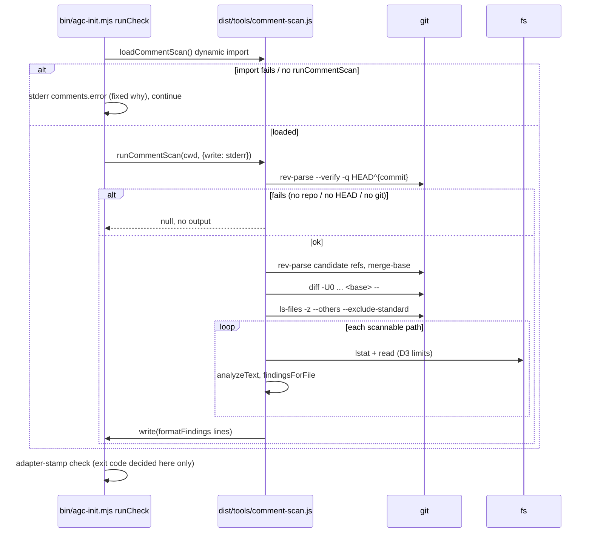

# e258b-comment-scan — architecture

Status: **final.** Agreed with the integrator (stage-2 pre-review, to-lane#2) and human-approved together with the cut (2026-09-30). OQ1 adopted (AC14 smoke + AC14b); trailing-comment workaround withdrawn (see *Self-dogfood rule*).

Scope: D8 (module shape), plus every item `specs/e258b-comment-scan.md` marks "architect may refine": the D2 git argv, rename handling and ref order, and the D4 lexer heuristic with its known misreads. Everything else in the spec is binding and is not restated here. Precedent: `specs/e234-hygiene-scan-architecture.md` / `tools/hygiene-scan.ts`, whose load/check/never-throw shape this module copies.

## Self-dogfood rule (binding on the builder, T-E258B-01..03)
`tools/comment-scan.ts`, the `bin/agc-init.mjs` additions and qa's `test/e258b-comment-scan.test.mjs` are all in this lane's own diff, so the scan reads them.
- **`tools/comment-scan.ts`**: no comment block over 7 counted lines, and a file ratio well under 30% (aim for 15% or less). One short header block (at most 7 lines) that names the ticket and points here. Short WHAT comments where needed. **Rationale lives in this doc, not in code comments.**
- **`bin/agc-init.mjs` is already over the ratio**: about 30.6% (1050 comment-leader lines out of 3427 non-blank lines, a rough grep count; T-E258B-03 re-measures it with the real lexer). Under D6, adding even one standalone comment line there makes the file warn `high-ratio`. Write the wiring comments by the Comment discipline rule: a short head-of-function line, or none. **Trailing comments are never used to carry explanatory prose** — moving comment text onto code lines so D4 does not count it is shaping code to dodge the scanner (integrator objection, to-lane#2). If the scan then warns `high-ratio` on `bin/agc-init.mjs` because the file was already over 30%, that is the designed path: code-reviewer keeps it with a one-line reason in the review report. Also leave the file's 28-line header block alone: editing a line inside it would add a line to a block over 7 lines.
- qa: the same two limits apply to the new `.mjs` test file. Long sample text stays in `test/fixtures/e258b/*.fixture.txt`, as the spec already says.

## Affected Files
- `tools/comment-scan.ts`: **new**. T-E258B-01 writes the pure layer; T-E258B-02 adds the I/O layer and `runCommentScan`. Imports: `fs`, `path`, `node:child_process` only, and no other `tools/` module.
- `dist/tools/comment-scan.js`, `.js.map`, `.d.ts`, `.d.ts.map`: **new build output** (T-E258B-03), committed. `dist/` is outside the scan's own scope (D3). Commit only these four files from `npm run build`. If any other `dist/` file changes, stop and report it; do not commit it (AC16).
- `bin/agc-init.mjs`: **modify** (T-E258B-03). Add `loadCommentScan()` and `checkComments(cwd)` next to `checkHygiene`, and one line in `runCheck()` right after `await checkHygiene(cwd);`. Nothing else in the file changes.
- `docs/install.md`: **modify** (T-E258B-04). Add one paragraph after the hygiene-scan paragraph, inside the existing `agc check` advisory text (around line 154 today).
- `docs/config.md`: **modify** (T-E258B-04). Add one bullet after the "Advisory hygiene scan (not a config key)" bullet (line 48 today).
- `test/e258b-comment-scan.test.mjs`, `test/fixtures/e258b/**`: **new**, owned by qa (T-E258B-05).

## Data Structures
```ts
export const commentLimits: Readonly<{
  maxBlockLines: 7;        // D1: a block warns at > 7 counted lines
  maxRatioPercent: 30;     // D1: a file warns at > 30%
  minRatioLines: 50;       // D6: the ratio check needs >= 50 non-blank lines
  maxListed: 50;           // D7: output cap
  maxContentBytes: 1048576;// D3
  binarySniffBytes: 8192;  // D3
}>;

export type LineKind = "blank" | "code" | "comment";

export interface LexedLine {
  kind: LineKind;
  body: string;            // comment lines only: text after the leader (see Lexer); "" otherwise
  delimiterOnly: boolean;  // trimmed raw line is exactly "/*", "/**" or "*/"
}

export interface CommentBlock { start: number; end: number; counted: number } // 1-based, inclusive

export interface FileAnalysis {
  lines: LexedLine[];      // index i = physical line i + 1
  nonBlank: number;        // code + comment lines
  commentLines: number;
  blocks: CommentBlock[];
}

export type AddedLines = ReadonlySet<number> | "all"; // "all" = untracked file

export type Finding =
  | { kind: "long-block"; path: string; line: number; lines: number }
  | { kind: "high-ratio"; path: string; pct: string; nonBlank: number };

export interface CommentScanOptions { write?: (line: string) => void } // one call per line, no newline; default stderr
```
Naming: camelCase only. `test/error-code-contract.test.mjs` harvests UPPER_SNAKE tokens from `tools/*.ts` (D8).

## Interface Contracts

### Pure layer (deterministic, no I/O; unit-testable from `dist/tools/comment-scan.js`)
- `lexLines(text: string): LexedLine[]`: runs the lexer (below). It splits on `\r?\n`, so the result has one entry per physical line, including a final empty entry after a trailing newline (that entry is blank).
- `analyzeText(text: string): FileAnalysis`: runs `lexLines`, then groups blocks as maximal runs of consecutive `comment` lines, then counts each block (D4 + D5, below).
- `findingsForFile(path: string, a: FileAnalysis, added: AddedLines): Finding[]`: applies the D6 rules.
  - `long-block`: fires when `counted > maxBlockLines` and some line in `[start, end]` is in the added set. `line = start` and `lines = counted`.
  - `high-ratio`: fires when `nonBlank >= minRatioLines`, `commentLines * 100 > maxRatioPercent * nonBlank` (integer comparison, so exactly 30% is silent), and at least one added line has kind `comment`.
  - `"all"` means every line is added.
- `formatPct(comment: number, nonBlank: number): string`: rounds the ratio **up** to one decimal place, using integers: `t = Math.ceil(comment * 1000 / nonBlank)`. It prints `t/10` with no decimal when `t % 10 === 0`, and `floor(t/10) + "." + t%10` otherwise. 31/100 prints `31`, 22/70 prints `31.5`. Rounding up means a firing ratio can never print as `30`.
- `parseAddedLines(patch: string): Map<string, Set<number>>`: the hunk parser (below).
- `unquoteGitPath(s: string): string`: decodes a git C-quoted path. It removes the surrounding `"` and decodes `\\ \" \a \b \t \n \v \f \r`. It collects `\ooo` octal escapes as raw bytes, then decodes the whole path from UTF-8 with `Buffer`. Unquoted input comes back unchanged.
- `isScannablePath(rel: string): boolean`: D3 name rules on a forward-slash relative path. The path must end with `.ts`, `.tsx`, `.js`, `.jsx` or `.mjs` (case-sensitive), must not end with `.d.ts`, and must have no segment equal to `dist` or `node_modules`.
- `formatFindings(f: Finding[]): string[]`: the D7 output assembly.
  - Sort by `path`, using code-unit order (`<`, not `localeCompare`). Within a path, the file-level `high-ratio` hit comes first, then line hits by ascending line.
  - Emit the first `maxListed` hits (`comments.block` / `comments.ratio`). Then `comments.more` with `n = total - 50` when positive. Then `comments.summary` with `n = total` and `m = distinct paths`, when total > 0.
  - Before a path is printed, `displayPath` renders each C0 control character and DEL as `\xNN`.
  - Zero findings return `[]`.
- `commentCopy`: a frozen object holding the five spec Copy strings as template functions, verbatim. It also holds the two fixed `{why}` texts: `"cannot load dist/tools/comment-scan.js — run \`npm run build\`"` (used only by `bin/`; mirrors hygiene) and `"unexpected error"`.

### I/O layer
- `resolveBase(cwd: string): string | null`: returns `null` for "stay silent" (not a repo, no `HEAD`, or git missing).
- `collectAdded(cwd: string, base: string): Map<string, AddedLines>`: diff added lines plus untracked files. Untracked entries get `"all"` and override any diff entry for the same path.
- `readScannable(cwd: string, rel: string): string | null`: returns the file text if the file passes the D3 content rules, and `null` otherwise. The rules: `lstatSync` shows a regular file (not a symlink), `size <= maxContentBytes`, and no `0x00` byte in the first `binarySniffBytes`. The file is read as UTF-8. Missing or unreadable files also return `null`.
- `runCommentScan(cwd: string, opts?: CommentScanOptions): Finding[] | null`: the single entry point that `bin/` calls. Steps:
  1. `base = resolveBase(cwd)`. On `null`, return `null` and write nothing.
  2. `collectAdded`.
  3. For each path that passes `isScannablePath`, run `readScannable`, then `analyzeText`, then `findingsForFile`.
  4. Write each line of `formatFindings` through `write`.

  **It never throws.** Any exception is caught, one `comments.error` line is written with `{why} = "unexpected error"`, and the function returns `null`. The raw error is never printed.

### Git argv (D2 refinement)
Every call goes through `execFileSync("git", argv, { cwd, encoding: "utf8", maxBuffer: 256 MiB, stdio: ["ignore", "pipe", "ignore"], env: { ...process.env, GIT_OPTIONAL_LOCKS: "0" } })`. `GIT_OPTIONAL_LOCKS=0` stops `git diff` from rewriting the index opportunistically. It is passed to the child process only and changes no scan behaviour, so the spec's "no env input" still holds.

1. **Repo and HEAD probe**: `git rev-parse --verify -q HEAD^{commit}`. A non-zero exit or ENOENT (git missing) returns `null`: silent (D2, AC10).
2. **Ref candidates, in order**: `@{upstream}`, `refs/remotes/origin/main`, `refs/remotes/origin/master`, `refs/heads/main`, `refs/heads/master`. Each is tested with `git rev-parse --verify -q <ref>^{commit}`. Fully qualified names avoid ambiguity with a tag named `main`. `@{upstream}` fails on a detached HEAD or a branch with no upstream, and the probe moves on to the next ref.
3. **Merge-base**: for the **first** ref that resolves, run `git merge-base HEAD <sha>`. If that fails (unrelated histories, a shallow clone), the base is `HEAD`. The probe does **not** fall through to the next ref, because D2 says "the first ref that exists". If no ref resolves, the base is `HEAD`.
4. **Diff**: `git -c core.quotePath=false diff -U0 --no-color --no-ext-diff --no-textconv --ignore-submodules=all -M --diff-filter=d --src-prefix=a/ --dst-prefix=b/ --relative <base> --`
   - The explicit prefixes defeat user `diff.noprefix` / `diff.mnemonicPrefix` config. `--no-ext-diff` and `--no-color` defeat `diff.external` and `color.ui=always`.
   - `--diff-filter=d` drops deleted files. `-M` scans only the added lines of a renamed file. A 100%-similar rename produces no hunk, so it is silent.
   - `--relative` limits the scan to `cwd`'s subtree and makes paths relative to `cwd`, the same as `git ls-files` in step 5 and the hygiene scan.
   - Intent-to-add files (`git add -N`) appear here as new files.
5. **Untracked**: `git ls-files -z --others --exclude-standard`, run in `cwd`. Split the output on NUL; paths come back relative to `cwd`.

If step 4 or 5 fails after step 1 succeeded, the error reaches `runCommentScan`'s catch and prints `comments.error` with `unexpected error`.

### Hunk parser (`parseAddedLines`)
This format was checked against git 2.50 output while drafting.
- Line-oriented, with one flag `inHeader`. A line starting with `diff --git ` sets `inHeader = true` and clears the current path. Content lines always begin with `+`, `-`, space or `\`, so this header line cannot be content.
- While `inHeader`, a line starting with `+++ ` sets the path:
  1. Take the rest of the line after `+++ `.
  2. Drop **one trailing `\t`**. Git appends a tab when the name contains a space, including quoted names.
  3. If the result starts with `"`, run `unquoteGitPath` on it.
  4. `/dev/null` means no path. Otherwise strip the leading `b/`.
- A line starting with `@@ ` sets `inHeader = false`. Match it with `^@@ -\d+(?:,\d+)? \+(\d+)(?:,(\d+))? @@`; text may follow the closing `@@` (function context). Let `c` be the first capture and `d` the second (default 1). When `d > 0` and a path is set, add lines `c .. c+d-1`. With `-U0`, every new-side line in a hunk is an added line.
- Outside the header, `+++` and `---` lines are content (for example an added line whose text is `++ x`) and are ignored. Every other line is ignored too.

## Lexer (D4 refinement)
A single pass over the text, one character at a time, with states `code`, `line` (`//`), `block` (`/* */`), `sq`, `dq`, `tpl`, `regex`, `regexClass`, and a stack of `${` brace depths for template nesting. Two flags per physical line: `hasCode` and `hasComment`.

- **Marking.** In `code`, every non-whitespace character sets `hasCode`. So do all characters inside string, template and regex literals: a literal is code. In `line` and `block`, every character, delimiters included, sets `hasComment`. **At the start of each physical line**, a line that begins inside `block` gets `hasComment`, and one that begins inside `tpl` gets `hasCode`. The result is `kind`: comment when `hasComment && !hasCode`; code when `hasCode`; otherwise blank.
- **Shebang.** When the text starts with `#!`, line 1 is code and lexing starts at line 2.
- **Transitions from `code`.** `//` enters `line`, and `/*` enters `block`; both checks run before the regex test. `'` enters `sq`, `"` enters `dq`, and a backtick enters `tpl`. If the template stack is non-empty, `{` increments its top and `}` at depth 0 pops it back to `tpl`. A `/` that starts neither comment enters `regex` when the **previous significant code token** is:
  - nothing (start of file);
  - one of ``( , = : [ ! & | ? { } ; + - * % < > ~ ^``;
  - or the identifier keyword `return typeof instanceof in of new delete void throw case do else yield await`.

  Otherwise the `/` is division. "Significant" means the last non-whitespace character lexed in `code` state, plus the identifier that ends there, if any. A closing quote or backtick counts as a value, so a `/` after it is division.
- **Literals.**
  - `sq` / `dq`: `\` escapes the next character. The matching quote returns to `code`. A newline not preceded by `\` also returns to `code` (unterminated-literal recovery).
  - `tpl`: `\` escapes the next character. A backtick returns to `code`. `${` pushes depth 0 onto the stack and enters `code`.
  - `regex`: `\` escapes the next character, `[` enters `regexClass`, and `/` returns to `code` (the flags lex as identifier characters). A newline returns to `code` (recovery).
  - `regexClass`: `\` escapes the next character, and `]` returns to `regex`.
- **Comments.** `line` ends at the newline. `block` ends after `*/`.
- **`body`** (comment lines only): trim the raw line, then remove one leading run of `^//+`, or `^/\*+`, or `^\*+(?!/)`, then trim the start again. A line ` * @param x` gives `@param x`.
- **Block counting (D4 + D5).** Walk the block's lines with a flag `excluding = false`. For each line:
  1. If `body` matches `^@([A-Za-z]+)`, set `excluding` to whether the tag is one of `param`, `returns`, `return`, `throws`, `example`.
  2. The line counts when it is not `delimiterOnly` and `excluding` is false.

  A later line that starts with any `@` tag ends the exclusion, so a following `@see` line counts again. The rule applies to `//` blocks too. The file ratio counts every comment line, and ignores both `delimiterOnly` and the D5 exclusion.

### Known misreads (for reviewers and the docs)
1. **JSX text.** A JSX text line whose only content is `// …` or `/* … */` counts as a comment line. JSX text containing `'` or `"` opens a string that recovers at the end of the line. The line is already code, so there is no effect beyond that line.
2. **Regex after `)`.** A regex after `)` (`if (ok) /re/.test(s)`) lexes as division. If that regex holds a backtick, it opens a template that can run over later lines and hide comment lines there: a false negative, and the only multi-line one.
3. **Division read as regex.** Division after `}` or after postfix `++`/`--` lexes as a regex. It recovers at the end of the line; the line is already code, so this is harmless.
4. **`@example` bodies.** An `@example` body line that begins with `@` (a decorator) ends the exclusion early, so the lines after it are counted: a conservative false positive.
5. **Blank lines inside comments.** A whitespace-only line inside `/* */` counts as a comment line, for both block length and the ratio (see Decision Records).
6. **Blank lines inside templates.** A whitespace-only line inside a multi-line template literal counts as a non-blank code line, which lowers a file's ratio slightly.
7. **Other syntax.** No other syntax is recognized: HTML comments inside JSX, `#` private names (lexed as ordinary code characters, which is correct), and Flow or other dialects.

## Sequence Diagram


## `bin/agc-init.mjs` wiring (T-E258B-03)
```js
async function loadCommentScan() {
  try {
    return await import(new URL("../dist/tools/comment-scan.js", import.meta.url).href);
  } catch {
    return null;
  }
}

async function checkComments(cwd) {
  const skipped = (why) => process.stderr.write(`agc check — comments: scan skipped (${why})\n`);
  const mod = await loadCommentScan();
  if (mod === null || typeof mod.runCommentScan !== "function") {
    skipped("cannot load dist/tools/comment-scan.js — run `npm run build`");
    return;
  }
  try {
    mod.runCommentScan(cwd, { write: (l) => process.stderr.write(`${l}\n`) });
  } catch {
    skipped("unexpected error");
  }
}
```
In `runCheck()`, the new line goes right after `await checkHygiene(cwd); // advisory; never affects exit code`:
`await checkComments(cwd);`.
Place the two functions directly after `checkHygiene`. The builder may add at most a one-line head-of-function comment to each; no trailing prose comments (see *Self-dogfood rule*).

## Per-task file lists
| task | files | notes |
|---|---|---|
| T-E258B-01 | `tools/comment-scan.ts` (pure layer: `commentLimits`, types, `lexLines`, `analyzeText`, `findingsForFile`, `formatPct`, `parseAddedLines`, `unquoteGitPath`, `isScannablePath`, `formatFindings`, `commentCopy`) | No `fs` or `child_process` calls in these functions. `npx tsc --noEmit` is green. |
| T-E258B-02 | `tools/comment-scan.ts` (I/O layer: `resolveBase`, `collectAdded`, `readScannable`, `runCommentScan`) | Git argv exactly as specified; never throws. |
| T-E258B-03 | `bin/agc-init.mjs`; `dist/tools/comment-scan.{js,js.map,d.ts,d.ts.map}` | `npm run build`; commit only these `dist` files. Re-measure the ratio of `bin/agc-init.mjs`. Run `node bin/agc-init.mjs check` in the worktree after committing and quote its actual output in the T-E258B-03 handoff: list every `agc check — comments` line, or state there were none (integrator condition, to-lane#2). A `high-ratio` warning on `bin/agc-init.mjs` is acceptable and goes to code-reviewer for a keep-with-reason. |
| T-E258B-04 | `docs/install.md` (one paragraph after the hygiene paragraph); `docs/config.md` (one bullet after the hygiene bullet) | Cover the AC15 items. Also mention the known-misread classes in one sentence: "a heuristic lexer, not a parser". `docs/` `.md` files are outside the scan. |
| T-E258B-05 | `test/e258b-comment-scan.test.mjs`, `test/fixtures/e258b/**`; the two AC13 helper files only if needed | Owned by qa. The pure layer can also be unit-tested directly from `dist/`. |

## Decision Records
| Context | Decision | Consequences |
|---|---|---|
| Where the logic lives (D8) | A TypeScript module under `tools/`, loaded from `dist/` by a dynamic import that returns null on failure. `bin/` holds only the load/check shim. | Same as the hygiene precedent. The pure layer can be unit-tested. A missing build shows as `comments.error`, not a crash. |
| Ref names | Fully qualified (`refs/remotes/origin/main`, `refs/heads/main`); `@{upstream}` first | A tag or file named `main` cannot shadow the branch. The observable D2 order is unchanged. |
| Merge-base failure on the first existing ref | Fall back to `HEAD`; do not try the next ref | Follows the D2 wording literally. With unrelated histories, only uncommitted and untracked work is scanned. |
| Git missing (ENOENT) | Silent, the same as "not a git repo" | No `comments.error` line in environments without git. The alternative (an error line) would make every git-less CI print noise. |
| Path parsing | Parse the `+++` header of one patch call (trailing tab, C-quote, `b/` prefix), not a per-file `--name-only` loop | One git process for the diff; relies on the header rules documented above. |
| Scope under a subdirectory `cwd` | `--relative` plus `ls-files` in `cwd` | Only `cwd`'s subtree is scanned, the same as the hygiene scan. `agc check` normally runs at the root. |
| Blank lines inside `/* */` | Counted as comment lines (block length and ratio) | One span stays one block (D4). Slightly conservative. |
| `{pct}` format | Round up to one decimal place; drop `.0` | A firing ratio never prints as `30`. AC4's 31% case prints `31`. |
| Extension match | Case-sensitive | `.TS` files are not scanned; this matches the D3 list literally. |
| Comments in the `bin/agc-init.mjs` wiring | By the rule: at most a one-line head-of-function comment, no trailing prose comments | May trip `high-ratio` on a file already at about 30.6%; code-reviewer keeps it with a reason (integrator, to-lane#2). |

## Deferred Resources
_None. The spec's Dependencies / Prerequisites lists no ignored or deferred external reference; all of its references are in-repo specs._

## Open Questions
None open. Resolved:
1. **(RESOLVED — adopted by integrator to-lane#2; human-approved with the cut, spec AC14 note + AC14b + lane-diff evidence) AC14 cannot fail as worded.** Under D2, a fresh temp repo holding HEAD's tree as its only commit has base = HEAD (through `refs/heads/main`/`master` or the fallback). The diff is empty and the scan is silent **whatever the content**. Running it the other way, treating the whole tree as added, would fail on existing debt: `bin/agc-init.mjs` alone has a 28-line header block and a ratio of about 30.6%. Recommendation: (a) keep AC14's current proof as a smoke test (no crash, no output on committed state), and (b) add **AC14b**: a hermetic unit check that runs `analyzeText` from `dist/tools/comment-scan.js` on `tools/comment-scan.ts` and asserts no block over 7 counted lines and a ratio of 30% or less. This check does not depend on git history and stays meaningful after merge. The lane-diff dogfood (every file this lane adds, including `bin/` and the test file) is covered as task evidence: T-E258B-03 runs a live `node bin/agc-init.mjs check` in the worktree, and code-reviewer re-runs it. It is not a resident test, because after merge the base equals HEAD and such a test would test nothing.
