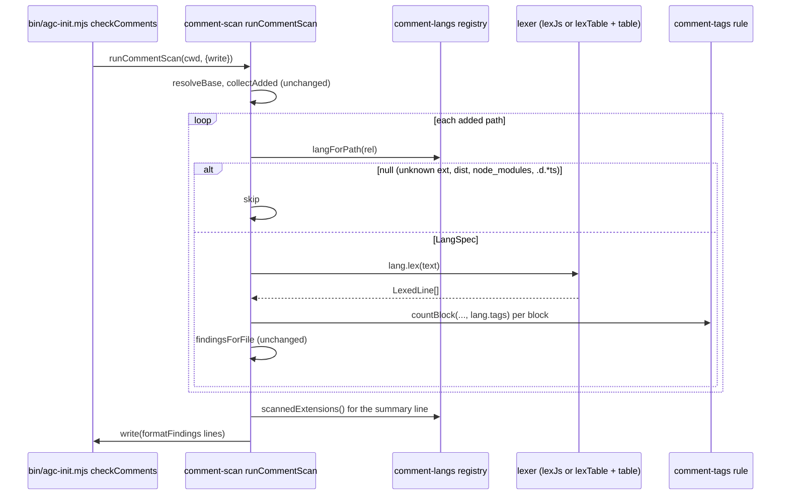

# e259-comment-scan-languages — architecture

Status: **draft for integrator stage-2 pre-review.** Extends `specs/e258b-comment-scan-architecture.md`: everything there that this doc does not change still binds (git argv, hunk parser, I/O layer, never-throw, output assembly, self-dogfood rule). The spec `specs/e259-comment-scan-languages.md` (D1–D9, AC1–AC29) is binding and is not restated here; this doc fixes the table shape, the lexer rules for each string form, the module split, and the task-to-file map.

## Self-dogfood rule (binding on every sr task)
Every `tools/comment-*.ts` file is in this lane's diff, and AC28 runs the analysis on each one.
- One header block of at most 5 lines per file (`// Coded by @sr-engineer`, one WHAT line, one pointer to this doc). Aim for a file ratio of 15% or less.
- No comments inside function bodies except a one-line warning at the head of a function. Rationale lives here, not in code.
- Tables are data: no per-entry comments. If an entry needs explaining, the explanation goes in this doc's *String forms* section.
- A table regex is written as a literal after `re:` (a `:` puts the JS lexer in regex mode, so `"` `#` `//` inside it are safe). Never put a backtick in a regex literal (E258 misread 2).
- Before handing off, each sr task runs `analyzeText` from `dist/tools/comment-scan.js` on every `tools/comment-*.ts` it touched and quotes the result (max block, ratio) in its handoff note.

## Affected Files
| file | status | task(s) | contents |
|---|---|---|---|
| `tools/comment-types.ts` | new | 01 (04 adds one field) | shared types only: `LineKind`, `LexedLine`, `TagRule`, `LangId`, `LangSpec` |
| `tools/comment-lang-js.ts` | new | 01 | the E258 JS lexer, **moved verbatim** out of `comment-scan.ts` (`lexJs`), plus `jsTags` |
| `tools/comment-langs.ts` | new | 01, 02, 03, 04, 05 | the registry: `langRegistry`, `jsLang`, `langForPath`, `scannedExtensions` |
| `tools/comment-scan.ts` | modify | 01, 05 | engine + I/O as today; lexing delegated to the registry; `countBlock` takes a `TagRule`; summary list from the registry |
| `tools/comment-lex.ts` | new | 02, 03, 04 | the shared table-driven lexer `lexTable` and its table types (`LexTable`, `StringForm`, `Closer`, `DocstringTracker`) |
| `tools/comment-lang-c.ts` | new | 02, 03 | tables `cTable` (c-like), `javaTable`, `goTable` (02), `csharpTable` (03) |
| `tools/comment-lang-nested.ts` | new | 03 | tables `rustTable`, `kotlinTable`, `swiftTable` |
| `tools/comment-lang-hash.ts` | new | 04 | tables `pythonTable`, `shellTable`, `rubyTable` |
| `tools/comment-python.ts` | new | 04 | `pythonDocstrings()`: the docstring-position tracker (D5) |
| `tools/comment-tags.ts` | new | 05 | the D6 tag rules for every non-JS language |
| `dist/tools/comment-*.{js,js.map,d.ts,d.ts.map}` | build output | each sr task | commit only `dist/tools/comment-*` files; any other `dist/` change → stop and report (E258B AC16 rule) |
| `docs/install.md`, `docs/config.md` | modify | 06 | the scan paragraph / row only (AC27) |
| `test/e259-*.test.mjs`, `test/fixtures/e259/**`, two assertions in `test/e258b-comment-scan.test.mjs` | qa-owned | 07, 08, 09 | see *Per-task file lists* |

Not touched: `bin/agc-init.mjs` (`checkComments` only calls `runCommentScan`), every other `tools/` module, `content/**`.

Import graph (acyclic, checked by T-01's build): `comment-types` ← `comment-lang-js`, `comment-lex` ← `comment-lang-{c,nested,hash}`, `comment-python` ← `comment-lang-hash`; `comment-tags` ← (types only); `comment-langs` imports all tables, `comment-lex`, `comment-lang-js`, `comment-tags`; `comment-scan` imports `comment-langs` and `comment-types`. No module imports `comment-scan`.

Naming: camelCase and PascalCase only. No UPPER_SNAKE identifier or string anywhere in `tools/comment-*.ts` (`test/error-code-contract.test.mjs` harvests `\b[A-Z][A-Z0-9]*(?:_[A-Z0-9]+)*\b` from `tools/*.ts`).

## Data Structures

### `tools/comment-types.ts`
```ts
export type LineKind = "blank" | "code" | "comment";

export interface LexedLine {
  kind: LineKind;
  body: string;            // comment lines only; "" otherwise (per-origin rule below)
  delimiterOnly: boolean;  // excluded from block length, never from the ratio
  docstring?: true;        // set only by the Python table, on docstring comment lines
}

// true = this line starts an excluded tag; false = it starts a non-excluded tag
// (ends an exclusion); null = neither (keeps the current state).
export type TagRule = (line: LexedLine) => boolean | null;

export type LangId =
  | "js" | "c" | "java" | "csharp" | "go" | "kotlin" | "swift" | "rust"
  | "python" | "shell" | "ruby";

export interface LangSpec {
  readonly id: LangId;
  readonly exts: readonly string[];   // with the dot, e.g. ".rs"
  readonly lex: (text: string) => LexedLine[];
  readonly tags: TagRule;
}
```
`docstring` is optional and never set for JS, so `lexLines(text)` output is deep-equal to E258's.

### `tools/comment-lex.ts`
```ts
export interface Interp { open: string; openCh: string; closeCh: string } // "${" "{" "}"; "\\(" "(" ")"; "#{" "{" "}"

export interface Closer {
  end: string;                                  // exact closing text
  escape: "backslash" | "doubled" | "none";
  multiline: boolean;                           // false: an unescaped newline ends the string (recovery)
  interp?: Interp;
  docCandidate?: boolean;                       // Python only: triple-quoted, prefix "" / r / R / u / U
}

export interface StringForm {
  first: string;              // chars that can begin the opener (cheap pre-filter)
  re: RegExp;                 // sticky (`y`); matched at the opener position
  wordStart?: boolean;        // opener only when the previous char is not [A-Za-z0-9_]
  close?: (m: RegExpExecArray) => Closer; // absent: the match itself is a complete literal
}

export interface DocstringTracker {
  code(s: string, i: number): void;              // each non-whitespace code char
  string(docCandidate: boolean): boolean;        // at every string opener; true = docstring
  lineEnd(continued: boolean): void;             // newline reached in code state
}

export interface LexTable {
  line: "//" | "#";
  block?: { nested: boolean };                   // "/* */"
  hashWordStart?: boolean;                       // shell
  beginEnd?: boolean;                            // ruby
  shebang?: boolean;                             // # languages
  strings: readonly StringForm[];                // tried in order; first match wins
  docstrings?: () => DocstringTracker;           // python; fresh tracker per file
}
```
Tables are frozen object literals (`Object.freeze`), camelCase names ending in `Table`.

## Interface Contracts

### `tools/comment-scan.ts` (public surface kept; two signatures widened)
- `lexLines(text: string): LexedLine[]` — unchanged meaning: the JS lexer. Implemented as `export { lexJs as lexLines } from "./comment-lang-js.js"`.
- `analyzeText(text: string, lang: LangSpec = jsLang): FileAnalysis` — `lang.lex(text)`, then block grouping as today, then `countBlock(lines, i, j, lang.tags)`. With the default argument this is the E258 function.
- `isScannablePath(rel: string): boolean` — `langForPath(rel) !== null`.
- `commentCopy.summary(n, m)` — text unchanged except `{exts}` = `scannedExtensions().join("/")`.
- `runCommentScan` — per path: `const lang = langForPath(rel); if (lang === null) continue;` then `analyzeText(text, lang)`. Nothing else in the I/O layer changes.
- `LineKind`, `LexedLine` stay importable from `comment-scan` (`export type { … } from "./comment-types.js"`); `CommentBlock`, `FileAnalysis`, `Finding`, `AddedLines`, `CommentScanOptions`, `commentLimits` stay where they are.
- Private `countBlock(lines, start, end, rule: TagRule)`: `excluding = false`; per line `t = rule(line)`; if `t !== null` then `excluding = t`; the line counts when `!delimiterOnly && !excluding`. With `jsTags` this is E258's loop.

### `tools/comment-langs.ts`
- `jsLang: LangSpec` — `{ id: "js", exts: [".ts",".tsx",".js",".jsx",".mjs",".cjs",".mts",".cts"], lex: lexJs, tags: jsTags }`.
- `langRegistry: readonly LangSpec[]` — one entry per D2 family, in D2 order. Non-JS entries are `{ id, exts, lex: (t) => lexTable(t, xTable), tags }`. `.h` is in `c`.
- `langForPath(rel: string): LangSpec | null` — null when any `/`-segment is `dist` or `node_modules`; null when the basename ends with `.d.ts`, `.d.mts` or `.d.cts`; otherwise the extension is the basename's last `.`-suffix (`/\.[^./]+$/`, case-sensitive) and the result is the entry whose `exts` holds it, else null. `Makefile` → null, `A.PY` → null, `.bashrc` → null.
- `scannedExtensions(): string[]` — `langRegistry.flatMap((l) => l.exts)` sorted with the default `sort()` (code-unit order). Equals the D8 list.
- Until a task lands a family, its registry entry does not exist (T-01 registers only `jsLang`; T-02 adds `c`, `java`, `go`; T-03 `csharp`, `kotlin`, `swift`, `rust`; T-04 `python`, `shell`, `ruby`). Entries before T-05 use `tags: noTags` (`() => null`).

### `tools/comment-lang-js.ts`
- `lexJs(text: string): LexedLine[]` — the body of E258's `lexLines`, with its helpers (`regexAfterPunct`, `regexAfterWord`, `delimiterLines`, `isIdentChar`, `commentBody`), **copied without any edit**. The reviewer checks it with `git diff -M --color-moved=dimmed-zebra` against `tools/comment-scan.ts`.
- `jsTags: TagRule` — `(l) => { const m = /^@([A-Za-z]+)/.exec(l.body); return m ? jsExcluded.has(m[1]) : null; }` with `jsExcluded = {param, returns, return, throws, example}`. Same behaviour as E258's inline loop.

### `tools/comment-lex.ts`
- `lexTable(text: string, t: LexTable): LexedLine[]` — the shared lexer (below). Pure, total (never throws on any input), one pass, O(length × forms).
- `slashBody(raw)`, `hashBody(raw)`, `docBody(raw)` — the per-origin `body` rules (below), exported for the tables' tests.

### `tools/comment-python.ts`
- `pythonDocstrings(): DocstringTracker` — the D5 tracker (below).

### `tools/comment-tags.ts`
- `atTags: TagRule` (java, kotlin, go, rust, ruby), `cTags` (c-like), `csharpTags`, `swiftTags`, `pythonTags`, `noTags` (shell). Rules below.

## Shared lexer (`lexTable`)
State: `mode` ∈ `code | line | block | str | beginEnd`; `depth` (block nesting); `closer` + `asComment` (active string, and whether it is a docstring); a stack `frames` of `{ closer, asComment, depth }` for interpolation holes; the tracker, if the table has one. Per physical line: `hasCode`, `hasComment`, `origin` (`slash | hash | beginEnd | doc`, the first comment origin seen on the line), `delim` (engine-set delimiter flag). Lines split on `\r?\n`, as in E258.

**Line start.** Line 1 with `t.shebang` and text starting `#!` → code, skip the line. In `beginEnd`: the line is comment; if it matches `/^=end(?:\s|$)/`, it is a delimiter line and mode returns to `code`; skip the line. In `code` with `t.beginEnd` and `/^=begin(?:\s|$)/` → comment, delimiter, mode `beginEnd`, skip. Otherwise a line beginning in `block` (or in `str` with `asComment`) is marked comment with the carried origin; a line beginning in `str` is marked code.

**Per character, by mode:**
- `line`: mark comment, stop the line.
- `block`: mark comment. `*/` → `depth--`, consume 2; at 0 → `code`. Else when `t.block.nested` and `/*` → `depth++`, consume 2.
- `str`: mark comment if `asComment`, else code. In this order: (1) `closer.interp` and the text at `i` starts with `interp.open` → push a frame, mode `code`, consume the opener; (2) `escape: "backslash"` and `\` → skip the next char (a `\` that is the line's last char sets `escapedNewline`); (3) the text at `i` starts with `closer.end` → with `escape: "doubled"` and a second `"` at `i+1`, consume both and stay; else consume `end`, mode `code`.
- `code`:
  1. Whitespace → next char.
  2. `t.line === "//"` and `//` → origin `slash`, mode `line`. `t.block` and `/*` → origin `slash`, mode `block`, `depth = 1`, consume 2. `t.line === "#"` and `#` and (not `hashWordStart`, or `i === 0`, or the previous char is one of space, tab, `; & | ( ) < >`) → origin `hash`, mode `line`.
  3. If `frames` is non-empty: the top frame's `interp.openCh` → `depth++`; its `closeCh` at depth 0 → pop, restore `closer`/`asComment`, mode `str`, consume, mark code, next char; at depth > 0 → `depth--`.
  4. String forms, in table order: skip a form whose `first` lacks the char, or whose `wordStart` is set and the previous char is `[A-Za-z0-9_]`. Set `re.lastIndex = i`; on a match: with no `close`, mark code and consume the match; with `close`, `closer = close(m)`, `asComment = tracker ? tracker.string(closer.docCandidate === true) : false`, mark the char comment (origin `doc`) if `asComment` else code, mode `str`, consume the match.
  5. Otherwise mark code and call `tracker?.code(s, i)`.

**Line end.** `line` → `code`. `str` with `!closer.multiline && !escapedNewline` → `code` (recovery; frames are kept, as E258 keeps `tplDepth`). In `code`, `tracker?.lineEnd(lastCodeCharWasBackslash)`. Multi-line strings, block comments, docstrings and `=begin` run to end of file when unterminated (AC26); the loop is linear, so it cannot hang.

**Result.** `kind` = code if `hasCode`, else comment if `hasComment`, else blank (E258's rule). `body` (comment lines only), by origin:
- `slash`: E258's `commentBody` — trim, drop one leading `//+`, `/*+` or `*+(?!/)`, trimStart. (`///` and `//!` lose their slashes; `//!` keeps the `!`.)
- `hash`: trim, drop leading `#+`, trimStart.
- `beginEnd`: trim.
- `doc`: trim, drop a leading `[rRuU]?(?:"""|''')`, trimStart.

`delimiterOnly` = the engine's `delim` flag, or the trimmed raw line is one of `/*`, `/**`, `*/` (slash tables), or it matches `/^[rRuU]?(?:"""|''')$/` (Python). `docstring: true` on comment lines whose origin is `doc`.

## String forms per table (D3)
All regexes are sticky. `dq(multi)` = `{ first: '"', re: /"/y, close: { end: '"', escape: "backslash", multiline: multi } }`. `charLit` = complete-match `/'(?:\\.|[^\\'\n])*'/y` — a `'` with no closing `'` on the line is a plain code char, which also keeps C++ digit separators (`1'000`) harmless in most lines.

| table | forms, in order |
|---|---|
| `cTable` (c-like; `.h` included) | raw `/(?:u8\|u\|U\|L)?R"([^\s()\\]{0,16})\(/y` wordStart → `end: ")" + m[1] + '"'`, escape none, multiline; `dq(false)`; `charLit`. Block not nested. |
| `javaTable` | text block `/"""/y` → `end: '"""'`, backslash, multiline; `dq(false)`; `charLit`. |
| `goTable` | raw `` /`/y `` → `` end: "`" ``, none, multiline; `dq(false)`; `charLit`. |
| `csharpTable` | raw `/\$*("{3,})/y` → `end: m[1]` (same quote count), none, multiline; verbatim `/(?:\$@\|@\$?)"/y` → `end: '"'`, **doubled**, multiline; interpolated `/\$+"/y` → `dq(false)` closer; `dq(false)`; `charLit`. `///` is an ordinary `//` line. Not nested. |
| `rustTable` | raw `/(?:b\|c)?r(#*)"/y` wordStart → `end: '"' + m[1]`, none, multiline; `dq(true)` (Rust strings span lines; `b"`/`c"` fall through here because the prefix is a code char); char `/'(?:\\(?:u\{[0-9A-Fa-f_]{1,6}\}\|x[0-9A-Fa-f]{2}\|.)\|[^\\'\n])'/yu` complete-match — exactly one char, so `'a` (lifetime, label) is a plain code char. Nested. |
| `kotlinTable` | raw `/"""/y` → `end: '"""'`, none, multiline, interp `${`; `dq(false)` + interp `${`; `charLit`. Nested. |
| `swiftTable` | extended `/(#+)("""\|")/y` wordStart → `end: m[2] + m[1]`, none, multiline iff `m[2] === '"""'`; `/"""/y` → backslash, multiline, interp `\(`; `dq(false)` + interp `\(`. No char literal. Nested. |
| `pythonTable` | prefixed `/[rRbBuUfF]{1,2}("""\|'''\|"\|')/y` wordStart; unprefixed `/("""\|'''\|"\|')/y`. Closer: `end: m[1]`, backslash (a raw string still cannot end at `\"`), multiline iff triple, `docCandidate` iff triple and the prefix is empty or one of `r R u U`. `line: "#"`, shebang, tracker `pythonDocstrings`. No interp (f-strings: D7). |
| `shellTable` | ANSI-C `/\$'/y` → `end: "'"`, backslash, multiline; `/'/y` → `end: "'"`, none, multiline; `dq(true)`. `line: "#"`, `hashWordStart`, shebang. |
| `rubyTable` | special globals `/\$['"]/y` complete-match (`$'`, `$"` are variables, not strings); `/"/y` and `` /`/y `` → backslash, multiline, interp `#{`; `/'/y` → backslash, multiline. `line: "#"`, `beginEnd`, shebang. |

Interp values: `${` = `{ open: "${", openCh: "{", closeCh: "}" }`; `\(` = `{ open: "\\(", openCh: "(", closeCh: ")" }`; `#{` = `{ open: "#{", openCh: "{", closeCh: "}" }`. The frame stack gives any nesting depth when brackets balance; D7 only promises one level.

## Python docstrings (`pythonDocstrings`, D5)
Tracker state: `bracket` (depth of `( [ {`), `atStart` (at the start of a statement; initially true), `expectDoc` (initially true: module position), `inHeader`.
- `code(s, i)`: if `atStart` and `/(?:async\s+)?(?:def|class)\b/y` matches at `i` → `inHeader = true`. Then `atStart = false`, `expectDoc = false`. `( [ {` → `bracket++`; `) ] }` → `bracket--` (floor 0). At `bracket === 0`: `:` with `inHeader` → `inHeader = false`, `expectDoc = true`, `atStart = true`; `;` → `atStart = true`.
- `string(docCandidate)`: `doc = atStart && expectDoc && docCandidate`; then `atStart = false`, `expectDoc = false`; return `doc`.
- `lineEnd(continued)`: if `!continued && bracket === 0` → `atStart = true`.

Comments, blank lines and the shebang never reach the tracker, so they do not clear module position. `if ok:` does not set `expectDoc` (AC16). A multi-line signature keeps `bracket > 0` until its `)`, so the header ends at the right `:`. `def f(): """x"""` on one line is a docstring on a code line, so the line stays code. Blank lines inside a docstring are comment lines and count toward block length, like blank lines inside `/* */` in E258 (see Decision Records).

## Doc-tag rules (`tools/comment-tags.ts`, D6)
Every rule reads `line.body` (already stripped of its leader). Block length only; the ratio counts every comment line.
- `atTags` (java, kotlin, go, rust, ruby): `/^@([A-Za-z]+)/` → member of `{param, returns, return, throws, exception, example}`; no match → null.
- `cTags`: `/^[@\\]([A-Za-z]+)/` with the same set (`\param[in]` captures `param`).
- `csharpTags`: first non-null of `atTags` and the XML rule: `/^<(?:param|typeparam|returns|exception|example)\b/` → true; `/^<[A-Za-z]/` → false; else null (so `</param>` and prose continue the current state).
- `swiftTags`: `/^[-*+]\s+([A-Za-z]+)\b/`, keyword lowercased: in `{parameter, parameters, returns, throws}` → true; in Swift's callout set `{attention, author, authors, bug, complexity, copyright, date, experiment, important, invariant, localizationkey, mutatingvariant, nonmutatingvariant, note, postcondition, precondition, remark, remarks, requires, seealso, since, tag, todo, version, warning}` → false; else null (so `- name:` bullets under `- Parameters:` stay excluded).
- `pythonTags`: a line without `docstring` → false (end of docstring). On docstring lines: `/^(?:Args|Arguments|Returns|Return|Raises|Yields|Example|Examples):\s*$/` or `/^:(?:param|type|returns|return|rtype|raises|raise|yields)\b/` → true; `/^[A-Z][A-Za-z ]*:\s*$/` (another section header, e.g. `Note:`, `See Also:`) or `/^:[a-z]+/` (another Sphinx field) → false; else null.
- `noTags` (shell, and every entry before T-05): always null. Rust `# Errors` / Go prose need no rule: `atTags` never matches them (AC24).

## Known misreads (D7; the docs name them in one sentence)
1. Shell and Ruby heredoc bodies are lexed as code: a `'` or `"` in the body opens a string that can run to the next matching quote.
2. Ruby `%q{}` / `%w[]` / `/regex/` literals, `?#` / `?'` char literals, and everything after `__END__` are lexed as code.
3. C/C++ backslash-newline continuation of a `//` comment: the next line is lexed on its own.
4. C++ digit separators (`1'000'0`) can pair into a char literal; harmless unless the pair spans a `//`.
5. Python f-string holes that reuse the outer quote (PEP 701) and Kotlin/Swift/Ruby/C# interpolation nested past one level; C# `$"…"` holes are not tracked at all (a `"` inside a hole ends the string; it recovers at the line end).
6. Kotlin `"""a""""` (quotes before the closing run) closes on the first `"""`; the stray `"` recovers at the line end.
7. Swift regex literals (`/…/`, `#/…/#`) are code characters; a `//` or `"` inside one is misread.
8. Swift keywords outside the listed set, a parameter named like a callout (`- note:` under `- Parameters:`), NumPy docstring sections, rustdoc sections and Kotlin `@property` / `@constructor` are not tag-excluded (D6 known gaps).
9. Blank lines inside a docstring or `=begin` span count toward block length (same as `/* */`, E258 misread 5).
Every misread affects at most one region, and `lexTable` is total, so none can crash, hang or produce a non-advisory result.

## JS path stays behaviour-identical (how it is proven)
1. `lexJs` is a verbatim move; code-reviewer confirms with `--color-moved` that no line inside it changed.
2. `analyzeText(text)` with no second argument uses `jsLang`, whose `lex` is `lexJs` and whose `tags` is `jsTags` (same predicate as E258's inline loop).
3. The E258 suite passes with only the two reassigned assertions edited (AC3).
4. qa's differential check (T-07): lex the E258 fixtures and a new JS corpus fixture with the base-commit module (`git show <base>:dist/tools/comment-scan.js`, run once while authoring, not resident) and freeze the per-line `kind`/`delimiterOnly`/block `counted` as `test/fixtures/e259/js-baseline.fixture.txt`; the resident test asserts the current `analyzeText` under `.ts`, `.cjs`, `.mts` and `.cts` reproduces it.

## Sequence Diagram


## Per-task file lists
`task_size` = ≤ 5 authored files / ≤ 300 changed lines per task; `dist/` build output is regenerated, not authored, and is not counted (as in E258B T-03).

| task | files (authored) | est. lines | done when |
|---|---|---|---|
| T-E259-01 | `comment-types.ts` (new), `comment-lang-js.ts` (new, moved code), `comment-langs.ts` (new, `jsLang` only), `comment-scan.ts` (modify) | ~260 incl. the ~115-line move | E258 suite green except the AC8 lists and AC11 summary line (qa edits those in T-07); `isScannablePath` true for `.cjs .mts .cts`, false for `.d.mts .d.cts`; summary lists the 8 JS extensions |
| T-E259-02 | `comment-lex.ts` (new: modes `code line block str`, string forms, backslash/none escapes, complete-match forms; the `nested`, `doubled` and `interp` type fields exist but are ignored until T-03), `comment-lang-c.ts` (new: `cTable`, `javaTable`, `goTable`), `comment-langs.ts` | ~260 | AC5 (`//`, c-like/java/go), AC6 (`.java`, `.go`), AC9 (non-nested), AC12, AC15 hand-checked |
| T-E259-03 | `comment-lex.ts` (nested depth, `doubled` escape, interp frames), `comment-lang-c.ts` (+`csharpTable`), `comment-lang-nested.ts` (new), `comment-langs.ts` | ~200 | AC5/AC6 for `.cs .kt .kts .swift .rs`, AC7, AC8, AC9 (nested, and `.cs` first-close), AC10, AC11, AC13, AC14 hand-checked |
| T-E259-04 | `comment-lex.ts` (`#` line comments, `hashWordStart`, `beginEnd`, shebang, tracker calls, `doc` origin, `docstring` flag), `comment-types.ts` (+`docstring?`), `comment-lang-hash.ts` (new), `comment-python.ts` (new), `comment-langs.ts` | ~280 | AC5 (`#`), AC16–AC20 hand-checked |
| T-E259-05 | `comment-tags.ts` (new), `comment-langs.ts` (attach rules) | ~120 | AC21–AC24 hand-checked |
| T-E259-06 | `docs/install.md`, `docs/config.md` | ~20 | AC27 items; misreads 1–9 in one sentence |
| T-E259-07 (qa) | `test/e259-comment-scan-brace.test.mjs`, `test/fixtures/e259/**` (brace-language and JS fixtures, `js-baseline.fixture.txt`), `test/e258b-comment-scan.test.mjs` (AC8 lists, AC11 summary only) | — | AC1–AC4, AC5 (`//`), AC6–AC15, AC25 |
| T-E259-08 (qa) | `test/e259-comment-scan-hash.test.mjs`, `test/fixtures/e259/**` (`#`-language and tag fixtures) | — | AC5 (`#`), AC16–AC24, AC26 |
| T-E259-09 (qa) | `test/e259-comment-scan-limits.test.mjs` | — | AC27 check, AC28, AC29, lane-diff `agc check` output quoted |

Test file names are a suggestion; qa owns them. The `.mjs` test files are in the diff too, so the self-dogfood limits apply to them.

## Decision Records
| Context | Decision | Consequences |
|---|---|---|
| One engine vs per-language lexers | JS keeps its bespoke lexer (moved verbatim); every other family is a data table over one shared `lexTable` | JS behaviour identity is structural, not re-verified by re-implementation. Two lexers exist; JS regex/template handling is not reused by the table engine (no other D2 language needs regex literals). |
| How string forms are expressed | Sticky regex opener + `Closer` built from the match (`end`, escape kind, multiline, interp) | Counted raw strings (`r##"`, C# `""""`, Swift `##"`) and delimiter-carrying ones (C++ `R"x(`) are one regex each; no per-language code paths in the engine. |
| Char literals vs Rust lifetimes | Char literals are complete-match forms (whole literal on one line, else `'` is a plain code char); Rust's form matches exactly one char | Lifetimes and labels can never open a string (AC8); C++ digit separators are mostly harmless. |
| Python docstring detection | A small tracker fed by the engine (code chars, string openers, line ends), not a second pass | One pass per file; the header ends at `:` at bracket depth 0 (multi-line signatures work). The tracker is Python-only and ~60 lines. |
| Blank lines inside docstrings and `=begin` | Comment lines, counted toward block length | Same rule as `/* */` in E258 (misread 5); a docstring stays one block. qa fixtures for AC17/AC23 count blank lines. |
| AC20 count | Ruby `=begin`/`=end` lines are delimiter lines; the reported count is the body lines | "a span of 9 lines … count excludes the two delimiter lines" reads as 9 body lines between the delimiters (11 physical lines) reported as `long-block 9 lines`; 9 physical lines would count 7 and stay silent. qa fixture uses the former. |
| `.c` and `.h` share the C++ table | One `cTable` for all six c-like extensions | A C file with a macro named `R` followed by a string would misread; not worth a second table. |
| Tag rules as `TagRule` returning `true / false / null` | One generic `countBlock`; D6's "ends at the next tag line" is the `false` return | JS rule is a one-line port of E258's loop. Python "end of docstring" is `false` on a non-docstring line. |
| Summary list | `scannedExtensions()` from the registry, default `sort()` | D8 cannot drift from the scanned set; AC2 asserts both ways. |
| Module split | 9 small `tools/comment-*.ts` files, split along task lines | Each task stays under 5 authored files / 300 lines; each file is small enough to keep its own ratio low. |
| Spec maps AC8 (Rust lifetimes) to T-02, but the Rust table lands in T-03 per the task list | AC8 is met and hand-checked in T-03 | No test impact: qa's T-07 depends on T-03 anyway. |
| `dist/` in the task budget | Not counted | Build output only; the file budget is about review load. |

## Deferred Resources
_None. The spec's Dependencies / Prerequisites lists only in-repo specs (`specs/e258b-comment-scan.md`, `specs/fanout-e246-e259.md`); no external reference was ignored or deferred._

## Open Questions
None. Items settled here that the integrator may want to see in stage 2: blank lines inside docstrings count toward block length (Decision Records row 5), the AC20 count reading (row 6), and the misread list above.
