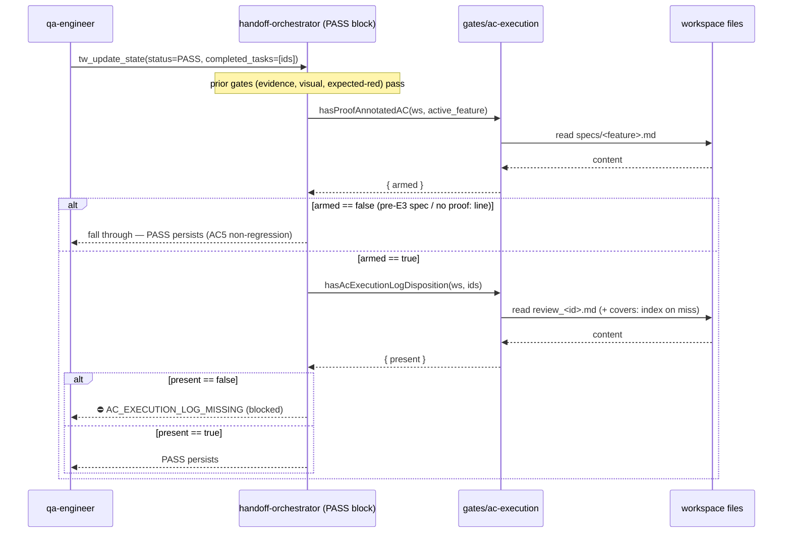

# e3-outcome-shaped-acceptance — architecture

Blueprint for T-E3-ARCH. Translates `specs/e3-outcome-shaped-acceptance.md`
(8 ACs) into an implementable design. Three legs, per the MVP cut: PM AC
schema (`content/skill-pm.md`), QA runtime-evidence phase
(`content/skill-qa-engineer.md`), and one PASS-time evidence-gate extension
(new `AC_EXECUTION_LOG_MISSING` gate). No schema bump, no new pixel-diff
engine, no second gate mechanism — everything in the spec's *Out of Scope*
stays out.

## Decision Records

| Context | Decision | Consequences |
|---|---|---|
| **(a) Gate module placement** — new `gates/ac-execution.ts` vs extending `gates/qa-review.ts` (spec Dependencies "Open design question"). | **New `gates/ac-execution.ts`.** The gate is a structural twin of `gates/expected-red.ts`: arm by parsing a *workspace file's content*, clear by a *`## …` H2 disposition* in `qa_reports/review_<id>.md`. `gates/qa-review.ts` owns a different concept (review-file *existence*, `MISSING_EVIDENCE`); folding spec-parsing into it blurs the A2 single-responsibility rule. | One more small module (~2 predicates). Symmetric with `expected-red.ts` (its own module for the same reason). The `CODE_SOURCE_FILES` glob in `error-code-contract.test.mjs` already includes `gates/*.ts`, so the parity harvest auto-covers the new file — no test-glob change. Closed off: reusing `qa-review.ts`. |
| **(b) Arm detection** — parse `specs/<feature>.md` for `proof:` tokens (no schema bump) vs a new first-class handoff field (v12→v13 bump). | **Parse `specs/<feature>.md`; no schema bump.** Every E-series arm precedent (`gates/visual.ts` mode, `gates/expected-red.ts` manifest, E4 credibility) arms by reading a workspace file derived from `active_feature`, never a handoff field. The spec path is derivable from `active_feature` exactly like `design/<feature>.md`. No hard blocker found: the arm signal (`≥1 proof: AC`) is a pure content read. | Zero migration work, zero `schema/versions.ts` / `schema/migrations-*.ts` churn, zero PM-stamping burden. `handoff` stays at **v12**. Consequence: the gate reads one small file per PASS attempt (negligible, same posture as `hasVisualBaselinesInDesign`). Closed off: v13 bump + a `proof_count`/boolean field. |
| **(c) Disposition lookup shape** — per-task vs per-feature, given one spec covers multiple tasks. | **Per-feature (at-least-one-across-ids).** The AC Execution Log is feature-scoped (proofs describe the spec, run once per round), identical to the Expected-Red Diff disposition. `hasAcExecutionLogDisposition(workspacePath, taskIds)` returns present iff **≥1** review file among the PASS'd ids (direct `review_<id>.md`, else the `covers:` index) carries a `## AC Execution Log` H2. | Verbatim reuse of `hasExpectedRedDisposition`'s proven traversal (direct-file → lazy `buildCoverageIndex` fallback). QA records ONE log per round covering every id; no per-id duplication. Closed off: per-id requirement (would force N duplicate logs). |
| **Trust boundary** — semantic vs existence check. | **Existence/well-formedness only**, mirroring `EXPECTED_RED_DIFF_MISSING` / `VISUAL_EVIDENCE_MISSING`. The server confirms the `## AC Execution Log` H2 is present; it never parses the logged commands, re-runs them, or judges the proofs truthful. | Attestation trust class: proof truthfulness stays with qa-engineer / code-reviewer (spec AC4, *Out of Scope* line 3). No stdout parsing, no command execution in the server. |
| **Storage mode** — file vs storage-agnostic. | **File-mode only** (`storage instanceof FileHandoffStorage`), like `EXPECTED_RED_DIFF_MISSING`. | The disposition lives in the `qa_reports/` file convention, which SQLite/HTTP mode lacks. SQLite PASS path is untouched (AC5 non-regression for that mode by construction). |
| **Registry classification** — plain-text orchestrator vs transition union. | **Plain-text orchestrator gate**; NOT added to `TransitionRejection["error"]` nor `TRANSITION_GATE_CODES`. | Same family as `EXPECTED_RED_DIFF_MISSING` / `REPRO_MANIFEST_MISSING` (orchestrator-produced, not `validateTransition`-emitted). The DR-8 union assertion in `error-code-contract.test.mjs` stays byte-identical at **16** members — do NOT touch it. Only the `GATE_REGISTRY.length` (27→28) and doc-file-mapping (27→28) assertions move. |
| **Gate-code shape** — new suffix vocabulary? | **`AC_EXECUTION_LOG_MISSING`** — the `_MISSING` suffix already matches the parity test's `SUFFIX_RE`. | No `SUFFIX_RE`/`PREFIX_RE` vocabulary widening in `error-code-contract.test.mjs` (unlike E1's `HELD` / E4's — those needed new suffixes; this one does not). |
| **Dogfood self-arm** — E3's own spec carries 8 `proof:` ACs. | Accepted and intended: the gate **arms on E3's own PASS** (`active_feature=e3-outcome-shaped-acceptance`). | T-E3-QA's review file MUST carry a `## AC Execution Log` H2 or its own PASS is (correctly) blocked by the gate it ships. The ultimate dogfood; flagged in the handoff brief so QA plans for it. Pre-E3 specs (E4/E8/…) carry zero `proof:` lines → dormant for them (AC5). |

## Affected Files

New + modified files, grouped by the existing task cut (T-E3-01..04). Budget:
each group ≤5 files / ≤300 lines.

**T-E3-01 — PM AC schema** (1 file)
- `content/skill-pm.md` — MODIFY: extend the *Acceptance Criteria* bullet in the
  Spec Schema with the conditional `proof:` annotation convention (AC1/AC2) +
  one worked example AC line. Does NOT mention `AC_EXECUTION_LOG_MISSING`
  (that code is QA-side; keep the parity doc-mapping clean).

**T-E3-02 — QA runtime-evidence phase** (1 file)
- `content/skill-qa-engineer.md` — MODIFY: insert **Phase 3.5 — AC Execution**
  between Phase 3 (Tests) and Phase 4 (Run) (AC3); the phase records
  command + raw output/exit code + pass/fail verdict per AC under a
  `## AC Execution Log` H2 in `qa_reports/review_<task-id>.md`; cross-reference
  the existing *Escalation Routes: Phase 4 FAIL* row (AC6, no new route). Add a
  PASS-GATE note backtick-quoting `AC_EXECUTION_LOG_MISSING` (this is the ONLY
  file that backtick-quotes the code — the doc-file-mapping anchor).

**T-E3-03 — evidence gate** (3 files)
- `gates/ac-execution.ts` — NEW: the two predicates + spec-path/review-path
  helpers (Interface Contracts below). Mirrors `gates/expected-red.ts` shape.
- `gates/registry.ts` — MODIFY: add `"AC_EXECUTION_LOG_MISSING"` to the
  `GateErrorCode` union; append one `GateDefinition` to `GATE_REGISTRY` (→ 28);
  add its line to the `errorCode → doc-file mapping` comment
  (`AC_EXECUTION_LOG_MISSING  skill-qa-engineer.md`).
- `tools/handoff-orchestrator.ts` — MODIFY: import the two predicates; add the
  PASS-time gate block (Sequence Diagram + Interface Contracts below), placed
  immediately AFTER the Expected-Red block, still inside
  `if (parsed.status === "PASS" && parsed.completed_tasks.length > 0)`.
  Check order stays frozen-additive (append-only).

**T-E3-04 — tests** (see *Test Specification*; qa-owned per the brief — SPEC only)
- `test/gates/ac-execution.test.mjs` — NEW.
- `test/error-code-contract.test.mjs` — MODIFY: mandatory registry re-baseline
  (27→28). This is the standard qa-owned re-baseline every gate addition
  performs (see E4/E2/E1 precedent comments in that file), NOT a "pre-existing
  gate test file" change in AC5's sense (AC5 protects the per-gate *behavior*
  tests — `test/gates/gates-expected-red.test.mjs` et al. — which stay
  byte-untouched).

**Not touched** (explicit, AC7 scope guard): `schema/versions.ts`,
`schema/migrations-*.ts` (no bump), `tools/transitions.ts` (no union change),
`gates/qa-review.ts`, `content/skill-sr-engineer.md`, any `const-*.md` /
`coord-*.md` fragment, `content/skill-qa-visual.md`, the C15 manifest / D9
`covers:` machinery.

## Data Structures

No new persisted types; `handoff` schema stays v12. Two in-module return shapes
in `gates/ac-execution.ts`, mirroring `gates/expected-red.ts`:

```ts
// Arm signal: the active feature's spec declares ≥1 proof:-annotated AC.
export interface AcArmResult { armed: boolean; specPath: string }

// Disposition: ≥1 PASS'd review file carries the `## AC Execution Log` H2.
export interface AcDispositionResult { present: boolean }
```

The `## AC Execution Log` review-file section and the `proof:` spec-line are
markdown conventions, not schemas — the server treats them as opaque presence
markers (trust boundary).

## Interface Contracts

`gates/ac-execution.ts` (new). Sanitiser + `sliceH2Section`/`buildCoverageIndex`
reuse are byte-identical to `gates/expected-red.ts`.

```ts
// H2 heading QA's Phase 3.5 writes into qa_reports/review_<id>.md.
const DISPOSITION_HEADING = "AC Execution Log";

// specs/<feature>.md path, same sanitiser as expectedRedManifestPath /
// designFilePath (replace non-[A-Za-z0-9._-], collapse `..` runs to `_`).
export function specFilePath(workspacePath: string, activeFeature: string): string;

// ARM (decision b): armed iff specs/<feature>.md exists AND contains ≥1 line
// whose first non-whitespace token is `proof:` (case-insensitive). Absence of
// file OR of any proof: line ⇒ { armed:false } (zero-cost dormant, AC5). Never
// throws (fs errors → armed:false). Regex: /^[^\S\n]*proof[^\S\n]*:/im — anchored
// so mid-line/backtick "proof:" prose never false-arms (verified against the
// live spec: 8 matches, 0 false positives).
export function hasProofAnnotatedAC(
  workspacePath: string,
  activeFeature: string,
): AcArmResult;

// DISPOSITION (decision c): present iff AT LEAST ONE candidate review file for
// the PASS'd ids contains a `## AC Execution Log` H2. Candidate per id: direct
// qa_reports/review_<id>.md; else (lazy, first miss only) the file covering the
// id via the c3 `covers:` index. Verbatim clone of hasExpectedRedDisposition.
// Never throws (fs errors → file skipped).
export function hasAcExecutionLogDisposition(
  workspacePath: string,
  taskIds: string[],
): AcDispositionResult;
```

`tools/handoff-orchestrator.ts` — PASS-time block (append after the Expected-Red
block, ~L764, inside the PASS `if`):

```ts
// E3 — AC-Execution-Log gate (e3-outcome-shaped-acceptance, AC4/AC5). Sibling
// of EXPECTED_RED_DIFF_MISSING: arms on spec content (≥1 proof: AC), clears on a
// `## AC Execution Log` H2 in a PASS'd review file (or a covers: file).
// Existence-only trust boundary. FILE-MODE ONLY.
if (storage instanceof FileHandoffStorage) {
  const arm = hasProofAnnotatedAC(parsed.workspace_path, parsed.active_feature);
  if (arm.armed) {
    const disposition = hasAcExecutionLogDisposition(
      parsed.workspace_path, parsed.completed_tasks,
    );
    if (!disposition.present) {
      return {
        content: [{ type: "text" as const,
          text:
            `⛔ AC_EXECUTION_LOG_MISSING: ${parsed.completed_tasks.join(", ")}. ` +
            `Spec ${arm.specPath} declares ≥1 proof:-annotated AC but no ` +
            `## AC Execution Log section was found for the listed task(s). ` +
            gate("AC_EXECUTION_LOG_MISSING").hintStatic,
        }],
        isError: true,
      };
    }
  }
}
```

`gates/registry.ts` — new `GateDefinition` (documentation order: append after
`EXPECTED_RED_DIFF_MISSING`, or at the plain-text tail — array order is DOC-only,
not eval-order):

```ts
{
  errorCode: "AC_EXECUTION_LOG_MISSING",
  producer: "orchestrator",
  envelope: "plain-text",
  triggerEdge: "status=PASS with completed_tasks, spec has >=1 proof: AC, ## AC Execution Log absent",
  armCondition: "hasProofAnnotatedAC().armed (file-mode only)",
  clearingArtifact: "## AC Execution Log H2 in qa_reports/review_<id>.md (covers: files count)",
  hintStatic:
    "Run Phase 3.5 (skill-qa-engineer) — execute each proof:-annotated AC in " +
    "specs/<feature>.md and record command, raw output/exit code, and a per-AC " +
    "pass/fail verdict under a ## AC Execution Log section in a " +
    "qa_reports/review_<id>.md for one of the PASS'd ids (covers: files count) " +
    "before PASS. The server checks the section's presence only — the proofs' " +
    "truthfulness stays with qa-engineer / code-reviewer. " +
    "See specs/e3-outcome-shaped-acceptance.md AC3/AC4.",
  documentedInProse: true,
}
```

## Sequence Diagram



## Deferred Resources

_None — the spec's Dependencies / Prerequisites shows zero ignored/deferred
external refs (all three cited research artifacts are in-repo under `research/`
and were read in full by PM; `external_refs` omitted, non-blocking)._

## Test Specification

Tests are qa-owned (T-E3-QA per the brief) — SPECIFIED here, not authored by
architect. Two files:

### 1. `test/gates/ac-execution.test.mjs` (NEW, spec AC4)

Construct a temp workspace with `specs/<feature>.md` and `qa_reports/`. Assert
the gate's behavior directly (mirror `test/gates/gates-expected-red.test.mjs`).

- **Arm + missing → reject.** Spec with a `proof:`-annotated AC + a
  `review_<id>.md` lacking `## AC Execution Log` → `tw_update_state(status=PASS,
  completed_tasks=[id])` (or `handleUpdateState`) returns `isError:true` with
  text containing `AC_EXECUTION_LOG_MISSING`.
- **Arm + present → accept.** Same spec; add a `## AC Execution Log` H2 to the
  review file → the AC gate does not fire (write proceeds / no
  `AC_EXECUTION_LOG_MISSING`).
- **Unarmed → dormant (AC5).** Spec with ZERO `proof:` lines → gate never fires
  even with no `## AC Execution Log` anywhere; PASS is not blocked by this code.
- **No spec file → dormant.** `active_feature` whose `specs/<feature>.md` is
  absent → `armed:false`, no rejection (never throws).
- **`covers:` coverage.** Batched round: `review_T-A.md` carries
  `covers: T-A, T-B` + the `## AC Execution Log` H2; PASS of `T-B` (no direct
  `review_T-B.md`) is satisfied via the coverage index.
- **Arm-regex precision (unit).** `hasProofAnnotatedAC` returns `armed:false`
  for a spec whose only "proof" occurrences are mid-line/backtick prose (e.g.
  `` `proof: pixel-diff <region>` `` inside a sentence), `armed:true` for a
  line-leading `  proof:` annotation.
- **File-mode only (optional).** Under SQLite/HTTP storage the gate is skipped
  (no `qa_reports/` convention) — mirror the expected-red file-mode test.

### 2. Skill-content assertion (spec AC3 + AC6) — `test/gates/ac-execution.test.mjs` or a sibling content test

- Assert `content/skill-qa-engineer.md` contains the **exact** new phase heading
  `**Phase 3.5 — AC Execution**` verbatim (AC3 names the heading as
  test-asserted).
- Assert it contains the `## AC Execution Log` H2 token (the disposition heading
  the gate keys on — must match `DISPOSITION_HEADING`).
- Assert the new phase text references the existing *Phase 4 FAIL* escalation
  route and does NOT introduce a new escalation-table row (AC6 — grep the
  Escalation Routes table row count is unchanged).
- Assert `content/skill-pm.md`'s AC-schema guidance states the annotation is
  conditional (`where feasible` literal present) — AC2 conditional-not-mandatory.

### 3. `test/error-code-contract.test.mjs` re-baseline (spec AC4/AC5 — MANDATORY)

The registry parity meta-test MUST move with the new gate (this is the standard
per-gate re-baseline, not an AC5 violation):
- `GATE_REGISTRY.length` and `ALL_GATE_CODES.length` assertions: **27 → 28**
  (two `assert.equal` sites + the test title string).
- Doc-file-mapping test: `mapping.size` **27 → 28**.
- Add an explicit pin (mirror the `REVIEW_VERDICT_STATUS_MISMATCH` pin): assert
  `AC_EXECUTION_LOG_MISSING` is in `ALL_GATE_CODES` AND backtick-quoted in ≥1
  `content/*.md` (it will be `skill-qa-engineer.md`).
- Add `AC_EXECUTION_LOG_MISSING:triggerEdge` to `FREE_TEXT_ALLOWLIST` (free
  English precondition list, like `EXPECTED_RED_DIFF_MISSING:triggerEdge`); its
  `armCondition` names `hasProofAnnotatedAC` (a camelCase predicate) so it is
  auto-covered by `armConditionCheckable` — NO allowlist entry for armCondition.
  The predicate name must appear literally in `tools/handoff-orchestrator.ts`
  (it will, via the import + call).
- Do **NOT** touch the DR-8 `TransitionRejection["error"]` 16-member assertion,
  `SUFFIX_RE`/`PREFIX_RE` (the `_MISSING` suffix already matches), or
  `TRANSITION_GATE_CODES`.

### 4. Spec self-check proofs (AC1/AC8, verified at T-E3-QA, not new test files)

- AC1: `grep -c '^  proof:' specs/e3-outcome-shaped-acceptance.md` ≥ 4 (currently 8).
- AC8: `grep -c '^| N/A' specs/e3-outcome-shaped-acceptance.md` == 3 (currently 3).
- AC5: full suite green with the count re-baseline above and **zero** edits to
  `test/gates/gates-expected-red.test.mjs` or any other per-gate behavior test.

## Co-landing requirement (implementation note)

The 28th registry entry (T-E3-03), its backtick-quote in `skill-qa-engineer.md`
(T-E3-02), the doc-file-mapping line (T-E3-03), and the count re-baseline
(T-E3-04) are mutually interlocking — `registry ⊆ doc`, `mapping.size == 28`,
and `GATE_REGISTRY.length == 28` all fail if any one is missing. They must ship
in the same PR (reviewed together at T-E3-CR). Analogous to the HOP_CAP DR-7
"both must ship before the parity test runs" note in `gates/registry.ts`.

## Open Questions

None.
