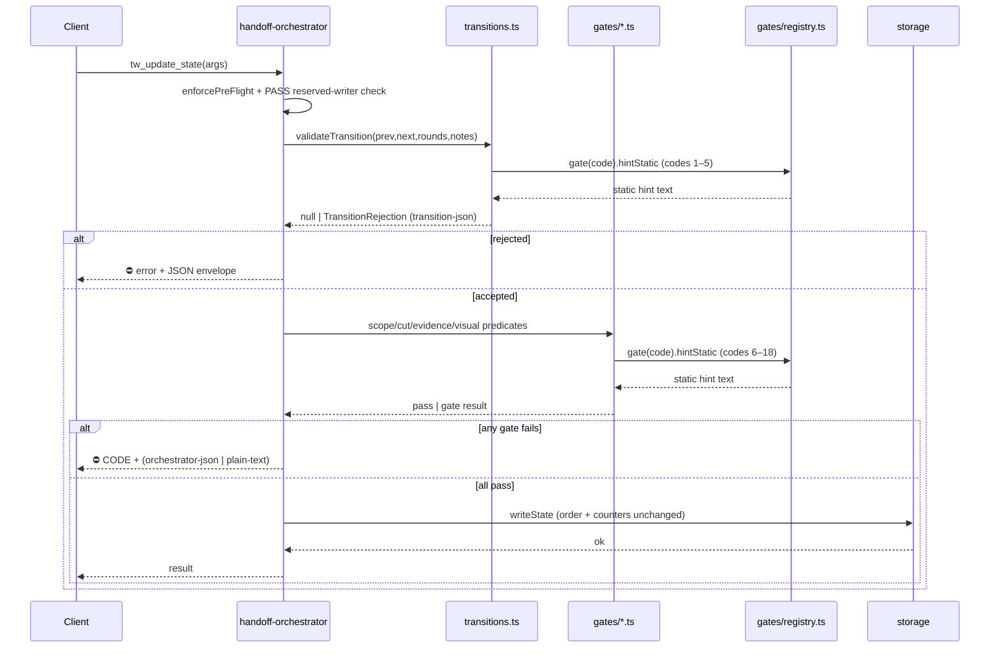

# Architecture: gate-registry (A10 + A2 folded in)

Blueprint for `specs/gate-registry.md`. Reconciles the gate catalog against
live source, pins the `gates/registry.ts` shape, fixes the `gates/` module
boundaries for the A2 split, decides the AC-3/AC-4 rendering mechanism, and
specifies the evaluation-order and test-impact contracts. Implementation-free.

> **Catalog correction (load-bearing).** The spec enumerates **17** codes; the
> live catalog is **18**. The spec's list omits **`MISSING_REVIEW_EVIDENCE`**
> (emitted at `tools/handoff-orchestrator.ts:437`, the code-reviewer→qa evidence
> gate). `test/error-code-contract.test.mjs` AC-1 asserts `>= 18` precisely
> because of this code. Every AC that says "17 in, 17 out" (AC-5) reads **18 in,
> 18 out**. This is the reconciliation the spec's Dependencies section asked the
> architect to perform ("reconcile exactly, don't approximate").

---

## Affected Files

**New:**
- `gates/registry.ts` — the single structured catalog (18 `GateDefinition`
  entries + types + lookup helpers). Runtime **leaf**: imports nothing at
  runtime; may `import type` from `tools/transitions.ts` only.
- `gates/qa-review.ts` — QA-evidence predicates.
- `gates/code-review.ts` — code-review-evidence predicates.
- `gates/visual.ts` — all visual sub-gate predicates + design-mode arm signal.
- `gates/scope-decision.ts` — `hasScopeDecision`.
- `gates/cut-approval.ts` — `hasCutApproval`.
- (test) rewritten `test/error-code-contract.test.mjs` → generative registry
  parity test (renamed conceptually; keep the filename so no runner globs break).

**Modified:**
- `tools/evidence-file.ts` — drained to shared plumbing only (path helpers,
  `sliceH2Section`, `splitTableCells`, table/checkbox cell parsers shared across
  gates, `escapeRegex`, the fs `record*` writers). All `has*/check*/validate*`
  gate predicates leave.
- `tools/transitions.ts` — the 5 `validateTransition` rejection hints + the
  `TransitionRejection["error"]` union source their code/hint text from
  `gates/registry.ts` (value import; type-only back-edge stays erased).
- `tools/handoff-orchestrator.ts` — retarget imports from `./evidence-file.js`
  to the new `../gates/*.js` modules; source each literal error code + static
  hint substring from the registry. **Check order unchanged** (AC-7).
- `prompts/build.ts` — retarget the one `hasDesignModeRequiringVisual` import
  from `../tools/evidence-file.js` to `../gates/visual.js`. No behavior change.
- `content/const-07-design-chain-gates.md`, `const-08-chain-31-mid.md`, and the
  skill files `skill-qa-engineer.md`, `skill-sr-engineer.md`, `skill-pm.md`,
  `skill-code-reviewer.md` — **no byte change**; they become parity-locked to
  the registry by the rewritten test (see Rendering Mechanism, DR-3).
- test import retargets (8 files, listed in Test Impact).

**NOT modified (guard against scope creep):**
- `prompts/constitution-manifest.ts`, `composeConstitution`, `stripOriginTags`,
  `stripRationale` — the A9 pipeline is untouched (DR-3). This is what preserves
  the `constitution-monolith.txt` golden baseline by construction (AC-3).
- All 4 `schema_version` constants (AC-8) — no persisted-field change.
- `ALLOWED_TRANSITIONS` graph shape + `validateTransition` control flow (Out of
  Scope in spec) — only the code/hint **strings** are re-sourced.

---

## The reconciled 18-gate catalog

Verified by shape-rule harvest over `index.ts tools/ guards/ schema/` (matches
`error-code-contract.test.mjs`'s `TOKEN_RE`/`SUFFIX_RE`/`PREFIX_RE`) → exactly 18.

| # | errorCode | producer | envelope | trigger edge / condition | arm condition (predicate) | clearing artifact |
|---|-----------|----------|----------|--------------------------|---------------------------|-------------------|
| 1 | `AGENT_ID_REQUIRED` | `validateTransition` | transition-json | `next.agent` null/unknown on any write | always (step 1) | valid `agent_id` |
| 2 | `TRANSITION_REJECTED` | `validateTransition` | transition-json | no edge `prev→next` in `ALLOWED_TRANSITIONS`; unknown status | always (step 4) | a legal edge |
| 3 | `QA_ROUND_EXCEEDED` | `validateTransition` | transition-json | `prev_qa_round >= 4` and next ≠ `(pm,In_Progress)` | always (step 2) | `(pm,In_Progress)` reset |
| 4 | `REVIEW_ROUND_EXCEEDED` | `validateTransition` | transition-json | `prev_review_round >= 4` and next ≠ `(pm,In_Progress)` | always (step 2) | `(pm,In_Progress)` reset |
| 5 | `VISUAL_ROUND_EXCEEDED` | `validateTransition` | transition-json | `prev_visual_round >= 6` and next ≠ `(pm,In_Progress)` | opt-in (counter present) | `(pm,In_Progress)` rebudget |
| 6 | `SCOPE_DECISION_REQUIRED` | orchestrator | **orchestrator-json** | `pm:In_Progress → {architect,sr-engineer}:In_Progress` | `hasDesignModeRequiringVisual().required` | `feature-split.md` OR `scope_decision:single-feature` |
| 7 | `CUT_APPROVAL_REQUIRED` | orchestrator | **orchestrator-json** | same build-entry edge | unconditional; **file-mode only** (`FileHandoffStorage`) | `cut_approved:true` on prev state |
| 8 | `MISSING_EVIDENCE` | orchestrator | plain-text | `status=PASS` with `completed_tasks` | `hasEvidence().missing` non-empty | `qa_review` / `qa_reports/review_<id>.md` |
| 9 | `VISUAL_BASELINES_REQUIRED` | orchestrator | plain-text | PASS, armed, `## Visual Baselines` absent | `armCheck.required && !visualGate.present` | add `## Visual Baselines` to design |
| 10 | `VISUAL_EVIDENCE_MISSING` | orchestrator | plain-text | PASS, baselines present, `visual_<id>.md` absent | `visualGate.present` | write `qa_reports/visual_<id>.md` |
| 11 | `VISUAL_WIDGETS_UNVERIFIED` | orchestrator | plain-text | PASS, unchecked `## Widget Shape Verification` rows | `hasUncheckedWidgets` | mark rows `[x]` |
| 12 | `VISUAL_ASSERTIONS_REQUIRED` | orchestrator | plain-text | PASS, armed, `## Visual Structural Assertions` absent from design | `armCheck.required && !designDeclaresStructuralAssertions` | add design section |
| 13 | `VISUAL_REPORT_INCOMPLETE` | orchestrator | plain-text | PASS, armed, report fails schema/rows/verdict | `validateVisualReports.ok===false` | clear failing rows |
| 14 | `VISUAL_PROVENANCE_MISSING` | orchestrator | plain-text | PASS, armed, diffed surface lacks `baseline:`/`diff-metric:` | `checkVisualProvenance` (opt-in) | add provenance lines |
| 15 | `BASELINE_MANIFEST_MISSING` | orchestrator | plain-text | PASS, armed, `## Source` present, 0 audited rows | `checkBaselineManifest.code` | freeze ≥1 audited node-id |
| 16 | `BASELINE_PROVENANCE_INCOMPLETE` | orchestrator | plain-text | PASS, armed, ≥2 audited rows, provenance section absent/incomplete | `checkBaselineManifest.code` | add `## Baseline Selection Provenance` |
| 17 | `PIXEL_GATE_ATTESTATION_MISSING` | orchestrator | plain-text | PASS, armed, non-carry-forward surface lacks `pixel_gate_complete:true` | `checkPixelGateAttestation` (opt-in) | attest per surface |
| 18 | `MISSING_REVIEW_EVIDENCE` | orchestrator | plain-text | `code-reviewer:In_Progress → qa-engineer:In_Progress` with completed_tasks | `hasCodeReviewEvidence().missing` non-empty | write `review_reports/review_<id>.md` |

**Three envelope shapes — the byte-parity minefield.** Do not assume the spec's
two-shape framing (transitions-json vs plain-text). There are three:
- **transition-json** (codes 1–5): `⛔ ${error}\n${JSON.stringify({error, attempted:{prev_agent,prev_status,new_agent,new_status,qa_round,visual_round?}, allowed, hint}, null, 2)}`.
- **orchestrator-json** (codes 6–7): SAME wrapper, but `attempted` has **only 4
  fields** (no `qa_round`/`visual_round`) and `allowed` = `ALLOWED_TRANSITIONS.get("pm:In_Progress")`.
  The registry must NOT try to unify these two `attempted` shapes.
- **plain-text** (codes 8–18): `⛔ CODE: <interpolated>. <static guidance>.`

**Not in the error-code catalog (do not registry-fy as gates):** the
`requireQaEngineer` reserved-writer check (`⛔ BLOCKED: … reserved for qa-engineer`)
emits no `SCREAMING_CASE` code, is not doc-referenced as a code, and is not counted
by the shape-rule. Leave it in `tools/transitions.ts` as-is. Likewise the
`⛔ Round N` `pending_notes` sentinels (`Round 4 …`, `Visual Round 6 …`) are
counter side-effects, not gate codes — leave in the orchestrator.

---

## Data Structures (`gates/registry.ts`)

```ts
// Runtime leaf. NO runtime imports. Type-only back-edge to transitions is erased.
import type { AgentName, StatusName } from "../tools/transitions.js";

export type GateErrorCode =
  | "AGENT_ID_REQUIRED" | "TRANSITION_REJECTED"
  | "QA_ROUND_EXCEEDED" | "REVIEW_ROUND_EXCEEDED" | "VISUAL_ROUND_EXCEEDED"
  | "SCOPE_DECISION_REQUIRED" | "CUT_APPROVAL_REQUIRED"
  | "MISSING_EVIDENCE" | "MISSING_REVIEW_EVIDENCE"
  | "VISUAL_BASELINES_REQUIRED" | "VISUAL_EVIDENCE_MISSING"
  | "VISUAL_WIDGETS_UNVERIFIED" | "VISUAL_ASSERTIONS_REQUIRED"
  | "VISUAL_REPORT_INCOMPLETE" | "VISUAL_PROVENANCE_MISSING"
  | "BASELINE_MANIFEST_MISSING" | "BASELINE_PROVENANCE_INCOMPLETE"
  | "PIXEL_GATE_ATTESTATION_MISSING";

export type GateProducer = "validateTransition" | "orchestrator";
export type GateEnvelope = "transition-json" | "orchestrator-json" | "plain-text";

export interface GateDefinition {
  readonly errorCode: GateErrorCode;
  readonly producer: GateProducer;
  readonly envelope: GateEnvelope;
  // Human-readable, doc-facing, verbatim-sourced from today's prose:
  readonly triggerEdge: string;      // e.g. "pm:In_Progress → {architect,sr-engineer}:In_Progress"
  readonly armCondition: string;     // names the predicate, e.g. "hasDesignModeRequiringVisual().required"
  readonly clearingArtifact: string; // what satisfies it
  // The STATIC portion of the emitted hint, lifted byte-for-byte from the
  // current emit site (S02 verbatim rule). Interpolation stays at the emit
  // site (see Interface Contracts / DR-2); this is the fixed-sentence part
  // that ALSO appears in constitution/skill prose.
  readonly hintStatic: string;
  // True iff the code is (and must stay) backtick-quoted in >=1 content/*.md.
  // All 18 are true today (A5 test green in both directions). Field exists so
  // a future code-internal gate can opt out without weakening the test.
  readonly documentedInProse: boolean;
}

export const GATE_REGISTRY: readonly GateDefinition[] = [ /* 18 entries, catalog order */ ];

// O(1) lookup; throws on unknown code (fail-loud, not silent undefined).
export function gate(code: GateErrorCode): GateDefinition;
// The 5 codes validateTransition's rejection() may emit. For tests + optional
// Extract<> typing of validateTransition's own return — NOT for re-typing the
// 12-member TransitionRejection["error"] union (see Interface Contracts / DR-8).
export const TRANSITION_GATE_CODES: readonly GateErrorCode[];
export const ALL_GATE_CODES: readonly GateErrorCode[]; // === GATE_REGISTRY.map(g => g.errorCode)
```

**Ordering rule (AC-7 encode).** `GATE_REGISTRY` array order is documentation
order and MUST NOT be relied on for evaluation order. **Evaluation order is
FROZEN in `tools/handoff-orchestrator.ts` and stays expressed by the physical
sequence of `if` blocks there** — the registry is a keyed lookup, not a
dispatch loop. Adding an `evalOrder: number` field would invite a future
refactor to "iterate the registry in order," which would collapse the
early-return control flow AC-7 forbids. **Do not add an order field.** See DR-5.

---

## `gates/` module boundaries (A2 split) + import direction

Predicate → module map (verbatim logic moves; **no behavior change**):

| module | exports (moved from `evidence-file.ts`) | consumed by |
|--------|------------------------------------------|-------------|
| `gates/qa-review.ts` | `hasEvidenceInFile`, `recordReviewInFile` | orchestrator (PASS evidence gate #8) |
| `gates/code-review.ts` | `hasCodeReviewEvidenceInFile`, `recordCodeReviewInFile` | orchestrator (gate #18) |
| `gates/visual.ts` | `hasVisualBaselinesInDesign`, `hasDesignModeRequiringVisual`, `parseDesignMode` (+`KNOWN_MODES`), `hasVisualEvidenceInFile`, `parseVisualWidgetsChecklist`, `hasUncheckedWidgets`, `designDeclaresStructuralAssertions`, `validateVisualReport`, `validateVisualReports`, `parseVisualProvenanceRows`, `checkVisualProvenance`, `isPlaceholderDiffMetric`, `parsePixelGateAttestation`, `checkPixelGateAttestation`, `parseBaselineManifestRows`, `hasBaselineProvenance`, `checkBaselineManifest` (+ the `REQUIRED_VISUAL_SECTIONS`, token/placeholder consts, and line-regex consts they use) | orchestrator (gates #9–17), **`prompts/build.ts`** (arm signal) |
| `gates/scope-decision.ts` | `hasScopeDecision` | orchestrator (gate #6) |
| `gates/cut-approval.ts` | `hasCutApproval` | orchestrator (gate #7) |

**Shared plumbing stays in `tools/evidence-file.ts`** (imported by the gate
modules): `sliceH2Section`, `escapeRegex`, `splitTableCells`, and the low-level
cell/label parsers (`parseUncheckedLabels`, `parseAssertionFailures`,
`parseRegionDiffFailures`, `normalizeStatus`) plus the fs path helpers
(`evidencePath`/`codeReviewPath`/`visualEvidencePath`/`designFilePath`) IF they
are shared by ≥2 gate modules. **Decision rule for each helper:** used by exactly
one gate module → move it there (co-locate); used by ≥2 → keep in
`evidence-file.ts` as plumbing. Concretely: `designFilePath` is used by
`gates/visual.ts` only (all its callers) → **move to `gates/visual.ts`**;
`sliceH2Section`/`splitTableCells` are used across visual parsers only but stay
generic → keep in `evidence-file.ts` (plumbing) to avoid `gates/visual.ts`
becoming a de-facto util dump. `recordReviewInFile`/`recordCodeReviewInFile` are
writers, not predicates, but co-locate with their read counterpart per the A2
"one file per gate" intent.

**Import DAG (no cycles):**
```
gates/registry.ts        (leaf; runtime imports: none; type-only: transitions.ts)
      ▲
      │ (value import of hintStatic/metadata)
      ├── gates/qa-review.ts, code-review.ts, visual.ts, scope-decision.ts, cut-approval.ts
      │        └── (may import shared plumbing from tools/evidence-file.ts)
      ▲
      ├── tools/transitions.ts        (value-imports registry hint consts; keeps type-only edge back → registry)
      ├── tools/handoff-orchestrator.ts (imports gates/*.ts + transitions.ts + registry.ts)
      └── prompts/build.ts            (imports gates/visual.ts)
```
- **Cycle risk 1 — registry ⇄ transitions.** `registry.ts` needs `AgentName`/
  `StatusName` for the (documentation-only) trigger-edge typing; `transitions.ts`
  needs the registry's hint constants. Resolve with `import type` in
  `registry.ts` (erased at runtime → no runtime cycle) and a value import in
  `transitions.ts`. If TS's `isolatedModules`/emit still flags it, fall back to
  moving `AgentName`/`StatusName` into `registry.ts` and re-exporting from
  `transitions.ts` — but try `import type` first (smaller blast radius). DR-1.
- **Cycle risk 2 — gates ⇄ evidence-file.** `gates/*.ts` import plumbing FROM
  `evidence-file.ts`; `evidence-file.ts` must import NOTHING from `gates/`.
  Verify post-move: `evidence-file.ts` has zero `../gates/` imports.

---

## Interface Contracts

**Registry consumption at the emit sites — byte-parity is enforced by the
EXISTING gate tests, not a new harness.** The 8 gate test files already assert
exact error text (AC-2). The migration is therefore safe-by-test: replace each
hardcoded literal with a registry reference; if the reference equals the old
literal, the existing assertions stay green unchanged.

- **transitions.ts (codes 1–5).** Keep `validateTransition`'s control flow
  identical. Replace the inline hint literals with `gate("QA_ROUND_EXCEEDED").hintStatic`
  etc., interpolating the dynamic number at the call site:
  ```ts
  // before: `qa_round=${req.prev_qa_round} exceeds cap. Only (pm, In_Progress) allowed to reset.`
  // after:  `qa_round=${req.prev_qa_round}${gate("QA_ROUND_EXCEEDED").hintStatic}`
  // where hintStatic === " exceeds cap. Only (pm, In_Progress) allowed to reset."
  ```
  **Do NOT re-source `TransitionRejection["error"]` from `TRANSITION_GATE_CODES`.**
  That union has **12 members today** (verified in `tools/transitions.ts:43–88`):
  the 5 codes `rejection()` actually emits PLUS 7 handler-side codes
  (`VISUAL_WIDGETS_UNVERIFIED`, `VISUAL_BASELINES_REQUIRED`,
  `VISUAL_REPORT_INCOMPLETE`, `VISUAL_ASSERTIONS_REQUIRED`,
  `SCOPE_DECISION_REQUIRED`, `PIXEL_GATE_ATTESTATION_MISSING`,
  `CUT_APPROVAL_REQUIRED`) deliberately carried "for handler-side narrowing +
  envelope consistency" — even though the orchestrator builds those envelopes as
  **inline object literals** (`handoff-orchestrator.ts:111–124, 161–174`), NOT
  via the `TransitionRejection` interface. It is therefore NOT a clean
  by-producer subset, so `TRANSITION_GATE_CODES` (5) is the wrong source and
  narrowing to it would silently delete 7 documented members (behavior-neutral at
  runtime, but a type-surface regression). **Keep the union byte-identical to
  today** (leave the explicit 12-member list as authored). Prevent registry drift
  the cheap way instead: add a parity assertion in the rewritten contract test
  that every member of `TransitionRejection["error"]` ∈ `ALL_GATE_CODES`. See DR-8.
  **hintStatic holds the maximal fixed
  substring**; whatever leading/trailing dynamic text remains stays at the call
  site. The engineer picks the exact split per code; the invariant is "emitted
  string is byte-identical" (existing tests prove it).
- **orchestrator.ts fully-static hints (codes 6, 7).** `SCOPE_DECISION_REQUIRED`
  and `CUT_APPROVAL_REQUIRED` hints are 100% static multi-sentence strings →
  `hintStatic` holds them whole; the envelope builder uses them verbatim.
- **orchestrator.ts plain-text hints (codes 8–18).** Pattern
  `⛔ ${code}: ${dynamicList}. ${hintStatic}` — `hintStatic` = the fixed guidance
  sentence(s); `dynamicList` (missing ids, mode, listing) stays computed at the
  emit site. `BASELINE_MANIFEST_MISSING`/`BASELINE_PROVENANCE_INCOMPLETE` share
  one emit site selecting on `manifest.code` — both entries' `hintStatic` feed
  the ternary.
- **`gate(code)` helper:** `GATE_REGISTRY.find(g => g.errorCode === code)` with a
  throw on miss (or a precomputed `Record<GateErrorCode, GateDefinition>` for
  O(1)). Pure, no I/O.

Moved predicates keep **identical signatures** (verbatim move) — e.g.
`hasScopeDecision(workspacePath, handoffState)`, `checkBaselineManifest(workspacePath, activeFeature): BaselineManifestCheck`. No signature is allowed to change; only the file they live in and the source of their error-code/hint metadata.

---

## Rendering mechanism (AC-3 / AC-4) — DECISION: option (a), realized as a generative parity check

**Chosen: build-time generator in its `verifies` form — the rewritten
`test/error-code-contract.test.mjs` is the generative check that renders the
registry projection and asserts the committed content matches. The runtime
composition pipeline (`build.ts`, `composeConstitution`, `constitution-manifest`,
the strip passes) is NOT touched, and the `constitution-monolith.txt` golden
baseline is NOT regenerated.** This is squarely the PM's option (a) as they
defined it ("a checked script that reads `gates/registry.ts` and **writes/verifies**
the affected `content/*` fragments … the A9 golden-baseline test's guarantee is
untouched by construction"). We lean on the *verify* half. Optional
`scripts/gen-gate-docs.mjs --check|--write` may wrap the same render for a
developer convenience, wired into `npm test` — but the authoritative gate is the
test.

**Why not literal wholesale generation of the prose spans:**
1. **AC-3 forbids regenerating the golden baseline.** Any generator that emits
   into shipped constitution bytes needs region delimiters; inline markers would
   themselves alter the bytes (`composeConstitution` concatenates fragments
   verbatim and does NOT run the strippers), breaking `constitution-monolith.txt`.
   Re-slicing fragments into dedicated generated files bloats the manifest and
   still can't carry a "generated" banner in-band. So in-band generation is
   effectively barred by AC-3 + AC-8's "don't touch the pipeline" intent.
2. **The prose is not 1:1 with codes and is role-tailored.** `const-07` bullets
   are thematic (one bullet spans `VISUAL_BASELINES_REQUIRED` +
   `VISUAL_EVIDENCE_MISSING`; another spans 2 more). Skill references are single
   code tokens embedded mid-paragraph in role-specific SOP steps
   (`skill-qa-engineer.md:68–69`, `skill-code-reviewer.md:40–41`). Generating
   these byte-for-byte would require storing whole SOP paragraphs as `.ts`
   string literals — that is prose-in-TypeScript, the opposite of "structured
   data," and strictly worse to maintain.
3. **Option (b) touches the A9-hardened pipeline** every prompt/hook/context-budget
   test exercises, for zero behavioral gain.

**What the parity check guarantees (this IS the ticket's "drift structurally
impossible" — a red test on any divergence):**
1. `GATE_REGISTRY` has exactly 18 entries; `ALL_GATE_CODES` set === the
   shape-rule harvest over the code source set (the same
   `CODE_SOURCE_FILES`/`TOKEN_RE` the current test uses) → **18 in / 18 out**,
   no gate dropped or added by the refactor (AC-5).
2. **Doc ⊆ registry:** every backtick-quoted gate code across ALL `content/*.md`
   ∈ `ALL_GATE_CODES` (no doc names a phantom gate).
3. **Registry ⊆ doc:** every entry with `documentedInProse:true` is
   backtick-quoted in ≥1 `content/*.md`.
4. **Internal consistency:** for each entry, `hintStatic` is non-empty and (for
   the transition/orchestrator emit sites) the entry's `errorCode` string
   literally appears in its producer file — anchoring the "code side" to the
   typed registry instead of a blind regex scrape (the qualitative upgrade over
   A5).

**Affected doc sites (corrected scope — reconcile against the spec's list):**
- The spec names **5 constitution fragments (const-06/07/08/09/11)** and **4
  skills**. Live grep shows the *code tokens* actually live in: **`const-07`**
  (`VISUAL_BASELINES_REQUIRED`, `VISUAL_EVIDENCE_MISSING`, `VISUAL_REPORT_INCOMPLETE`,
  `VISUAL_ASSERTIONS_REQUIRED`, `BASELINE_MANIFEST_MISSING`,
  `BASELINE_PROVENANCE_INCOMPLETE`), **`const-08`** (`SCOPE_DECISION_REQUIRED`,
  `CUT_APPROVAL_REQUIRED`), **`const-13-design-chain-s4.md`** (3 visual codes —
  **NOT in the spec's list**), and `constitution-rationale.md` (4 codes, stripped
  from dispatch but scanned by the test). **`const-06`, `const-09`, `const-11`
  contain NO backtick code tokens** — they reference gates narratively ("Round 4",
  "Round 6", `visual_round`) and are covered by the round-cap `hintStatic`
  consistency check, not by token parity. Skills carrying codes: qa-engineer,
  code-reviewer, pm, plus **qa-visual, design-auditor, coordinator, coordinator-lite**
  (broader than the spec's 4). **The parity test scans all of `content/*.md`
  regardless of the spec's enumeration**, so it self-covers the extra sites. No
  fragment is byte-edited by this feature.

**Impact on drafted tasks A10-06 / A10-07 (architect refinement, per the
task-granularity note):** under this decision neither task writes generated
prose into files. A10-06 becomes "add the parity-check assertions for
constitution fragments to the rewritten test + confirm `constitution-monolith.txt`
still matches with the registry landed (no fragment edit)." A10-07 becomes the
same for skill files. Both fold naturally into the A10-08 test rewrite. **Do not
byte-edit any `const-*.md` or `skill-*.md` file** — if a diff appears there, the
implementation drifted from this decision. Flagged in handoff for the engineer
and for QA's evaluation criteria.

---

## Evaluation-order preservation (AC-7)

The FROZEN order lives in `tools/handoff-orchestrator.ts` and is expressed by the
physical top-to-bottom sequence of guard blocks with early returns. The registry
change re-sources **strings**, never the control flow. Order to preserve verbatim:

```
preflight
 → PASS/qa-engineer reserved-writer gate
 → validateTransition (codes 1–5, in its own internal precedence 1→2→3→3.5→4)
 → SCOPE_DECISION_REQUIRED (6)
 → CUT_APPROVAL_REQUIRED (7)
 → QA evidence RECORD (side effect)
 → MISSING_EVIDENCE (8)
 → visual sub-gates, in sub-order:
     VISUAL_BASELINES_REQUIRED (9) → VISUAL_EVIDENCE_MISSING (10)
      → VISUAL_WIDGETS_UNVERIFIED (11) → VISUAL_ASSERTIONS_REQUIRED (12)
      → VISUAL_REPORT_INCOMPLETE (13) → VISUAL_PROVENANCE_MISSING (14)
      → BASELINE_MANIFEST_MISSING/BASELINE_PROVENANCE_INCOMPLETE (15/16)
      → PIXEL_GATE_ATTESTATION_MISSING (17)
 → MISSING_REVIEW_EVIDENCE (18)
 → round-cap sentinels (pending_notes)
 → storage.writeState
 → PASS RAG GC hook
```
Encoding decision: **order is NOT data.** No `evalOrder`/priority field in the
registry (DR-5). The A10-05 diff must be reviewable as "same `if` blocks, same
order, string sources swapped." A reviewer diffs the block sequence against the
current file; identical structure = AC-7 satisfied.

---

## Sequence Diagram — `tw_update_state` gate flow (registry as string source)



---

## Test Impact (AC-5 + import retargets)

**Generative rewrite — `test/error-code-contract.test.mjs`:** keep the filename;
replace the doc-side regex-scrape of `content/*.md` with `import { GATE_REGISTRY,
ALL_GATE_CODES } from "../dist/gates/registry.js"`. Assertions: (1) 18 entries;
(2) `ALL_GATE_CODES` set === code-side shape-rule harvest (keep the existing
`CODE_SOURCE_FILES` scan as the "code truth" side — it now must scan
`gates/*.ts` too; the `listFiles("tools",".ts")` glob does NOT reach `gates/`, so
**add `...listFiles("gates",".ts")` to `CODE_SOURCE_FILES`**); (3) doc⊆registry;
(4) registry⊆doc for `documentedInProse`; (5) internal consistency (§ above).
The AC-6 noise-token unit tests and AC-7 no-dist-import test — **AC-7 must be
relaxed:** the rewritten test now DOES import `dist/gates/registry.js`, so it
requires a built tree. Update that test's intent (or drop it) and note the
`npm test` prebuild already guarantees `dist/`. This is a deliberate, AC-5-mandated
change ("imports gates/registry.ts").

**Import retargets — 8 files, assertions unchanged (AC-2):** change
`from "../dist/tools/evidence-file.js"` → the specific `../dist/gates/<module>.js`
per symbol used. Verified importers of `evidence-file.js` in test/:

| test file | symbols it imports → new module |
|-----------|--------------------------------|
| `cut-approval-gate.test.mjs` | `hasCutApproval` → `gates/cut-approval.js` |
| `baseline-manifest-gate.test.mjs` | `parseBaselineManifestRows`, `hasBaselineProvenance`, `checkBaselineManifest` → `gates/visual.js` |
| `pixel-gate-attestation.test.mjs` | `parsePixelGateAttestation`, `isPlaceholderDiffMetric`, `checkPixelGateAttestation`, `parseVisualProvenanceRows` → `gates/visual.js` |
| `visual-evidence-gate.test.mjs` | `hasVisualBaselinesInDesign`, `hasDesignModeRequiringVisual`, `hasVisualEvidenceInFile` → `gates/visual.js` |
| `visual-widgets-unverified-gate.test.mjs` | `parseVisualWidgetsChecklist`, `hasUncheckedWidgets` → `gates/visual.js` |
| `visual-round-transitions.test.mjs` | transitions symbols (stay) + any evidence import → `gates/visual.js` if present |
| `feature-scope-gate.test.mjs` | `hasScopeDecision` (+ arm) → `gates/scope-decision.js` / `gates/visual.js` |
| `qa-flow.test.mjs` | `hasEvidenceInFile`, `recordReviewInFile`, `hasCodeReviewEvidenceInFile`, `recordCodeReviewInFile` → `gates/qa-review.js` + `gates/code-review.js` |

**Additional importers the spec's 8-file list omits (retarget too, else red
build):** `evidence-provenance.test.mjs`, `visual-gate-e2e.test.mjs`,
`visual-report-schema-validation.test.mjs`, and the `context-budget.test.mjs`
source-grep at lines 1030/1034 (it asserts `build.ts` imports
`hasDesignModeRequiringVisual` from `tools/evidence-file` — **this regex must be
updated to `gates/visual`** or it fails after the move). Also
`constitution-deliverable-guard.test.mjs` greps `tools/evidence-file.ts:342` for
the `REQUIRED_VISUAL_SECTIONS` array — since that array moves to `gates/visual.ts`,
**update that test's file path + line anchor**. These four are load-bearing and
must be in the A10-08 scope; flag for the engineer.

---

## Task-granularity check (per spec's note)

The drafted A10-01..10 mostly hold at ≤5 files / ≤300 lines. Two refinements:
- **A10-03 is the largest** (moves ~17 visual predicates + ~5 shared consts +
  `designFilePath`, ~640 lines of `evidence-file.ts`). It touches
  `evidence-file.ts`, `gates/visual.ts` (new), `handoff-orchestrator.ts`,
  `build.ts` = 4 files but a large line volume. **Recommend splitting A10-03 into
  A10-03a (extract the arm-signal + baseline/evidence-existence predicates:
  `hasVisualBaselinesInDesign`, `hasDesignModeRequiringVisual`, `parseDesignMode`,
  `hasVisualEvidenceInFile`, `hasUncheckedWidgets`, `parseVisualWidgetsChecklist`)
  and A10-03b (extract the schema/provenance/manifest/pixel validators:
  `validateVisualReport(s)`, `checkVisualProvenance`, `checkBaselineManifest`,
  `checkPixelGateAttestation`, `hasBaselineProvenance`, parsers + consts).** Both
  into the single `gates/visual.ts`; A10-03a lands the file, A10-03b appends.
  Preserve `depends_on`: A10-03a → A10-02, A10-03b → A10-03a, A10-04 → A10-03b.
- **A10-06 and A10-07 collapse into A10-08** under the rendering decision (no
  file generation). Keep them as explicit "add constitution / skill parity
  assertions" sub-steps of the test rewrite rather than dropping them, so the
  audit trail shows AC-3/AC-4 were addressed. Do not silently drop.

---

## Decision Records

| Context | Decision | Consequences |
|---|---|---|
| Catalog is 17 (spec) or 18 (code)? | 18 — spec omitted `MISSING_REVIEW_EVIDENCE`. Registry, union, and test read 18. | AC-5 "17 in/out" → "18 in/out". Every gate has exactly one registry entry; the `>=18` test floor becomes an exact `=== 18`. |
| registry ⇄ transitions type cycle | `gates/registry.ts` `import type`-only from `transitions.ts` (erased); `transitions.ts` value-imports registry hint consts. Fallback: relocate `AgentName`/`StatusName` into registry. | Runtime DAG stays acyclic. If TS emit flags the type edge, small follow-up to move the two type aliases. |
| How to store hint text for byte-parity | Registry holds `hintStatic` (maximal fixed substring, verbatim S02); dynamic interpolation stays at emit sites; existing 8 gate tests enforce byte-parity. | No new byte-parity harness needed. Registry stays pure serializable string data (feeds the doc parity test). Rejected: `hint(ctx)=>string` closures (harder for the doc test to consume; less "data"). |
| AC-3/AC-4 rendering mechanism | Option (a) as generative **parity check** (rewritten test), NOT prose generation into files. Pipeline + golden baseline untouched. | Constitution/skill files are byte-unchanged and drift-locked to the registry. Deliberate reading of "render from registry" as "generated-checked against registry." Rejected: (b) runtime templating (touches A9 pipeline, zero gain); in-band generation (barred by AC-3 golden-baseline freeze). QA evaluates against THIS interpretation. |
| Evaluation order encoding | Order is NOT registry data; it stays the physical `if`-block sequence in `handoff-orchestrator.ts`. No `evalOrder` field. | AC-7 provable by structural diff. Prevents a future "iterate registry in order" refactor that would collapse early-returns. |
| Envelope shapes | Model 3 shapes (`transition-json` / `orchestrator-json` / `plain-text`) as a discriminant; do NOT unify `attempted` across shapes. | `SCOPE_DECISION_REQUIRED`/`CUT_APPROVAL_REQUIRED` keep their 4-field `attempted`; transition codes keep `qa_round`(+`visual_round?`). Byte-parity preserved. |
| Shared-helper placement | Single-consumer helper → co-locate in that gate module; ≥2-consumer helper → keep in `evidence-file.ts` plumbing. | `designFilePath` → `gates/visual.ts`; `sliceH2Section`/`splitTableCells` stay plumbing. `evidence-file.ts` ends as thin shared I/O + slicing, zero `has*/check*/validate*` predicates (AC-6). |
| `error-code-contract.test.mjs` AC-7 (no dist import) | Relax it — the generative rewrite MUST import `dist/gates/registry.js`. | The one test invariant that changes semantics; `npm test` prebuild covers the dependency. Called out so the reviewer expects the diff. |
| `TransitionRejection["error"]` union source (DR-8) | Keep the union byte-identical (explicit 12-member list); do NOT re-source it from `TRANSITION_GATE_CODES`. Enforce non-drift via a test assertion `union ⊆ ALL_GATE_CODES`. | Union is 5 emitted + 7 handler-side "envelope-consistency" codes; not a clean by-producer subset. Narrowing to the 5 would delete 7 documented members (runtime-neutral, type-surface regression). Type stays stable; drift still caught. |

---

## Deferred Resources

_No external references. The spec's Resource Audit Gate (constitution §7) found
zero `http(s)://` / figma / ticket references — every pointer is an in-repo path.
Nothing to defer._

---

## Open Questions

_None. The rendering-mechanism choice was explicitly delegated to the architect
(spec Dependencies) and is decided above; the catalog-count reconciliation is
resolved (18). No unresolved design decision requires PM/human input — handoff to
sr-engineer._
