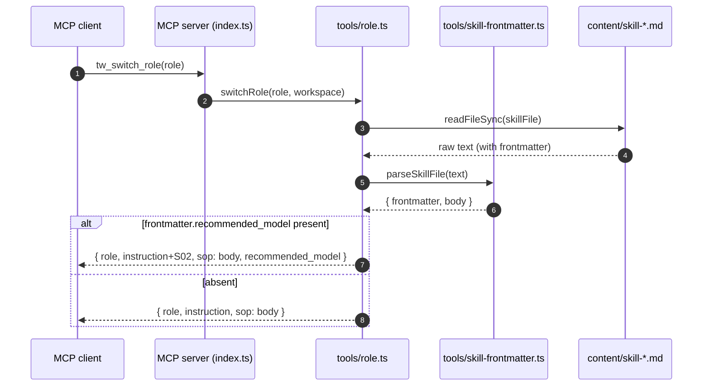
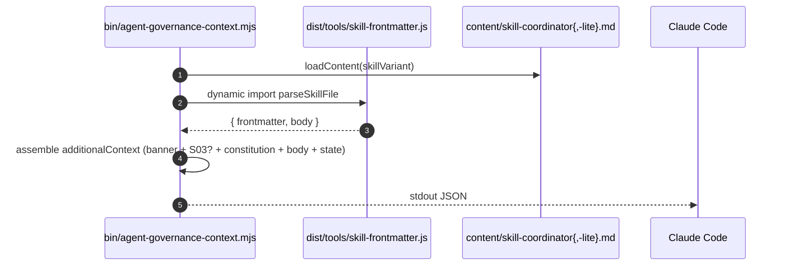

# Architecture: Per-Role Model Routing

Pairs with `specs/model-routing.md` (PRD). Implementation blueprint for
sr-engineer.

## Affected Files

**New**
- `tools/skill-frontmatter.ts` — shared parser + frontmatter stripper.
  Single source of truth for the skill-file YAML contract.
- `test/skill-frontmatter.test.mjs` — unit tests (qa-engineer owns —
  Constitution §2). Covers parse-positive / no-frontmatter / malformed.

**Modified**
- `tools/role.ts` — import `parseSkillFile`; expose `recommended_model`
  in the JSON response; strip frontmatter from `sop`; append S02 to
  `instruction` when a value is present.
- `prompts/build.ts` — import `parseSkillFile`; strip frontmatter from
  every skill load; append S03-style line `Recommended model for this
  role: <model>.` to the assembled prompt body (between skill body and
  handoff block) when a value is present.
- `bin/agent-governance-context.mjs` — import the **compiled**
  `dist/tools/skill-frontmatter.js` via dynamic import (same hop pattern
  the hook already uses to stay vanilla-ESM); emit S03 line after the
  banner. Falls back silently to no-op when import fails (keeps hook
  resilient — same posture as the existing `if (!constitution || !skill)`
  guard).
- `content/skill-pm.md`, `skill-researcher.md`, `skill-architect.md`,
  `skill-design-auditor.md`, `skill-sr-engineer.md`, `skill-code-reviewer.md`,
  `skill-qa-engineer.md`, `skill-qa-visual.md`, `skill-doc-writer.md`,
  `skill-release-engineer.md`, `skill-coordinator.md`, `skill-coordinator-lite.md`
  — prepend YAML frontmatter block (one key: `recommended_model`).
- `README.md` (or `docs/` equivalent if README delegates) — Per-Role
  Model Routing section per PRD AC5.
- `package.json` — version bump `3.18.x` → `3.19.0`.
- `index.ts` — `Server({ version: "3.19.0" })` literal.

**Untouched (explicit non-goals)**
- `schema/versions.ts` and migration registries — content-only change.
- `tools/handoff.ts`, `tools/tasks-file.ts`, `tools/storage*.ts`,
  `tools/transitions.ts` — no persisted-state schema changes.

## Data Structures

```ts
// tools/skill-frontmatter.ts

export type ModelTier = "opus" | "sonnet" | "haiku";
export const MODEL_TIERS = ["opus", "sonnet", "haiku"] as const;

export interface SkillFrontmatter {
  recommended_model?: ModelTier;
}

export interface ParsedSkillFile {
  frontmatter: SkillFrontmatter;  // empty object when none present
  body: string;                    // skill content with frontmatter stripped
}
```

No persisted schema. The frontmatter is in-memory only; the source of
truth is the `.md` file on disk.

## Interface Contracts

```ts
// tools/skill-frontmatter.ts

/**
 * Parse a skill markdown file. Recognises a single leading YAML
 * frontmatter block delimited by `---` on its own line (first and second
 * occurrence). Returns body unchanged when no leading `---` is present.
 *
 * Validation:
 *   - `recommended_model` MUST be one of MODEL_TIERS; any other value is
 *     dropped (field omitted from result, body still stripped) and a
 *     single-line warning emitted on stderr. Backwards-compat posture:
 *     never throw on malformed frontmatter.
 *   - Unknown frontmatter keys are tolerated and ignored (forward-compat
 *     reserve for follow-up fields).
 *
 * Pure function — no I/O.
 */
export function parseSkillFile(text: string): ParsedSkillFile;
```

Caller contract changes:

```ts
// tools/role.ts — switchRole() return shape (additive)
{
  role: RoleName;
  instruction: string;            // S02 appended IFF recommended_model defined
  sop: string;                    // body only (frontmatter stripped)
  recommended_model?: ModelTier;  // NEW — omitted when absent (NOT null)
}

// prompts/build.ts — buildPromptForRole(): unchanged signature.
// Internal behavior: parseSkillFile() → stripped body inserted in place
// of the previous raw read; if frontmatter.recommended_model present,
// inject one line `Recommended model for this role: <model>.` between
// skill body and handoff state block.

// bin/agent-governance-context.mjs — emit one extra line in additionalContext:
//   `Recommended model: <model> (tier <tier>)`
// placed immediately after the existing banner / before the constitution dump.
```

## Sequence Diagram





## Decision Records

| Context | Decision | Consequences |
| --- | --- | --- |
| Three call sites (`tools/role.ts`, `prompts/build.ts`, `bin/agent-governance-context.mjs`) all need to strip + parse the same YAML block. | Extract a single `tools/skill-frontmatter.ts` and import it from all three. | One source of truth for the wire contract; the hook pays a one-time dynamic-import cost. Alternative (hand-rolled regex per site) was rejected — three drift surfaces, three test surfaces. |
| YAML parsing library choice. | Reuse `js-yaml` (already a project dependency, declared per `tools/handoff.ts`). | Zero new dependency; consistent error semantics with handoff parsing. Alternative (hand-rolled key=value scanner) rejected — the frontmatter contract may grow (forward-compat reserve note in `parseSkillFile` JSDoc); reusing js-yaml absorbs that growth. |
| Backwards-compat for skill files lacking frontmatter (older workspaces or partial installs that override `.current/skill-*.md`). | Soft-degrade: parser returns `{ frontmatter: {}, body: text }`; callers omit `recommended_model` from output and skip the appended recommendation lines. Never throw. | Old clients + workspace overrides keep working unchanged (PRD AC2 backwards-compat clause). Cost: a missing-frontmatter regression in our own files would silently disable routing — mitigated by qa unit-test that asserts every shipped `content/skill-*.md` parses non-empty frontmatter. |
| Malformed `recommended_model` value (e.g. typo `sonet`). | Drop the field, warn on stderr, still strip the frontmatter block from body. | Resilient — a single typo cannot brick `tw_switch_role`. Trade-off: silent skip is hard to spot in chat; the stderr warning + qa parse-test catch it before ship. |
| Hook (`*.mjs`) is plain ESM JS with no TS compile step. | Hook imports from `dist/tools/skill-frontmatter.js` via dynamic `await import(...)`. | Hook stays vanilla-ESM, no build coupling beyond what already exists (`dist/` is committed). Alternative (duplicate parser as a `.mjs` sibling) rejected — second drift surface. |
| Should `recommended_model` be persisted to handoff state? | No — it's a per-role advisory hint, not a per-feature decision. Persisting would also require a `schema_version` bump (out of scope per PRD). | Lower blast radius (no migration); the hint regenerates fresh per `tw_switch_role` call from the source-of-truth file. |
| Single tier value vs `recommended_model` + `fallback_model`. | Single value only (per PRD Out of Scope). | MVP-strict (Constitution §1). Revisit when a concrete need surfaces; parser already tolerates unknown keys so adding `fallback_model` later costs zero on the parse side. |
| Hook output ordering — S03 line before or after constitution dump? | Before (immediately after banner, ahead of constitution). | High-signal info surfaces early so a human scanning the boot block sees it without scrolling past ~200 lines of constitution. Consistent with PRD AC4 ("on its own line directly after the auto-context banner"). |
| `prompts/build.ts` recommendation line placement. | After skill body, before the handoff state block. | Co-locates the hint with the skill SOP that explains the role; placing it last (after state) would bury it under stale notes. |

## Deferred Resources

PRD's *Dependencies / Prerequisites* lists two references — both internal,
both marked `indexed-in-workspace`. No external (`http`, Figma, ticket)
references. No `defer` / `ignore` rows. Section intentionally empty —
nothing to surface.

_No deferred external resources._

## Open Questions

_None._ All design decisions resolved inline in *Decision Records*.
