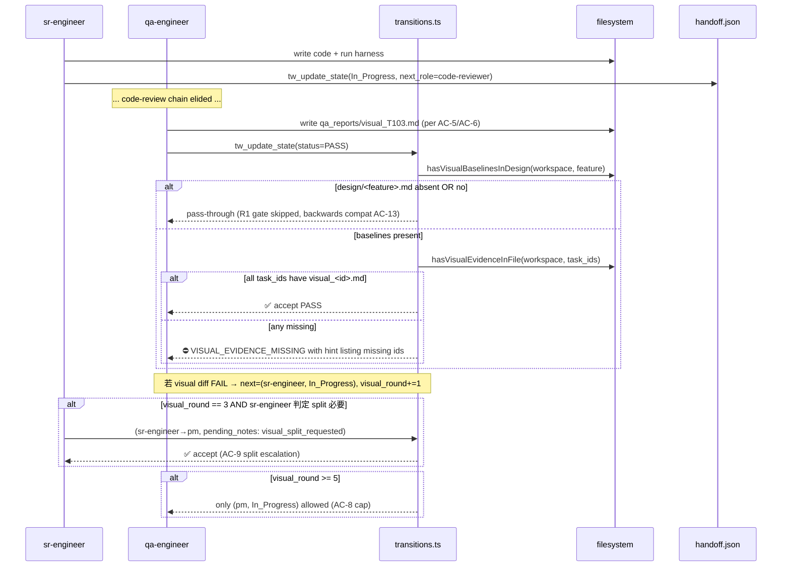

# pixel-perfect-fixes-v3.14 — Architecture

## Affected Files

### Skill / Constitution（markdown，無代碼）
- `content/constitution.md` — T100：§1 MVP exception block；§3.1 visual_round 子迴圈規約；§4 routing chain note。
- `content/skill-pm.md` — T101：Spec Schema 新增 `## Visual Widgets` H2 段定義 + R5 cross-ref 註解。
- `content/skill-design-auditor.md` — T102：擴展 extraction contract，加入 widget-shape 抽取 + heuristics 表 + 寫入 `## Visual Widgets` 段。
- `content/skill-architect.md` — T103：Artifact Schema 新增 `## Visual Harness` 必填段 + harness 任務必先於 widget 任務之規約。
- `content/skill-sr-engineer.md` — T104：SOP 新增 Phase 0.5 Design-Aware Pre-Flight。
- `content/skill-qa-engineer.md` — T105：Phase 1.5 從 lazy-skip 改 PASS-gated；明訂 `visual_<task-id>.md` 產出契約。
- `content/skill-qa-visual.md` — T105：新增 widget-shape per-row checklist 驗證；輸出格式契約。

### Server（TypeScript）
- `schema/versions.ts` — T106：`CURRENT_VERSIONS.handoff: 2 → 3`。
- `schema/migrations-handoff.ts` — T106：註冊 v2→v3 migration，補 `visual_round: 0`。
- `tools/handoff.ts` — T106：parse/serialize `visual_round`，與 `qa_round` / `review_round` 同位階。
- `tools/transitions.ts` — T107：
  - 加 `VISUAL_ROUND_CAP = 6`（5 輪 + 1 失敗緩衝，對齊既有 `ROUND_CAP=4` 邏輯）。
  - `TransitionRequest` 加 `prev_visual_round: number` 與 `next.visual_round` 計算。
  - `computeNewRound` 加 visual_round 規則。
  - `validateTransition` 加 round-cap 與 split-escalation 處理。
  - 新出口 `validateVisualEvidenceGate()` — 純函數，吃 workspace_path + active_feature + task_ids，回 `{ok, missing}`。
- `tools/evidence-file.ts` — T107：新增 `hasVisualEvidenceInFile()` + `hasVisualBaselinesInDesign()`。
- `index.ts` — T107：handler 在 PASS attempt 時呼叫 visual gate；T110 升版本 literal。

### Spec / Test / Doc
- `specs/qa-flow-enforcement-architecture.md` — T108：補 visual_round transition matrix。
- `test/visual-evidence-gate.test.mjs` — T109 新檔。
- `test/visual-round-transitions.test.mjs` — T109 新檔。
- `test/widget-shape-spec.test.mjs` — T109 新檔（解析 skill-pm + skill-design-auditor 文字 contract）。
- `test/phase-0-5-sop.test.mjs` — T109 新檔（解析 skill-sr-engineer SOP）。
- `test/handoff-versioning.test.mjs` — T109 修改：加 v2→v3 case。
- `CHANGELOG.md` / `README.md` — T110。
- `package.json` — T110：`3.13.0 → 3.14.0`。

## Data Structures

### Handoff schema v3（新增欄位，純加法）
```typescript
interface HandoffStateV3 {
  schema_version: 3;
  active_feature: string;
  status: StatusName;
  last_agent: AgentName | null;
  last_updated: string;
  prd_path?: string;
  completed_tasks: string[];
  pending_notes: string[];
  qa_round: number;
  review_round: number;
  visual_round: number;  // NEW — defaults to 0; bumped per AC-8
}
```

### Transition request 擴充
```typescript
interface TransitionRequest {
  prev: TransitionTuple;
  next: TransitionTuple;
  prev_qa_round: number;
  prev_review_round: number;
  prev_visual_round: number;  // NEW
}

interface TransitionRejection {
  error:
    | "TRANSITION_REJECTED"
    | "QA_ROUND_EXCEEDED"
    | "REVIEW_ROUND_EXCEEDED"
    | "VISUAL_ROUND_EXCEEDED"      // NEW
    | "VISUAL_EVIDENCE_MISSING"    // NEW (R1)
    | "VISUAL_WIDGETS_UNVERIFIED"  // NEW (R6) — content-level, see Open Questions § A
    | "AGENT_ID_REQUIRED";
  attempted: { /* + visual_round?: number */ };
  allowed: Array<{ new_agent: AgentName; new_status: StatusName }>;
  hint: string;
}
```

### Visual gate result（新純函數）
```typescript
interface VisualEvidenceCheck {
  ok: boolean;
  has_baselines: boolean;     // design/<feature>.md 是否含 ## Visual Baselines
  baselines_path: string;     // 解析後的 design 檔路徑
  missing_reports: string[];  // PASS 涉及之 task_ids 中無 visual_<id>.md 者
  hint: string;
}
```

## Interface Contracts

### `tools/evidence-file.ts` 新增
```typescript
// 檢查 design/<feature>.md 是否宣告 Visual Baselines。
// 不解析 baseline rows；只偵測 H2 是否存在 → R1 觸發判定夠用。
export function hasVisualBaselinesInDesign(
  workspacePath: string,
  activeFeature: string,
): { present: boolean; designPath: string };

// 鏡像 hasEvidenceInFile，僅路徑換為 qa_reports/visual_<task-id>.md。
export function hasVisualEvidenceInFile(
  workspacePath: string,
  taskIds: string[],
): { present: string[]; missing: string[] };
```

### `tools/transitions.ts` 新增
```typescript
// AC-10 主入口；handler 在 PASS attempt 後呼叫一次。
export function validateVisualEvidenceGate(
  workspacePath: string,
  activeFeature: string,
  taskIdsForRound: string[],
): VisualEvidenceCheck;

// computeNewRound 改簽（向後相容；舊呼叫端 prev_visual_round 視為 0）。
export function computeNewRound(
  prev_qa_round: number,
  prev_review_round: number,
  prev_visual_round: number,
  next: TransitionTuple,
  prev?: TransitionTuple,
): { qa_round: number; review_round: number; visual_round: number };
```

### `tools/handoff.ts` parse 路徑
- v2→v3 migration：`{ ...payload, visual_round: 0, schema_version: 3 }`。
- write 路徑無條件帶 `visual_round`；無欄位舊檔 lazy migrate（既有 pattern）。

## Sequence Diagram



## Decision Records

| Context | Decision | Consequences |
|---|---|---|
| 如何讓 server 知道 `## Visual Baselines` 存在 | 在 PASS attempt 時 grep `design/<active_feature>.md` 之 H2 行 | + 單一真相源（design 檔）；+ design-auditor 不需寫 handoff，維持角色分離；− 每次 PASS 多一個 fs.readFile。可忽略（< 1ms） |
| `visual_round` 儲存位置 | 加在 handoff JSON 與 `qa_round` / `review_round` 並列 | + schema 一致；+ 既有 migration 機制可重用；− 需要 schema bump（v2→v3）。可接受 |
| widget-shape 驗證解析策略（R6） | **延後**到 SOP-level（skill-qa-visual 強制 checklist），server 不解析 | + 避免 server 解析 markdown 報告（脆弱）；+ qa-engineer 是仲裁者；− `VISUAL_WIDGETS_UNVERIFIED` 不能 server-enforce。詳 Open Questions §A |
| `VISUAL_ROUND_CAP` 數值 | `6`（spec 寫 5，cap 設 6 對齊既有 `ROUND_CAP=4`/3 輪 FAIL 之 off-by-one pattern） | + 與 `qa_round` cap 邏輯對稱；+ Round 1-5 允許 visual diff 迭代，Round 6 才 lock 到 PM；− 必須在 §3.1 文字明確標示 “5 輪 = 第 6 次寫入時 lock” |
| R4a split escalation 觸發點 | `visual_round >= 3` 時，`(sr-engineer, In_Progress) → (pm, In_Progress)` 自動允許；pending_notes 需含 `visual_split_requested:` | + 不需新 status；+ 重用 PM rebudget 邏輯；− split 與 threshold 重談共用同一條 transition，靠 pending_notes 區分；qa-flow doc 須明文 |
| 是否在 R1 同 attempt 檢查 widget 形狀（AC-6） | server **不檢查**，僅 file-existence + size > 0；內容由 qa-engineer 簽核 | + 與既有 `hasEvidenceInFile` 行為一致（“existence sufficient”）；− R6 依賴 qa-engineer 誠實。可由 doc-writer 後續加 lint 工具 |
| 為何不擴 `code-reviewer` 做 visual review | 維持 clean-context property（per report Alternatives A2） | + 不破壞 code-reviewer 設計目的；− visual review 完全落 qa-engineer 肩上。可接受 |
| migration 步進 | 只走 v2→v3 一步；不批次 | + 與既有 schema-versioning runner 規約一致；+ 測試容易；− 未來 v3→v4 仍需新 migration 步 |

## Deferred Resources

_本 feature spec 之 Dependencies / Prerequisites 列零個 external ref（research 檔已在 workspace）。本段空，per Artifact Schema 允許。_

## Open Questions

_（none — 所有設計決策已透過 Question Batch 鎖定或在 Decision Records 中明確記錄）_

### §A 註記：R6 server enforcement 為何放棄

雖然 R6 spec 描述「widget-shape 缺漏應 server FAIL」，本架構決定**降級為 SOP-level 強制**：

1. server 解析 markdown 報告內容是脆弱的（headings 變動、checklist 標記不同步）。
2. qa-engineer 是 PASS 的 sole authority（per §3.1）；違反 SOP 等同其他 qa-engineer 違規，由 process review 處理（且本 release T109 之 widget-shape-spec.test.mjs 會 lint skill-qa-visual SOP 是否含 checklist 段，確保**規約存在**）。
3. 若未來要 server-enforce，可在 v3.15 加 `VISUAL_WIDGETS_UNVERIFIED` 處理 — interface 已預留。

非 open question，僅紀錄為知情選擇；qa-engineer + qa-visual SOP 強制的 checklist 即為 R6 的實作。

---

Next role: **sr-engineer** — 依任務順序 T100 → T110 實作。T100/T101/T103/T104/T105 為 markdown 規約檔，無建置；T106/T107/T109 為 TS + 測試（需 `npm run build` 通過 + `npm audit`）；T108/T110 為文件 + 版本 wiring。

— @architect
