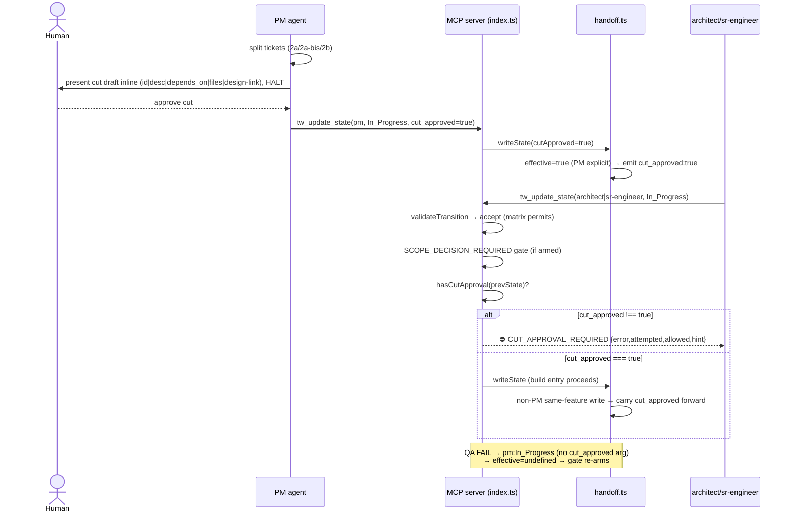

# Architecture: PM Ticket-Cut Approval Gate

> v1.0 — authored 2026-06-26 by @architect
> Spec: `specs/pm-cut-approval-gate.md` (v1.0, @pm). Scope attested `single-feature`.
> Schema: handoff **v4 → v5** (`cut_approved` boolean; absence === unapproved).

This is server-internal architecture. No UI, no external design source. All
output surfaces are MCP error envelopes and SOP text. The feature adds a
second handler-side sub-gate on the build-entry edge, modeled 1:1 on the
existing `SCOPE_DECISION_REQUIRED` gate.

---

## Affected Files

| File | Change | Why |
|---|---|---|
| `schema/versions.ts` | `CURRENT_VERSIONS.handoff` `4 → 5` | bump target version (AC-6) |
| `schema/migrations-handoff.ts` | register `v4 → v5` (stamp-only, seeds nothing) | lazy migrate-on-read (AC-6, AC-7) |
| `tools/handoff.ts` | add `cut_approved?: boolean` to `HandoffState`; parse it; add `cutApproved?: boolean` to `WriteHandoffStateOptions`; emit + **feature-scoped preserve** in `writeHandoffState`; thread through the migration write-back call | write path + reset semantics (§1) |
| `tools/evidence-file.ts` | add `hasCutApproval(handoffState)` helper | gate predicate, mirrors `hasScopeDecision` |
| `index.ts` | add `cut_approved` zod field + JSON descriptor; add `CUT_APPROVAL_REQUIRED` sub-gate after the scope-decision gate; pass `cutApproved` into `storage.writeState` | server gate (§2), write path (§1) |
| `tools/transitions.ts` | add `"CUT_APPROVAL_REQUIRED"` to the `TransitionRejection["error"]` union (handler-side only; NOT produced by `validateTransition`) | type narrowing + envelope consistency |
| `content/skill-pm.md` | new SOP step 7a (inline cut draft + halt + set `cut_approved`); design-link rule when arm active | AC-3, AC-4, AC-5 |
| `content/skill-coordinator.md` | Auto-Routing stop-condition entry (S04) | AC-8 |
| `content/skill-coordinator-lite.md` | halt instruction (SOP-ceiling for lite) | AC-3, §3 |
| `docs/schema-versions.md` | document the v5 bump | release hygiene (§5) |
| `test/*.test.mjs` | gate fire/clear, reset semantics, migration purity | AC-1/2/6/7 |

**Not touched (by design, per spec Out of Scope):**
- `tools/storage-sqlite.ts` — `cut_approved` is handoff-YAML only. The SQLite
  `writeState` reads named fields off the options object; an unrecognized
  `cutApproved` key is silently ignored. No column, no SQLite migration. (D5)
- `validateTransition` in `tools/transitions.ts` — stays pure / fs-free. The
  `pm:In_Progress` matrix row already permits both build targets (spec
  §Transition matrix). The gate is handler-side only.

---

## Data Structures

### `HandoffState` (tools/handoff.ts) — new field

```ts
// Ticket-cut approval attestation (handoff schema v5, pm-cut-approval-gate).
// Set to `true` by the PM on its pm:In_Progress write AFTER presenting the
// cut draft inline and obtaining human approval. Satisfies the
// CUT_APPROVAL_REQUIRED gate on the build-entry edge.
// ABSENT by default — undefined === "no approval recorded" === gate may fire.
// Pure boolean: the ONLY meaningful set value is `true`. A literal `false`
// is treated identically to absence by the gate (gate fires unless === true).
// FEATURE-SCOPED (see §Reset semantics): NOT preserved across an
// active_feature change; reset to undefined on a fresh feature, a fresh PM
// entry from a non-pm predecessor, and a QA-FAIL re-entry to PM.
cut_approved?: boolean;
```

### `WriteHandoffStateOptions` (tools/handoff.ts) — new field

```ts
// v5 — cut-approval attestation. Emitted into frontmatter only when === true.
// Unlike scope_decision, this field is NOT blindly preserved across omitting
// writes — see the feature-scoped preserve rule in writeHandoffState (§1).
cutApproved?: boolean;
```

### Migration (schema/migrations-handoff.ts) — new step

```ts
// v4 → v5: add optional cut_approved attestation (pm-cut-approval-gate).
// Additive STAMP-ONLY: bumps the version, seeds NO default for cut_approved.
// Absence is the unapproved sentinel (AC-7) — a defaulted `false` would be a
// redundant materialization of absence and a defaulted `true` a false
// attestation, so we add nothing. Mirrors the v3→v4 scope_decision pattern.
registerMigration<Record<string, unknown>, Record<string, unknown>>({
  kind: "handoff",
  from: 4,
  to: 5,
  up: (input) => ({ ...input, schema_version: 5 }),
});
```

### Error envelope (index.ts) — new shape, identical to `SCOPE_DECISION_REQUIRED`

```ts
{
  error: "CUT_APPROVAL_REQUIRED",
  attempted: { prev_agent, prev_status, new_agent, new_status },
  allowed: ALLOWED_TRANSITIONS.get("pm:In_Progress")
            .map(c => ({ new_agent: c.agent, new_status: c.status })),
  hint: /* S02 */,
}
```

---

## Interface Contracts

### `hasCutApproval` (tools/evidence-file.ts) — NEW

```ts
// pm-cut-approval-gate. Reports whether the PREV handoff state carries an
// explicit cut approval. Pure equality check — never touches the filesystem,
// never throws. The handoffState passed in is the already-parsed PREV state
// (the attestation must have been recorded by the preceding pm:In_Progress
// write), mirroring hasScopeDecision's prev-state contract.
export function hasCutApproval(
  handoffState: { cut_approved?: boolean } | null | undefined,
): boolean {
  return handoffState?.cut_approved === true;
}
```

Strict `=== true`: absence (`undefined`) and a literal `false` both fail the
gate. There is no filesystem fallback (unlike `hasScopeDecision`, which also
honors `.current/feature-split.md`) — cut approval is a pure boolean with one
source of truth, the handoff field.

### `writeHandoffState` reset/preserve rule (tools/handoff.ts) — see §1.

### `tw_update_state` zod field (index.ts) — NEW

```ts
// v5 — cut-approval attestation (pm-cut-approval-gate). PM sets
// cut_approved: true on its pm:In_Progress write AFTER inline cut draft +
// human approval, to clear the CUT_APPROVAL_REQUIRED gate.
cut_approved: z.boolean().optional(),
```

---

## §1 — `cut_approved` write path and reset semantics

### Write path

1. **Client surface:** new optional `cut_approved: z.boolean().optional()` on
   the `tw_update_state` zod schema + a JSON tool descriptor entry (mirrors
   `scope_decision` at index.ts:473-482).
2. **Handler:** the existing `storage.writeState({...})` call (index.ts:1099)
   gains `cutApproved: parsed.cut_approved`.
3. **Persistence (tools/handoff.ts):** `writeHandoffState` emits
   `cut_approved: true` into the YAML frontmatter **only when the effective
   value is `true`** (guard the write exactly like `scope_decision`: a falsy
   value is indistinguishable from "not set", so never emit `false`).
4. **Parse (tools/handoff.ts):** read `frontmatter.cut_approved`, coerce to a
   strict boolean — `cut_approved === true` only when the YAML value is
   boolean `true` (js-yaml parses bare `true`); anything else → `undefined`
   (field omitted from the state object via the spread-guard pattern at
   handoff.ts:157).

Canonical setter: `tw_update_state(agent_id="pm", status="In_Progress",
active_feature=<f>, cut_approved=true)`. This is the PM's post-approval write.

### Reset semantics (the load-bearing part)

A stale `true` carried across features would defeat the gate. `scope_decision`
today is **preserved** across omitting writes (handoff.ts:415-429 re-reads the
existing value when the option is `undefined`). For `cut_approved` we must NOT
copy that behavior wholesale, because the gate's correctness depends on the
flag being false-by-default for each new build entry.

**Rule: `cut_approved` is FEATURE-SCOPED, not write-sticky.** In
`writeHandoffState`, compute the effective value as:

```text
effectiveCutApproved =
  if cutApproved option is explicitly provided  → use it (true → emit; false/undefined → absent)
  else if existing.active_feature === activeFeature (this write)  → preserve existing.cut_approved
  else  → undefined   (active_feature changed → drop the stale approval)
```

This yields the three required reset points precisely:

| Trigger | Mechanism | Result |
|---|---|---|
| **New `active_feature`** | the omitting-write preserve branch compares the incoming `active_feature` to the on-disk one; mismatch → drop | `cut_approved` resets to `undefined`. Gate re-arms for the new feature. |
| **Fresh PM entry from a non-pm predecessor** (e.g. researcher→pm, qa PASS→pm) | PM's `pm:In_Progress` write that does NOT pass `cut_approved` AND lands on a different feature drops it; if same feature, PM must re-approve by explicitly passing `cut_approved=true` (it is the PM's own SOP step 7a, so this is intended — see note) | resets unless PM re-affirms |
| **QA FAIL re-entry to PM** (`qa-engineer:FAIL → pm:In_Progress`, same feature) | the qa-engineer FAIL write does not carry `cut_approved`; on the **same** feature it would be preserved by the rule above — so we add an explicit drop: **any write whose `agent_id === "pm"` and `status === "In_Progress"` and does NOT explicitly pass `cut_approved` resets it to `undefined`** | resets — PM must re-present and re-approve the (possibly re-cut) tickets |

**Consolidated effective-value algorithm** (the implementable form):

```text
if option cutApproved === true        → effective = true        (PM approving now)
else if writing agent_id === "pm" and status === "In_Progress"
                                       → effective = undefined   (every PM re-entry re-arms the gate)
else if existing.active_feature === activeFeature
                                       → effective = existing.cut_approved  (carry within a feature for non-PM writes)
else                                   → effective = undefined   (feature changed → drop)
```

Rationale for the PM-re-entry clause being unconditional: the only legitimate
way `cut_approved` becomes `true` is a PM write that *explicitly* passes it
after inline approval (SOP step 7a). Therefore "PM entered In_Progress without
passing `cut_approved=true`" universally means "no fresh approval yet" — across
new features, QA-FAIL bounces, and scope-rework loops alike. Collapsing all
three reset triggers into this one clause makes the reset total and removes any
window where a stale `true` survives a PM bounce. Non-PM writes within the same
feature (architect→sr-engineer self-progression after the gate already
cleared) carry the `true` forward so the gate does not re-fire mid-build.

> `writeHandoffState` already performs one existing-state read for the
> prd_path/scope_decision preserve logic (handoff.ts:420); the
> `active_feature` comparison reuses that same `parseHandoff` result — no
> extra I/O.

---

## §2 — Server gate placement and composition with the scope-decision gate

### Placement

Immediately AFTER the `SCOPE_DECISION_REQUIRED` block (index.ts:761-797),
before the evidence blocks. Same edge predicate:

```ts
if (
  (nextTuple.agent === "architect" || nextTuple.agent === "sr-engineer") &&
  nextTuple.status === "In_Progress" &&
  prevTuple.agent === "pm" &&
  prevTuple.status === "In_Progress"
) {
  if (!hasCutApproval(prevState)) {
    // build CUT_APPROVAL_REQUIRED envelope (S02 hint) and return isError
  }
}
```

`prevState` is the parsed PREV handoff (already loaded at index.ts:723). The
approval must have been recorded by the **preceding** `pm:In_Progress` write —
identical prev-state contract to `hasScopeDecision`. Pinning `prev=pm` keeps
resume/re-entry safe: `architect→sr-engineer` and the sr self-loop have a
non-pm predecessor and are never gated.

### Composition with the scope-decision gate (SAME edge)

Both gates fire on the exact same edge. They are **independent and ordered**:

| Property | Scope-decision gate | Cut-approval gate |
|---|---|---|
| Error code | `SCOPE_DECISION_REQUIRED` | `CUT_APPROVAL_REQUIRED` |
| Predicate | `arm.required && !hasScopeDecision(...)` | `!hasCutApproval(prevState)` |
| Arm condition | only when `hasDesignModeRequiringVisual().required` | **unconditional** — every build entry, design or not |
| Order | runs first (existing position) | runs second (added directly after) |

**Ordering decision (D1):** scope-decision first, cut-approval second. The two
are orthogonal checks with distinct error codes; a caller hitting both gets the
scope error first, fixes it, then hits the cut error on retry. This is
acceptable (and matches how the round-cap → scope-decision → evidence chain
already surfaces one rejection at a time). We deliberately do NOT merge them
into a combined envelope: independent codes keep each gate's hint actionable
and let tests assert each in isolation.

**Arm-condition decision (D2):** the cut-approval gate is **unconditional** —
it fires on every `pm→build` edge regardless of design mode, because human
approval of the cut is valuable for non-visual features too (the spec's user
stories are mode-agnostic). This differs from the scope-decision gate, which
only arms under `hasDesignModeRequiringVisual()`. Consequence: a purely
non-visual feature that today sails through `pm→sr-engineer` will now require
`cut_approved=true`. This is intended (it is the whole point of the feature)
and is called out in the migration note + skill update so existing chains know
to set the flag.

---

## §3 — Lite / in-context enforcement

**Decision (D3): option (b) — SOP-level is the accepted enforcement ceiling
for lite. No complementary server gate is added.**

### Why not a complementary tool-surface gate

The spec offers two candidates for a complementary mechanism: gate at
`tw_add_task` or at `tw_get_next_task`. Both fail:

1. **`teamwork-lite` is server-read-only by design** (CLAUDE.md: "no `agent_id`
   in the routing chain", "server-read-only by design"). Lite mode does not
   call mutating `tw_*` tools at all — it reads state and executes directly. A
   gate on `tw_add_task` / `tw_get_next_task` would not be reached because lite
   does not route through task mutation as a build-entry signal. Gating those
   surfaces would instead penalize the **full** coordinator chain (which legit-
   imately adds tasks during PM work) without catching lite at all — net
   negative.

2. **No transition edge exists to intercept.** The entire server-side
   enforcement model is the transition matrix + handler sub-gates keyed on
   `(prev_agent, prev_status) → (next_agent, next_status)`. Lite emits no
   `tw_update_state`, so there is structurally no tuple to gate. This is the
   *same* limitation the scope-decision gate already documents
   (transitions.ts:68-74 / spec §Lite-mode enforcement) — we inherit it rather
   than invent a parallel, leakier mechanism.

3. **A read-surface gate (e.g. on `tw_get_state`) is a non-starter** — the
   pre-flight protocol mandates `tw_get_state` as the first action of *every*
   agent; gating it would break the read-only contract and the pre-flight guard
   simultaneously.

### What lite DOES get

SOP-level enforcement in two files:
- `content/skill-pm.md` step 7a — the cut-draft-and-halt instruction is in the
  PM SOP, which lite-mode PM work loads.
- `content/skill-coordinator-lite.md` — an explicit halt instruction: before
  nominating a build role / executing build work, present the cut draft inline
  and obtain human approval.

### Trade-off, stated plainly

| | Transition-gated (full chain) | SOP-ceiling (lite) |
|---|---|---|
| Enforcement | server-hard (cannot bypass from client) | advisory (agent must comply) |
| Bypass risk | none on the gated edge | an agent ignoring SOP can skip it |
| Consistency | — | **identical posture to the existing scope-decision gate**, so we add no new asymmetry |

Accepting the SOP ceiling for lite keeps lite's read-only contract intact and
matches the precedent the scope-decision gate already set. The full chain — the
path that consumes the most engineer context, which the research cites as the
checkpoint that matters — remains server-hard-gated. (Spec AC-3 explicitly
endorses this: "the SOP text is the enforcement mechanism for these paths.")

---

## §4 — Design-link auto-determination

**Decision (D4): SOP-only. The server gate checks `cut_approved`, NOT
per-ticket link presence.** (Spec Out of Scope: "Per-ticket Figma link
validation at the server level … the node-id convention is SOP-enforced only.")

### Where it is enforced

`content/skill-pm.md` step 7a. When the PM builds the inline cut draft, it
calls the existing `hasDesignModeRequiringVisual()` arm signal (conceptually —
the PM reasons from the design file's Mode line; no new code). When armed
(`mode != no-design`):

- tickets that touch a visual surface MUST carry a Figma **node id + URL** in
  the `design-link` column;
- tickets that do not touch a visual surface carry `—`.

### Node-id convention (align with baseline-manifest gate)

The baseline-manifest gate (`tools/evidence-file.ts` §v3.40.0,
`parseBaselineManifestRows`) reads the design-auditor's `## Source` manifest,
whose `pointer` / `node-id` column holds the frozen Figma node id (medium
`figma`, status `audited`). The PM cut-draft `design-link` column MUST use the
**same node-id token** — i.e. the Figma `node-id` (e.g. `12:345`) plus the
canonical Figma URL form
`https://www.figma.com/design/<fileKey>/<name>?node-id=<node-id>`. This keeps
the PM's per-ticket link, the design-auditor's frozen `## Source` pointer, and
the eventual `mcp__figma__download_figma_images` node id all referring to the
same identifier, so a reviewer can trace ticket → baseline row → capture
without reconciling three notations.

No server check is added: per spec Out of Scope, the server gate validates the
boolean `cut_approved`, not link presence. The convention lives in the PM SOP
text only.

---

## §5 — Schema migration (handoff v4 → v5)

| Change | File | Detail |
|---|---|---|
| Bump target | `schema/versions.ts` | `CURRENT_VERSIONS.handoff: 4 → 5` |
| Register step | `schema/migrations-handoff.ts` | `v4→v5` stamp-only `up: (input) => ({ ...input, schema_version: 5 })` |
| Default for `cut_approved` on legacy files | — | **none** — field stays absent; absence === unapproved (AC-6, AC-7). A defaulted `false` is a redundant materialization of absence; never seed it. |
| Migration purity | — | only `schema_version` changes; no existing field touched or removed (AC-7). Mirrors v3→v4 exactly. |
| Write-back threading | `tools/handoff.ts` | `readHandoffState`'s migration heal-write (handoff.ts:216-230) currently uses the **positional** `writeHandoffState` overload, which has no `cutApproved` slot. Since legacy files seed no `cut_approved`, the heal-write correctly omits it (effective value resolves to existing/undefined). No positional-param addition required; if a new call site needs it, prefer the options-object overload. |
| `tools/storage-sqlite.ts` | — | **no SQLite schema migration** — `cut_approved` is handoff-YAML only (spec Out of Scope). `CURRENT_VERSIONS.sqlite` stays `2`. |
| Docs | `docs/schema-versions.md` | add a v5 row: "handoff v5 — `cut_approved?: boolean`, absence === unapproved; v4→v5 stamp-only, seeds nothing." |

**Concurrent-bump check (spec §Schema version bump):** `CURRENT_VERSIONS.handoff`
is `4` on `main`; the incomplete task list (`T-ORM-*`, `T-PGAT-*`) shows no
other in-flight feature touching the handoff version. v5 is uncontested.

---

## Sequence Diagram



---

## Decision Records

| Context | Decision | Consequences |
|---|---|---|
| Two gates on the same `pm→build` edge | Run scope-decision first, cut-approval second; independent error codes, no merged envelope (D1) | One rejection surfaces at a time; each hint stays actionable; tests assert each in isolation. A caller failing both retries twice. |
| Should cut-approval arm only on visual features (like scope-decision)? | **Unconditional** — fires on every `pm→build` edge regardless of design mode (D2) | Non-visual features now also require `cut_approved=true`. Intended; flagged in migration note + skill update so existing non-visual chains add the flag. |
| `scope_decision` is preserved across omitting writes; should `cut_approved` be too? | **No — feature-scoped.** Reset to `undefined` on every PM `In_Progress` write that doesn't explicitly pass it, and on any `active_feature` change | Closes the stale-`true` hole. PM must re-approve after QA-FAIL bounce / scope rework / new feature. Adds one `active_feature` comparison reusing the existing state read (no extra I/O). |
| Lite / in-context enforcement mechanism | **SOP-ceiling (option b); no complementary server gate** (D3) | Lite stays read-only; matches existing scope-decision posture. Advisory-only for lite — an agent ignoring SOP can skip it. Full chain remains server-hard-gated. |
| Per-ticket design-link enforcement level | **PM SOP only; server checks the boolean, not link presence** (D4) | Server stays a pure boolean gate; node-id convention reuses the baseline-manifest `## Source` pointer token so ticket→baseline→capture all share one node id. No false negatives from server-side link parsing. |
| SQLite `cut_approved` column | **Not added** — handoff-YAML only (D5) | `cutApproved` option silently ignored by SQLite `writeState`; `CURRENT_VERSIONS.sqlite` unchanged. Matches the `scope_decision`-style "frontmatter-only" precedent the spec calls for. HTTP/SQLite-mode deployments do not enforce this gate via the DB — acceptable, as the gate reads the parsed prev-state which in SQLite mode also lacks the field (gate would always fire in SQLite mode unless field surfaced). **See Open-risk note below.** |

> **Open-risk note (NOT an open question — resolved):** In SQLite mode the
> parsed prev-state has no `cut_approved`, so `hasCutApproval` always returns
> false and the gate would block every build entry. The spec explicitly scopes
> this feature to file-mode handoff YAML (Out of Scope: "the field lives in the
> handoff YAML frontmatter only"). SQLite/HTTP mode is the multi-client server
> deployment, not the single-workspace file mode where the PM-cut chain runs.
> The gate predicate therefore should **only arm in file-storage mode**: guard
> the cut-approval block with a storage-kind check (e.g. skip when the active
> storage is SQLite), OR accept that SQLite mode does not run the PM cut chain.
> **Resolution: gate the cut-approval block to file-mode only** — add the
> check that the cut-approval sub-gate is skipped when `getActiveStorage()` is
> the SQLite implementation, consistent with `cut_approved` being a
> file-frontmatter-only field. sr-engineer: implement the storage-mode skip
> alongside the gate. This is a concrete instruction, not an unresolved
> question.

---

## Deferred Resources

| Resource | PM classification | Reason |
|---|---|---|
| `research/ticket-splitting-for-ai-agents.md` | on-disk, no fetch | Spec §Research reference: rationale only, already on-disk, no external URL. Consumed as motivation; no action required by sr-engineer. |

No external URLs, design files, or tickets in the spec's *Dependencies /
Prerequisites* were marked `ignore`/`defer` beyond the on-disk research note
above. No leftover unclassified external references (Constitution §7 satisfied).

---

## Open Questions

_None._ The lite-enforcement tension (spec's flagged hard decision) is resolved
in §3 (D3). The SQLite-mode interaction is resolved as a concrete file-mode-only
gate instruction in the Decision Records open-risk note. The blueprint is ready
for sr-engineer.
