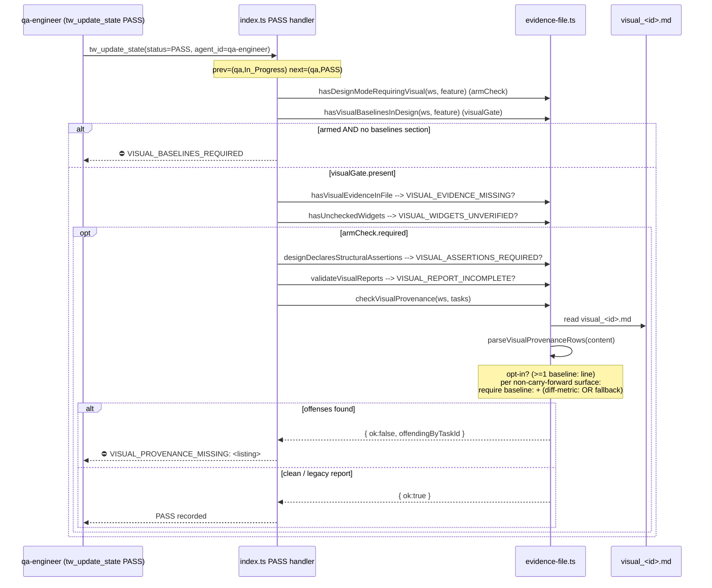

<!-- @architect | feature_id: qa-visual-baseline-provenance | created_at: 2026-06-16 -->

# Architecture: qa-visual-baseline-provenance

Blueprint for closing finding #1 of `research/mode-feature-process-retrospective.md`
(P4 / AD-MPVF-4 empty-PASS): make Figma-baseline provenance + diff-execution
machine-verifiable at the server PASS gate. Today the "download a real Figma
export and run a real diff" mandate lives only as SOP prose in
`content/skill-qa-visual.md`; a qa-visual run can write `pass` rows from
token/DOM reasoning alone and the server accepts PASS. This feature adds a
fifth visual sub-gate that parses the visual report's per-surface prose
sub-sections and rejects PASS when a diffed surface carries no `baseline:`
fingerprint or no `diff-metric:` value.

Scope is single-feature and surgical: one new pure parser + composition helper
in `tools/evidence-file.ts`, one new gate block in `index.ts` (reusing the
existing `hasDesignModeRequiringVisual()` arm signal and the same
`visualGate.present`/`armCheck.required` path the four prior visual gates run
in), SOP edits to `content/skill-qa-visual.md` Steps B1/B2, and a new test
file. No schema migration (see D3). No new npm dependency (regex over strings).

---

## Decision Records

| Context | Decision | Consequences |
|---|---|---|
| **D1 — fingerprint form.** Spec offers (a) content-hash, (b) Figma node-id, (c) both. The server cannot reach Figma and explicitly does NOT verify the hash maps to a real node (Out of Scope). The goal is *proof-of-execution*, not proof-of-correctness, at the lowest operator burden that still blocks a blank value. | **Form: EITHER a content-hash OR a Figma node-id, on a single `baseline:` line — not both.** The server validates only **non-emptiness** via a permissive parse: the value after `baseline:` must contain at least one non-whitespace, non-placeholder token. Parse contract: capture the remainder of the `baseline:` line (case-insensitive label, optional leading `-`/`*` bullet and optional surrounding markdown emphasis), trim, strip surrounding backticks, then require it to match `/\S/` AND NOT equal a placeholder token (`<fingerprint>`, `TODO`, `TBD`, `N/A`, `none`, `-`). Validation regex for the label line: `/^\s*(?:[-*]\s*)?(?:\*\*\s*)?baseline(?:\s*\*\*)?\s*[:—-]\s*(.+?)\s*$/im`; emptiness test on the captured group 1 after backtick-strip. | Lowest operator burden of the three options; consistent with the existing permissive `parseDesignMode` style in the same file. Does NOT lock in SHA-256 vs node-id form, so qa-visual may record whichever the B1 tool path naturally produces (odiff/ImageMagick path → file content hash; pure-Figma node path → node id). Accepts that a determined operator could hash a blank PNG or copy a node-id (acknowledged in spec Out of Scope) — the gate raises the cost of empty-PASS from "type prose" to "produce and reference a concrete artifact token", which is the retrospective's actual target. Placeholder blacklist prevents the template stub `baseline: <fingerprint>` from satisfying the gate. |
| **D2 — backwards-compat opt-in (AC-6).** Spec offers (a) design-frontmatter marker, (b) schema/presence-gated, (c) unconditional. Option (c) risks breaking in-flight QA rounds; (a) adds a design-auditor emit step (cross-cutting, out of single-feature scope). | **Option (b) — presence-gated opt-in.** The provenance gate fires only when the report ALREADY contains at least one parseable per-surface prose sub-section carrying a `baseline:` line (i.e. `parseVisualProvenanceRows(content).length > 0`). A legacy report whose `## Region Diff` has table rows but ZERO prose sub-sections with `baseline:` lines yields an empty parse → gate is a no-op for that report. Once any surface declares a `baseline:` line, the whole report opts into strict mode and EVERY non-carry-forward, non-fallback surface in the table must then carry both fields. | Mirrors the established `designDeclaresStructuralAssertions` opt-in pattern (v3.26) and the "existence is sufficient / presence opts in" convention already in `evidence-file.ts`. Zero disruption to in-flight rounds: pre-feature reports written without prose `baseline:` lines pass through unchanged. No new design-auditor step, no frontmatter marker → stays inside single-feature scope. The cutover is automatic: the moment sr-engineer's SOP edit lands and qa-visual starts emitting `baseline:` lines, the gate self-arms per-report. Trade-off closed off vs (a): we accept that a workspace can never be *forced* into strict mode by a design-file flag — but per the constitution the server only puts rules in context and gates execution proof, and a report that emits a `baseline:` line is exactly the report we want to hold to the contract. |
| **D3 — handoff schema_version bump.** Spec asks whether v4→v5 is required. | **No bump. handoff stays at schema_version 4.** Confirmed: the parser reads ONLY `qa_reports/visual_<task-id>.md` (never `handoff.md`), adds NO new handoff field, and the opt-in signal (D2) is derived from the visual report content itself — not from any persisted handoff or design flag. `SCHEMA_VERSIONS.handoff` in `schema/versions.ts` is unchanged; no migration file is added. | Smallest possible blast radius; no `schema/migrations-*.ts` runner touched, no migration test. Consistent with `docs/schema-versions.md` rule that a bump is required only when a persisted artifact's shape changes. AC-10 is satisfied trivially (no migration needed → "handoff files parsed correctly at v4" holds by construction). |
| **D4 — carry-forward exemption + B1-unavailable fallback vs a stricter hard gate.** Spec defaults to exempting carry-forward (AC-3) and accepting the LLM fallback (AC-4). | **Confirm both exemptions; no stricter gate.** (i) Carry-forward surfaces (prose sub-section contains the literal `pass (carried forward — git diff confirms source untouched)`) are EXEMPT from both the `baseline:` and `diff-metric:` requirement — they were already proven in a prior round and Step B0's `git diff` is itself the proof-of-execution. (ii) A surface whose prose sub-section contains the literal `B1 tool unavailable — LLM fallback` SATISFIES AC-2's diff-metric requirement: the LLM path is a valid executable diff path, not an evidence gap. It still requires a `baseline:` fingerprint (the LLM must have read a real baseline image to diff against). | Avoids false-FAILing the two legitimate paths the retrospective explicitly carved out. A stricter gate (require a fingerprint even on carry-forward) would force qa-visual to re-record fingerprints for surfaces it deliberately did NOT re-read — reintroducing exactly the per-round redundancy B10/B11 removed, and contradicting Step B0's "WITHOUT reading its baseline path" mandate. The B1-fallback acceptance keeps the deterministic-tool-first gate optional (Bash may be unavailable) without punishing the agent for a tool gap outside its control. Asymmetry rationale (fallback still needs `baseline:` but not a numeric metric): "I had no diff tool" is a defensible metric gap; "I had no baseline to compare against" is never defensible for a non-carry-forward surface. |

---

## Affected Files

- **`tools/evidence-file.ts`** (modify) — add the `VisualProvenanceRow` interface, the pure parser `parseVisualProvenanceRows(content)`, and the composition helper `checkVisualProvenance(workspacePath, taskIds)`. New code lives at the end of the `// ---------- visual evidence ----------` region, after `validateVisualReports` (the v3.26 block), following the established `parseVisualWidgetsChecklist` / `validateVisualReport` + `validateVisualReports` pure-parser-then-composition pairing.
- **`index.ts`** (modify) — import the new composition helper; add the fifth visual sub-gate block (`VISUAL_PROVENANCE_MISSING`) immediately AFTER the `validateVisualReports` schema check, still inside `if (armCheck.required)` and `if (visualGate.present)`.
- **`content/skill-qa-visual.md`** (modify) — extend Step B1 and Step B2 to mandate the `baseline:` and `diff-metric:` prose lines per surface; add the report-schema note. Pure SOP/doc edit.
- **`test/evidence-provenance.test.mjs`** (create) — unit tests for `parseVisualProvenanceRows` + `checkVisualProvenance` (AC-1..AC-4, AC-6, AC-9).
- **`package.json` / `index.ts` `Server()` literal** (modify) — version bump to `3.38.0` at release time (release-engineer, NOT sr-engineer). Listed for traceability only; `scripts/check-version.mjs` enforces parity.
- **NO** `schema/` change (D3). **NO** new npm dependency (spec Out of Scope).

---

## Data Structures

New TypeScript in `tools/evidence-file.ts`:

```ts
export interface VisualProvenanceRow {
  surfaceId: string;       // surface id from the prose sub-section heading
  fingerprint: string | null;   // value after `baseline:` (backtick-stripped, trimmed); null if no baseline line
  diffMetric: string | null;    // value after `diff-metric:` (trimmed); null if no diff-metric line
  isCarryForward: boolean; // prose contains the literal carry-forward token
  isFallback: boolean;     // prose contains the literal B1-unavailable token
}

export interface VisualProvenanceCheck {
  ok: boolean;
  // task id -> list of surface ids missing required provenance, with the reason
  // (e.g. "checkout-panel: no baseline:"; "hero: no diff-metric:")
  offendingByTaskId: Record<string, string[]>;
}
```

Two module-level literal constants (verbatim from spec Copy/Strings — AC-3/AC-4
require exact-substring match):

```ts
const CARRY_FORWARD_TOKEN = "pass (carried forward — git diff confirms source untouched)";
const B1_UNAVAILABLE_TOKEN = "B1 tool unavailable — LLM fallback";
// placeholder values that must NOT satisfy the non-empty fingerprint test
const FINGERPRINT_PLACEHOLDERS = new Set(["<fingerprint>", "todo", "tbd", "n/a", "none", "-", ""]);
```

---

## Interface Contracts

### `parseVisualProvenanceRows(content: string): VisualProvenanceRow[]` (AC-9 — pure, no I/O)

Pure function over the full visual report string. Returns one row per per-surface
prose sub-section under `## Region Diff`. No filesystem access, no throws.

Algorithm (mirrors `parseVisualWidgetsChecklist` slice-then-scan style):

1. `sliceH2Section(content, "Region Diff")` → the Region Diff section body
   (heading-exclusive, up to next `## ` or EOF). If `null` → return `[]`.
2. **Surface prose sub-section delimiter.** A prose sub-section starts at a
   markdown sub-heading deeper than H2 — `### ` or `#### ` (the SOP says "one
   prose sub-section per surface id"; the surface id is the sub-heading text).
   Split the Region-Diff body into blocks on `/^#{3,6}\s+/m`. Each block's
   heading text (after stripping leading `#`, whitespace, and surrounding
   backticks) is the `surfaceId`; the block body is everything up to the next
   sub-heading.
   - Rationale for anchoring on the sub-heading and NOT the `| surface | result |`
     table row: the table rows are already parsed by `parseRegionDiffFailures`
     for pass/fail; provenance lives in the **prose** sub-sections per the spec
     (AC-1/AC-2 say "in its prose sub-section"). The table cell must stay clean
     (`pass`/`accepted`/`fail` only — Step B2 mandate), so fingerprints can only
     live in prose.
3. For each block, within its body:
   - `isCarryForward` = body contains `CARRY_FORWARD_TOKEN` as a substring.
   - `isFallback` = body contains `B1_UNAVAILABLE_TOKEN` as a substring.
   - `fingerprint` = first `baseline:` label-line match → captured value,
     backtick-stripped + trimmed; `null` if no match OR captured value is empty
     after strip. The label regex:
     `/^\s*(?:[-*]\s*)?(?:\*\*\s*)?baseline(?:\s*\*\*)?\s*[:—-]\s*(.+?)\s*$/im`
   - `diffMetric` = first `diff-metric:` label-line match → captured value,
     trimmed; `null` if absent/empty. Label regex:
     `/^\s*(?:[-*]\s*)?(?:\*\*\s*)?diff-metric(?:\s*\*\*)?\s*[:—-]\s*(.+?)\s*$/im`
4. Non-emptiness for fingerprint additionally rejects `FINGERPRINT_PLACEHOLDERS`
   (lowercased compare) so a template stub never passes.
5. Return all rows (including carry-forward / fallback rows — the *gate*, not the
   parser, applies exemptions). Order: source order.

Return shape exactly `{ surfaceId, fingerprint, diffMetric, isCarryForward, isFallback }[]`
per AC-9.

### `checkVisualProvenance(workspacePath: string, taskIds: string[]): VisualProvenanceCheck` (composition, fs)

Mirrors `validateVisualReports`. For each task id: read `visual_<id>.md` (skip if
absent — existence enforced upstream by `hasVisualEvidenceInFile`), call
`parseVisualProvenanceRows`.

- **Opt-in gate (D2):** if NO row has a non-null `fingerprint` (i.e. the report
  declares zero `baseline:` lines) → this report is legacy/pre-provenance →
  contributes nothing (treated as ok). This makes AC-6 a no-op for legacy reports.
- Once opted in (≥1 `baseline:` present anywhere in the report), for EACH row:
  - `isCarryForward` → exempt (AC-3): skip both checks.
  - else require `fingerprint != null` (AC-1). Missing → push `"${surfaceId}: no baseline:"`.
  - else require `diffMetric != null` OR `isFallback` (AC-2 + AC-4). Missing both →
    push `"${surfaceId}: no diff-metric:"`. (`isFallback` alone satisfies the
    metric requirement even when `diffMetric` is null — D4.)
- A row with NO surfaceId / empty body but that matched a sub-heading is still a
  row; an empty-prose surface that opted the report in via a sibling will surface
  its own `no baseline:` offense.
- `ok` = no offenses across all task ids. Returns `offendingByTaskId` for the
  error listing.

Signature parity with the existing `validateVisualReports(workspacePath, taskIds): VisualReportsCheck`.

---

## Sequence Diagram



---

## Wiring Point (index.ts) — exact edit

**Import (line ~63):** add `checkVisualProvenance` to the existing
`from "./tools/evidence-file.js"` import group alongside `validateVisualReports`.

**Gate block:** insert IMMEDIATELY after the `validateVisualReports` block closes
(after the `VISUAL_REPORT_INCOMPLETE` return, current line 926, before the `}` at
927 that closes `if (armCheck.required)`). It is the FIFTH and LAST visual sub-gate,
running only when armed + baselines present + structural-assertions declared +
schema valid — i.e. it is the most-specific final proof-of-execution check, so it
fires last and only on otherwise-clean reports.

```ts
// v3.38.0 — Baseline provenance gate (qa-visual-baseline-provenance, AC-1/AC-2).
// The v3.27 schema gate confirmed the report's STRUCTURE is complete and every
// row reads pass/accepted; it could NOT confirm the agent diffed a real baseline.
// This gate parses each per-surface prose sub-section under ## Region Diff and
// rejects PASS when a diffed (non-carry-forward) surface lacks a baseline:
// fingerprint or a diff-metric: value. Opt-in (D2): dormant for reports with no
// baseline: line anywhere (legacy/pre-provenance). Carry-forward surfaces are
// exempt (AC-3); a "B1 tool unavailable — LLM fallback" note satisfies the
// metric requirement (AC-4).
const prov = checkVisualProvenance(parsed.workspace_path, parsed.completed_tasks);
if (!prov.ok) {
  const listing = Object.entries(prov.offendingByTaskId)
    .map(([taskId, offenses]) => `${taskId} {${offenses.join("; ")}}`)
    .join(" | ");
  return {
    content: [{
      type: "text" as const,
      text:
        `⛔ VISUAL_PROVENANCE_MISSING: ${listing}. Each diffed surface in ` +
        `qa_reports/visual_<id>.md must carry a baseline: fingerprint and a ` +
        `diff-metric: value in its prose sub-section under ## Region Diff. ` +
        `Carry-forward surfaces (annotated "pass (carried forward — git diff ` +
        `confirms source untouched)") are exempt; "B1 tool unavailable — LLM ` +
        `fallback" satisfies the diff-metric requirement. ` +
        `See specs/qa-visual-baseline-provenance.md.`,
    }],
    isError: true,
  };
}
```

The error string follows the `err.provenance_missing` Copy/Strings row (AC-8,
exact code `VISUAL_PROVENANCE_MISSING`) and the `VISUAL_REPORT_INCOMPLETE`
listing style (`${taskId} {reasons}}` joined by ` | `).

---

## skill-qa-visual.md edits (the exact changes sr-engineer makes — AC-7)

These are pure SOP/doc edits; the server reads them only as the human-facing
contract that PRODUCES the fields the parser reads.

### Edit 1 — Step B1, the at-or-below-threshold branch (current lines 108–110)

The pre-screen `pass` branch currently writes `pre-screened by <tool>: <metric>`.
Extend the prose-sub-section mandate so the recorded note ALSO carries the two
machine-parsed lines. Change the bullet to require, in the surface's prose
sub-section:

```
- baseline: <fingerprint — file content-hash of the downloaded Figma export, OR the Figma node id passed to mcp__figma__download_figma_images>
- diff-metric: <tool numeric output — e.g. "odiff: 0 px (0%)" or "ImageMagick AE: 0">
```

(The existing `pre-screened by <tool>: <metric>` note may remain as human prose;
the new `diff-metric:` line is what the parser reads.)

### Edit 2 — Step B1, the tool-unavailable fallback branch (current lines 112–114)

Keep the `B1 tool unavailable — LLM fallback` note (AC-4 verbatim token), and add
the mandate that the fallback surface STILL records a `baseline:` line (the LLM
must have read a real baseline image to diff). So the fallback prose sub-section
carries:

```
- baseline: <fingerprint>
- diff-metric: B1 tool unavailable — LLM fallback
```

i.e. for the fallback path the literal token doubles as the `diff-metric:` value
(the parser's `isFallback` substring test matches it anywhere in the block, and
the gate accepts a null numeric metric when `isFallback` is true).

### Edit 3 — Step B2, the LLM-judged branch (current line 121)

Add to the "Append under `## Region Diff` ... one prose sub-section per surface id"
sentence that each prose sub-section MUST additionally include the two lines:

```
- baseline: <fingerprint of the baseline image read via the Read tool>
- diff-metric: <quantified region delta — pixel/percentage estimate, or the qualitative judgement that drove the result cell>
```

### Edit 4 — Step B0 carry-forward (current lines 73–76) — clarifying note only

Add one sentence: carry-forward surfaces are EXEMPT from the `baseline:` /
`diff-metric:` provenance requirement (the `git diff` proof in Step B0 stands in
for re-diff). Do NOT add the fields to a carried-forward surface; the carry-forward
annotation alone exempts it (server gate honors AC-3).

### Edit 5 — Report schema reference section (the `## Region Diff (Step B)` schema list, ~line 178)

Add a one-line note that each non-carry-forward surface prose sub-section now
carries a `baseline:` and a `diff-metric:` line, parsed by the server's
`VISUAL_PROVENANCE_MISSING` gate (forward-pointer to this feature). This keeps the
report-schema reference in sync with the new required fields.

**Prose sub-section heading convention (binding for the parser):** each surface's
prose sub-section MUST be introduced by a `### <surface id>` (or deeper) markdown
heading under `## Region Diff`, where `<surface id>` matches the surface id in the
`| surface | result |` table. The parser anchors on `^#{3,6}\s+` sub-headings;
a surface whose prose lives without a sub-heading will not be parsed as a row.
sr-engineer must make this explicit in Step B2 so qa-visual emits parseable blocks.

---

## Visual Harness

_Omitted: this feature is `no-design` (server-side TS, no `design/<feature>.md`
with `## Visual Baselines`). The Visual Harness section is MANDATORY only when
such a design file exists; it does not here._

---

## Deferred Resources

_No external references in the spec's Dependencies / Prerequisites were marked
`ignore`/`defer` by PM. The only references are internal (the retrospective doc,
existing error-code set, `hasDesignModeRequiringVisual()` arm signal) — all
in-repo, none deferred._

---

## Open Questions

_None. D1–D4 are resolved above with rationale; the spec's Acceptance Criteria
are consistent and complete given those resolutions. Handoff to sr-engineer._

---

## Task mapping (for sr-engineer)

- **T-QAVBP-01** — `tools/evidence-file.ts`: add `VisualProvenanceRow`,
  `VisualProvenanceCheck`, `parseVisualProvenanceRows`, `checkVisualProvenance`
  (AC-9 pure parser + composition; D1 parse contract; D2 opt-in; D3 no schema;
  D4 exemptions).
- **T-QAVBP-02** — `index.ts`: import + the `VISUAL_PROVENANCE_MISSING` gate block
  at the wiring point above (AC-1/AC-2/AC-5/AC-8).
- **T-QAVBP-03** — `content/skill-qa-visual.md`: Edits 1–5 above (AC-7).
- **T-QAVBP-04** — `test/evidence-provenance.test.mjs`: parser + gate unit tests
  covering missing-baseline (AC-1), missing-metric (AC-2), carry-forward exempt
  (AC-3), fallback accepted (AC-4), legacy-report no-op opt-in (AC-6), pure-function
  return shape (AC-9), and placeholder-stub rejection (D1).
- `npm run build` + `npm test` green before handoff to qa.
