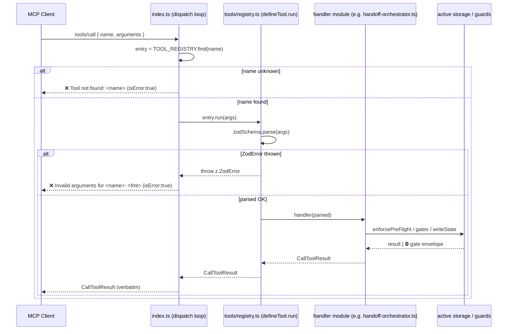

# registry-pattern — Architecture Blueprint

Source spec: `specs/registry-pattern.md` (T-REG-01..09, cut approved 2026-07-06).
Non-design feature (no `design/registry-pattern.md`) — **Visual Harness section omitted per architect SOP.**

This is a **registration-mechanics-only refactor**. Every handler body, gate check,
error string, and zod/JSON schema is a **verbatim relocation** — no logic, order,
or wording changes. Byte-for-byte wire compatibility (`tools/list`, `tools/call`,
`prompts/list`, `prompts/get`) is the hard invariant (AC-1..AC-4, AC-8).

---

## Affected Files

| File | Action | What changes |
|---|---|---|
| `tools/registry.ts` | **CREATE** | `ToolResult` alias, `ToolRegistryEntry`, `PromptRegistryEntry`, `defineTool<TSchema>` helper (T-REG-01); all 11 zod schemas + inferred type aliases + `TOOL_REGISTRY` array (T-REG-05); `PROMPT_REGISTRY` array (T-REG-07). |
| `tools/handoff-orchestrator.ts` | **CREATE** | `handleUpdateState(parsed)` — verbatim `index.ts:722-1197` gate-orchestration body (T-REG-04). |
| `tools/handoff.ts` | MODIFY | add `handleGetState` export (T-REG-02). |
| `tools/drift.ts` | MODIFY | add `handleDetectDrift` export (T-REG-02). |
| `tools/sync.ts` | MODIFY | add `handleSync` export (T-REG-02). |
| `tools/role.ts` | MODIFY | add `handleSwitchRole` export (T-REG-02). |
| `tools/tasks.ts` | MODIFY | add `handleGetNextTask`, `handleCompleteTask`, `handleRollbackTask`, `handleAddTask` exports (T-REG-02/03). |
| `tools/rag.ts` | MODIFY | add `handleIndexPrd`, `handleClearPrdChunks` exports (T-REG-03). |
| `index.ts` | MODIFY | strip all per-tool zod consts, JSON-Schema literals, the `switch`, the `ListPrompts` array, the `GetPrompt` if-chain, and the now-dead imports; replace ListTools/CallTool/ListPrompts/GetPrompt handler bodies with registry iteration (T-REG-06/07). `formatZodError`, the HTTP/stdio boot block, and the `Server(... version: "3.44.0")` literal are **untouched**. |
| `test/skill-evolution-v3.11.test.mjs` | MODIFY | retarget assertions off `index.ts` source text (T-REG-08). |
| `test/visual-evidence-gate.test.mjs` | MODIFY | retarget `readFileSync` to `tools/handoff-orchestrator.ts` (T-REG-08). |
| `test/context-budget.test.mjs` | MODIFY | retarget `hasDesignModeRequiringVisual` import assertion to `tools/handoff-orchestrator.ts` (T-REG-08). |
| `test/qa-flow.test.mjs` | MODIFY | retarget `readFileSync` to `tools/handoff-orchestrator.ts` (T-REG-08). |
| `dist/**` | RECOMMIT | rebuilt output (T-REG-09). |

**Hard constraint (AC-7):** every new module lives under `tools/`. `test/error-code-contract.test.mjs`
builds `CODE_SOURCE_FILES` via `fs.readdirSync("tools")` at run time (verified: `test/error-code-contract.test.mjs:37-50`),
so `tools/registry.ts` and `tools/handoff-orchestrator.ts` are auto-scanned — **that test needs no edit.**
Do **not** create a top-level `registry/` directory; it would escape the glob and silently drop error-code coverage.

---

## Data Structures

All new types live in `tools/registry.ts`. **Zero `any`** (AC-9, Constitution §2).

```ts
import type { CallToolResult, Tool } from "@modelcontextprotocol/sdk/types.js";
import { z } from "zod";

// Handler return type = the SDK's own CallToolResult. Using the SDK type
// (not a hand-narrowed alias) guarantees the index.ts dispatch loop's
// `return await entry.run(args)` satisfies the setRequestHandler signature
// with zero assignability friction, and every relocated `{ content: [...],
// isError?: true }` literal is assignable to it.
export type ToolResult = CallToolResult;

export interface ToolRegistryEntry {
  name: string;
  description: string;
  inputSchema: Tool["inputSchema"]; // the hand-written JSON Schema, verbatim
  run: (rawArgs: unknown) => Promise<ToolResult>; // parses internally, then dispatches
}

export interface PromptRegistryEntry {
  name: string;
  description: string;
  arguments: Array<{ name: string; description: string; required: boolean }>;
  build: (workspacePath: string) => PromptResult; // PromptResult imported from ../prompts/build.js
}
```

### The `defineTool` helper — the one type-safety mechanism sr-engineer MUST copy exactly

```ts
export function defineTool<TSchema extends z.ZodTypeAny>(spec: {
  name: string;
  description: string;
  inputSchema: Tool["inputSchema"];
  zodSchema: TSchema;
  handler: (args: z.infer<TSchema>) => Promise<ToolResult>;
}): ToolRegistryEntry {
  return {
    name: spec.name,
    description: spec.description,
    inputSchema: spec.inputSchema,
    // spec.zodSchema is the CONCRETE TSchema (not the erased z.ZodTypeAny),
    // so .parse() returns z.infer<TSchema> — NOT `any` — and feeds a handler
    // typed for exactly that. Erasure to (unknown)=>Promise happens at the
    // `run` boundary. No cast, no `any`, at any point.
    run: (rawArgs: unknown) => spec.handler(spec.zodSchema.parse(rawArgs)),
  };
}
```

**Why this is `any`-free where the spec's Decision 4 sketch risked a cast:** the
naive alternative — storing `handler: (args:unknown)` on the entry and calling
`entry.zodSchema.parse(args)` from the index.ts loop — fails AC-9, because the
stored `zodSchema` is typed `z.ZodTypeAny` whose `.parse` returns `any`, poisoning
the loop's local. By closing over the **concrete** `TSchema` inside `defineTool`
and exposing only `run(rawArgs: unknown)`, the sole `parse` call site sees the
concrete output type. This supersedes the spec's Decision 4 storage sketch while
staying inside its stated intent ("generic function + return-type erasure, not
`any`-typed parameters").

### Inferred type aliases (exported from `tools/registry.ts`, consumed type-only by handler modules)

```ts
export type WorkspaceOnlyInput = z.infer<typeof WorkspaceOnly>;
export type UpdateStateInput  = z.infer<typeof UpdateStateArgs>;
export type CompleteTaskInput = z.infer<typeof CompleteTaskArgs>;
export type RollbackTaskInput = z.infer<typeof RollbackTaskArgs>;
export type AddTaskInput      = z.infer<typeof AddTaskArgs>;
export type SwitchRoleInput   = z.infer<typeof SwitchRoleArgs>;
export type IndexPrdInput     = z.infer<typeof IndexPrdArgs>;
```

Handler modules import these **`import type`-only** (fully erased at compile), so the
runtime dependency graph is one-directional: `registry.ts` → (value) → handler modules;
handler modules → (type-only, erased) → `registry.ts`. **No runtime cycle.**

The zod schemas themselves (`absoluteWorkspacePath`, `WorkspaceOnly`, `UpdateStateArgs`,
`CompleteTaskArgs`, `RollbackTaskArgs`, `AddTaskArgs`, `SwitchRoleArgs`,
`EMBEDDING_MODEL_RE`, `ALLOWED_EMBEDDING_MODELS`, `IndexPrdArgs`) move **verbatim**
from `index.ts:74-221` into `tools/registry.ts`. `formatZodError` (`index.ts:223-227`)
**stays in `index.ts`** (still used by the dispatch catch block).

---

## Interface Contracts

### Handler exports (each = its old `case` body verbatim, minus the `XxxArgs.parse(args)` line)

The parse line is removed because `defineTool`'s `run` closure already parsed; the
handler receives the typed, parsed object. Inside each body, references stay identical
(the parsed value is still named `parsed`, or destructured `const { workspace_path } = args`).

| Tool | Old case (index.ts) | New export | Module |
|---|---|---|---|
| `tw_get_state` | 681-685 | `export async function handleGetState(args: WorkspaceOnlyInput): Promise<ToolResult>` | `tools/handoff.ts` |
| `tw_detect_drift` | 688-692 | `export async function handleDetectDrift(args: WorkspaceOnlyInput): Promise<ToolResult>` | `tools/drift.ts` |
| `tw_sync` | 698-703 | `export async function handleSync(args: WorkspaceOnlyInput): Promise<ToolResult>` | `tools/sync.ts` |
| `tw_switch_role` | 706-710 | `export async function handleSwitchRole(args: SwitchRoleInput): Promise<ToolResult>` | `tools/role.ts` |
| `tw_get_next_task` | 713-717 | `export async function handleGetNextTask(args: WorkspaceOnlyInput): Promise<ToolResult>` | `tools/tasks.ts` |
| `tw_update_state` | 720-1198 | `export async function handleUpdateState(parsed: UpdateStateInput): Promise<ToolResult>` | `tools/handoff-orchestrator.ts` |
| `tw_complete_task` | 1200-1209 | `export async function handleCompleteTask(parsed: CompleteTaskInput): Promise<ToolResult>` | `tools/tasks.ts` |
| `tw_rollback_task` | 1211-1216 | `export async function handleRollbackTask(parsed: RollbackTaskInput): Promise<ToolResult>` | `tools/tasks.ts` |
| `tw_add_task` | 1218-1228 | `export async function handleAddTask(parsed: AddTaskInput): Promise<ToolResult>` | `tools/tasks.ts` |
| `tw_index_prd` | 1230-1285 | `export async function handleIndexPrd(parsed: IndexPrdInput): Promise<ToolResult>` | `tools/rag.ts` |
| `tw_clear_prd_chunks` | 1287-1315 | `export async function handleClearPrdChunks(args: WorkspaceOnlyInput): Promise<ToolResult>` | `tools/rag.ts` |

Handlers whose old bodies were synchronous (`handleGetState`, `handleDetectDrift`,
`handleSwitchRole`, `handleGetNextTask`) become `async` — the `return { content: [...] }`
lines are unchanged; only the wrapper becomes a resolved promise so the entry's
`run` signature is uniform.

### `tools/handoff-orchestrator.ts` — imports the extracted body drags along (PIN EXACTLY)

The `tw_update_state` body (722-1197) references these; the module MUST import all of them
(all currently imported at the top of `index.ts`, used **only** inside this body — verified):

```ts
import type { UpdateStateInput } from "./registry.js";                    // type-only
import type { ToolResult } from "./registry.js";                          // type-only
import { enforcePreFlight } from "../guards/session.js";
import { getActiveStorage, FileHandoffStorage } from "./storage.js";
import {
  requireQaEngineer, validateTransition, computeNewRound, ALLOWED_TRANSITIONS,
  type AgentName, type StatusName, type TransitionTuple,
} from "./transitions.js";
import {
  hasVisualBaselinesInDesign, hasVisualEvidenceInFile, hasUncheckedWidgets,
  hasDesignModeRequiringVisual, designDeclaresStructuralAssertions,
  validateVisualReports, checkVisualProvenance, checkBaselineManifest,
  checkPixelGateAttestation, hasScopeDecision, hasCutApproval,
} from "./evidence-file.js";
import { awaitAllInflightFor } from "./rag-coalesce.js";
```

**Check order INSIDE `handleUpdateState` is FROZEN and must read top-to-bottom exactly:**
1. `enforcePreFlight` (722)
2. PASS-requires-qa-engineer defense-in-depth gate (726-731)
3. read `prevState` + rounds + build `prevTuple`/`nextTuple` (733-745)
4. `validateTransition` → `⛔ ${rejection.error}` envelope (747-760)
5. **Scope-Decision Gate** `SCOPE_DECISION_REQUIRED` (772-808)
6. **Cut-Approval Gate** `CUT_APPROVAL_REQUIRED` (824-858)
7. QA-review evidence record write (863-876)
8. PASS evidence gate `MISSING_EVIDENCE` (879-889)
9. visual sub-gates in order: `VISUAL_BASELINES_REQUIRED` → `VISUAL_EVIDENCE_MISSING`
   → `VISUAL_WIDGETS_UNVERIFIED` → `VISUAL_ASSERTIONS_REQUIRED` → `VISUAL_REPORT_INCOMPLETE`
   → `VISUAL_PROVENANCE_MISSING` → `BASELINE_MANIFEST_MISSING`/`BASELINE_PROVENANCE_INCOMPLETE`
   → `PIXEL_GATE_ATTESTATION_MISSING` (890-1092)
10. code-reviewer evidence gate `MISSING_REVIEW_EVIDENCE` (1099-1119)
11. `computeNewRound` + Round-4/Review-Round-4/Visual-Round-6 sentinel unshifts (1121-1154)
12. `storage.writeState({...})` (1160-1175)
13. PASS RAG GC hook (1181-1195)
14. `return { content: [...] }` (1197)

No reorder, no merge, no early-return removal. This is the AC-5 / AC-8 crux.

### `index.ts` dispatch loop (replaces the `switch`, T-REG-06)

```ts
server.setRequestHandler(CallToolRequestSchema, async (request) => {
  const { name, arguments: args } = request.params;
  try {
    const entry = TOOL_REGISTRY.find((e) => e.name === name);
    if (!entry) {
      return {
        content: [{ type: "text" as const, text: `❌ Tool not found: ${name}` }],
        isError: true,
      };
    }
    return await entry.run(args);
  } catch (error: unknown) {
    if (error instanceof z.ZodError) {
      return {
        content: [{ type: "text" as const, text: `❌ Invalid arguments for ${name}: ${formatZodError(error)}` }],
        isError: true,
      };
    }
    const message = error instanceof Error ? (error.stack ?? error.message) : String(error);
    return { content: [{ type: "text" as const, text: message }], isError: true };
  }
});
```

**Error-path contract (AC-2/AC-3):**
- Unknown tool → `entry === undefined` → `❌ Tool not found: ${name}`, `isError:true` — byte-identical to old `default` case.
- Bad args → `spec.zodSchema.parse(rawArgs)` inside `run` throws `z.ZodError` → propagates out of the awaited `run` → caught by the **same** outer catch → `❌ Invalid arguments for ${name}: ${formatZodError(error)}`. Same `z` module instance in `registry.ts` and `index.ts` (both `import { z } from "zod"`), so `error instanceof z.ZodError` holds.
- Every gate `⛔ …` rejection is produced **inside the handler** and returned normally (not thrown), exactly as today.
- `index.ts` keeps `import { z } from "zod"` (used in the catch + `formatZodError` signature).

### `index.ts` list loop (T-REG-06)

```ts
server.setRequestHandler(ListToolsRequestSchema, async () => ({
  tools: TOOL_REGISTRY.map((e) => ({
    name: e.name, description: e.description, inputSchema: e.inputSchema,
  })),
}));
```

`TOOL_REGISTRY` array order is FROZEN to match current `ListToolsRequestSchema` output
(AC-1 byte-identical): `tw_get_state, tw_update_state, tw_get_next_task, tw_complete_task,
tw_add_task, tw_rollback_task, tw_detect_drift, tw_sync, tw_switch_role, tw_index_prd,
tw_clear_prd_chunks`. JSON-Schema literals are **copy-pasted verbatim** from `index.ts:416-668`
into each `defineTool(...)` `inputSchema` (Decision 7 — not regenerated from zod). Concatenated
descriptions (e.g. `tw_sync`, `tw_switch_role`) move as-is; their runtime string value is unchanged.

### Prompt registry (T-REG-07)

`PROMPT_REGISTRY` order FROZEN to current `ListPromptsRequestSchema` order (AC-4):
`sr-engineer, researcher, pm, qa-engineer, teamwork, teamwork-lite, architect,
design-auditor, code-reviewer, doc-writer, release-engineer` — **11 entries**, incl.
the `teamwork` / `teamwork-lite` back-compat ids mapped to `buildCoordinatorPrompt` /
`buildCoordinatorLitePrompt`. Each entry's `arguments` is the single optional
`workspace_path` object, identical across all 11.

```ts
// tools/registry.ts
import { buildSrEngineerPrompt } from "../prompts/sr-engineer.js";
// ...all 11 buildXxx imports + PromptResult type from ../prompts/build.js
export const PROMPT_REGISTRY: PromptRegistryEntry[] = [
  { name: "sr-engineer", description: "Load constitution, skill, state. Run first.",
    arguments: [{ name: "workspace_path", description: "Absolute workspace path (optional — defaults to current project dir)", required: false }],
    build: buildSrEngineerPrompt },
  // ... 10 more, descriptions copied verbatim from index.ts:248-367
];
```

```ts
// index.ts — ListPrompts
server.setRequestHandler(ListPromptsRequestSchema, async () => ({
  prompts: PROMPT_REGISTRY.map((e) => ({
    name: e.name, description: e.description, arguments: e.arguments,
  })),
}));

// index.ts — GetPrompt (resolvedPath + appendSpecContext logic unchanged)
server.setRequestHandler(GetPromptRequestSchema, async (request) => {
  const { name, arguments: args } = request.params;
  const resolvedPath =
    (typeof args?.workspace_path === "string" && args.workspace_path) ||
    process.env.CLAUDE_PROJECT_DIR || process.cwd();
  const entry = PROMPT_REGISTRY.find((e) => e.name === name);
  if (!entry) throw new Error(`Prompt not found: ${name}`);
  return appendSpecContext(entry.build(resolvedPath), resolvedPath, name);
});
```

`appendSpecContext` and `PROMPT_REGISTRY` are imported into `index.ts`; the 11 `buildXxx`
imports move out of `index.ts` into `registry.ts`. The `Prompt not found: ${name}` throw
and the `appendSpecContext(promptResult, resolvedPath, name)` call are byte-identical to today.

### `index.ts` import ledger after refactor (verified against usage grep)

- **KEEP:** `path` (HTTP boot `path.join`), `z` (catch/`formatZodError`), `Server`,
  transports, `ListTools/CallTool/ListPrompts/GetPrompt` schemas, `setActiveStorage`,
  `cleanupStaleSessions`, `appendSpecContext`, `TOOL_REGISTRY`, `PROMPT_REGISTRY`, `SqliteHandoffStorage` (dynamic).
- **DROP** (moved into handler/registry modules; verified used only in relocated bodies):
  `fs`, `getActiveStorage`, `FileHandoffStorage`, `getNextTask/completeTask/rollbackTask/addTask`,
  `detectDrift`, `reconcileTasks`, `enforcePreFlight`, all 11 `buildXxx` prompt imports,
  `switchRole`/`RoleName`, `buildPrdChunks`/`CHUNKER_VERSION`/`DEFAULT_EMBEDDING_MODEL`,
  `getInflightKey`/`getInflight`/`setInflight`/`deleteInflight`/`awaitAllInflightFor`,
  the whole `transitions.js` import block, the whole `evidence-file.js` import block.
- Split targets: `enforcePreFlight` → `sync.ts` + `tasks.ts` + `handoff-orchestrator.ts`;
  `requireQaEngineer` → `tasks.ts` (for `handleCompleteTask`) + `handoff-orchestrator.ts`;
  `getActiveStorage` → `handoff.ts` + `rag.ts` + `handoff-orchestrator.ts`;
  `awaitAllInflightFor` → `rag.ts` + `handoff-orchestrator.ts`.
  `DEFAULT_EMBEDDING_MODEL` is referenced in the `tw_index_prd` JSON-Schema description
  literal (`index.ts:651`) → `registry.ts` imports it from `../tools/rag.js` for that string;
  `rag.ts`'s own `handleIndexPrd` uses it locally (same module, no import).

---

## Sequence Diagram



---

## Decision Records

| Context | Decision | Consequences |
|---|---|---|
| Handler args must be typed from each tool's zod schema with no `any` (AC-9), but a heterogeneous registry array can only store one handler signature. | `defineTool<TSchema>` closes over the **concrete** `TSchema` and exposes only `run(rawArgs: unknown)`, which calls `spec.zodSchema.parse(rawArgs)` **inside** the closure. `.parse` on the concrete generic returns `z.infer<TSchema>`, not `any`; erasure to `unknown` happens only at the `run` param. | No `any`, no `as` cast anywhere. Supersedes the spec's Decision 4 storage sketch (which would have needed `.parse` on the erased `z.ZodTypeAny` → `any` in the loop). sr-engineer copies `defineTool` verbatim from this doc. |
| Handler return type. | Use the SDK's `CallToolResult` (aliased `ToolResult`) rather than a hand-narrowed struct. | The index.ts loop's `return await entry.run(args)` satisfies `setRequestHandler` with zero assignability friction; all relocated `{ content, isError? }` literals remain assignable. |
| Where the ~480-line `tw_update_state` gate body goes. | New `tools/handoff-orchestrator.ts` (`handleUpdateState`), **not** `tools/handoff.ts`. | Keeps "read/write handoff YAML" (`handoff.ts`) separate from "gate-policy orchestration" (imports `transitions.ts` + `evidence-file.ts`); scopes the future A2 `gates/` extraction cleanly. Auto-covered by `error-code-contract` glob. |
| JSON Schema: derive from zod vs keep hand-written. | Keep hand-written, moved **verbatim** into each `defineTool.inputSchema`. | Zero AC-1 regression risk (copy-paste, not derive). No new dependency (`zod-to-json-schema`). Explicitly out of scope per spec. |
| Zod schemas + inferred types home. | Schemas live in `registry.ts`; type aliases exported and imported **`import type`-only** by handler modules. | One-directional runtime graph (`registry.ts` → handlers). Type-only back-imports erase, so no runtime cycle. Alternative (leaf `tool-schemas.ts` module) rejected: adds a file and contradicts spec Decision 1's "schemas move into registry via defineTool pairing". |
| Dispatch data structure. | `Array.find(name)` over `TOOL_REGISTRY` (n=11). | Preserves list order from the same array (AC-1); O(11) lookup is negligible. A parallel dispatch `Map` was rejected as premature. |
| `formatZodError` location. | Stays in `index.ts`. | Still used by the dispatch catch; moving it would need a back-import for no benefit. |
| Prompt registry supersedes both prompt sites. | Single `PROMPT_REGISTRY` feeds ListPrompts (map) and GetPrompt (find) — replaces the metadata array AND the 11-branch if-chain. | Fixes the prompt-registration drift risk (not just the tool one), per spec Decision 5. |
| Sync handlers becoming `async`. | Wrap the 4 formerly-sync handler bodies in `async` fns. | Uniform `run: (unknown) => Promise<ToolResult>` entry signature; return literals unchanged, so no behavior/wire change. |

---

## Deferred Resources

_None._ The spec's *Dependencies / Prerequisites* records a completed Resource Audit
(Constitution §7) with **zero** external URLs/Figma/ticket references — ticket source
(`docs/backlog.md §A1`) and CLAUDE.md excerpts are all in-repo. Per architect SOP, an
empty section is permitted only when the spec shows zero such refs; that condition holds.

---

## Sequencing / Verification (per-task)

Tasks are strictly sequenced by `depends_on` in the spec (T-REG-01 → 02/03/04 → 05 → 06;
07 depends only on 01; 08 depends on 06+07; 09 last). Per-task gate:

- **T-REG-01..05** (create registry types, extract handlers, populate `TOOL_REGISTRY`):
  after each, `npm run build` must pass (tsc, no `any`, no unused-import errors). Extraction
  tasks are **pure verbatim moves** — a `git diff` of the moved body against the old case
  should show only the removed `XxxArgs.parse(args)` line and the `export async function`
  wrapper. T-REG-04 legitimately exceeds the ≤300-line task norm (verbatim move, do not split).
- **T-REG-06/07** (rewire `index.ts`): after each, `npm run build` passes; the removed
  dead code (per-tool JSON literals, zod consts, `switch`, if-chain, dropped imports) is fully
  deleted, not commented out.
- **T-REG-08**: the **only** four test files that may be modified are
  `skill-evolution-v3.11`, `visual-evidence-gate`, `context-budget`, `qa-flow`
  (AC-6). No other test file changes. Each retarget preserves the test's semantic intent —
  only the `readFileSync`/import-assertion path moves from `index.ts` to the new module
  (`tools/handoff-orchestrator.ts` for the three gate-string/import tests;
  registry module or driven-behavior for `skill-evolution-v3.11`).
  `test/error-code-contract.test.mjs` MUST remain **unmodified** (AC-7).
- **T-REG-09** (final verification, all must pass before PASS):
  1. `npm run build` — clean.
  2. `npm test` — **817 green** (baseline), zero net test-count change beyond the 4 retargets.
  3. **stdio boot smoke test**: spawn `dist/index.js`, send `initialize`, expect
     `🛡️ Agent Governance MCP is online` on stderr.
  4. **YAML round-trip smoke test** (`writeHandoffState`/`parseHandoff`) per CLAUDE.md — guards handoff-parsing regressions.
  5. `scripts/check-version.mjs` passes (`Server(... version: "3.44.0")` literal untouched).
  6. **Recommit `dist/`** reflecting the refactor.

---

## Open Questions

_None._ All decisions delegated to the architect by the spec ("Decide and record")
are resolved in the Decision Records above. Ready for sr-engineer.
