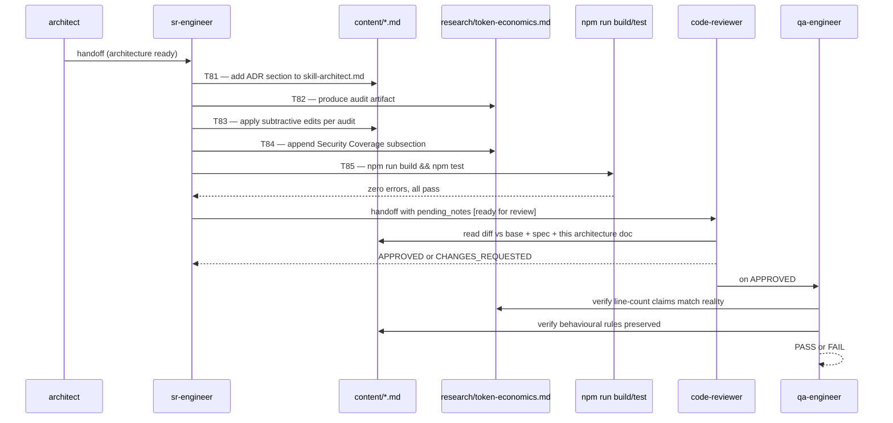

# Architecture: skill-polish-v3.12

## Affected Files

| File | Change kind | Owned by |
|---|---|---|
| `content/skill-architect.md` | EDIT — add `## Decision Records` H2 between existing `## Artifact Schema` last bullet and `## SOP`; extend SOP step 5 to require ADR emission | T81 |
| `content/constitution.md` | EDIT (conditional) — only if T84 audit identifies a real gap | T84 |
| `content/skill-coordinator.md` | EDIT (subtractive) — trim restated constitution lines flagged by audit | T83 |
| `content/skill-coordinator-lite.md` | EDIT (subtractive) — trim restated constitution lines flagged by audit | T83 |
| `content/skill-researcher.md` | NO CHANGE expected — schemas (depth, tier, recency) already cover v3.9 gaps | T83 verification |
| `content/skill-code-reviewer.md` | NO CHANGE expected — Performance section already covers v3.9 gap | T83 verification |
| `content/skill-pm.md` | EDIT (subtractive) — trim restated rules if any (e.g. `tw_get_state` re-explanation) | T83 |
| `content/skill-sr-engineer.md` | EDIT (subtractive) — trim restated rules if any | T83 |
| `content/skill-qa-engineer.md` | EDIT (subtractive) — trim restated rules if any | T83 |
| `content/skill-design-auditor.md` | EDIT (subtractive) — trim restated rules if any | T83 |
| `content/skill-doc-writer.md` | EDIT (subtractive) — trim restated rules if any | T83 |
| `content/skill-release-engineer.md` | EDIT (subtractive) — trim restated rules if any | T83 |
| `content/skill-qa-visual.md` | NO CHANGE expected — lazy-loaded sub-skill already 19 lines | T83 verification |
| `research/token-economics.md` | CREATE | T82 |
| `specs/skill-polish-v3.12-architecture.md` | CREATE (this file) | architect |

**No production-code (`.ts`) changes.** `prompts/build.ts` reads `content/*.md` as opaque blobs concatenated into the prompt; no anchor or section-id is parsed, so subtractive edits within those files cannot break the build.

## Data Structures

### ADR row (architecture artifact)

A single Architecture Decision Record is a row in a 3-column markdown table inside `specs/<feature>-architecture.md`. No code-level data structure exists; the format is purely textual.

```markdown
## Decision Records

| Context | Decision | Consequences |
|---|---|---|
| <one-line problem framing> | <one-line chosen approach> | <one-line trade-off accepted> |
```

- One row per non-trivial trade-off (decisions that closed off ≥ 1 alternative).
- Trivial decisions (style choices, single-option scenarios) MUST NOT be recorded — that defeats the purpose.
- Empty section renders the literal placeholder `_No non-trivial trade-offs in this artifact._` (string id `arch.adr.empty` from the spec).

### Token-frugality audit artifact schema

`research/token-economics.md` MUST contain these H2 sections in order:

```markdown
## Methodology
<grep pattern list + manual-review heuristics used>

## Per-File Findings
### content/<filename>
- **Before**: <N> lines
- **Restated constitution rules** (DELETE candidates):
  - L<line>: <quoted text> — duplicates constitution §<N> rule "<rule name>"
- **Redundant padding** (DELETE candidates):
  - L<line>: <quoted text> — <reason>
- **After (target)**: <N> lines

## Security Coverage (§6 review)
<bullet list confirming each v3.9-eval security gap is addressed, with citation to constitution line/rule>

## Aggregate
- Total before: 580 lines
- Total after: <N> lines
- Reduction: <N> lines (<percentage>%) — target ≥ 29 lines (≥ 5%)
```

## Interface Contracts

### Architect SOP extension (T81)

The existing `content/skill-architect.md` SOP step 5 reads `Produce specs/<feature>-architecture.md per the Artifact Schema.` It MUST be extended so the schema itself adds a `Decision Records` bullet between `Sequence Diagram` and `Deferred Resources` in the existing schema list. Exact insertion:

```markdown
- **Decision Records** — table `Context | Decision | Consequences`, one row per non-trivial trade-off. Trivial decisions excluded. Empty section renders `_No non-trivial trade-offs in this artifact._`.
```

No SOP-step renumbering required; the gate steps (Open Questions Gate, External-reference Sanity Gate) stay as-is. ADR is a schema requirement, not a new gate — there is no `tw_update_state(status=Blocked)` triggered by an empty ADR section because empty is a valid state (rendered placeholder).

### Subtractive-edit rule (T83)

For each file flagged in T82's audit, the sr-engineer MUST apply only line-level deletions. The following are FORBIDDEN in this task:

- Renaming sections.
- Reordering H2 sections.
- Rewording behavioural rules.
- Adding new content.

The single allowed addition is the ADR section in `skill-architect.md` (T81), governed by its own interface contract above.

### Build & test gate (T85)

```bash
npm run build   # MUST exit 0 with no TS errors
npm test        # MUST pass all existing tests
```

Neither command exercises `content/*.md` directly — they verify the surrounding TS layer is still healthy after content edits. The verification confirms that no `prompts/build.ts` regression was introduced by accidentally touching server code.

## Sequence Diagram



## Deferred Resources

_Empty — spec's *Dependencies / Prerequisites* lists only one local file (`research/process-retrospective.md`) which is already fetched. No external references to defer._

## Open Questions

_None._ All design choices are pinned in the spec or this artifact:

- ADR table format: 3 columns (Context / Decision / Consequences) — chosen over Michael Nygard's longer narrative form to fit the project's terse style; trade-off recorded inline.
- Edits to skills not explicitly flagged by the audit: still in scope for verification (T83), but expected zero-change. Architect deems this safe because the audit is a generative step and may surface duplication in any file.
- Constitution §6 edit: conditional on T84 findings. If audit concludes §6 is complete, the file is untouched (allowed per spec Acceptance Criteria).
