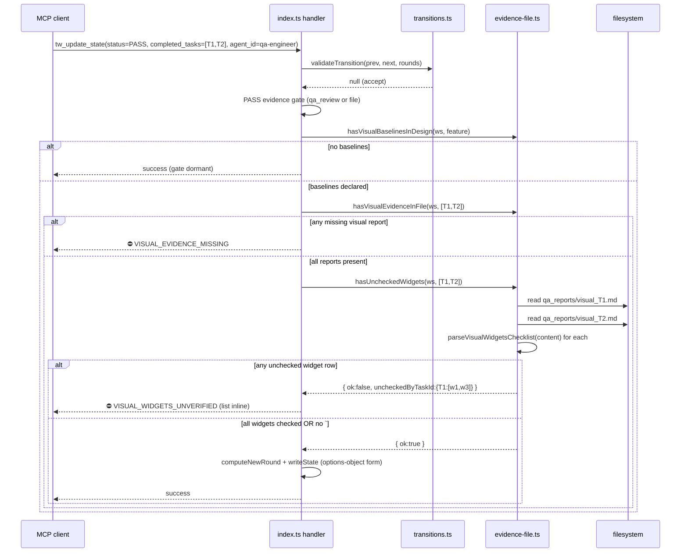

# v3.15.0 — Architecture

## Affected Files

### TypeScript source
- `tools/transitions.ts` — T300: extend `TransitionRejection.error` union with `"VISUAL_WIDGETS_UNVERIFIED"`. The error code was reserved in v3.14.0 architecture §A but never added to the union; activating it now.
- `tools/evidence-file.ts` — T301: add two exports: `parseVisualWidgetsChecklist()` (pure parser, returns array of `{ widgetId, checked }`) and `hasUncheckedWidgets()` (composition helper returning `{ uncheckedByTaskId: Record<string, string[]> }`).
- `tools/handoff.ts` — T303: add options-object overload to `writeHandoffState`; positional signature retained with `@deprecated` JSDoc.
- `tools/storage.ts` — T303: extend `HandoffStorage` interface to support both call shapes; `FileHandoffStorage.writeState` delegates to `writeHandoffState`.
- `tools/storage-sqlite.ts` — T303: `SqliteHandoffStorage.writeState` mirrors the dual signature; internal logic unchanged.
- `index.ts` — T302 + T303 + T304: wire `VISUAL_WIDGETS_UNVERIFIED` gate after `VISUAL_EVIDENCE_MISSING`; switch handler call site to options-object form; apply `>=` cap-cross predicate to `qa_round` / `review_round` sentinels.

### Tests
- `test/visual-widgets-unverified-gate.test.mjs` — T305 new.
- `test/writestate-options-object.test.mjs` — T306 new.
- `test/qa-flow.test.mjs` — T307 extend with Round 4 symmetric predicate cases.

### Release wiring
- `package.json` — T308: `3.14.1` → `3.15.0`.
- `index.ts` Server literal — T308.
- `CHANGELOG.md` — T308: `[3.15.0]` entry.
- `README.md` — T308: §(s) entry + install-ref bumps.

## Data Structures

### `TransitionRejection.error` union (T300)
```typescript
export interface TransitionRejection {
  error:
    | "TRANSITION_REJECTED"
    | "QA_ROUND_EXCEEDED"
    | "REVIEW_ROUND_EXCEEDED"
    | "VISUAL_ROUND_EXCEEDED"
    | "VISUAL_WIDGETS_UNVERIFIED"   // NEW v3.15.0
    | "AGENT_ID_REQUIRED";
  // ...rest unchanged
}
```

Note: `VISUAL_WIDGETS_UNVERIFIED` is **NOT** produced by `validateTransition`. It is produced by the `index.ts` handler after the visual-evidence gate, when `hasUncheckedWidgets()` reports non-empty unchecked rows. The union extension is for handler-side type narrowing and for the rejection envelope shape consistency only.

### Checkbox parse result (T301)
```typescript
export interface VisualWidgetRow {
  widgetId: string;          // text between `- [x]` / `- [ ]` and the first `—` or end-of-line
  checked: boolean;          // true if [x] or [X], false otherwise (including [Y], [ ], [garbage])
  rawLine: string;           // for diagnostics
}

export function parseVisualWidgetsChecklist(
  visualReportContent: string,
): VisualWidgetRow[];

export interface UncheckedWidgetsCheck {
  ok: boolean;
  uncheckedByTaskId: Record<string, string[]>;   // taskId -> [widgetId, widgetId, ...]
}

export function hasUncheckedWidgets(
  workspacePath: string,
  taskIds: string[],
): UncheckedWidgetsCheck;
```

### Options-object overload (T303)
```typescript
export interface WriteHandoffStateOptions {
  workspacePath: string;
  activeFeature: string;
  status: string;
  completedTasks?: string[];        // default []
  pendingNotes?: string[];          // default []
  blockingReason?: string;
  lastAgent?: string;
  qaRound?: number;                 // default 0
  prdPath?: string;
  reviewRound?: number;             // default 0
  visualRound?: number;             // default 0
}

// Overload signatures
export function writeHandoffState(opts: WriteHandoffStateOptions): Promise<string>;
export function writeHandoffState(
  /** @deprecated v3.15.0: prefer the options-object overload. Positional retained for backwards-compat; planned removal in v4.0.0. */
  workspacePath: string,
  activeFeature: string,
  status: string,
  completedTasks: string[],
  pendingNotes: string[],
  blockingReason?: string,
  lastAgent?: string,
  qaRound?: number,
  prdPath?: string,
  reviewRound?: number,
  visualRound?: number,
): Promise<string>;
```

The overload **discriminates by `typeof arguments[0]`**: if the first argument is an object (not a string), the options-object branch executes. This avoids a discriminated-union schema and keeps both call sites ergonomic.

## Interface Contracts

### `parseVisualWidgetsChecklist` (pure parser)
- **Input**: full markdown content of `qa_reports/visual_<id>.md`.
- **Behaviour**:
  1. Locate the `## Widget Shape Verification` H2 (case-insensitive, multiline).
  2. If absent → return `[]` (backwards-compat per AC-2/AC-3: no section = no verification claim = gate passes through).
  3. Within the section (up to the next `^##\s` or EOF), match lines `/^-\s+\[(.)\]\s+(.*)$/m`.
  4. For each match, `checked = group[1].toLowerCase() === 'x'`; `widgetId = group[2].split(/\s+—\s+|\s+-\s+/)[0].trim()` (split at em-dash or hyphen separator to isolate the id from description).
  5. Return `[{ widgetId, checked, rawLine }, …]`.
- **Edge cases**:
  - `- [ ]` (empty bracket) → `checked: false` ✓
  - `- [x]` / `- [X]` → `checked: true` ✓
  - `- [Y]` / `- [a]` / `- [garbage]` → `checked: false` (gate catches operator typos)
  - `widgetId` without separator → use full remainder as id
  - blank lines / non-checkbox bullets ignored

### `hasUncheckedWidgets` (composition)
- **Input**: workspace + list of task ids.
- **Behaviour**:
  1. For each `taskId`, resolve `qa_reports/visual_<sanitised(taskId)>.md` (reuse `visualEvidencePath` sanitiser from v3.14.0/v3.14.1).
  2. If file missing → skip (caller's `hasVisualEvidenceInFile` already returns missing for this case; calling order is `hasVisualEvidenceInFile` first, then `hasUncheckedWidgets` only on the surviving ids).
  3. Read content, call `parseVisualWidgetsChecklist`, collect `widgetId` where `checked === false`.
  4. If any unchecked rows → add to `uncheckedByTaskId[taskId]`.
- **Output**: `{ ok: <true if all dicts empty>, uncheckedByTaskId }`.

### `writeHandoffState` overload (T303)
- **Detection**: `typeof arguments[0] === "object" && arguments[0] !== null && !Array.isArray(arguments[0])` → options-object branch. Otherwise positional.
- **Options branch**: destructure with defaults; delegate to the existing positional implementation (no duplicate logic).
- **`@deprecated` JSDoc body**: matches the spec's `jsdoc.writestate.deprecated` Copy / Strings entry verbatim.
- **`HandoffStorage` interface**: add two overload signatures (options + positional). Implementations route both to the same backing function.

### `index.ts` handler composition (T302 + T304)
- Insert `VISUAL_WIDGETS_UNVERIFIED` gate **after** the v3.14.0 `VISUAL_EVIDENCE_MISSING` block. Order:
  1. existing `MISSING_EVIDENCE` (qa_review or `qa_reports/review_<id>.md`).
  2. existing `VISUAL_EVIDENCE_MISSING` (when `## Visual Baselines` declared).
  3. **NEW** `VISUAL_WIDGETS_UNVERIFIED` (when visual evidence exists AND unchecked rows).
- Round 4 sentinel predicates change from `=== && ===` to `>= && <` (symmetric to v3.14.1's Round 6 fix). Three predicates flip in lock-step.

## Sequence Diagram



## Decision Records

| Context | Decision | Consequences |
|---|---|---|
| Where does the parser live? | `tools/evidence-file.ts` (same module as `hasVisualEvidenceInFile`) | + Co-locates the visual-gate primitives; + tests already exercise this module; − one more export from an already-large file (still under 200 LoC after addition). Net positive. |
| Overload detection for writeHandoffState | Runtime `typeof === "object"` check on first argument | + No discriminated union needed; + TS overloads handle types at call sites cleanly; − a (hypothetical) caller passing `null` as first positional arg would now hit the options branch — but that was already a bug in pre-v3.15.0 code (would crash on YAML serialise). Acceptable. |
| Where to hook the new gate in `index.ts` | After `VISUAL_EVIDENCE_MISSING`, same indent level | + Gate ordering matches user mental model (file existence → file contents); + each gate emits one specific error code; − three nested `if` blocks in the handler. Acceptable; alternative (early-return helper) would obscure the linear gate sequence. |
| What `widgetId` separator to use in parser | Split at `\s+—\s+` (em-dash) OR `\s+-\s+` (hyphen) | + Matches both v3.14.0 `skill-qa-visual.md` example (`datetime.picker — column-scroller`) and ASCII variant; + permissive on whitespace; − if a `widgetId` itself contains an em-dash, only the prefix is captured. Operator-facing risk: low (widget ids are short alnum). |
| `[Y]` / `[a]` / `[garbage]` → checked or unchecked? | Treat as **unchecked** | + Catches operator typos rather than silently passing; + the spec AC-5 mandates "permissive on whitespace, case-sensitive on bracket content"; − could surprise an operator using a non-standard mark. Trade-off favours strictness for the gate's purpose. |
| Missing `## Widget Shape Verification` section | Treat as **no claim → accept** | + Backwards-compat with v3.14.0 visual reports (the section was optional in v3.14.0); + matches AC-2/AC-3; − operator can game by deleting the section. Acceptable: the gate's job is to verify CLAIMED checks, not to mandate the claim shape (v3.14.0 skill-qa-visual SOP still requires writing the section — SOP-vs-server defense in depth). |
| Positional signature removal target | v4.0.0 | + Long deprecation window (multiple MINOR releases); + matches v4.0.0 = breaking-change semver. − one more API surface to maintain for ~6 months. Acceptable. |
| Sentinel predicate change for qa_round / review_round | Apply same fix as v3.14.1's visual_round | + Symmetric semantics across three counters; + simpler mental model; − three lines changed where one was strictly necessary (path-to-trigger is migration-only). Worth doing now for consistency. |

## Deferred Resources

_PM spec's *Dependencies / Prerequisites* lists only internal artifacts (`research/xenova-reachability.md`, prior Question Batch decisions). No external refs to defer._

## Open Questions

_(none — all 16 ACs map to one or more architectural decisions above. R6 strategy, refactor approach, sentinel scope all locked at PM Question Batch time.)_

---

Next role: **sr-engineer**. Implementation order per task graph:
1. **Batch A**: T300 + T301 (transitions union + evidence-file parser) — 2 files, no behavioural change yet.
2. **Batch B**: T302 + T304 (handler gate wiring + Round 4 sentinel fix) — 1 file (index.ts), behavioural change.
3. **Batch C**: T303 (writeState dual API across handoff.ts + storage.ts + storage-sqlite.ts + index.ts call site) — 4 files.
4. **qa-engineer**: T305 + T306 + T307 + run all tests.
5. **sr-engineer**: T308 release wiring (4 files).

— @architect
