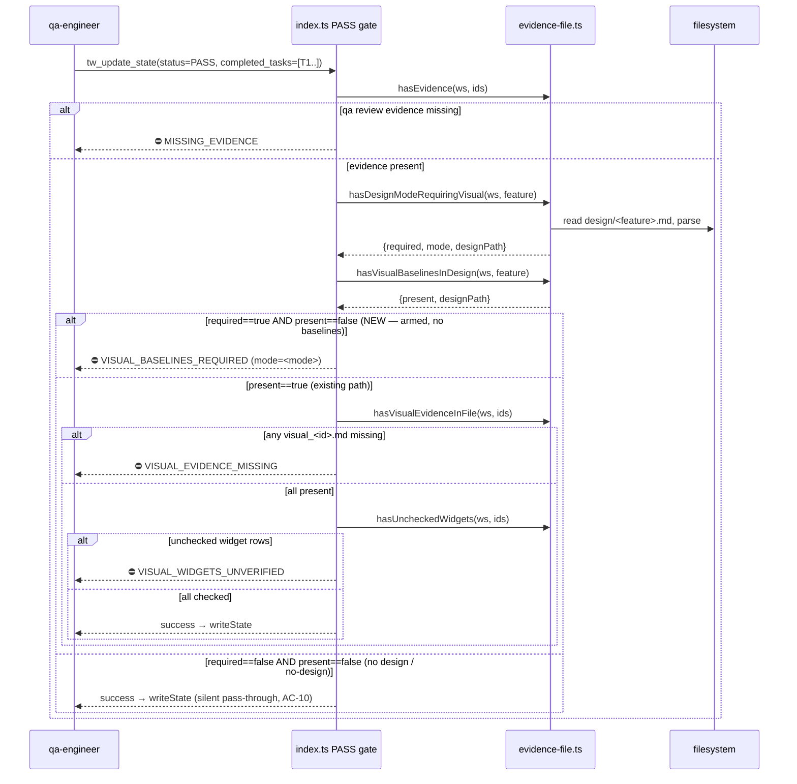

<!-- @architect | feature_id: visual-fidelity-gate-hardening | created_at: 2026-06-04 -->

# Architecture: Visual Fidelity Gate Hardening

> Blueprint for the gate-hardening server contract. Scope is surgical: move the visual-gate
> arming signal from "`## Visual Baselines` H2 present" to "design source exists and mode ≠
> `no-design`", add the `VISUAL_BASELINES_REQUIRED` block for the missing-baselines case, and
> document the two-tier (geometry / pixel) split + new error code in the enforcement matrix.
> No new subsystem, no headless renderer, no QA-flow redesign.
>
> **Locked human decision (Q-OQ1, do not re-litigate):** arm the visual gate for ALL modes
> except `no-design`. No raster-only exemption list. `paper`/`image`/`pdf` are armed exactly
> like `figma`/`sketch`/`xd`/`penpot`.

## AC → Blueprint Section Map

| AC | Covered by section |
|---|---|
| AC-1 (arming signal change → `VISUAL_BASELINES_REQUIRED`) | Interface Contracts §1; Sequence Diagram; Decision Records D1, D2 |
| AC-2 (skill-design-auditor contradictory sentence) | Out-of-contract — owned by T-SKILL; this doc only states the server-side meaning of absence (see "Cross-task contract notes") |
| AC-3 (constitution §3.1 + §4) | Out-of-contract — owned by T-CONST; arming-condition wording is fixed here (see "Cross-task contract notes") |
| AC-4 (PM canvas framing verbatim) | Out-of-contract — owned by T-SKILL (skill-pm); not server-side |
| AC-5 (sr-engineer geometry read method) | Interface Contracts §5 (Geometry-Assertion contract) |
| AC-6 (geometry graceful degradation) | Interface Contracts §5; Decision Records D5 |
| AC-7 (two-tier token economics → Visual Gate Tiers section) | Enforcement-Matrix Deliverable §A |
| AC-8 (empty-node honesty) | Out-of-contract — owned by T-SKILL; no server impact |
| AC-9 (`VISUAL_BASELINES_REQUIRED` row in error table) | Enforcement-Matrix Deliverable §B; Interface Contracts §3 |
| AC-10 (non-UI pass-through regression) | Interface Contracts §1, §2; Decision Records D2; Backwards-Compat section |

---

## Affected Files

| File | Change | Owning task |
|---|---|---|
| `tools/evidence-file.ts` | **CREATE** new exported helper `hasDesignModeRequiringVisual(workspacePath, activeFeature)` immediately after `hasVisualBaselinesInDesign` (~line 148). Reuses the existing private `designFilePath` sanitiser. | T-SERVER |
| `index.ts` | **MODIFY** PASS visual-evidence gate (lines ~710–754): insert a mode-check + baselines-presence branch before the existing `visualGate.present` block. Import the new helper. | T-SERVER |
| `tools/transitions.ts` | **MODIFY** `TransitionRejection.error` union (lines 42–52): add `"VISUAL_BASELINES_REQUIRED"` member with the same handler-emitted-not-validateTransition comment style as `VISUAL_WIDGETS_UNVERIFIED`. | T-SERVER |
| `specs/qa-flow-enforcement-architecture.md` | **MODIFY** add a new `## Visual Gate Tiers` section (AC-7) and a `VISUAL_BASELINES_REQUIRED` error-code row (AC-9). **Delivered by this T-ARCH task** — see Enforcement-Matrix Deliverable below. | T-ARCH |
| `content/constitution.md` | §3.1 + §4 wording — NOT this doc's deliverable; contract fixed under "Cross-task contract notes". | T-CONST |
| `content/skill-design-auditor.md`, `content/skill-sr-engineer.md`, `content/skill-pm.md` | Skill SOP wording — NOT this doc's deliverable. | T-SKILL, T-SR |

---

## Data Structures

### New helper return shape (matches `hasVisualBaselinesInDesign` exactly)

```ts
// tools/evidence-file.ts
export function hasDesignModeRequiringVisual(
  workspacePath: string,
  activeFeature: string,
): { required: boolean; mode: string | null; designPath: string };
```

- `required` — `true` iff a design file exists AND its `## Mode` value parses to a mode in the
  REQUIRES-VISUAL set (every enum value except `no-design`). `false` otherwise (no file, no
  `## Mode` line, or `mode === "no-design"`).
- `mode` — the parsed lowercased mode string when a `## Mode` line was found, else `null`. Carried
  for error-message context and future logging; the gate logic depends only on `required`.
- `designPath` — the resolved (sanitised) design path, mirroring the existing helper so the caller
  can interpolate it into the error hint. Always returned, even when the file is absent.

This is the **superset** of `hasVisualBaselinesInDesign`'s shape (`{present, designPath}`) plus
`mode`. The two helpers are deliberately parallel and both read the file once per call (no caching
— design files are small; PASS attempts are infrequent).

### Mode enum (source of truth: `content/skill-design-auditor.md:20`)

```
figma | sketch | xd | penpot | pdf | image | paper | no-design
```

REQUIRES-VISUAL set (per locked Q-OQ1) = **all of the above except `no-design`**. The
implementation MUST encode this as a single exclusion (`mode !== "no-design"`), NOT an allow-list
of the seven names — see Decision Record D3 (forward-compat with future modes).

### `## Mode` line format

The design-auditor template (line 20) emits a one-line **bullet** of the form:

```
- **Mode** — one of `figma`, … . One line.
```

and the no-design fast path (line 14) writes a literal `mode: no-design`. So the parser must
tolerate two real-world shapes that have appeared in design docs:

1. H2-section style: a `## Mode` heading followed by the value on the next non-blank content line.
2. Inline bullet / key style: `**Mode**` or `mode:` with the value on the same line.

The parser MUST be permissive about which of these it sees (Decision Record D4).

---

## Interface Contracts

### 1. `hasDesignModeRequiringVisual` — exact behaviour

```ts
// tools/evidence-file.ts — new export, placed directly below hasVisualBaselinesInDesign (~L148)

// v3.16.0 — Visual gate self-arming signal (visual-fidelity-gate-hardening, AC-1).
// Moves the arm-condition off "## Visual Baselines present" and onto
// "design file exists AND mode != no-design". Returns the parsed mode for
// error-context. Parallels hasVisualBaselinesInDesign: reuses designFilePath,
// reads once, never throws (fs errors → {required:false}).
export function hasDesignModeRequiringVisual(
  workspacePath: string,
  activeFeature: string,
): { required: boolean; mode: string | null; designPath: string } {
  const designPath = designFilePath(workspacePath, activeFeature);
  if (!activeFeature || !fs.existsSync(designPath)) {
    return { required: false, mode: null, designPath };
  }
  try {
    const content = fs.readFileSync(designPath, "utf-8");
    const mode = parseDesignMode(content); // null if no Mode line found
    // Locked Q-OQ1: arm for every mode except no-design. Encoded as an
    // EXCLUSION (not an allow-list) so future modes auto-arm — see D3.
    const required = mode !== null && mode !== "no-design";
    return { required, mode, designPath };
  } catch {
    return { required: false, mode: null, designPath };
  }
}
```

**Mode parser (private helper, same file):**

```ts
// Permissive Mode extractor. Accepts BOTH the H2-section style
// (`## Mode` heading, value on a following line) AND the inline/bullet style
// (`**Mode** — <value>` or `mode: <value>`). Returns the first token that
// matches a known mode enum value, lowercased; null if none found. Tolerant of
// surrounding markdown (backticks, bold, em-dash) per design-auditor template.
const KNOWN_MODES = ["figma","sketch","xd","penpot","pdf","image","paper","no-design"] as const;

function parseDesignMode(content: string): string | null {
  // 1. Inline form: `mode: no-design` (no-design fast path, design-auditor L14)
  //    or `**Mode** — figma` (bullet form, L20). Scan the whole doc for the
  //    FIRST line carrying a Mode declaration, then pull the first known-mode
  //    token from it (handles backtick-wrapped values like `figma`).
  const lineRe = /^\s*(?:[-*]\s*)?(?:\*\*\s*mode\s*\*\*|mode)\s*(?:[—:-])\s*(.+)$/im;
  // 2. H2 form: `## Mode` then value on next content line.
  const h2Re = /^##\s+Mode\b[^\n]*\n+\s*(?:[-*]\s*)?(.+)$/im;

  const candidates: string[] = [];
  const mInline = lineRe.exec(content);
  if (mInline) candidates.push(mInline[1]);
  const mH2 = h2Re.exec(content);
  if (mH2) candidates.push(mH2[1]);

  for (const raw of candidates) {
    const lc = raw.toLowerCase();
    for (const mode of KNOWN_MODES) {
      // word-boundary-ish: `no-design` must win over `design`; check longest first
      // (KNOWN_MODES has no overlap risk except substring `design`, which is not
      // a listed mode, so first-match over the enum is safe).
      if (new RegExp(`\\b${mode.replace(/[-]/g, "\\-")}\\b`).test(lc)) {
        return mode;
      }
    }
  }
  return null;
}
```

**Contract guarantees for the implementer (T-SERVER):**
- Never throws. Any `fs`/parse failure → `{required:false, mode:null, designPath}`.
- `required` is the ONLY field the gate branches on. `mode` is advisory.
- A design file present but with **no recognisable Mode line** → `{required:false}` (fail-open).
  This is deliberate: a malformed design doc must not start blocking PASS on its own; the
  arming signal requires a *positive* non-`no-design` mode. See Decision Record D6.

### 2. PASS-validation gate ordering in `index.ts`

**Current code (lines 710–729, the relevant head of the block):**

```ts
// v3.14.0 — Visual evidence gate (Constitution §3.1).
// Only fires when `design/<active_feature>.md` declares `## Visual
// Baselines`. Pass-through (silent) on non-UI workspaces ...
const visualGate = hasVisualBaselinesInDesign(parsed.workspace_path, parsed.active_feature);
if (visualGate.present) {
  const visEv = hasVisualEvidenceInFile(parsed.workspace_path, parsed.completed_tasks);
  if (visEv.missing.length > 0) {
    return { /* ⛔ VISUAL_EVIDENCE_MISSING ... */ };
  }
  // v3.15.0 — Widget Shape Verification gate (hasUncheckedWidgets) ...
}
```

**New control flow (replaces lines 710–714, wraps the existing `visualGate.present` block):**

The new ordering is a strict **two-step arm-then-evidence** sequence. Step ordering and
first-fired error are normative:

```
PASS gate (status==PASS && completed_tasks.length>0), AFTER the MISSING_EVIDENCE check:

  STEP 0 (unchanged): MISSING_EVIDENCE — qa review evidence per task.   [already first]

  STEP 1 (NEW — arming): armCheck = hasDesignModeRequiringVisual(ws, feature)
          baselines  = hasVisualBaselinesInDesign(ws, feature)
    1a. if armCheck.required === true AND baselines.present === false:
            ⛔ VISUAL_BASELINES_REQUIRED   ← FIRES FIRST, before any evidence-file lookup
    1b. else fall through to STEP 2 with the existing `baselines.present` gate.

  STEP 2 (existing, now reached only when baselines.present === true):
    2a. VISUAL_EVIDENCE_MISSING   — qa_reports/visual_<id>.md absent
    2b. VISUAL_WIDGETS_UNVERIFIED — unchecked `## Widget Shape Verification` rows
```

**Resulting first-error precedence (highest → lowest):**

1. `MISSING_EVIDENCE` (qa review) — unchanged, still first.
2. `VISUAL_BASELINES_REQUIRED` — NEW. Fires when armed (mode ≠ no-design) but `## Visual
   Baselines` is absent. This is mutually exclusive with VISUAL_EVIDENCE_MISSING: if baselines
   are absent we never reach the evidence-file check.
3. `VISUAL_EVIDENCE_MISSING` — unchanged. Reached only when baselines ARE present.
4. `VISUAL_WIDGETS_UNVERIFIED` — unchanged. Reached only when baselines present AND every visual
   report file exists.

**Concrete edit shape (illustrative — implementer matches house style):**

```ts
// v3.16.0 — Visual gate self-arming (visual-fidelity-gate-hardening, AC-1).
// Arming moved off "## Visual Baselines present" onto "design mode != no-design".
const armCheck = hasDesignModeRequiringVisual(parsed.workspace_path, parsed.active_feature);
const visualGate = hasVisualBaselinesInDesign(parsed.workspace_path, parsed.active_feature);

// STEP 1 — armed but no baselines section → block (NEW path).
if (armCheck.required && !visualGate.present) {
  return {
    content: [{
      type: "text" as const,
      text:
        `⛔ VISUAL_BASELINES_REQUIRED: design/<feature>.md declares mode != no-design ` +
        `(mode=${armCheck.mode}, at ${armCheck.designPath}) but ## Visual Baselines is absent. ` +
        `Add the Visual Baselines section (design-auditor SOP §Artifact Schema) before retrying PASS.`,
    }],
    isError: true,
  };
}

// STEP 2 — existing behaviour, UNCHANGED, reached when baselines present.
if (visualGate.present) {
  const visEv = hasVisualEvidenceInFile(parsed.workspace_path, parsed.completed_tasks);
  if (visEv.missing.length > 0) { /* ⛔ VISUAL_EVIDENCE_MISSING ... (unchanged) */ }
  const widgetsCheck = hasUncheckedWidgets(parsed.workspace_path, parsed.completed_tasks);
  if (!widgetsCheck.ok) { /* ⛔ VISUAL_WIDGETS_UNVERIFIED ... (unchanged) */ }
}
```

> Note the spec's Copy/Strings table (line 165) uses the literal `<feature>.md` placeholder in the
> message, not the interpolated `designPath`. The contract above interpolates `armCheck.mode` and
> `armCheck.designPath` for operator actionability while keeping the spec's leading
> `design/<feature>.md declares mode != no-design but ## Visual Baselines is absent. Add the Visual
> Baselines section ... before retrying PASS.` phrasing verbatim. T-QA asserts on the stable
> substring `VISUAL_BASELINES_REQUIRED` + `## Visual Baselines is absent`, NOT the full interpolated
> string (Decision Record D7).

### 3. New error code `VISUAL_BASELINES_REQUIRED` — registration

- **Message format** (matches the `VISUAL_EVIDENCE_MISSING` style at index.ts:722–725): leading
  `⛔ CODE:` token, a one-clause statement of what was found, then a one-clause remediation
  pointing at the design-auditor SOP. Exact leading text per spec Copy/Strings `ERR_VISUAL_BASELINES_REQUIRED`.
- **Where to register:** add `"VISUAL_BASELINES_REQUIRED"` to the `TransitionRejection.error`
  union in `tools/transitions.ts` (lines 42–52), following the `VISUAL_WIDGETS_UNVERIFIED`
  precedent — a handler-emitted code added to the union for envelope/type consistency even though
  `validateTransition` itself never produces it. Carry the same explanatory comment:

  ```ts
  | "VISUAL_BASELINES_REQUIRED"  // v3.16.0 — emitted by index.ts PASS gate when
                                 // design mode != no-design but ## Visual Baselines
                                 // is absent. NOT produced by validateTransition;
                                 // union extension is for handler-side narrowing +
                                 // envelope consistency (mirrors VISUAL_WIDGETS_UNVERIFIED).
  ```
- **No other enum** carries error codes (verified: `grep` finds the union in transitions.ts is the
  only error-code registry; index.ts emits the string literals inline). The enforcement-matrix
  error-code TABLE is documentation, not code — updated as the T-ARCH deliverable below (AC-9).

### 5. Geometry-Assertion contract (sr-engineer side, AC-5 / AC-6)

The PM resolved AC-5/AC-6 as: **CSS-literal inspection in implementation source (number-vs-number,
no browser); skip silently if `## Layout / Canvas` absent.** This is sound — confirmed, no
disagreement. Rationale and the precise contract sr-engineer must implement:

**Why sound:**
- The postmortem's foundational failure (fixed 1280×720 stage built as fluid full-width) is a
  *declared-dimension* mismatch, not a sub-pixel rendering artifact. A literal compare of the
  `## Layout / Canvas` numbers against the container width/margin declarations in the impl source
  catches exactly that class of error — no rendering needed.
- It honours the Out-of-Scope clause "Adding headless-browser infrastructure to the repo" (spec
  line 198) and the research Tier-A definition (research line 130): near-free, no vision.
- Tier B (qa-visual pixel diff) still exists at the end for everything literal inspection cannot
  see (alignment, spacing, color). The split is intentional (AC-7 / Visual Gate Tiers below).

**Contract (what sr-engineer step 3a must specify so it is implementable without a renderer):**

| Aspect | Contract |
|---|---|
| **Trigger** | After screen 1 / first surface is built, before fanning out to screens 2..N. |
| **Read source** | The implementation's CSS / SCSS / Tailwind / inline-style **literals** for the root container — width, max-width, height (for fixed stages), outer margins, and stage type (fixed vs fluid). NO `getBoundingClientRect`, NO dev-server fetch, NO headless snapshot required. The "primary path" in AC-5's bullet (computed CSS via headless) is demoted to an OPTIONAL path the sr-engineer MAY use only if a running environment already exists; the literal-inspection fallback is the **mandatory baseline** that must always work. |
| **Compare against** | The numbers in `## Layout / Canvas` of `design/<active_feature>.md` (root canvas dims, fixed container widths, margins, stage type). |
| **Assertion type** | "number-vs-number" — string/numeric equality of declared dimensions. Tolerance is a follow-on concern (Q-OQ2); for this feature it is exact-or-flag. |
| **Mismatch action** | Fix the shell NOW (before screens 2..N inherit it). This is a build-gate, not a `visual_fail:` — it does NOT touch `visual_round`. |
| **Graceful degradation (AC-6)** | If `design/<active_feature>.md` does not exist, OR `## Layout / Canvas` is absent (older design doc), the step **skips silently and continues**. It MUST NOT block the build on absence. Same skip semantics as the rest of step 3a's design-aware preflight. |
| **No server enforcement** | The geometry assertion is an sr-engineer SOP build-gate only. The server has NO hook for it and gains none in this feature. (The server's only new behaviour is the `VISUAL_BASELINES_REQUIRED` PASS gate.) |

This is a documentation/SOP contract owned by T-SR; no code in `tools/` or `index.ts` implements
it. The architect confirms the mechanics are deterministic and renderer-free as specified.

---

## Sequence Diagram



---

## Decision Records

| Context | Decision | Consequences |
|---|---|---|
| **D1** — Where does the arming signal live? Could compute `required` inside index.ts or in a helper. | Add a dedicated `hasDesignModeRequiringVisual` helper in `tools/evidence-file.ts`, parallel to `hasVisualBaselinesInDesign`. | Keeps the file the single home for design-file reads; reuses `designFilePath` sanitiser; testable in isolation by T-QA. Index.ts stays orchestration-only. Closes off inlining the regex in index.ts. |
| **D2** — Arm-vs-evidence ordering: should the missing-baselines block fire before or after the evidence-file check? | Arm-check (`VISUAL_BASELINES_REQUIRED`) fires FIRST; the evidence-file path is reached only when baselines are present. The two are mutually exclusive. | A workspace armed-but-baseline-less gets one clear actionable error ("add the section"), never the confusing "visual_<id>.md absent" for a section that doesn't exist. Closes off running both checks and emitting the wrong-layer error. |
| **D3** — REQUIRES-VISUAL set as allow-list of 7 modes vs single `!== "no-design"` exclusion. | Encode as exclusion `mode !== "no-design"`. | Per locked Q-OQ1 (no exemption list). Any future mode added to the design-auditor enum auto-arms with zero server change. Closes off the maintenance burden + Q-OQ1-style re-litigation of which modes are "raster-capable". |
| **D4** — `## Mode` may appear as an H2 section, a `**Mode** —` bullet, or a `mode:` inline key (all three exist in real docs / the no-design fast path). | Parser accepts all three shapes, returns the first known-enum token found. | Robust against the design-auditor template's two emission styles. Closes off a brittle single-format regex that would mis-classify the `mode: no-design` fast-path docs as "no Mode line → fail-open armed". |
| **D5** — Geometry assertion read method: headless computed CSS (AC-5 "primary") vs source-literal inspection (AC-5 "fallback"). | Make source-literal inspection the MANDATORY baseline; headless computed-CSS is OPTIONAL only when a running env already exists. | No headless dependency added to the repo (honours Out-of-Scope line 198). Deterministic, near-free Tier-A check. Closes off requiring a renderer in CI. Note: this inverts the AC-5 bullet's "primary/fallback" labelling — flagged to PM/sr-engineer as an intentional clarification, not a scope change (the number-vs-number outcome is identical). |
| **D6** — Design file present but `## Mode` unparseable. | Fail OPEN: `{required:false}`. A positive non-`no-design` mode is required to arm. | A malformed design doc never spontaneously starts blocking PASS. The design-auditor SOP already mandates a Mode line, so a missing one is an auditor bug surfaced elsewhere, not a gate trigger. Closes off fail-closed (which would block legitimate non-UI work on a typo). |
| **D7** — Error message: spec Copy/Strings uses literal `design/<feature>.md`; operator wants the real path + mode. | Keep the spec's verbatim leading phrasing AND append `(mode=<mode>, at <designPath>)`; T-QA asserts on stable substrings only. | Operator gets actionable context; tests don't break on path interpolation. Closes off asserting the full string (brittle across workspaces). |

---

## Deferred Resources

The spec's *Dependencies / Prerequisites* lists Open Questions, not external URL/design/ticket
references requiring fetch classification. The PM Resource Audit recorded no fetchable external
refs for this feature (it modifies no UI; "there is no design source", spec line 209). The research
doc's T2 vendor-blog citations were consumed by the researcher, not deferred for this feature.
Deferred items per the spec:

- **Q-OQ2 — Fidelity threshold for pixel-diff PASS/FAIL** — DEFERRED. Reason (PM, spec lines
  193–194 + 233–239): out of scope for this gate-hardening feature; a concrete similarity ratio
  (e.g. ≥ 90%) must be added to `skill-qa-visual.md` and validated against a real baseline run in a
  follow-on before being codified. No threshold logic is introduced by this feature.
- **Q-OQ1 — Auto-arm scope (paper/whiteboard modes)** — RESOLVED by human decision (not deferred):
  arm ALL modes except `no-design`, no exemption list. Recorded here for traceability; it is the
  governing constraint on Interface Contracts §1 and Decision Record D3.

---

## Enforcement-Matrix Deliverable (T-ARCH writes into `specs/qa-flow-enforcement-architecture.md`)

T-ARCH must add the following two items to `specs/qa-flow-enforcement-architecture.md`. They are
specified here verbatim so the edit is mechanical.

### §A — New `## Visual Gate Tiers` section (AC-7)

Add a top-level `## Visual Gate Tiers (v3.16.0)` section stating the two-tier split:

- **Tier A — Geometry assertion (cheap, upstream).** Owner: sr-engineer, screen 1, once. Method:
  number-vs-number compare of `## Layout / Canvas` declared dimensions against the implementation's
  CSS/SCSS/Tailwind literals. No vision model, no headless render, near-free. Build-gate only —
  does NOT touch `visual_round`. Skips silently when no design file or no `## Layout / Canvas`.
- **Tier B — Pixel / fidelity diff (expensive, end-of-cycle).** Owner: qa-visual Phase 1.5, once at
  the end. Method: screenshot + vision-model reasoning per baseline. Drives `visual_round`.
  Unchanged by this feature; now actually fires because the gate self-arms (AC-1).
- **Rationale:** mirrors Figma's `get_metadata` → `get_design_context` two-tier guidance. The early
  cheap check is one-time insurance against the most expensive failure (foundational rework across
  all screens); the expensive diff stays once-at-the-end, preserving the original token-saving
  intent.

### §B — New error-code row (AC-9)

Add to the error-code documentation:

| Error code | Trigger | Resolution |
|---|---|---|
| `VISUAL_BASELINES_REQUIRED` (v3.16.0) | `design/<feature>.md` exists with `## Mode` ≠ `no-design` AND `## Visual Baselines` H2 is absent, at `tw_update_state(status=PASS)`. | design-auditor adds the `## Visual Baselines` section (design-auditor SOP §Artifact Schema) before PASS is retried. |

---

## Cross-task contract notes (non-server tasks consuming this blueprint)

These are NOT this doc's deliverables but their server-facing meaning is fixed here so downstream
SOP edits stay consistent:

- **T-CONST (constitution §3.1 + §4, AC-3):** arming condition wording MUST read "design file
  exists with mode ≠ `no-design`" (not "`## Visual Baselines` H2 present"); the missing-baselines
  case MUST be described as a `VISUAL_BASELINES_REQUIRED` block, not a silent pass-through. Use the
  `Visual evidence gate (v3.16.0)` version label per spec Copy/Strings `CONSTITUTION_GATE_LABEL`.
- **T-SKILL (skill-design-auditor, AC-2):** the sentence "Absence of this section MUST cause QA
  Phase 1.5 to skip silently — non-UI features pay zero overhead." (design-auditor line 26) MUST be
  replaced with text clarifying absence is legitimate ONLY for `mode = no-design`; absence with any
  other mode blocks PASS at the server via `VISUAL_BASELINES_REQUIRED`.
- **T-SR (skill-sr-engineer, AC-5/AC-6):** implement step 3a per the Geometry-Assertion contract in
  Interface Contracts §5 above, including the D5 clarification (literal inspection mandatory,
  headless optional) and the silent-skip degradation.

---

## Backwards-Compatibility

| Scenario | Pre-feature behaviour | Post-feature behaviour | Verdict |
|---|---|---|---|
| No `design/<feature>.md` at all (non-UI work) | Silent pass-through | `hasDesignModeRequiringVisual` → `{required:false}`; STEP 1 skipped; `visualGate.present` false → STEP 2 skipped → success | **Unaffected** (AC-10). |
| Design file with `mode: no-design` | Silent pass-through | `required:false` → silent pass-through | **Unaffected** (AC-10). |
| Design file, mode ≠ no-design, `## Visual Baselines` PRESENT | Armed via baselines-H2 → VISUAL_EVIDENCE_MISSING path | Identical: `required:true` but `present:true` so STEP 1 falls through to the unchanged STEP 2 | **Unaffected** (existing behaviour preserved). |
| Design file, mode ≠ no-design, `## Visual Baselines` ABSENT | **Silent pass-through (the bug)** | `required:true` + `present:false` → ⛔ VISUAL_BASELINES_REQUIRED | **CHANGED — the intended fix.** |
| Design file present but `## Mode` line malformed/missing | Depends on baselines-H2 presence | `required:false` (fail-open, D6) → behaves as pre-feature | **Unaffected** (no spurious new block). |

**Migration risk — flagged, intended (per locked Q-OQ1):** any **existing** workspace whose design
doc has a real (non-`no-design`) mode but no `## Visual Baselines` section will, after this feature
ships, START blocking PASS with `VISUAL_BASELINES_REQUIRED` where it previously passed. This is the
deliberate closure of the OOBE-incident hole — those workspaces were silently skipping the entire
visual chain. The remediation is owner-clear (design-auditor adds the section) and the error message
names it. Operators upgrading mid-feature should expect this on any armed-but-baseline-less
workspace; it is correct, not a regression. No automatic migration of old design docs is in scope
(spec Out-of-Scope line 195–197 covers `## Layout / Canvas`; the same no-auto-migrate stance applies
to `## Visual Baselines` — the block IS the migration prompt).

---

## Open Questions

_None._ Q-OQ1 is resolved by locked human decision (arm all modes except `no-design`, no exemption
list). Q-OQ2 is explicitly deferred out of scope (Deferred Resources). Q-OQ3 is resolved by AC-5.
All of AC-1 through AC-10 have a complete, non-contradictory contract above. Proceeding to
sr-engineer.
